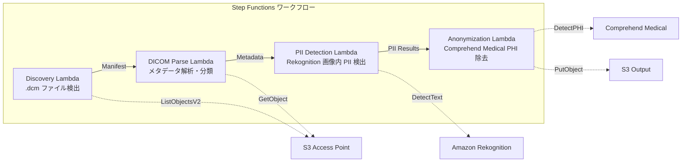

# UC5: 医療 — DICOM 画像の自動分類・匿名化

🌐 **Language / 言語**: 日本語 | [English](README.en.md) | [한국어](README.ko.md) | [简体中文](README.zh-CN.md) | [繁體中文](README.zh-TW.md) | [Français](README.fr.md) | [Deutsch](README.de.md) | [Español](README.es.md)

📚 **ドキュメント**: [アーキテクチャ図](docs/architecture.md) | [デモガイド](docs/demo-guide.md)

## 概要

FSx for ONTAP の S3 Access Points を活用し、DICOM 医用画像の自動分類と匿名化を行うサーバーレスワークフローです。患者プライバシーの保護と効率的な画像管理を実現します。

### このパターンが適しているケース

- PACS / VNA から FSx for ONTAP に保存された DICOM ファイルを定期的に匿名化したい
- 研究用データセット作成のために PHI（保護対象医療情報）を自動除去したい
- 画像内に焼き込まれた患者情報（Burned-in Annotation）を検出したい
- モダリティ・部位による自動分類で画像管理を効率化したい
- HIPAA / 個人情報保護法に準拠した匿名化パイプラインを構築したい

### このパターンが適さないケース

- リアルタイムの DICOM ルーティング（DICOM MWL / MPPS 連携が必要）
- 画像の診断支援 AI（CAD）— 本パターンは分類・匿名化に特化
- Comprehend Medical 非対応リージョンでクロスリージョンのデータ転送が規制上許容できない
- DICOM ファイルサイズが 5 GB を超える（MR/CT のマルチフレーム等）

### 主な機能

- S3 AP 経由で .dcm ファイルを自動検出
- DICOM メタデータ解析（患者名、検査日、モダリティ、部位）と分類
- Amazon Rekognition による画像内焼き込み個人情報（PII）の検出
- Amazon Comprehend Medical による PHI（保護対象医療情報）の特定・除去
- 匿名化済み DICOM ファイルの分類メタデータ付き S3 出力


## Success Metrics

### Outcome
DICOM 画像の自動分類・匿名化により、放射線科の検索効率向上と患者プライバシー保護を実現する。

### Metrics
| メトリクス | 目標値（例） |
|-----------|------------|
| 処理済み DICOM ファイル数 / 実行 | > 500 files |
| 分類精度 | > 90% |
| 匿名化成功率 | 100%（PHI 漏洩ゼロ） |
| 処理時間 / ファイル | < 30 秒 |
| コスト / 実行 | < $15 |
| Human Review 必須率 | 100%（匿名化結果は全件確認推奨） |

> **100% Human Review の理由**: 匿名化漏れが患者プライバシーに直接影響するため、全件の人間確認を推奨します。

### Measurement Method
Step Functions 実行履歴、Comprehend Medical entity count、匿名化前後の diff レビュー、CloudWatch Metrics。レビュー結果は DynamoDB に記録し、監査時に「誰が・いつ・何を確認したか」を追跡可能にする。

## アーキテクチャ



### ワークフローステップ

1. **Discovery**: S3 AP から .dcm ファイルを検出し、Manifest を生成
2. **DICOM Parse**: DICOM メタデータ（patient name, study date, modality, body part）を解析し、モダリティ・部位で分類
3. **PII Detection**: Rekognition で画像ピクセル内の焼き込み個人情報を検出
4. **Anonymization**: Comprehend Medical で PHI を特定・除去し、匿名化 DICOM を分類メタデータ付きで S3 出力

## 前提条件

- AWS アカウントと適切な IAM 権限
- FSx for ONTAP ファイルシステム（ONTAP 9.17.1P4D3 以上）
- S3 Access Point が有効化されたボリューム
- ONTAP REST API 認証情報が Secrets Manager に登録済み
- VPC、プライベートサブネット
- Amazon Rekognition、Amazon Comprehend Medical が利用可能なリージョン

## デプロイ手順

### 1. パラメータの準備

デプロイ前に以下の値を確認してください:

- FSx for ONTAP S3 Access Point Alias
- ONTAP 管理 IP アドレス
- Secrets Manager シークレット名
- VPC ID、プライベートサブネット ID

### 2. CloudFormation デプロイ

```bash
aws cloudformation deploy \
  --template-file healthcare-dicom/template.yaml \
  --stack-name fsxn-healthcare-dicom \
  --parameter-overrides \
    S3AccessPointAlias=<your-volume-ext-s3alias> \
    S3AccessPointName=<your-s3ap-name> \
    S3AccessPointOutputAlias=<your-output-volume-ext-s3alias> \
    OntapSecretName=<your-ontap-secret-name> \
    OntapManagementIp=<your-ontap-management-ip> \
    ScheduleExpression="rate(1 hour)" \
    VpcId=<your-vpc-id> \
    PrivateSubnetIds=<subnet-1>,<subnet-2> \
    NotificationEmail=<your-email@example.com> \
    EnableVpcEndpoints=false \
    EnableCloudWatchAlarms=false \
  --capabilities CAPABILITY_IAM CAPABILITY_AUTO_EXPAND \
  --region ap-northeast-1
```

> **注意**: `<...>` のプレースホルダーを実際の環境値に置き換えてください。

### 3. SNS サブスクリプションの確認

デプロイ後、指定したメールアドレスに SNS サブスクリプション確認メールが届きます。

> **注意**: `S3AccessPointName` を省略すると、IAM ポリシーが Alias ベースのみとなり `AccessDenied` エラーが発生する場合があります。本番環境では指定を推奨します。詳細は [トラブルシューティングガイド](../docs/guides/troubleshooting-guide.md#1-accessdenied-エラー) を参照してください。


## 設定パラメータ一覧

| パラメータ | 説明 | デフォルト | 必須 |
|-----------|------|----------|------|
| `S3AccessPointAlias` | FSx for ONTAP S3 AP Alias（入力用） | — | ✅ |
| `S3AccessPointName` | S3 AP 名（ARN ベースの IAM 権限付与用。省略時は Alias ベースのみ） | `""` | ⚠️ 推奨 |
| `S3AccessPointOutputAlias` | FSx for ONTAP S3 AP Alias（出力用） | — | ✅ |
| `OntapSecretName` | ONTAP 認証情報の Secrets Manager シークレット名 | — | ✅ |
| `OntapManagementIp` | ONTAP クラスタ管理 IP アドレス | — | ✅ |
| `ScheduleExpression` | EventBridge Scheduler のスケジュール式 | `rate(1 hour)` | |
| `VpcId` | VPC ID | — | ✅ |
| `PrivateSubnetIds` | プライベートサブネット ID リスト | — | ✅ |
| `NotificationEmail` | SNS 通知先メールアドレス | — | ✅ |
| `EnableVpcEndpoints` | Interface VPC Endpoints の有効化 | `false` | |
| `EnableCloudWatchAlarms` | CloudWatch Alarms の有効化 | `false` | |

## コスト構造

### リクエストベース（従量課金）

| サービス | 課金単位 | 概算（100 DICOM ファイル/月） |
|---------|---------|---------------------------|
| Lambda | リクエスト数 + 実行時間 | ~$0.01 |
| Step Functions | ステート遷移数 | 無料枠内 |
| S3 API | リクエスト数 | ~$0.01 |
| Rekognition | 画像数 | ~$0.10 |
| Comprehend Medical | ユニット数 | ~$0.05 |

### 常時稼働（オプショナル）

| サービス | パラメータ | 月額 |
|---------|-----------|------|
| Interface VPC Endpoints | `EnableVpcEndpoints=true` | ~$28.80 |
| CloudWatch Alarms | `EnableCloudWatchAlarms=true` | ~$0.20 |

> デモ/PoC 環境では変動費のみで **~$0.17/月** から利用可能です。

## セキュリティとコンプライアンス

本ワークフローは医療データを扱うため、以下のセキュリティ対策を実装しています:

- **暗号化**: S3 出力バケットは SSE-KMS で暗号化
- **VPC 内実行**: Lambda 関数は VPC 内で実行（VPC Endpoints 有効化推奨）
- **最小権限 IAM**: 各 Lambda 関数に必要最小限の IAM 権限を付与
- **PHI 除去**: Comprehend Medical で保護対象医療情報を自動検出・除去
- **監査ログ**: CloudWatch Logs で全処理のログを記録

> **注意**: 本パターンはサンプル実装です。実際の医療環境での使用には、HIPAA 等の規制要件に基づく追加のセキュリティ対策とコンプライアンス審査が必要です。

## クリーンアップ

```bash
# CloudFormation スタックの削除
aws cloudformation delete-stack \
  --stack-name fsxn-healthcare-dicom \
  --region ap-northeast-1

# 削除完了を待機
aws cloudformation wait stack-delete-complete \
  --stack-name fsxn-healthcare-dicom \
  --region ap-northeast-1
```

> **注意**: S3 バケットにオブジェクトが残っている場合、スタック削除が失敗することがあります。事前にバケットを空にしてください。

## Supported Regions

UC5 は以下のサービスを使用します:

| サービス | リージョン制約 |
|---------|-------------|
| Amazon Rekognition | ほぼ全リージョンで利用可能 |
| Amazon Comprehend Medical | 限定リージョンのみ対応。`COMPREHEND_MEDICAL_REGION` パラメータで対応リージョン（us-east-1 等）を指定 |
| AWS X-Ray | ほぼ全リージョンで利用可能 |
| CloudWatch EMF | ほぼ全リージョンで利用可能 |

> Cross-Region Client 経由で Comprehend Medical API を呼び出します。データレジデンシー要件を確認してください。詳細は [リージョン互換性マトリックス](../docs/region-compatibility.md) を参照。

## 参考リンク

### AWS 公式ドキュメント

- [FSx for ONTAP S3 Access Points 概要](https://docs.aws.amazon.com/fsx/latest/ONTAPGuide/accessing-data-via-s3-access-points.html)
- [Lambda でサーバーレス処理（公式チュートリアル）](https://docs.aws.amazon.com/fsx/latest/ONTAPGuide/tutorial-process-files-with-lambda.html)
- [Comprehend Medical DetectPHI API](https://docs.aws.amazon.com/comprehend-medical/latest/dev/API_DetectPHI.html)
- [Rekognition DetectText API](https://docs.aws.amazon.com/rekognition/latest/dg/API_DetectText.html)
- [HIPAA on AWS ホワイトペーパー](https://docs.aws.amazon.com/whitepapers/latest/architecting-hipaa-security-and-compliance-on-aws/welcome.html)

### AWS ブログ記事

- [S3 AP 発表ブログ](https://aws.amazon.com/blogs/aws/amazon-fsx-for-netapp-ontap-now-integrates-with-amazon-s3-for-seamless-data-access/)
- [FSx for ONTAP + Bedrock RAG](https://aws.amazon.com/blogs/machine-learning/build-rag-based-generative-ai-applications-in-aws-using-amazon-fsx-for-netapp-ontap-with-amazon-bedrock/)

### GitHub サンプル

- [aws-samples/amazon-rekognition-serverless-large-scale-image-and-video-processing](https://github.com/aws-samples/amazon-rekognition-serverless-large-scale-image-and-video-processing) — Rekognition 大規模処理
- [aws-samples/serverless-patterns](https://github.com/aws-samples/serverless-patterns) — サーバーレスパターン集


## 検証済み環境

| 項目 | 値 |
|------|-----|
| AWS リージョン | ap-northeast-1 (東京) |
| FSx for ONTAP バージョン | ONTAP 9.17.1P4D3 |
| FSx 構成 | SINGLE_AZ_1 |
| Python | 3.12 |
| デプロイ方式 | CloudFormation (標準) |

## Lambda VPC 配置アーキテクチャ

検証で得た知見に基づき、Lambda 関数は VPC 内/外に分離配置されています。

**VPC 内 Lambda**（ONTAP REST API アクセスが必要な関数のみ）:
- Discovery Lambda — S3 AP + ONTAP API

**VPC 外 Lambda**（AWS マネージドサービス API のみ使用）:
- その他の全 Lambda 関数

> **理由**: VPC 内 Lambda から AWS マネージドサービス API（Athena, Bedrock, Textract 等）にアクセスするには Interface VPC Endpoint が必要（各 $7.20/月）。VPC 外 Lambda はインターネット経由で直接 AWS API にアクセスでき、追加コストなしで動作します。

> **注意**: ONTAP REST API を使用する UC（UC1 法務・コンプライアンス）では `EnableVpcEndpoints=true` が必須です。Secrets Manager VPC Endpoint 経由で ONTAP 認証情報を取得するためです。


---

## AWS ドキュメントリンク

| サービス | ドキュメント |
|---------|------------|
| FSx for ONTAP | [FSx for ONTAP](https://docs.aws.amazon.com/fsx/latest/ONTAPGuide/what-is-fsx-ontap.html) |
| S3 Access Points | [S3 Access Points](https://docs.aws.amazon.com/fsx/latest/ONTAPGuide/s3-access-points.html) |
| Step Functions | [Step Functions](https://docs.aws.amazon.com/step-functions/latest/dg/welcome.html) |
| Amazon Comprehend Medical | [Amazon Comprehend Medical](https://docs.aws.amazon.com/comprehend-medical/latest/dev/comprehendmedical-welcome.html) |
| Amazon Bedrock | [Amazon Bedrock](https://docs.aws.amazon.com/bedrock/latest/userguide/what-is-bedrock.html) |
| AWS HIPAA 対応サービス | [AWS HIPAA 対応サービス](https://aws.amazon.com/compliance/hipaa-eligible-services-reference/) |

### Well-Architected Framework 対応

| 柱 | 対応 |
|----|------|
| 運用上の優秀性 | X-Ray トレーシング、EMF メトリクス、匿名化監査ログ |
| セキュリティ | 最小権限 IAM、KMS 暗号化、PII 検出・匿名化、HIPAA 考慮 |
| 信頼性 | Step Functions Retry/Catch、クロスリージョンフォールバック |
| パフォーマンス効率 | Lambda メモリ最適化、DICOM ストリーミング処理 |
| コスト最適化 | サーバーレス、Comprehend Medical ページ単位課金 |
| 持続可能性 | オンデマンド実行、匿名化済みデータの再利用 |


---

## ローカルテスト

### Prerequisites チェック

```bash
# 前提条件の確認
aws --version          # AWS CLI v2
sam --version          # SAM CLI
python3 --version      # Python 3.9+
docker --version       # Docker (sam local 用)
aws sts get-caller-identity  # AWS 認証情報
```

### sam local invoke

```bash
# ビルド
sam build

# Discovery Lambda のローカル実行
sam local invoke DiscoveryFunction --event events/discovery-event.json

# 環境変数オーバーライド付き
sam local invoke DiscoveryFunction \
  --event events/discovery-event.json \
  --env-vars env.json
```

### ユニットテスト

```bash
python3 -m pytest tests/ -v
```

詳細は [ローカルテスト クイックスタート](../docs/local-testing-quick-start.md) を参照してください。

---

## 出力サンプル (Output Sample)

DICOM 匿名化パイプラインの出力例:

```json
{
  "discovery": {
    "status": "completed",
    "object_count": 12,
    "prefix": "dicom-inbox/"
  },
  "anonymization": [
    {
      "key": "dicom-inbox/study-001/series-001.dcm",
      "pii_detected": ["PatientName", "PatientID", "InstitutionName"],
      "pii_removed": 3,
      "anonymized_key": "anonymized/study-001/series-001.dcm",
      "integrity_hash": "sha256:a1b2c3..."
    }
  ],
  "report": {
    "total_files": 12,
    "anonymized": 12,
    "pii_fields_removed": 36,
    "compliance_status": "HIPAA_SAFE_HARBOR_COMPLIANT"
  }
}
```

> **注記**: 上記はサンプル出力であり、実際の値は環境・入力データにより異なります。ベンチマーク数値は sizing reference であり、service limit ではありません。

---

## Governance Note

> 本パターンは技術アーキテクチャガイダンスを提供します。法的・コンプライアンス・規制上の助言ではありません。組織は適格な専門家に相談してください。

---

## S3AP Compatibility

S3 Access Points for FSx for ONTAP の互換性制約、トラブルシューティング、トリガーパターンについては [S3AP Compatibility Notes](../docs/s3ap-compatibility-notes.md) を参照してください。