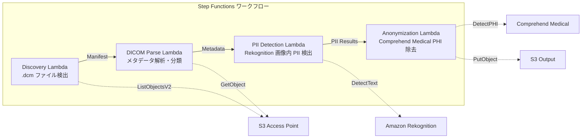

# UC5: 医疗 — DICOM 图像的自动分类与匿名化

🌐 **Language / 言語**: [日本語](README.md) | [English](README.en.md) | [한국어](README.ko.md) | 简体中文 | [繁體中文](README.zh-TW.md) | [Français](README.fr.md) | [Deutsch](README.de.md) | [Español](README.es.md)

## 概述
利用 FSx for NetApp ONTAP 的 S3 Access Points，实现 DICOM 医用图像的自动分类和匿名化的无服务器工作流。保护患者隐私并实现高效的图像管理。
### 适用情况
- 希望定期从 PACS / VNA 匿名化并存储到 FSx ONTAP 的 DICOM 文件
- 希望自动移除研究数据集中的 PHI（个人健康信息）
- 希望检测图像中烧录的患者信息（Burned-in Annotation）
- 希望通过模态和部位的自动分类来高效管理图像
- 希望构建符合 HIPAA / 个人信息保护法的匿名化管道
### 不适用的情况

当本模式不适用时，以下是一些情况：

- 使用 Amazon Bedrock 时
- 使用 AWS Step Functions 时
- 使用 Amazon Athena 时
- 使用 Amazon S3 时
- 使用 AWS Lambda 时
- 使用 Amazon FSx for NetApp ONTAP 时
- 使用 Amazon CloudWatch 时
- 使用 AWS CloudFormation 时

在处理 GDSII、DRC、OASIS、GDS 等技术术语时，应注意以下内容：

- Lambda
- tapeout

对于代码 (`...`)、文件路径和 URL，请保持不变。
- 实时 DICOM 路由（需要 DICOM MWL / MPPS 互通）
- 图像诊断辅助 AI（CAD）—— 本模式专注于分类和匿名化
- 在 Comprehend Medical 不支持的地区，跨地区数据传输受到法律限制
- DICOM 文件大小超过 5 GB（例如 MR/CT 的多帧）
### 主要功能
- 通过 S3 AP 自动检测.dcm 文件
- 分析 DICOM 元数据（患者姓名、检查日期、模态、部位）并进行分类
- 使用 Amazon Rekognition 检测图像中烧录的个人信息（PII）
- 使用 Amazon Comprehend Medical 确定和移除 PHI（受保护的医疗信息）
- 对匿名化的 DICOM 文件进行分类并输出到带有分类元数据的 S3
## 架构



### 工作流程步骤
1. **发现**：从 S3 AP 检出 .dcm 文件，生成 Manifest
2. **DICOM 解析**：解析 DICOM 元数据（病人姓名、检查日期、模式、身体部位），并按模式和部位进行分类
3. **PII 检测**：使用 Rekognition 检测图像像素中的烧录个人信息
4. **匿名化**：使用 Comprehend Medical 识别并删除 PHI，并将匿名化 DICOM 输出至 S3，附带分类元数据
## 先决条件
- AWS 账户和适当的 IAM 权限
- FSx for NetApp ONTAP 文件系统（ONTAP 9.17.1P4D3 及以上）
- 已启用 S3 Access Point 的卷
- ONTAP REST API 认证信息已注册到 Secrets Manager
- VPC、私有子网
- 支持 Amazon Rekognition 和 Amazon Comprehend Medical 的区域
## 部署步骤

### 1. 准备参数
部署之前请确认以下值：

- FSx ONTAP S3 访问点别名
- ONTAP 管理 IP 地址
- Secrets Manager 机密名称
- VPC ID，私有子网 ID
### 2. CloudFormation 部署

1. 确保你已经安装了 AWS CLI 和相关的软件包。
2. 创建一个新的 CloudFormation 堆栈，使用 `AWS CloudFormation` 服务。
3. 使用模板文件定义你的资源。模板文件可以是 JSON 或 YAML 格式。
4. 上传模板文件到 `Amazon S3` 存储桶。
5. 使用 `AWS CLI` 命令或 AWS 管理控制台来创建和管理 CloudFormation 堆栈。
6. 在模板中定义 `AWS Lambda` 函数、`Amazon S3` 存储桶、`Amazon DynamoDB` 表格等资源。
7. 确保所有资源都在同一个区域内部署。
8. 在堆栈创建完成后，可以通过 `AWS Management Console` 或 `AWS CLI` 查看堆栈状态。
9. 如果需要，可以使用 `Amazon CloudWatch` 来监控和管理 CloudFormation 堆栈。
10. 在堆栈部署过程中，如果遇到任何错误，可以查看 `CloudFormation` 事件日志来排除故障。

```bash
aws cloudformation deploy \
  --template-file healthcare-dicom/template.yaml \
  --stack-name fsxn-healthcare-dicom \
  --parameter-overrides \
    S3AccessPointAlias=<your-volume-ext-s3alias> \
    S3AccessPointName=<your-s3ap-name> \
    S3AccessPointOutputAlias=<your-output-volume-ext-s3alias> \
    OntapSecretName=<your-ontap-secret-name> \
    OntapManagementIp=<your-ontap-management-ip> \
    ScheduleExpression="rate(1 hour)" \
    VpcId=<your-vpc-id> \
    PrivateSubnetIds=<subnet-1>,<subnet-2> \
    NotificationEmail=<your-email@example.com> \
    EnableVpcEndpoints=false \
    EnableCloudWatchAlarms=false \
  --capabilities CAPABILITY_IAM CAPABILITY_AUTO_EXPAND \
  --region ap-northeast-1
```
> **注意**: 请将 `<...>` 中的占位符替换为实际的环境值。
### 3. 确认 SNS 订阅
部署之后，您指定的电子邮件地址会收到 SNS 订阅确认邮件。

> **注意**：如果省略 `S3AccessPointName`，IAM 策略可能会仅基于别名，从而导致 `AccessDenied` 错误。强烈建议在生产环境中指定。有关详细信息，请参阅 [故障排除指南](../docs/guides/troubleshooting-guide.md#1-accessdenied-错误)。
## 设置参数列表

| パラメータ | 説明 | デフォルト | 必須 |
|-----------|------|----------|------|
| `S3AccessPointAlias` | FSx ONTAP S3 AP Alias（入力用） | — | ✅ |
| `S3AccessPointName` | S3 AP 名（ARN ベースの IAM 権限付与用。省略時は Alias ベースのみ） | `""` | ⚠️ 推奨 |
| `S3AccessPointOutputAlias` | FSx ONTAP S3 AP Alias（出力用） | — | ✅ |
| `OntapSecretName` | ONTAP 認証情報の Secrets Manager シークレット名 | — | ✅ |
| `OntapManagementIp` | ONTAP クラスタ管理 IP アドレス | — | ✅ |
| `ScheduleExpression` | EventBridge Scheduler のスケジュール式 | `rate(1 hour)` | |
| `VpcId` | VPC ID | — | ✅ |
| `PrivateSubnetIds` | プライベートサブネット ID リスト | — | ✅ |
| `NotificationEmail` | SNS 通知先メールアドレス | — | ✅ |
| `EnableVpcEndpoints` | Interface VPC Endpoints の有効化 | `false` | |
| `EnableCloudWatchAlarms` | CloudWatch Alarms の有効化 | `false` | |

## 成本结构

规则：
- 保持AWS服务名称用英语（Amazon Bedrock、AWS Step Functions、Amazon Athena、Amazon S3、AWS Lambda、Amazon FSx for NetApp ONTAP、Amazon CloudWatch、AWS CloudFormation等）
- 保持技术术语不翻译（GDSII、DRC、OASIS、GDS、Lambda、tapeout等）
- 保持内联代码（`...`）不翻译
- 保持文件路径和URL不翻译
- 自然翻译，不是逐字翻译
- 仅返回翻译文本，不附解释

### 基于请求的（按需计费）

| サービス | 課金単位 | 概算（100 DICOM ファイル/月） |
|---------|---------|---------------------------|
| Lambda | リクエスト数 + 実行時間 | ~$0.01 |
| Step Functions | ステート遷移数 | 無料枠内 |
| S3 API | リクエスト数 | ~$0.01 |
| Rekognition | 画像数 | ~$0.10 |
| Comprehend Medical | ユニット数 | ~$0.05 |

### 常时运行（可选）

| サービス | パラメータ | 月額 |
|---------|-----------|------|
| Interface VPC Endpoints | `EnableVpcEndpoints=true` | ~$28.80 |
| CloudWatch Alarms | `EnableCloudWatchAlarms=true` | ~$0.20 |
> 演示/概念验证环境仅按使用量收费，每月起价 **约 0.17 美元**。
## 安全性和合规性
本工作流程处理医疗数据，因此实施了以下安全措施：

- **加密**：S3 输出存储桶使用 SSE-KMS 加密
- **在 VPC 内执行**：Lambda 函数在 VPC 内执行（推荐启用 VPC Endpoints）
- **最小权限 IAM**：为每个 Lambda 函数赋予最小必需的 IAM 权限
- **PHI 移除**：使用 Comprehend Medical 自动检测并移除受保护的医疗信息
- **审计日志**：使用 CloudWatch Logs 记录所有处理的日志

> **注意**：本模式为示例实现。在实际医疗环境中使用时，需要根据 HIPAA 等法规要求实施额外的安全措施和合规性审查。
## 清理

```bash
# CloudFormation スタックの削除
aws cloudformation delete-stack \
  --stack-name fsxn-healthcare-dicom \
  --region ap-northeast-1

# 削除完了を待機
aws cloudformation wait stack-delete-complete \
  --stack-name fsxn-healthcare-dicom \
  --region ap-northeast-1
```
> **注意**: 如果 S3 桶中仍有对象，删除堆栈可能会失败。请提前清空桶。
## 支持的地区
UC5 使用以下服务：
| サービス | リージョン制約 |
|---------|-------------|
| Amazon Rekognition | ほぼ全リージョンで利用可能 |
| Amazon Comprehend Medical | 限定リージョンのみ対応。`COMPREHEND_MEDICAL_REGION` パラメータで対応リージョン（us-east-1 等）を指定 |
| AWS X-Ray | ほぼ全リージョンで利用可能 |
| CloudWatch EMF | ほぼ全リージョンで利用可能 |
> 通过跨区域客户端调用 Comprehend Medical API。请确认数据常驻要求。详情请参阅 [区域兼容性矩阵](../docs/region-compatibility.md)。
## 参考链接

### AWS 官方文档
- [FSx ONTAP S3 访问点概述](https://docs.aws.amazon.com/fsx/latest/ONTAPGuide/accessing-data-via-s3-access-points.html)
- [使用 Lambda 进行无服务器处理（官方教程）](https://docs.aws.amazon.com/fsx/latest/ONTAPGuide/tutorial-process-files-with-lambda.html)
- [Comprehend Medical DetectPHI API](https://docs.aws.amazon.com/comprehend-medical/latest/dev/API_DetectPHI.html)
- [Rekognition DetectText API](https://docs.aws.amazon.com/rekognition/latest/dg/API_DetectText.html)
- [AWS 上的 HIPAA 白皮书](https://docs.aws.amazon.com/whitepapers/latest/architecting-hipaa-security-and-compliance-on-aws/welcome.html)
### AWS 博客文章
- [S3 AP 发布博客](https://aws.amazon.com/blogs/aws/amazon-fsx-for-netapp-ontap-now-integrates-with-amazon-s3-for-seamless-data-access/)
- [FSx ONTAP + Bedrock RAG](https://aws.amazon.com/blogs/machine-learning/build-rag-based-generative-ai-applications-in-aws-using-amazon-fsx-for-netapp-ontap-with-amazon-bedrock/)
### GitHub 示例
- [aws-samples/amazon-rekognition-serverless-large-scale-image-and-video-processing](https://github.com/aws-samples/amazon-rekognition-serverless-large-scale-image-and-video-processing) — Rekognition 大规模处理
- [aws-samples/serverless-patterns](https://github.com/aws-samples/serverless-patterns) — 无服务器模式集合
## 已验证环境

| 項目 | 値 |
|------|-----|
| AWS リージョン | ap-northeast-1 (東京) |
| FSx ONTAP バージョン | ONTAP 9.17.1P4D3 |
| FSx 構成 | SINGLE_AZ_1 |
| Python | 3.12 |
| デプロイ方式 | CloudFormation (標準) |

## Lambda VPC 配置架构
根据验证中的发现，Lambda 函数被分为在 VPC 内和 VPC 外两部分部署。

**在 VPC 内的 Lambda**（仅需要 ONTAP REST API 访问的函数）：
- Discovery Lambda — S3 AP + ONTAP API

**在 VPC 外的 Lambda**（仅使用 AWS 托管服务 API）：
- 所有其他 Lambda 函数

> **原因**: 需要通过 Interface VPC Endpoint 从在 VPC 内的 Lambda 访问 AWS 托管服务 API（如 Athena、Bedrock、Textract 等），每月每个 $7.20。在 VPC 外的 Lambda 可以直接通过互联网访问 AWS API，无需额外成本。

> **注意**: 使用 ONTAP REST API 的 UC（UC1 法律与合规）必须 `EnableVpcEndpoints=true`。这是因为通过 Secrets Manager VPC Endpoint 获取 ONTAP 认证信息。