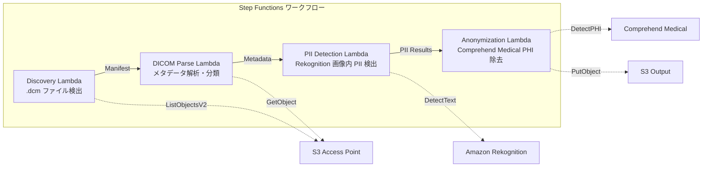

# UC5：醫療 — DICOM影像的自動分類與匿名化

🌐 **Language / 言語**: [日本語](README.md) | [English](README.en.md) | [한국어](README.ko.md) | [简体中文](README.zh-CN.md) | 繁體中文 | [Français](README.fr.md) | [Deutsch](README.de.md) | [Español](README.es.md)

## 概述
利用 Amazon FSx for NetApp ONTAP 的 S3 Access Points，實現 DICOM 醫用影像的自動分類和匿名化的無伺服器工作流程。保護患者隱私並實現高效的影像管理。
### 此模式適用的情況
- 定期從 PACS / VNA 將儲存在 FSx ONTAP 中的 DICOM 檔案匿名化
- 為了建立研究數據集，我們希望自動移除 PHI（受保護健康資訊）
- 我們希望檢測影像內燒入的病患資訊（Burned-in Annotation）
- 我們希望透過依據模態和部位自動分類來提高影像管理效率
- 我們希望建立符合 HIPAA / 個人資訊保護法的匿名化管線
### 不適合的情況

請參閱此模式的使用說明。
- 即時 DICOM 路由（需要 DICOM MWL / MPPS 連接）
- 影像診斷輔助 AI（CAD）— 本模式專注於分類與匿名化
- 在 Comprehend Medical 不支援的區域中，跨區域數據傳輸受法規限制而不被允許
- DICOM 檔案大小超過 5 GB（如 MR/CT 多幀）
### 主要功能
- 通過 S3 AP 自動檢測.dcm 檔案
- DICOM 元數據分析（患者名稱、檢查日期、模態性、部位）和分類
- 使用 Amazon Rekognition 檢測影像內的燒印個人資訊（PII）
- 使用 Amazon Comprehend Medical 確定並移除 PHI（受保護健康資訊）
- 匿名化 DICOM 文件分類，附帶元數據的 S3 輸出
## 架構



### 工作流程步驟
1. **發現**：從 S3 AP 發現 .dcm 檔案，並生成 Manifest
2. **DICOM 解析**：解析 DICOM 元數據（患者姓名、檢查日期、檢查方式、身體部位），按檢查方式和部位分類
3. **PII 檢測**：使用 Rekognition 檢測影像像素中刻印的個人資訊
4. **匿名化**：使用 Comprehend Medical 識別並移除 PHI，將匿名化的 DICOM 和分類的元數據一起輸出到 S3
## 前提條件
- AWS帳戶和適當的IAM權限
- FSx for NetApp ONTAP文件系統（ONTAP 9.17.1P4D3以上）
- 已啟用S3 Access Point的卷
- ONTAP REST API認證信息已在Secrets Manager中註冊
- VPC、私有子網
- Amazon Rekognition、Amazon Comprehend Medical可用的區域
## 部署步驟

### 1. 參數準備
部署前請確認以下值：

- FSx ONTAP S3 Access Point 別名
- ONTAP 管理 IP 地址
- Secrets Manager 機密名稱
- VPC ID、私有子網 ID
### 2. CloudFormation 部署

```bash
aws cloudformation deploy \
  --template-file healthcare-dicom/template.yaml \
  --stack-name fsxn-healthcare-dicom \
  --parameter-overrides \
    S3AccessPointAlias=<your-volume-ext-s3alias> \
    S3AccessPointName=<your-s3ap-name> \
    S3AccessPointOutputAlias=<your-output-volume-ext-s3alias> \
    OntapSecretName=<your-ontap-secret-name> \
    OntapManagementIp=<your-ontap-management-ip> \
    ScheduleExpression="rate(1 hour)" \
    VpcId=<your-vpc-id> \
    PrivateSubnetIds=<subnet-1>,<subnet-2> \
    NotificationEmail=<your-email@example.com> \
    EnableVpcEndpoints=false \
    EnableCloudWatchAlarms=false \
  --capabilities CAPABILITY_IAM CAPABILITY_AUTO_EXPAND \
  --region ap-northeast-1
```
> **注意**: 請將 `<...>` 的佔位符替換為實際的環境值。
### 3. 確認 SNS 訂閱
部署後，會收到 SNS 訂閱確認郵件至指定的電子郵件地址。

> **注意**：如果省略 `S3AccessPointName`，IAM 策略可能只基於別名，並可能導致 `AccessDenied` 錯誤。建議在生產環境中進行指定。詳細信息請參閱 [疑難排解指南](../docs/guides/troubleshooting-guide.md#1-accessdenied-錯誤)。
## 設定參數列表

| パラメータ | 説明 | デフォルト | 必須 |
|-----------|------|----------|------|
| `S3AccessPointAlias` | FSx ONTAP S3 AP Alias（入力用） | — | ✅ |
| `S3AccessPointName` | S3 AP 名（ARN ベースの IAM 権限付与用。省略時は Alias ベースのみ） | `""` | ⚠️ 推奨 |
| `S3AccessPointOutputAlias` | FSx ONTAP S3 AP Alias（出力用） | — | ✅ |
| `OntapSecretName` | ONTAP 認証情報の Secrets Manager シークレット名 | — | ✅ |
| `OntapManagementIp` | ONTAP クラスタ管理 IP アドレス | — | ✅ |
| `ScheduleExpression` | EventBridge Scheduler のスケジュール式 | `rate(1 hour)` | |
| `VpcId` | VPC ID | — | ✅ |
| `PrivateSubnetIds` | プライベートサブネット ID リスト | — | ✅ |
| `NotificationEmail` | SNS 通知先メールアドレス | — | ✅ |
| `EnableVpcEndpoints` | Interface VPC Endpoints の有効化 | `false` | |
| `EnableCloudWatchAlarms` | CloudWatch Alarms の有効化 | `false` | |

## 成本結構

### 按需（按量付費）

| サービス | 課金単位 | 概算（100 DICOM ファイル/月） |
|---------|---------|---------------------------|
| Lambda | リクエスト数 + 実行時間 | ~$0.01 |
| Step Functions | ステート遷移数 | 無料枠内 |
| S3 API | リクエスト数 | ~$0.01 |
| Rekognition | 画像数 | ~$0.10 |
| Comprehend Medical | ユニット数 | ~$0.05 |

### 常時稼動（選用）

| サービス | パラメータ | 月額 |
|---------|-----------|------|
| Interface VPC Endpoints | `EnableVpcEndpoints=true` | ~$28.80 |
| CloudWatch Alarms | `EnableCloudWatchAlarms=true` | ~$0.20 |
> 在演示/概念證明環境中，僅需變動費用，每月起價 **約 0.17 美元**。
## 安全性與合規性
本工作流程處理醫療數據，因此實施以下安全措施：

- **加密**: S3 輸出 Bucket 使用 SSE-KMS 加密
- **在 VPC 內執行**: Lambda 函數在 VPC 內執行（建議啟用 VPC Endpoints）
- **最小權限 IAM**: 為每個 Lambda 函數授予最低必要的 IAM 權限
- **PHI 移除**: 使用 Comprehend Medical 自動偵測和移除受保護的醫療信息
- **稽核日誌**: 使用 CloudWatch Logs 記錄所有處理的日誌

> **注意**: 本模式為範例實作。在實際醫療環境中使用時，需要根據 HIPAA 等規範要求進行額外的安全措施和合規審查。
## 清理

```bash
# CloudFormation スタックの削除
aws cloudformation delete-stack \
  --stack-name fsxn-healthcare-dicom \
  --region ap-northeast-1

# 削除完了を待機
aws cloudformation wait stack-delete-complete \
  --stack-name fsxn-healthcare-dicom \
  --region ap-northeast-1
```
> **注意**: 如果 S3 巴克特中仍有物件，刪除堆疊可能會失敗。請提前清空巴克特。
## 支援的地區
UC5 使用以下服務：
| サービス | リージョン制約 |
|---------|-------------|
| Amazon Rekognition | ほぼ全リージョンで利用可能 |
| Amazon Comprehend Medical | 限定リージョンのみ対応。`COMPREHEND_MEDICAL_REGION` パラメータで対応リージョン（us-east-1 等）を指定 |
| AWS X-Ray | ほぼ全リージョンで利用可能 |
| CloudWatch EMF | ほぼ全リージョンで利用可能 |
> 透過 Cross-Region Client 呼叫 Comprehend Medical API。請確認資料駐留需求。詳細請參閱 [區域相容性矩陣](../docs/region-compatibility.md)。
## 參考連結

### AWS 官方文件
- [FSx for NetApp ONTAP S3 存取點概覽](https://docs.aws.amazon.com/fsx/latest/ONTAPGuide/accessing-data-via-s3-access-points.html)
- [使用 Lambda 進行無伺服器處理（官方教學）](https://docs.aws.amazon.com/fsx/latest/ONTAPGuide/tutorial-process-files-with-lambda.html)
- [Comprehend Medical DetectPHI API](https://docs.aws.amazon.com/comprehend-medical/latest/dev/API_DetectPHI.html)
- [Rekognition DetectText API](https://docs.aws.amazon.com/rekognition/latest/dg/API_DetectText.html)
- [HIPAA on AWS 白皮書](https://docs.aws.amazon.com/whitepapers/latest/architecting-hipaa-security-and-compliance-on-aws/welcome.html)
### AWS 部落格文章
- [S3 AP 公告部落格](https://aws.amazon.com/blogs/aws/amazon-fsx-for-netapp-ontap-now-integrates-with-amazon-s3-for-seamless-data-access/)
- [FSx ONTAP + Bedrock RAG](https://aws.amazon.com/blogs/machine-learning/build-rag-based-generative-ai-applications-in-aws-using-amazon-fsx-for-netapp-ontap-with-amazon-bedrock/)
### GitHub 範例
- [aws-samples/amazon-rekognition-serverless-large-scale-image-and-video-processing](https://github.com/aws-samples/amazon-rekognition-serverless-large-scale-image-and-video-processing) — Rekognition 大規模處理
- [aws-samples/serverless-patterns](https://github.com/aws-samples/serverless-patterns) — 無伺服器模式集
## 已驗證的環境

| 項目 | 値 |
|------|-----|
| AWS リージョン | ap-northeast-1 (東京) |
| FSx ONTAP バージョン | ONTAP 9.17.1P4D3 |
| FSx 構成 | SINGLE_AZ_1 |
| Python | 3.12 |
| デプロイ方式 | CloudFormation (標準) |

## Lambda VPC 配置架構
根據驗證中獲得的見解，Lambda 函數被分為 VPC 內/外兩部分：

**VPC 內 Lambda**（僅需要 ONTAP REST API 訪問的函數）：
- Discovery Lambda — S3 AP + ONTAP API

**VPC 外 Lambda**（僅使用 AWS 管理服務 API）：
- 所有其他 Lambda 函數

> **原因**：從 VPC 內 Lambda 訪問 AWS 管理服務 API（Athena、Bedrock、Textract 等）需要 Interface VPC Endpoint（每個 $7.20/月）。VPC 外 Lambda 可以直接通過互聯網訪問 AWS API，且不會產生額外的費用。

> **注意**：使用 ONTAP REST API 的 UC（UC1 法務・コンプライアンス）必須 `EnableVpcEndpoints=true`。這是因為通過 Secrets Manager VPC Endpoint 來獲取 ONTAP 認證信息。