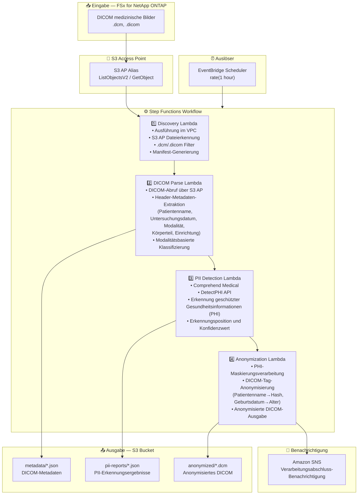

# UC5: Gesundheitswesen — Automatische DICOM-Bildklassifizierung und Anonymisierung

🌐 **Language / 言語**: [日本語](architecture.md) | [English](architecture.en.md) | [한국어](architecture.ko.md) | [简体中文](architecture.zh-CN.md) | [繁體中文](architecture.zh-TW.md) | [Français](architecture.fr.md) | Deutsch | [Español](architecture.es.md)

## End-to-End-Architektur (Eingabe → Ausgabe)

---

## Übergeordneter Ablauf

```
┌─────────────────────────────────────────────────────────────────────────────┐
│                         FSx for NetApp ONTAP                                 │
│                                                                              │
│  /vol/pacs_archive/                                                          │
│  ├── CT/patient_001/study_20240315/series_001.dcm    (CT scan)               │
│  ├── MR/patient_002/study_20240316/brain_t1.dcm      (MRI)                   │
│  ├── XR/patient_003/study_20240317/chest_pa.dcm      (X-ray)                 │
│  └── US/patient_004/study_20240318/abdomen.dicom     (Ultrasound)            │
│                                                                              │
└──────────────────────────────────┬───────────────────────────────────────────┘
                                   │
                                   ▼
┌──────────────────────────────────────────────────────────────────────────────┐
│                      S3 Access Point (Data Path)                              │
│                                                                              │
│  Alias: fsxn-dicom-vol-ext-s3alias                                           │
│  • ListObjectsV2 (DICOM file discovery)                                      │
│  • GetObject (DICOM file retrieval)                                          │
│  • No NFS/SMB mount required from Lambda                                     │
│                                                                              │
└──────────────────────────────────┬───────────────────────────────────────────┘
                                   │
                                   ▼
┌──────────────────────────────────────────────────────────────────────────────┐
│                    EventBridge Scheduler (Trigger)                            │
│                                                                              │
│  Schedule: rate(1 hour) — configurable                                       │
│  Target: Step Functions State Machine                                        │
│                                                                              │
└──────────────────────────────────┬───────────────────────────────────────────┘
                                   │
                                   ▼
┌──────────────────────────────────────────────────────────────────────────────┐
│                    AWS Step Functions (Orchestration)                         │
│                                                                              │
│  ┌─────────────┐    ┌──────────────┐    ┌──────────────┐    ┌───────────┐  │
│  │  Discovery   │───▶│ DICOM Parse  │───▶│PII Detection │───▶│Anonymiza- │  │
│  │  Lambda      │    │  Lambda      │    │  Lambda      │    │tion Lambda│  │
│  │             │    │             │    │             │    │           │  │
│  │  • VPC内     │    │  • Metadata  │    │  • Comprehend│    │  • PHI     │  │
│  │  • S3 AP List│    │    extraction│    │    Medical   │    │    removal │  │
│  │  • .dcm      │    │  • Patient   │    │  • PII       │    │  • Masking │  │
│  │    detection │    │    info      │    │    detection │    │    process │  │
│  └─────────────┘    └──────────────┘    └──────────────┘    └───────────┘  │
│                                                                              │
└──────────────────────────────────────────────────────────────────────────────┘
                                   │
                                   ▼
┌──────────────────────────────────────────────────────────────────────────────┐
│                         Output (S3 Bucket)                                    │
│                                                                              │
│  s3://{stack}-output-{account}/                                              │
│  ├── metadata/YYYY/MM/DD/                                                    │
│  │   └── patient_001_series_001.json   ← DICOM metadata                     │
│  ├── pii-reports/YYYY/MM/DD/                                                 │
│  │   └── patient_001_series_001_pii.json  ← PII detection results           │
│  └── anonymized/YYYY/MM/DD/                                                  │
│      └── anon_series_001.dcm           ← Anonymized DICOM                   │
│                                                                              │
└──────────────────────────────────────────────────────────────────────────────┘
```

---

## Mermaid-Diagramm



---

## Datenfluss im Detail

### Eingabe
| Element | Beschreibung |
|---------|--------------|
| **Quelle** | FSx for NetApp ONTAP Volume |
| **Dateitypen** | .dcm, .dicom (DICOM medizinische Bilder) |
| **Zugriffsmethode** | S3 Access Point (ListObjectsV2 + GetObject) |
| **Lesestrategie** | Vollständiger DICOM-Dateiabruf (Header + Pixeldaten) |

### Verarbeitung
| Schritt | Service | Funktion |
|---------|---------|----------|
| Discovery | Lambda (VPC) | DICOM-Dateien über S3 AP erkennen, Manifest generieren |
| DICOM Parse | Lambda | Metadaten aus DICOM-Headern extrahieren (Patienteninfo, Modalität, Untersuchungsdatum usw.) |
| PII Detection | Lambda + Comprehend Medical | Geschützte Gesundheitsinformationen über DetectPHI erkennen |
| Anonymization | Lambda | PHI-Maskierung und Anonymisierung, anonymisiertes DICOM ausgeben |

### Ausgabe
| Artefakt | Format | Beschreibung |
|----------|--------|--------------|
| DICOM-Metadaten | `metadata/YYYY/MM/DD/{stem}.json` | Extrahierte Metadaten (Modalität, Körperteil, Untersuchungsdatum) |
| PII-Bericht | `pii-reports/YYYY/MM/DD/{stem}_pii.json` | PHI-Erkennungsergebnisse (Position, Typ, Konfidenz) |
| Anonymisiertes DICOM | `anonymized/YYYY/MM/DD/{stem}.dcm` | Anonymisierte DICOM-Datei |
| SNS-Benachrichtigung | E-Mail | Verarbeitungsabschluss-Benachrichtigung (Anzahl verarbeitet und anonymisiert) |

---

## Wichtige Designentscheidungen

1. **S3 AP statt NFS** — Kein NFS-Mount von Lambda erforderlich; DICOM-Dateien werden über die S3-API abgerufen
2. **Comprehend Medical Spezialisierung** — Hochpräzise PII-Identifikation durch domänenspezifische PHI-Erkennung im Gesundheitswesen
3. **Stufenweise Anonymisierung** — Drei Stufen (Metadaten-Extraktion → PII-Erkennung → Anonymisierung) gewährleisten Audit-Trail
4. **DICOM-Standardkonformität** — Anonymisierungsregeln basierend auf DICOM PS3.15 (Sicherheitsprofile)
5. **HIPAA / Datenschutzkonformität** — Safe-Harbor-Methode zur Anonymisierung (Entfernung von 18 Identifikatoren)
6. **Polling (nicht ereignisgesteuert)** — S3 AP unterstützt keine Ereignisbenachrichtigungen, daher wird eine periodische geplante Ausführung verwendet

---

## Verwendete AWS-Services

| Service | Rolle |
|---------|-------|
| FSx for NetApp ONTAP | PACS/VNA medizinische Bildspeicherung |
| S3 Access Points | Serverloser Zugriff auf ONTAP-Volumes |
| EventBridge Scheduler | Periodischer Auslöser |
| Step Functions | Workflow-Orchestrierung |
| Lambda | Compute (Discovery, DICOM Parse, PII Detection, Anonymization) |
| Amazon Comprehend Medical | PHI-Erkennung (geschützte Gesundheitsinformationen) |
| SNS | Verarbeitungsabschluss-Benachrichtigung |
| Secrets Manager | ONTAP REST API Anmeldedatenverwaltung |
| CloudWatch + X-Ray | Observability |
