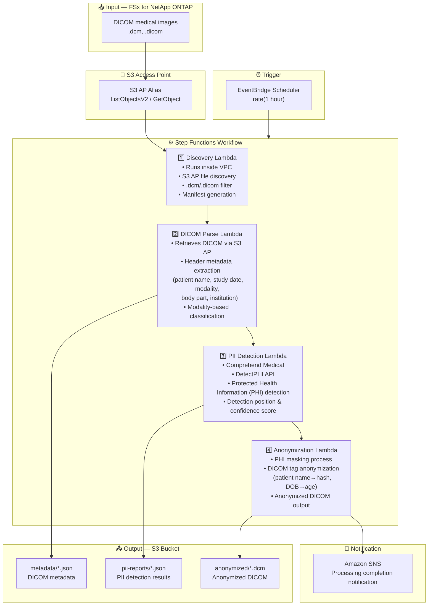

# UC5: Healthcare — DICOM Image Auto-Classification & Anonymization

🌐 **Language / 言語**: [日本語](architecture.md) | English | [한국어](architecture.ko.md) | [简体中文](architecture.zh-CN.md) | [繁體中文](architecture.zh-TW.md) | [Français](architecture.fr.md) | [Deutsch](architecture.de.md) | [Español](architecture.es.md)

## End-to-End Architecture (Input → Output)

---

## Architecture Diagram

---

## Data Flow Detail

### Input
| Item | Description |
|------|-------------|
| **Source** | FSx for NetApp ONTAP volume |
| **File Types** | .dcm, .dicom (DICOM medical images) |
| **Access Method** | S3 Access Point (ListObjectsV2 + GetObject) |
| **Read Strategy** | Full DICOM file retrieval (header + pixel data) |

### Processing
| Step | Service | Function |
|------|---------|----------|
| Discovery | Lambda (VPC) | Discover DICOM files via S3 AP, generate manifest |
| DICOM Parse | Lambda | Extract metadata from DICOM headers (patient info, modality, study date, etc.) |
| PII Detection | Lambda + Comprehend Medical | Detect Protected Health Information via DetectPHI |
| Anonymization | Lambda | PHI masking & anonymization, output anonymized DICOM |

### Output
| Artifact | Format | Description |
|----------|--------|-------------|
| DICOM Metadata | `metadata/YYYY/MM/DD/{stem}.json` | Extracted metadata (modality, body part, study date) |
| PII Report | `pii-reports/YYYY/MM/DD/{stem}_pii.json` | PHI detection results (position, type, confidence) |
| Anonymized DICOM | `anonymized/YYYY/MM/DD/{stem}.dcm` | Anonymized DICOM file |
| SNS Notification | Email | Processing completion notification (processed & anonymized counts) |

---

## Key Design Decisions

1. **S3 AP over NFS** — No NFS mount needed from Lambda; DICOM files retrieved via S3 API
2. **Comprehend Medical specialization** — High-accuracy PII identification using healthcare domain-specific PHI detection
3. **Staged anonymization** — Three stages (metadata extraction → PII detection → anonymization) ensure audit trail
4. **DICOM standard compliance** — Anonymization rules based on DICOM PS3.15 (Security Profiles)
5. **HIPAA / Privacy law compliance** — Safe Harbor method anonymization (removal of 18 identifiers)
6. **Polling (not event-driven)** — S3 AP does not support event notifications, so periodic scheduled execution is used

---

## AWS Services Used

| Service | Role |
|---------|------|
| FSx for NetApp ONTAP | PACS/VNA medical image storage |
| S3 Access Points | Serverless access to ONTAP volumes |
| EventBridge Scheduler | Periodic trigger |
| Step Functions | Workflow orchestration |
| Lambda | Compute (Discovery, DICOM Parse, PII Detection, Anonymization) |
| Amazon Comprehend Medical | PHI (Protected Health Information) detection |
| SNS | Processing completion notification |
| Secrets Manager | ONTAP REST API credential management |
| CloudWatch + X-Ray | Observability |
