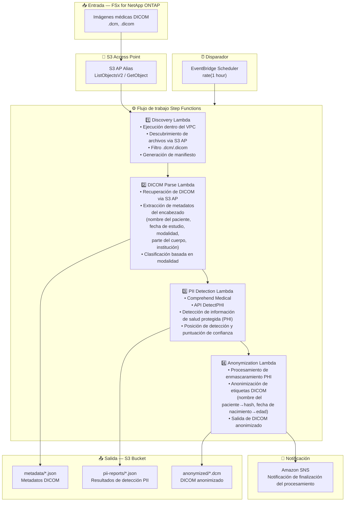

# UC5: Salud — Clasificación automática y anonimización de imágenes DICOM

🌐 **Language / 言語**: [日本語](architecture.md) | [English](architecture.en.md) | [한국어](architecture.ko.md) | [简体中文](architecture.zh-CN.md) | [繁體中文](architecture.zh-TW.md) | [Français](architecture.fr.md) | [Deutsch](architecture.de.md) | Español

## Arquitectura de extremo a extremo (Entrada → Salida)

---

## Diagrama de arquitectura

---

## Detalle del flujo de datos

### Entrada
| Elemento | Descripción |
|----------|-------------|
| **Origen** | Volumen FSx for NetApp ONTAP |
| **Tipos de archivo** | .dcm, .dicom (imágenes médicas DICOM) |
| **Método de acceso** | S3 Access Point (ListObjectsV2 + GetObject) |
| **Estrategia de lectura** | Recuperación completa del archivo DICOM (encabezado + datos de píxeles) |

### Procesamiento
| Paso | Servicio | Función |
|------|----------|---------|
| Discovery | Lambda (VPC) | Descubrir archivos DICOM via S3 AP, generar manifiesto |
| DICOM Parse | Lambda | Extraer metadatos de encabezados DICOM (info del paciente, modalidad, fecha de estudio, etc.) |
| PII Detection | Lambda + Comprehend Medical | Detectar información de salud protegida via DetectPHI |
| Anonymization | Lambda | Enmascaramiento y anonimización de PHI, salida de DICOM anonimizado |

### Salida
| Artefacto | Formato | Descripción |
|-----------|---------|-------------|
| Metadatos DICOM | `metadata/YYYY/MM/DD/{stem}.json` | Metadatos extraídos (modalidad, parte del cuerpo, fecha de estudio) |
| Informe PII | `pii-reports/YYYY/MM/DD/{stem}_pii.json` | Resultados de detección PHI (posición, tipo, confianza) |
| DICOM anonimizado | `anonymized/YYYY/MM/DD/{stem}.dcm` | Archivo DICOM anonimizado |
| Notificación SNS | Correo electrónico | Notificación de finalización del procesamiento (cantidad procesada y anonimizada) |

---

## Decisiones de diseño clave

1. **S3 AP en lugar de NFS** — No se necesita montaje NFS desde Lambda; archivos DICOM recuperados via API S3
2. **Especialización de Comprehend Medical** — Identificación PII de alta precisión mediante detección PHI específica del dominio médico
3. **Anonimización por etapas** — Tres etapas (extracción de metadatos → detección PII → anonimización) garantizan la trazabilidad de auditoría
4. **Conformidad con el estándar DICOM** — Reglas de anonimización basadas en DICOM PS3.15 (perfiles de seguridad)
5. **Conformidad HIPAA / leyes de privacidad** — Anonimización por método Safe Harbor (eliminación de 18 identificadores)
6. **Sondeo (no basado en eventos)** — S3 AP no admite notificaciones de eventos, por lo que se utiliza ejecución programada periódica

---

## Servicios AWS utilizados

| Servicio | Rol |
|----------|-----|
| FSx for NetApp ONTAP | Almacenamiento de imágenes médicas PACS/VNA |
| S3 Access Points | Acceso serverless a volúmenes ONTAP |
| EventBridge Scheduler | Disparador periódico |
| Step Functions | Orquestación del flujo de trabajo |
| Lambda | Cómputo (Discovery, DICOM Parse, PII Detection, Anonymization) |
| Amazon Comprehend Medical | Detección de PHI (información de salud protegida) |
| SNS | Notificación de finalización del procesamiento |
| Secrets Manager | Gestión de credenciales de la API REST de ONTAP |
| CloudWatch + X-Ray | Observabilidad |
