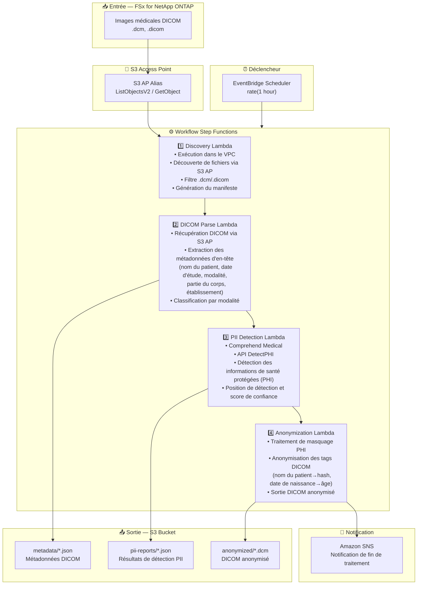

# UC5: Santé — Classification automatique et anonymisation d'images DICOM

🌐 **Language / 言語**: [日本語](architecture.md) | [English](architecture.en.md) | [한국어](architecture.ko.md) | [简体中文](architecture.zh-CN.md) | [繁體中文](architecture.zh-TW.md) | Français | [Deutsch](architecture.de.md) | [Español](architecture.es.md)

## Architecture de bout en bout (Entrée → Sortie)

---

## Flux de haut niveau

```
┌─────────────────────────────────────────────────────────────────────────────┐
│                         FSx for NetApp ONTAP                                 │
│                                                                              │
│  /vol/pacs_archive/                                                          │
│  ├── CT/patient_001/study_20240315/series_001.dcm    (CT scan)               │
│  ├── MR/patient_002/study_20240316/brain_t1.dcm      (MRI)                   │
│  ├── XR/patient_003/study_20240317/chest_pa.dcm      (X-ray)                 │
│  └── US/patient_004/study_20240318/abdomen.dicom     (Ultrasound)            │
│                                                                              │
└──────────────────────────────────┬───────────────────────────────────────────┘
                                   │
                                   ▼
┌──────────────────────────────────────────────────────────────────────────────┐
│                      S3 Access Point (Data Path)                              │
│                                                                              │
│  Alias: fsxn-dicom-vol-ext-s3alias                                           │
│  • ListObjectsV2 (DICOM file discovery)                                      │
│  • GetObject (DICOM file retrieval)                                          │
│  • No NFS/SMB mount required from Lambda                                     │
│                                                                              │
└──────────────────────────────────┬───────────────────────────────────────────┘
                                   │
                                   ▼
┌──────────────────────────────────────────────────────────────────────────────┐
│                    EventBridge Scheduler (Trigger)                            │
│                                                                              │
│  Schedule: rate(1 hour) — configurable                                       │
│  Target: Step Functions State Machine                                        │
│                                                                              │
└──────────────────────────────────┬───────────────────────────────────────────┘
                                   │
                                   ▼
┌──────────────────────────────────────────────────────────────────────────────┐
│                    AWS Step Functions (Orchestration)                         │
│                                                                              │
│  ┌─────────────┐    ┌──────────────┐    ┌──────────────┐    ┌───────────┐  │
│  │  Discovery   │───▶│ DICOM Parse  │───▶│PII Detection │───▶│Anonymiza- │  │
│  │  Lambda      │    │  Lambda      │    │  Lambda      │    │tion Lambda│  │
│  │             │    │             │    │             │    │           │  │
│  │  • VPC内     │    │  • Metadata  │    │  • Comprehend│    │  • PHI     │  │
│  │  • S3 AP List│    │    extraction│    │    Medical   │    │    removal │  │
│  │  • .dcm      │    │  • Patient   │    │  • PII       │    │  • Masking │  │
│  │    detection │    │    info      │    │    detection │    │    process │  │
│  └─────────────┘    └──────────────┘    └──────────────┘    └───────────┘  │
│                                                                              │
└──────────────────────────────────────────────────────────────────────────────┘
                                   │
                                   ▼
┌──────────────────────────────────────────────────────────────────────────────┐
│                         Output (S3 Bucket)                                    │
│                                                                              │
│  s3://{stack}-output-{account}/                                              │
│  ├── metadata/YYYY/MM/DD/                                                    │
│  │   └── patient_001_series_001.json   ← DICOM metadata                     │
│  ├── pii-reports/YYYY/MM/DD/                                                 │
│  │   └── patient_001_series_001_pii.json  ← PII detection results           │
│  └── anonymized/YYYY/MM/DD/                                                  │
│      └── anon_series_001.dcm           ← Anonymized DICOM                   │
│                                                                              │
└──────────────────────────────────────────────────────────────────────────────┘
```

---

## Diagramme Mermaid



---

## Détail du flux de données

### Entrée
| Élément | Description |
|---------|-------------|
| **Source** | Volume FSx for NetApp ONTAP |
| **Types de fichiers** | .dcm, .dicom (images médicales DICOM) |
| **Méthode d'accès** | S3 Access Point (ListObjectsV2 + GetObject) |
| **Stratégie de lecture** | Récupération complète du fichier DICOM (en-tête + données pixel) |

### Traitement
| Étape | Service | Fonction |
|-------|---------|----------|
| Discovery | Lambda (VPC) | Découverte des fichiers DICOM via S3 AP, génération du manifeste |
| DICOM Parse | Lambda | Extraction des métadonnées des en-têtes DICOM (info patient, modalité, date d'étude, etc.) |
| PII Detection | Lambda + Comprehend Medical | Détection des informations de santé protégées via DetectPHI |
| Anonymization | Lambda | Masquage et anonymisation PHI, sortie DICOM anonymisé |

### Sortie
| Artefact | Format | Description |
|----------|--------|-------------|
| Métadonnées DICOM | `metadata/YYYY/MM/DD/{stem}.json` | Métadonnées extraites (modalité, partie du corps, date d'étude) |
| Rapport PII | `pii-reports/YYYY/MM/DD/{stem}_pii.json` | Résultats de détection PHI (position, type, confiance) |
| DICOM anonymisé | `anonymized/YYYY/MM/DD/{stem}.dcm` | Fichier DICOM anonymisé |
| Notification SNS | E-mail | Notification de fin de traitement (nombre traité et anonymisé) |

---

## Décisions de conception clés

1. **S3 AP plutôt que NFS** — Pas de montage NFS nécessaire depuis Lambda ; fichiers DICOM récupérés via l'API S3
2. **Spécialisation Comprehend Medical** — Identification PII haute précision grâce à la détection PHI spécifique au domaine médical
3. **Anonymisation par étapes** — Trois étapes (extraction des métadonnées → détection PII → anonymisation) garantissent la traçabilité d'audit
4. **Conformité au standard DICOM** — Règles d'anonymisation basées sur DICOM PS3.15 (profils de sécurité)
5. **Conformité HIPAA / lois sur la vie privée** — Anonymisation par méthode Safe Harbor (suppression de 18 identifiants)
6. **Interrogation périodique (non événementielle)** — S3 AP ne prend pas en charge les notifications d'événements, une exécution planifiée périodique est donc utilisée

---

## Services AWS utilisés

| Service | Rôle |
|---------|------|
| FSx for NetApp ONTAP | Stockage d'images médicales PACS/VNA |
| S3 Access Points | Accès serverless aux volumes ONTAP |
| EventBridge Scheduler | Déclencheur périodique |
| Step Functions | Orchestration du workflow |
| Lambda | Calcul (Discovery, DICOM Parse, PII Detection, Anonymization) |
| Amazon Comprehend Medical | Détection PHI (informations de santé protégées) |
| SNS | Notification de fin de traitement |
| Secrets Manager | Gestion des identifiants de l'API REST ONTAP |
| CloudWatch + X-Ray | Observabilité |
