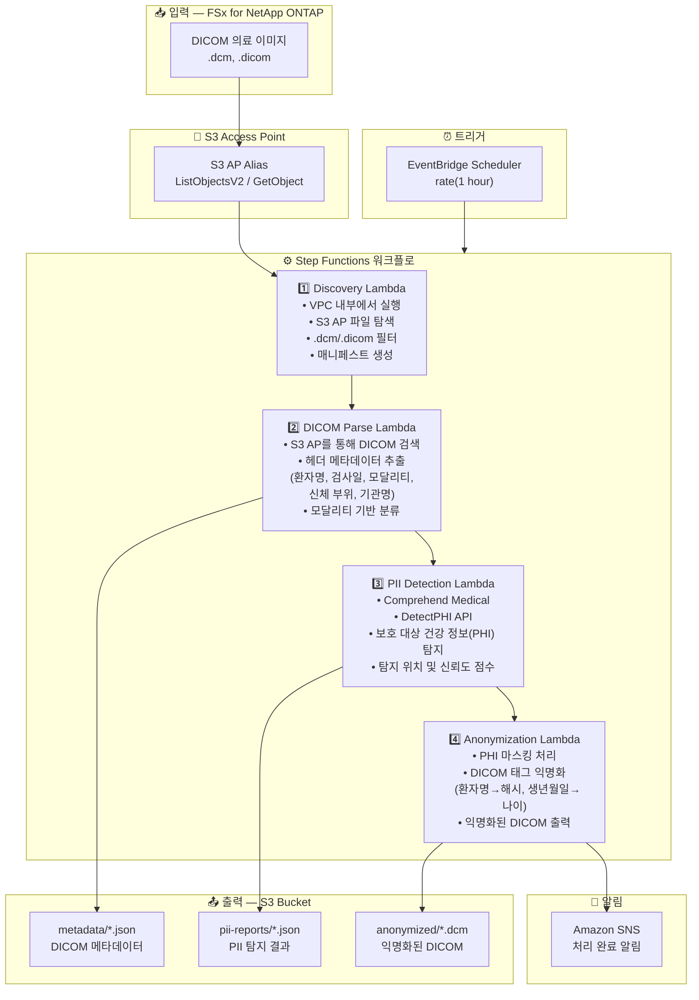

# UC5: 의료 — DICOM 이미지 자동 분류 및 익명화

🌐 **Language / 言語**: [日本語](architecture.md) | [English](architecture.en.md) | 한국어 | [简体中文](architecture.zh-CN.md) | [繁體中文](architecture.zh-TW.md) | [Français](architecture.fr.md) | [Deutsch](architecture.de.md) | [Español](architecture.es.md)

## 엔드투엔드 아키텍처 (입력 → 출력)

---

## 상위 수준 흐름

```
┌─────────────────────────────────────────────────────────────────────────────┐
│                         FSx for NetApp ONTAP                                 │
│                                                                              │
│  /vol/pacs_archive/                                                          │
│  ├── CT/patient_001/study_20240315/series_001.dcm    (CT scan)               │
│  ├── MR/patient_002/study_20240316/brain_t1.dcm      (MRI)                   │
│  ├── XR/patient_003/study_20240317/chest_pa.dcm      (X-ray)                 │
│  └── US/patient_004/study_20240318/abdomen.dicom     (Ultrasound)            │
│                                                                              │
└──────────────────────────────────┬───────────────────────────────────────────┘
                                   │
                                   ▼
┌──────────────────────────────────────────────────────────────────────────────┐
│                      S3 Access Point (Data Path)                              │
│                                                                              │
│  Alias: fsxn-dicom-vol-ext-s3alias                                           │
│  • ListObjectsV2 (DICOM file discovery)                                      │
│  • GetObject (DICOM file retrieval)                                          │
│  • No NFS/SMB mount required from Lambda                                     │
│                                                                              │
└──────────────────────────────────┬───────────────────────────────────────────┘
                                   │
                                   ▼
┌──────────────────────────────────────────────────────────────────────────────┐
│                    EventBridge Scheduler (Trigger)                            │
│                                                                              │
│  Schedule: rate(1 hour) — configurable                                       │
│  Target: Step Functions State Machine                                        │
│                                                                              │
└──────────────────────────────────┬───────────────────────────────────────────┘
                                   │
                                   ▼
┌──────────────────────────────────────────────────────────────────────────────┐
│                    AWS Step Functions (Orchestration)                         │
│                                                                              │
│  ┌─────────────┐    ┌──────────────┐    ┌──────────────┐    ┌───────────┐  │
│  │  Discovery   │───▶│ DICOM Parse  │───▶│PII Detection │───▶│Anonymiza- │  │
│  │  Lambda      │    │  Lambda      │    │  Lambda      │    │tion Lambda│  │
│  │             │    │             │    │             │    │           │  │
│  │  • VPC内     │    │  • Metadata  │    │  • Comprehend│    │  • PHI     │  │
│  │  • S3 AP List│    │    extraction│    │    Medical   │    │    removal │  │
│  │  • .dcm      │    │  • Patient   │    │  • PII       │    │  • Masking │  │
│  │    detection │    │    info      │    │    detection │    │    process │  │
│  └─────────────┘    └──────────────┘    └──────────────┘    └───────────┘  │
│                                                                              │
└──────────────────────────────────────────────────────────────────────────────┘
                                   │
                                   ▼
┌──────────────────────────────────────────────────────────────────────────────┐
│                         Output (S3 Bucket)                                    │
│                                                                              │
│  s3://{stack}-output-{account}/                                              │
│  ├── metadata/YYYY/MM/DD/                                                    │
│  │   └── patient_001_series_001.json   ← DICOM metadata                     │
│  ├── pii-reports/YYYY/MM/DD/                                                 │
│  │   └── patient_001_series_001_pii.json  ← PII detection results           │
│  └── anonymized/YYYY/MM/DD/                                                  │
│      └── anon_series_001.dcm           ← Anonymized DICOM                   │
│                                                                              │
└──────────────────────────────────────────────────────────────────────────────┘
```

---

## Mermaid 다이어그램



---

## 데이터 흐름 상세

### 입력
| 항목 | 설명 |
|------|------|
| **소스** | FSx for NetApp ONTAP 볼륨 |
| **파일 유형** | .dcm, .dicom (DICOM 의료 이미지) |
| **접근 방식** | S3 Access Point (ListObjectsV2 + GetObject) |
| **읽기 전략** | DICOM 파일 전체 검색 (헤더 + 픽셀 데이터) |

### 처리
| 단계 | 서비스 | 기능 |
|------|--------|------|
| Discovery | Lambda (VPC) | S3 AP를 통해 DICOM 파일 탐색, 매니페스트 생성 |
| DICOM Parse | Lambda | DICOM 헤더에서 메타데이터 추출 (환자 정보, 모달리티, 검사일 등) |
| PII Detection | Lambda + Comprehend Medical | DetectPHI를 통한 보호 대상 건강 정보 탐지 |
| Anonymization | Lambda | PHI 마스킹 및 익명화, 익명화된 DICOM 출력 |

### 출력
| 산출물 | 형식 | 설명 |
|--------|------|------|
| DICOM 메타데이터 | `metadata/YYYY/MM/DD/{stem}.json` | 추출된 메타데이터 (모달리티, 신체 부위, 검사일) |
| PII 보고서 | `pii-reports/YYYY/MM/DD/{stem}_pii.json` | PHI 탐지 결과 (위치, 유형, 신뢰도) |
| 익명화된 DICOM | `anonymized/YYYY/MM/DD/{stem}.dcm` | 익명화된 DICOM 파일 |
| SNS 알림 | 이메일 | 처리 완료 알림 (처리 건수 및 익명화 건수) |

---

## 주요 설계 결정

1. **NFS 대신 S3 AP** — Lambda에서 NFS 마운트 불필요; S3 API를 통해 DICOM 파일 검색
2. **Comprehend Medical 특화** — 의료 도메인 전용 PHI 탐지를 활용한 고정밀 PII 식별
3. **단계적 익명화** — 3단계 (메타데이터 추출 → PII 탐지 → 익명화)로 감사 추적 보장
4. **DICOM 표준 준수** — DICOM PS3.15 (보안 프로파일)에 기반한 익명화 규칙
5. **HIPAA / 개인정보보호법 준수** — Safe Harbor 방식 익명화 (18개 식별자 제거)
6. **폴링 (이벤트 기반 아님)** — S3 AP는 이벤트 알림을 지원하지 않으므로 주기적 스케줄 실행 사용

---

## 사용 AWS 서비스

| 서비스 | 역할 |
|--------|------|
| FSx for NetApp ONTAP | PACS/VNA 의료 이미지 스토리지 |
| S3 Access Points | ONTAP 볼륨에 대한 서버리스 접근 |
| EventBridge Scheduler | 주기적 트리거 |
| Step Functions | 워크플로 오케스트레이션 |
| Lambda | 컴퓨팅 (Discovery, DICOM Parse, PII Detection, Anonymization) |
| Amazon Comprehend Medical | PHI (보호 대상 건강 정보) 탐지 |
| SNS | 처리 완료 알림 |
| Secrets Manager | ONTAP REST API 자격 증명 관리 |
| CloudWatch + X-Ray | 관측 가능성 |
