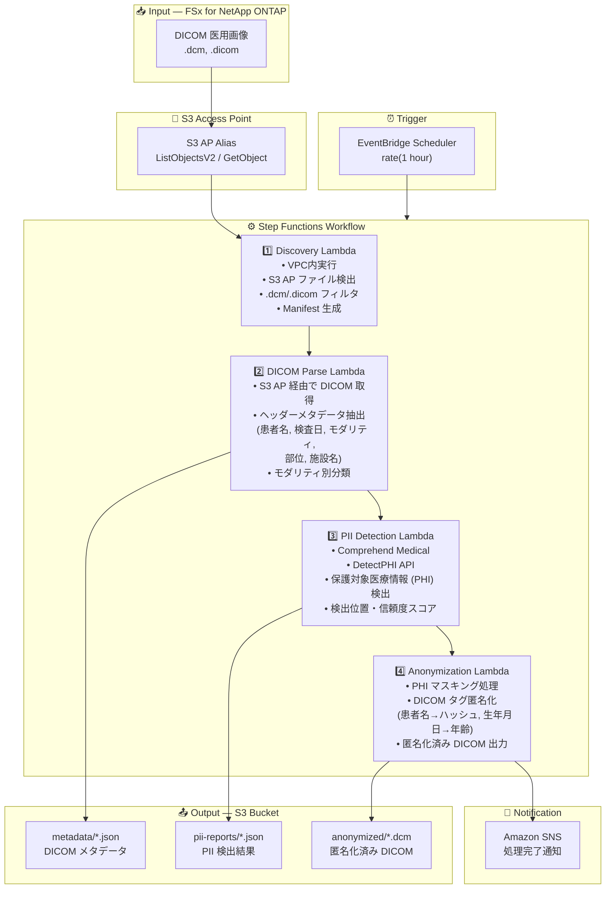

# UC5: 医療 — DICOM 画像の自動分類・匿名化

🌐 **Language / 言語**: 日本語 | [English](architecture.en.md) | [한국어](architecture.ko.md) | [简体中文](architecture.zh-CN.md) | [繁體中文](architecture.zh-TW.md) | [Français](architecture.fr.md) | [Deutsch](architecture.de.md) | [Español](architecture.es.md)

## End-to-End Architecture (Input → Output)

---

## High-Level Flow

```
┌─────────────────────────────────────────────────────────────────────────────┐
│                         FSx for NetApp ONTAP                                 │
│                                                                              │
│  /vol/pacs_archive/                                                          │
│  ├── CT/patient_001/study_20240315/series_001.dcm    (CT スキャン)           │
│  ├── MR/patient_002/study_20240316/brain_t1.dcm      (MRI)                   │
│  ├── XR/patient_003/study_20240317/chest_pa.dcm      (X線)                   │
│  └── US/patient_004/study_20240318/abdomen.dicom     (超音波)                │
│                                                                              │
└──────────────────────────────────┬───────────────────────────────────────────┘
                                   │
                                   ▼
┌──────────────────────────────────────────────────────────────────────────────┐
│                      S3 Access Point (Data Path)                              │
│                                                                              │
│  Alias: fsxn-dicom-vol-ext-s3alias                                           │
│  • ListObjectsV2 (DICOM ファイル検出)                                        │
│  • GetObject (DICOM ファイル取得)                                             │
│  • No NFS/SMB mount required from Lambda                                     │
│                                                                              │
└──────────────────────────────────┬───────────────────────────────────────────┘
                                   │
                                   ▼
┌──────────────────────────────────────────────────────────────────────────────┐
│                    EventBridge Scheduler (Trigger)                            │
│                                                                              │
│  Schedule: rate(1 hour) — configurable                                       │
│  Target: Step Functions State Machine                                        │
│                                                                              │
└──────────────────────────────────┬───────────────────────────────────────────┘
                                   │
                                   ▼
┌──────────────────────────────────────────────────────────────────────────────┐
│                    AWS Step Functions (Orchestration)                         │
│                                                                              │
│  ┌─────────────┐    ┌──────────────┐    ┌──────────────┐    ┌───────────┐  │
│  │  Discovery   │───▶│ DICOM Parse  │───▶│PII Detection │───▶│Anonymiza- │  │
│  │  Lambda      │    │  Lambda      │    │  Lambda      │    │tion Lambda│  │
│  │             │    │             │    │             │    │           │  │
│  │  • VPC内     │    │  • メタデータ│    │  • Comprehend│    │  • PHI 除去│  │
│  │  • S3 AP List│    │    抽出      │    │    Medical   │    │  • マスキン│  │
│  │  • .dcm 検出 │    │  • 患者情報  │    │  • PII 検出  │    │    グ処理  │  │
│  └─────────────┘    └──────────────┘    └──────────────┘    └───────────┘  │
│                                                                              │
└──────────────────────────────────────────────────────────────────────────────┘
                                   │
                                   ▼
┌──────────────────────────────────────────────────────────────────────────────┐
│                         Output (S3 Bucket)                                    │
│                                                                              │
│  s3://{stack}-output-{account}/                                              │
│  ├── metadata/YYYY/MM/DD/                                                    │
│  │   └── patient_001_series_001.json   ← DICOM メタデータ                   │
│  ├── pii-reports/YYYY/MM/DD/                                                 │
│  │   └── patient_001_series_001_pii.json  ← PII 検出結果                    │
│  └── anonymized/YYYY/MM/DD/                                                  │
│      └── anon_series_001.dcm           ← 匿名化済み DICOM                   │
│                                                                              │
└──────────────────────────────────────────────────────────────────────────────┘
```

---

## Mermaid Diagram



---

## Data Flow Detail

### Input
| Item | Description |
|------|-------------|
| **Source** | FSx for NetApp ONTAP volume |
| **File Types** | .dcm, .dicom (DICOM 医用画像) |
| **Access Method** | S3 Access Point (ListObjectsV2 + GetObject) |
| **Read Strategy** | DICOM ファイル全体を取得（ヘッダー + ピクセルデータ） |

### Processing
| Step | Service | Function |
|------|---------|----------|
| Discovery | Lambda (VPC) | S3 AP で DICOM ファイル検出、Manifest 生成 |
| DICOM Parse | Lambda | DICOM ヘッダーからメタデータ抽出（患者情報、モダリティ、検査日等） |
| PII Detection | Lambda + Comprehend Medical | DetectPHI で保護対象医療情報を検出 |
| Anonymization | Lambda | PHI のマスキング・匿名化処理、匿名化 DICOM 出力 |

### Output
| Artifact | Format | Description |
|----------|--------|-------------|
| DICOM Metadata | `metadata/YYYY/MM/DD/{stem}.json` | 抽出メタデータ（モダリティ、部位、検査日） |
| PII Report | `pii-reports/YYYY/MM/DD/{stem}_pii.json` | PHI 検出結果（位置、種別、信頼度） |
| Anonymized DICOM | `anonymized/YYYY/MM/DD/{stem}.dcm` | 匿名化済み DICOM ファイル |
| SNS Notification | Email | 処理完了通知（処理件数・匿名化件数） |

---

## Key Design Decisions

1. **S3 AP over NFS** — Lambda から NFS マウント不要、S3 API で DICOM ファイル取得
2. **Comprehend Medical 特化** — 医療ドメイン専用の PHI 検出で高精度な個人情報特定
3. **段階的匿名化** — メタデータ抽出 → PII 検出 → 匿名化の3段階で監査証跡を確保
4. **DICOM 標準準拠** — DICOM PS3.15 (Security Profiles) に基づく匿名化ルール適用
5. **HIPAA / 個人情報保護法対応** — Safe Harbor 方式の匿名化（18 識別子の除去）
6. **ポーリングベース** — S3 AP はイベント通知非対応のため、定期スケジュール実行

---

## AWS Services Used

| Service | Role |
|---------|------|
| FSx for NetApp ONTAP | PACS/VNA 医用画像ストレージ |
| S3 Access Points | ONTAP ボリュームへのサーバーレスアクセス |
| EventBridge Scheduler | 定期トリガー |
| Step Functions | ワークフローオーケストレーション |
| Lambda | コンピュート（Discovery, DICOM Parse, PII Detection, Anonymization） |
| Amazon Comprehend Medical | PHI（保護対象医療情報）検出 |
| SNS | 処理完了通知 |
| Secrets Manager | ONTAP REST API 認証情報管理 |
| CloudWatch + X-Ray | オブザーバビリティ |
