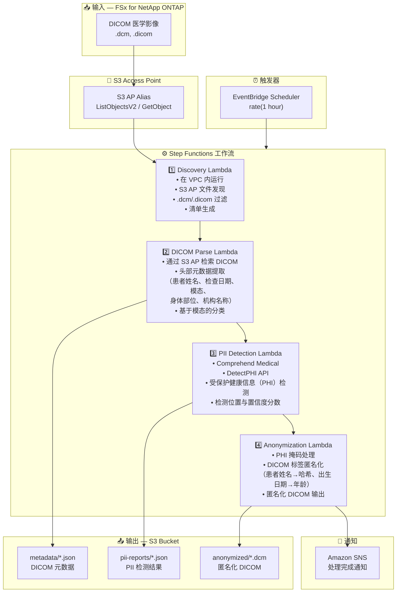

# UC5: 医疗 — DICOM 图像自动分类与匿名化

🌐 **Language / 言語**: [日本語](architecture.md) | [English](architecture.en.md) | [한국어](architecture.ko.md) | 简体中文 | [繁體中文](architecture.zh-TW.md) | [Français](architecture.fr.md) | [Deutsch](architecture.de.md) | [Español](architecture.es.md)

## 端到端架构（输入 → 输出）

---

## 架构图

---

## 数据流详情

### 输入
| 项目 | 说明 |
|------|------|
| **来源** | FSx for NetApp ONTAP 卷 |
| **文件类型** | .dcm, .dicom（DICOM 医学影像） |
| **访问方式** | S3 Access Point（ListObjectsV2 + GetObject） |
| **读取策略** | 完整 DICOM 文件检索（头部 + 像素数据） |

### 处理
| 步骤 | 服务 | 功能 |
|------|------|------|
| Discovery | Lambda（VPC） | 通过 S3 AP 发现 DICOM 文件，生成清单 |
| DICOM Parse | Lambda | 从 DICOM 头部提取元数据（患者信息、模态、检查日期等） |
| PII Detection | Lambda + Comprehend Medical | 通过 DetectPHI 检测受保护健康信息 |
| Anonymization | Lambda | PHI 掩码与匿名化，输出匿名化 DICOM |

### 输出
| 产出物 | 格式 | 说明 |
|--------|------|------|
| DICOM 元数据 | `metadata/YYYY/MM/DD/{stem}.json` | 提取的元数据（模态、身体部位、检查日期） |
| PII 报告 | `pii-reports/YYYY/MM/DD/{stem}_pii.json` | PHI 检测结果（位置、类型、置信度） |
| 匿名化 DICOM | `anonymized/YYYY/MM/DD/{stem}.dcm` | 匿名化 DICOM 文件 |
| SNS 通知 | 电子邮件 | 处理完成通知（处理数量与匿名化数量） |

---

## 关键设计决策

1. **S3 AP 优于 NFS** — Lambda 无需 NFS 挂载；通过 S3 API 检索 DICOM 文件
2. **Comprehend Medical 专业化** — 利用医疗领域专用 PHI 检测实现高精度 PII 识别
3. **分阶段匿名化** — 三阶段（元数据提取 → PII 检测 → 匿名化）确保审计追踪
4. **DICOM 标准合规** — 基于 DICOM PS3.15（安全配置文件）的匿名化规则
5. **HIPAA / 隐私法合规** — Safe Harbor 方法匿名化（移除 18 个标识符）
6. **轮询（非事件驱动）** — S3 AP 不支持事件通知，因此使用定期计划执行

---

## 使用的 AWS 服务

| 服务 | 角色 |
|------|------|
| FSx for NetApp ONTAP | PACS/VNA 医学影像存储 |
| S3 Access Points | 对 ONTAP 卷的无服务器访问 |
| EventBridge Scheduler | 定期触发器 |
| Step Functions | 工作流编排 |
| Lambda | 计算（Discovery、DICOM Parse、PII Detection、Anonymization） |
| Amazon Comprehend Medical | PHI（受保护健康信息）检测 |
| SNS | 处理完成通知 |
| Secrets Manager | ONTAP REST API 凭证管理 |
| CloudWatch + X-Ray | 可观测性 |
