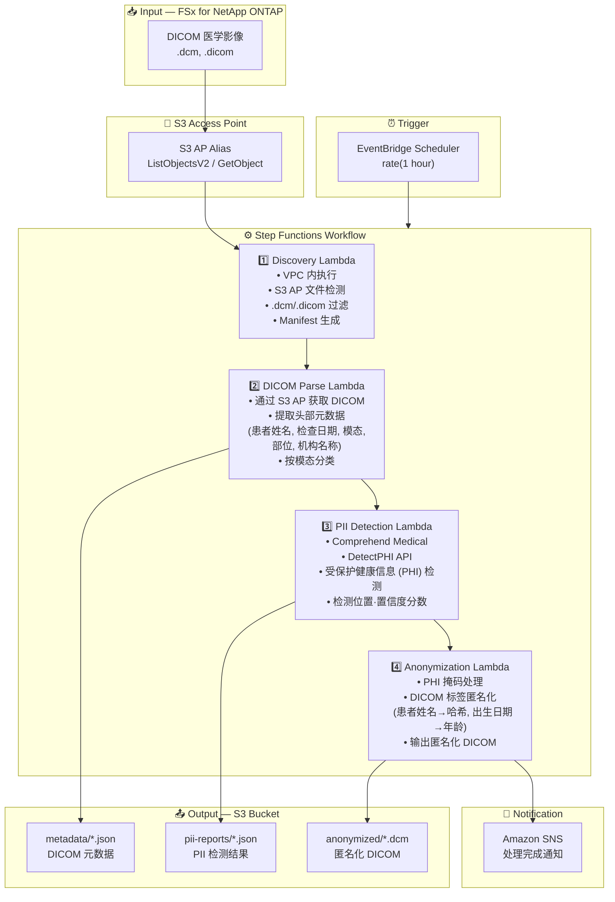

# UC5: 医疗 — DICOM 图像的自动分类·匿名化

🌐 **Language / 언어 / 语言 / 語言 / Langue / Sprache / Idioma**: [日本語](architecture.md) | [English](architecture.en.md) | [한국어](architecture.ko.md) | 简体中文 | [繁體中文](architecture.zh-TW.md) | [Français](architecture.fr.md) | [Deutsch](architecture.de.md) | [Español](architecture.es.md)

> 注意：此翻译由 Amazon Bedrock Claude 生成。欢迎对翻译质量提出改进建议。

## End-to-End Architecture (Input → Output)

---

## Architecture Diagram

---

## Data Flow Detail

### Input
| Item | Description |
|------|-------------|
| **Source** | FSx for NetApp ONTAP volume |
| **File Types** | .dcm, .dicom (DICOM 医学影像) |
| **Access Method** | S3 Access Point (ListObjectsV2 + GetObject) |
| **Read Strategy** | 获取完整 DICOM 文件（头部 + 像素数据） |

### Processing
| Step | Service | Function |
|------|---------|----------|
| Discovery | Lambda (VPC) | 通过 S3 AP 检测 DICOM 文件，生成 Manifest |
| DICOM Parse | Lambda | 从 DICOM 头部提取元数据（患者信息、模态、检查日期等） |
| PII Detection | Lambda + Comprehend Medical | 使用 DetectPHI 检测受保护健康信息 |
| Anonymization | Lambda | PHI 掩码·匿名化处理，输出匿名化 DICOM |

### Output
| Artifact | Format | Description |
|----------|--------|-------------|
| DICOM Metadata | `metadata/YYYY/MM/DD/{stem}.json` | 提取的元数据（模态、部位、检查日期） |
| PII Report | `pii-reports/YYYY/MM/DD/{stem}_pii.json` | PHI 检测结果（位置、类型、置信度） |
| Anonymized DICOM | `anonymized/YYYY/MM/DD/{stem}.dcm` | 匿名化 DICOM 文件 |
| SNS Notification | Email | 处理完成通知（处理数量·匿名化数量） |

---

## Key Design Decisions

1. **S3 AP over NFS** — 无需从 Lambda 挂载 NFS，通过 S3 API 获取 DICOM 文件
2. **Comprehend Medical 专用** — 使用医疗领域专用的 PHI 检测实现高精度个人信息识别
3. **分阶段匿名化** — 元数据提取 → PII 检测 → 匿名化的 3 阶段确保审计追踪
4. **DICOM 标准合规** — 应用基于 DICOM PS3.15 (Security Profiles) 的匿名化规则
5. **HIPAA / 个人信息保护法合规** — Safe Harbor 方式匿名化（移除 18 个标识符）
6. **基于轮询** — 由于 S3 AP 不支持事件通知，采用定期调度执行

---

## AWS Services Used

| Service | Role |
|---------|------|
| FSx for NetApp ONTAP | PACS/VNA 医学影像存储 |
| S3 Access Points | 对 ONTAP 卷的无服务器访问 |
| EventBridge Scheduler | 定期触发器 |
| Step Functions | 工作流编排 |
| Lambda | 计算（Discovery, DICOM Parse, PII Detection, Anonymization） |
| Amazon Comprehend Medical | PHI（受保护健康信息）检测 |
| SNS | 处理完成通知 |
| Secrets Manager | ONTAP REST API 凭证管理 |
| CloudWatch + X-Ray | 可观测性 |
