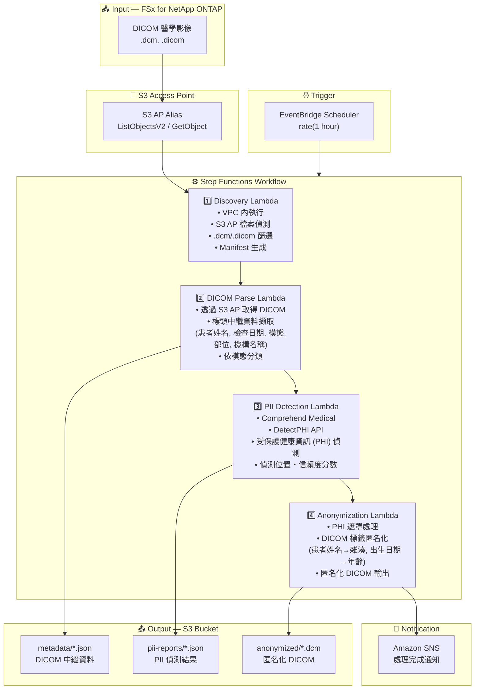

# UC5: 醫療 — DICOM 影像的自動分類・匿名化

🌐 **Language / 언어 / 语言 / 語言 / Langue / Sprache / Idioma**: [日本語](architecture.md) | [English](architecture.en.md) | [한국어](architecture.ko.md) | [简体中文](architecture.zh-CN.md) | 繁體中文 | [Français](architecture.fr.md) | [Deutsch](architecture.de.md) | [Español](architecture.es.md)

> 注意：此翻譯由 Amazon Bedrock Claude 產生。歡迎對翻譯品質提出改進建議。

## End-to-End Architecture (Input → Output)

---

## Architecture Diagram

---

## Data Flow Detail

### Input
| Item | Description |
|------|-------------|
| **Source** | FSx for NetApp ONTAP volume |
| **File Types** | .dcm, .dicom (DICOM 醫學影像) |
| **Access Method** | S3 Access Point (ListObjectsV2 + GetObject) |
| **Read Strategy** | 取得完整 DICOM 檔案（標頭 + 像素資料） |

### Processing
| Step | Service | Function |
|------|---------|----------|
| Discovery | Lambda (VPC) | 透過 S3 AP 偵測 DICOM 檔案，生成 Manifest |
| DICOM Parse | Lambda | 從 DICOM 標頭擷取中繼資料（患者資訊、模態、檢查日期等） |
| PII Detection | Lambda + Comprehend Medical | 使用 DetectPHI 偵測受保護健康資訊 |
| Anonymization | Lambda | PHI 遮罩・匿名化處理，輸出匿名化 DICOM |

### Output
| Artifact | Format | Description |
|----------|--------|-------------|
| DICOM Metadata | `metadata/YYYY/MM/DD/{stem}.json` | 擷取的中繼資料（模態、部位、檢查日期） |
| PII Report | `pii-reports/YYYY/MM/DD/{stem}_pii.json` | PHI 偵測結果（位置、類型、信賴度） |
| Anonymized DICOM | `anonymized/YYYY/MM/DD/{stem}.dcm` | 匿名化 DICOM 檔案 |
| SNS Notification | Email | 處理完成通知（處理數量・匿名化數量） |

---

## Key Design Decisions

1. **S3 AP over NFS** — Lambda 無需掛載 NFS，透過 S3 API 取得 DICOM 檔案
2. **Comprehend Medical 特化** — 使用醫療領域專用的 PHI 偵測，實現高精度個人資訊識別
3. **階段式匿名化** — 中繼資料擷取 → PII 偵測 → 匿名化三階段確保稽核軌跡
4. **DICOM 標準合規** — 套用基於 DICOM PS3.15 (Security Profiles) 的匿名化規則
5. **HIPAA / 個人資訊保護法對應** — Safe Harbor 方式匿名化（移除 18 項識別資訊）
6. **輪詢基礎** — 因 S3 AP 不支援事件通知，採用定期排程執行

---

## AWS Services Used

| Service | Role |
|---------|------|
| FSx for NetApp ONTAP | PACS/VNA 醫學影像儲存 |
| S3 Access Points | 對 ONTAP 磁碟區的無伺服器存取 |
| EventBridge Scheduler | 定期觸發器 |
| Step Functions | 工作流程編排 |
| Lambda | 運算（Discovery, DICOM Parse, PII Detection, Anonymization） |
| Amazon Comprehend Medical | PHI（受保護健康資訊）偵測 |
| SNS | 處理完成通知 |
| Secrets Manager | ONTAP REST API 認證資訊管理 |
| CloudWatch + X-Ray | 可觀測性 |
