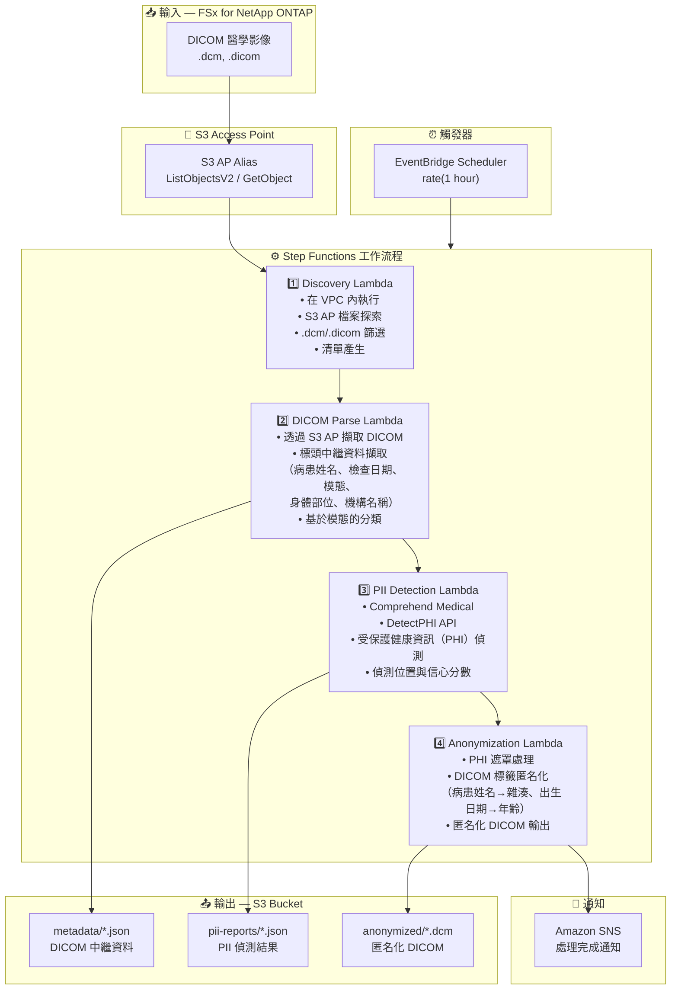

# UC5: 醫療 — DICOM 影像自動分類與匿名化

🌐 **Language / 言語**: [日本語](architecture.md) | [English](architecture.en.md) | [한국어](architecture.ko.md) | [简体中文](architecture.zh-CN.md) | 繁體中文 | [Français](architecture.fr.md) | [Deutsch](architecture.de.md) | [Español](architecture.es.md)

## 端對端架構（輸入 → 輸出）

---

## 架構圖

---

## 資料流程詳情

### 輸入
| 項目 | 說明 |
|------|------|
| **來源** | FSx for NetApp ONTAP 磁碟區 |
| **檔案類型** | .dcm, .dicom（DICOM 醫學影像） |
| **存取方式** | S3 Access Point（ListObjectsV2 + GetObject） |
| **讀取策略** | 完整 DICOM 檔案擷取（標頭 + 像素資料） |

### 處理
| 步驟 | 服務 | 功能 |
|------|------|------|
| Discovery | Lambda（VPC） | 透過 S3 AP 探索 DICOM 檔案，產生清單 |
| DICOM Parse | Lambda | 從 DICOM 標頭擷取中繼資料（病患資訊、模態、檢查日期等） |
| PII Detection | Lambda + Comprehend Medical | 透過 DetectPHI 偵測受保護健康資訊 |
| Anonymization | Lambda | PHI 遮罩與匿名化，輸出匿名化 DICOM |

### 輸出
| 產出物 | 格式 | 說明 |
|--------|------|------|
| DICOM 中繼資料 | `metadata/YYYY/MM/DD/{stem}.json` | 擷取的中繼資料（模態、身體部位、檢查日期） |
| PII 報告 | `pii-reports/YYYY/MM/DD/{stem}_pii.json` | PHI 偵測結果（位置、類型、信心度） |
| 匿名化 DICOM | `anonymized/YYYY/MM/DD/{stem}.dcm` | 匿名化 DICOM 檔案 |
| SNS 通知 | 電子郵件 | 處理完成通知（處理數量與匿名化數量） |

---

## 關鍵設計決策

1. **S3 AP 優於 NFS** — Lambda 無需 NFS 掛載；透過 S3 API 擷取 DICOM 檔案
2. **Comprehend Medical 專業化** — 利用醫療領域專用 PHI 偵測實現高精度 PII 識別
3. **分階段匿名化** — 三階段（中繼資料擷取 → PII 偵測 → 匿名化）確保稽核追蹤
4. **DICOM 標準合規** — 基於 DICOM PS3.15（安全設定檔）的匿名化規則
5. **HIPAA / 隱私法合規** — Safe Harbor 方法匿名化（移除 18 個識別碼）
6. **輪詢（非事件驅動）** — S3 AP 不支援事件通知，因此使用定期排程執行

---

## 使用的 AWS 服務

| 服務 | 角色 |
|------|------|
| FSx for NetApp ONTAP | PACS/VNA 醫學影像儲存 |
| S3 Access Points | 對 ONTAP 磁碟區的無伺服器存取 |
| EventBridge Scheduler | 定期觸發器 |
| Step Functions | 工作流程編排 |
| Lambda | 運算（Discovery、DICOM Parse、PII Detection、Anonymization） |
| Amazon Comprehend Medical | PHI（受保護健康資訊）偵測 |
| SNS | 處理完成通知 |
| Secrets Manager | ONTAP REST API 憑證管理 |
| CloudWatch + X-Ray | 可觀測性 |
