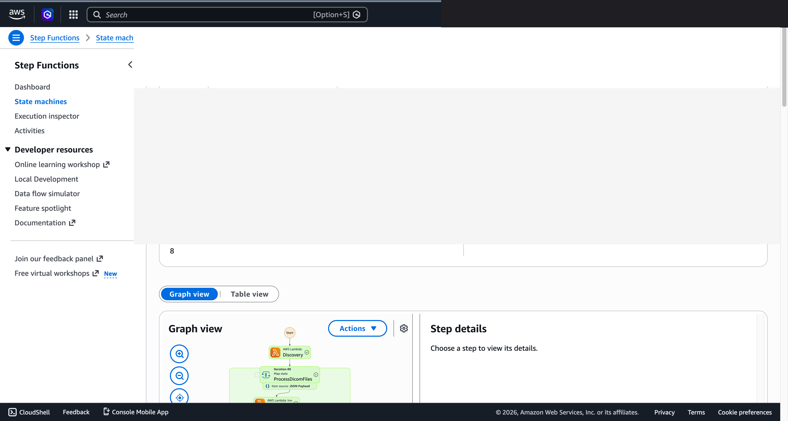

# Flujo de trabajo de anonimización DICOM — Demo Guide

🌐 **Language / 언어 / 语言 / 語言 / Langue / Sprache / Idioma**: [日本語](demo-guide.md) | [English](demo-guide.en.md) | [한국어](demo-guide.ko.md) | [简体中文](demo-guide.zh-CN.md) | [繁體中文](demo-guide.zh-TW.md) | [Français](demo-guide.fr.md) | [Deutsch](demo-guide.de.md) | Español

> Nota: Esta traducción ha sido producida por Amazon Bedrock Claude. Las contribuciones para mejorar la calidad de la traducción son bienvenidas.

## Executive Summary

Esta demostración muestra el flujo de trabajo de anonimización de imágenes médicas (DICOM). Se presenta el proceso de eliminación automática de información personal de pacientes para compartir datos de investigación y verificar la calidad de la anonimización.

**Mensaje central de la demostración**: Eliminar automáticamente la información de identificación de pacientes de archivos DICOM y generar de forma segura conjuntos de datos anonimizados utilizables para investigación.

**Tiempo estimado**: 3–5 minutos

---

## Target Audience & Persona

| Elemento | Detalle |
|------|------|
| **Cargo** | Administrador de información médica / Gestor de datos de investigación clínica |
| **Tareas diarias** | Gestión de imágenes médicas, provisión de datos de investigación, protección de privacidad |
| **Desafío** | La anonimización manual de grandes volúmenes de archivos DICOM consume tiempo y conlleva riesgo de errores |
| **Resultado esperado** | Anonimización segura y confiable con automatización de pistas de auditoría |

### Persona: Sr. Takahashi (Gestor de datos de investigación clínica)

- Necesita anonimizar más de 10,000 archivos DICOM para investigación colaborativa multicéntrica
- Se requiere la eliminación confiable de nombres de pacientes, IDs, fechas de nacimiento, etc.
- "Quiero garantizar cero fugas de anonimización mientras mantengo la calidad de imagen"

---

## Demo Scenario: Anonimización DICOM para compartir datos de investigación

### Visión general del flujo de trabajo

```
Archivo DICOM      Análisis tags    Procesamiento      Verificación
(con info paciente) →  Extracción   →  Eliminación info  →  Confirmación
                    metadatos        personal            anonimización
                                     Hashing             Generación reporte
```

---

## Storyboard (5 secciones / 3–5 minutos)

### Section 1: Problem Statement (0:00–0:45)

**Resumen de narración**:
> Es necesario anonimizar 10,000 archivos DICOM para investigación colaborativa multicéntrica. El procesamiento manual conlleva riesgo de errores y no se puede permitir la fuga de información personal.

**Key Visual**: Lista de archivos DICOM, resaltado de tags de información de pacientes

### Section 2: Workflow Trigger (0:45–1:30)

**Resumen de narración**:
> Se especifica el conjunto de datos objetivo de anonimización y se inicia el flujo de trabajo de anonimización. Se configuran las reglas de anonimización (eliminación, hashing, generalización).

**Key Visual**: Inicio del flujo de trabajo, pantalla de configuración de reglas de anonimización

### Section 3: De-identification (1:30–2:30)

**Resumen de narración**:
> Procesamiento automático de tags de información personal de cada archivo DICOM. Nombre de paciente→hash, fecha de nacimiento→rango de edad, nombre de institución→código anónimo. Los datos de píxeles de imagen se conservan.

**Key Visual**: Progreso del procesamiento de anonimización, antes/después de conversión de tags

### Section 4: Quality Verification (2:30–3:45)

**Resumen de narración**:
> Verificación automática de archivos después de la anonimización. Escaneo de todos los tags para detectar información personal residual. También se confirma la integridad de las imágenes.

**Key Visual**: Resultados de verificación — tasa de éxito de anonimización, lista de tags de riesgo residual

### Section 5: Audit Report (3:45–5:00)

**Resumen de narración**:
> Generación automática de informe de auditoría del procesamiento de anonimización. Se registran el número de archivos procesados, número de tags eliminados y resultados de verificación. Utilizable como material de presentación al comité de ética de investigación.

**Key Visual**: Informe de auditoría (resumen de procesamiento + pista de cumplimiento)

---

## Screen Capture Plan

| # | Pantalla | Sección |
|---|------|-----------|
| 1 | Lista de archivos DICOM (antes de anonimización) | Section 1 |
| 2 | Inicio de flujo de trabajo y configuración de reglas | Section 2 |
| 3 | Progreso de procesamiento de anonimización | Section 3 |
| 4 | Resultados de verificación de calidad | Section 4 |
| 5 | Informe de auditoría | Section 5 |

---

## Narration Outline

| Sección | Tiempo | Mensaje clave |
|-----------|------|--------------|
| Problem | 0:00–0:45 | "No se permiten fugas de anonimización en grandes volúmenes de DICOM" |
| Trigger | 0:45–1:30 | "Configurar reglas de anonimización e iniciar flujo de trabajo" |
| Processing | 1:30–2:30 | "Eliminación automática de tags de información personal, manteniendo calidad de imagen" |
| Verification | 2:30–3:45 | "Confirmar cero fugas de anonimización mediante escaneo de todos los tags" |
| Report | 3:45–5:00 | "Generar automáticamente pista de auditoría, presentable al comité de ética" |

---

## Sample Data Requirements

| # | Datos | Uso |
|---|--------|------|
| 1 | Archivos DICOM de prueba (20 archivos) | Objetivo principal de procesamiento |
| 2 | DICOM con estructura de tags compleja (5 archivos) | Casos extremos |
| 3 | DICOM con tags privados (3 archivos) | Verificación de alto riesgo |

---

## Timeline

### Alcanzable en 1 semana

| Tarea | Tiempo requerido |
|--------|---------|
| Preparación de datos DICOM de prueba | 3 horas |
| Confirmación de ejecución de pipeline | 2 horas |
| Captura de pantallas | 2 horas |
| Creación de guion de narración | 2 horas |
| Edición de video | 4 horas |

### Future Enhancements

- Detección y eliminación automática de texto en imagen (burn-in)
- Gestión de mapeo de anonimización mediante integración FHIR
- Anonimización diferencial (procesamiento incremental de datos adicionales)

---

## Technical Notes

| Componente | Rol |
|--------------|------|
| Step Functions | Orquestación de flujo de trabajo |
| Lambda (Tag Parser) | Análisis de tags DICOM y detección de información personal |
| Lambda (De-identifier) | Procesamiento de anonimización de tags |
| Lambda (Verifier) | Verificación de calidad de anonimización |
| Lambda (Report Generator) | Generación de informe de auditoría |

### Fallback

| Escenario | Respuesta |
|---------|------|
| Fallo de análisis DICOM | Usar datos preprocesados |
| Error de verificación | Cambiar a flujo de confirmación manual |

---

*Este documento es una guía de producción de video de demostración para presentaciones técnicas.*

---

## Acerca del destino de salida: FSxN S3 Access Point (Pattern A)

UC5 healthcare-dicom está clasificado como **Pattern A: Native S3AP Output**
(consulte `docs/output-destination-patterns.md`).

**Diseño**: Los metadatos DICOM, resultados de anonimización y registros de detección PII se escriben todos a través de FSxN S3 Access Point
al **mismo volumen FSx ONTAP** que las imágenes médicas DICOM originales. No se
crean buckets S3 estándar (patrón "no data movement").

**Parámetros de CloudFormation**:
- `S3AccessPointAlias`: S3 AP Alias para lectura de datos de entrada
- `S3AccessPointOutputAlias`: S3 AP Alias para escritura de salida (puede ser el mismo que el de entrada)

**Ejemplo de despliegue**:
```bash
aws cloudformation deploy \
  --template-file healthcare-dicom/template-deploy.yaml \
  --stack-name fsxn-healthcare-dicom-demo \
  --parameter-overrides \
    S3AccessPointAlias=eda-demo-s3ap-XYZ-ext-s3alias \
    S3AccessPointOutputAlias=eda-demo-s3ap-XYZ-ext-s3alias \
    ... (otros parámetros obligatorios)
```

**Visibilidad para usuarios SMB/NFS**:
```
/vol/dicom/
  ├── patient_001/study_A/image.dcm    # DICOM original
  └── metadata/patient_001/             # Resultado de anonimización AI (mismo volumen)
      └── study_A_anonymized.json
```

Para restricciones de especificación de AWS, consulte
[la sección "Restricciones de especificación de AWS y soluciones alternativas" del README del proyecto](../../README.md#aws-仕様上の制約と回避策)
y [`docs/output-destination-patterns.md`](../../docs/output-destination-patterns.md).

---

## Capturas de pantalla UI/UX verificadas

Siguiendo la misma política que las demostraciones de Phase 7 UC15/16/17 y UC6/11/14, se enfocan en **pantallas UI/UX que los usuarios finales ven realmente en sus tareas diarias**. Las vistas para técnicos (gráfico de Step Functions, eventos de stack de CloudFormation, etc.) se consolidan en `docs/verification-results-*.md`.

### Estado de verificación de este caso de uso

- ⚠️ **Verificación E2E**: Solo funciones parciales (se recomienda verificación adicional en entorno de producción)
- 📸 **Captura UI/UX**: ✅ SFN Graph completado (Phase 8 Theme D, commit c66084f)

### Capturado en reverificación de redespliegue 2026-05-10 (centrado en UI/UX)

#### UC5 Step Functions Graph view (SUCCEEDED)



Step Functions Graph view es la pantalla más importante para usuarios finales que visualiza
el estado de ejecución de cada Lambda / Parallel / Map state mediante colores.

### Capturas de pantalla existentes (de Phase 1-6 aplicables)


### Pantallas UI/UX objetivo en reverificación (lista de captura recomendada)

- Bucket de salida S3 (dicom-metadata/, deid-reports/, diagnoses/)
- Resultados de detección de entidades de Comprehend Medical (Cross-Region)
- JSON de metadatos DICOM anonimizados

### Guía de captura

1. **Preparación previa**:
   - Confirmar requisitos previos con `bash scripts/verify_phase7_prerequisites.sh` (existencia de VPC/S3 AP común)
   - Empaquetar Lambda con `UC=healthcare-dicom bash scripts/package_generic_uc.sh`
   - Desplegar con `bash scripts/deploy_generic_ucs.sh UC5`

2. **Colocación de datos de muestra**:
   - Subir archivos de muestra al prefijo `dicom/` a través de S3 AP Alias
   - Iniciar Step Functions `fsxn-healthcare-dicom-demo-workflow` (entrada `{}`)

3. **Captura** (cerrar CloudShell/terminal, enmascarar nombre de usuario en la parte superior derecha del navegador):
   - Vista general del bucket de salida S3 `fsxn-healthcare-dicom-demo-output-<account>`
   - Vista previa de JSON de salida AI/ML (referencia al formato `build/preview_*.html`)
   - Notificación por correo SNS (si aplica)

4. **Procesamiento de enmascaramiento**:
   - Enmascaramiento automático con `python3 scripts/mask_uc_demos.py healthcare-dicom-demo`
   - Enmascaramiento adicional según `docs/screenshots/MASK_GUIDE.md` (si es necesario)

5. **Limpieza**:
   - Eliminar con `bash scripts/cleanup_generic_ucs.sh UC5`
   - Liberación de ENI de Lambda VPC en 15-30 minutos (especificación de AWS)
