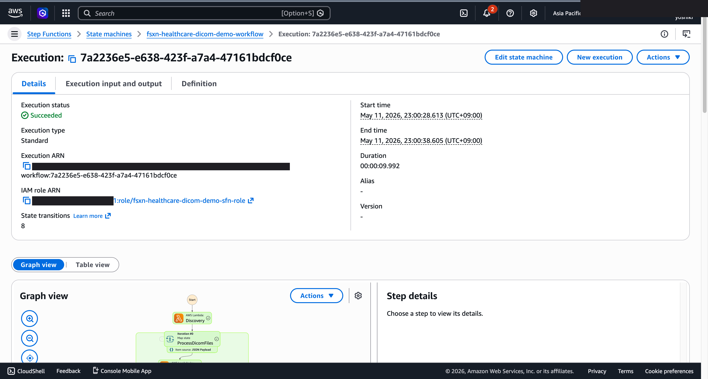
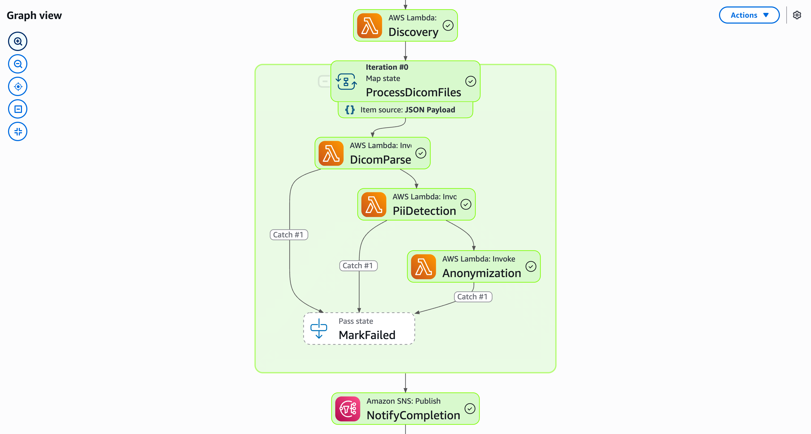

# Workflow d'anonymisation DICOM -- Demo Guide

🌐 **Language / 言語**: [日本語](demo-guide.md) | [English](demo-guide.en.md) | [한국어](demo-guide.ko.md) | [简体中文](demo-guide.zh-CN.md) | [繁體中文](demo-guide.zh-TW.md) | Français | [Deutsch](demo-guide.de.md) | [Español](demo-guide.es.md)

## Executive Summary

Cette démo présente un pipeline d'anonymisation automatique de fichiers DICOM. Les informations patient sont supprimées pour un partage sécurisé des données de recherche.

**Message clé**: Supprimer automatiquement les informations patient des fichiers DICOM pour un partage conforme et sécurisé.

**Durée prévue**: 3–5 min

---

## Destination de sortie : FSxN S3 Access Point (Pattern A)

Ce UC relève du **Pattern A : Native S3AP Output**
(voir `docs/output-destination-patterns.md`).

**Conception** : tous les artefacts IA/ML sont écrits via le FSxN S3 Access Point
sur le **même volume FSx ONTAP** que les données source. Aucun bucket S3 standard
séparé n'est créé (pattern "no data movement").

**Paramètres CloudFormation** :
- `S3AccessPointAlias` : S3 AP Alias d'entrée
- `S3AccessPointOutputAlias` : S3 AP Alias de sortie (peut être identique à l'entrée)

Pour les contraintes et solutions de contournement AWS, voir
[README.fr.md — Contraintes de spécification AWS](../../README.fr.md#contraintes-de-spécification-aws-et-solutions-de-contournement).

---
## Workflow

```
Upload DICOM → Extraction métadonnées → Détection PHI → Anonymisation → Rapport de validation
```

---

## Storyboard (5 Sections / 3–5 min)

### Section 1 (0:00–0:45)
> Problématique : Le partage de données de recherche exige la conformité aux réglementations

### Section 2 (0:45–1:30)
> Upload : Placer les fichiers DICOM pour démarrer le traitement automatique

### Section 3 (1:30–2:30)
> Détection PHI et anonymisation : Détection IA des informations personnelles et masquage automatique

### Section 4 (2:30–3:45)
> Résultats : Vérification des fichiers anonymisés et statistiques de traitement

### Section 5 (3:45–5:00)
> Rapport de validation : Génération du rapport de conformité et approbation du partage

---

## Technical Notes

| Component | Role |
|-----------|------|
| Step Functions | Orchestration du workflow |
| Lambda (DICOM Parser) | Extraction métadonnées DICOM |
| Lambda (PHI Detector) | Détection IA des informations personnelles |
| Lambda (Anonymizer) | Exécution de l'anonymisation |
| Amazon Athena | Analyse agrégée des résultats |

---

*Ce document sert de guide de production pour les vidéos de démonstration technique.*

---

## Captures d'écran UI/UX vérifiées

Suivant la même approche que les démos Phase 7 UC15/16/17 et UC6/11/14, ciblant
**les écrans UI/UX que les utilisateurs finaux voient réellement dans leurs opérations quotidiennes**.
Les vues techniques (graphe Step Functions, événements de pile CloudFormation, etc.)
sont consolidées dans `docs/verification-results-*.md`.

### Statut de vérification pour ce cas d'utilisation

- ⚠️ **E2E**: Partial (additional verification recommended)
- 📸 **Capture UI/UX** : ✅ SFN Graph terminé (Phase 8 Theme D, commit c66084f)

### Captures d'écran existantes (de Phase 1-6)





### Écrans UI/UX cibles pour re-vérification (liste de captures recommandées)

- Bucket S3 de sortie (dicom-metadata/, deid-reports/, diagnoses/)
- Résultats de détection d'entités Comprehend Medical (Cross-Region)
- JSON de métadonnées DICOM dé-identifiées

### Guide de capture

1. **Préparation** : Exécuter `bash scripts/verify_phase7_prerequisites.sh` pour vérifier les prérequis
2. **Données d'exemple** : Télécharger les fichiers via S3 AP Alias, puis démarrer le workflow Step Functions
3. **Capture** (fermer CloudShell/terminal, masquer le nom d'utilisateur en haut à droite du navigateur)
4. **Masquage** : Exécuter `python3 scripts/mask_uc_demos.py <uc-dir>` pour le masquage OCR automatique
5. **Nettoyage** : Exécuter `bash scripts/cleanup_generic_ucs.sh <UC>` pour supprimer la pile
