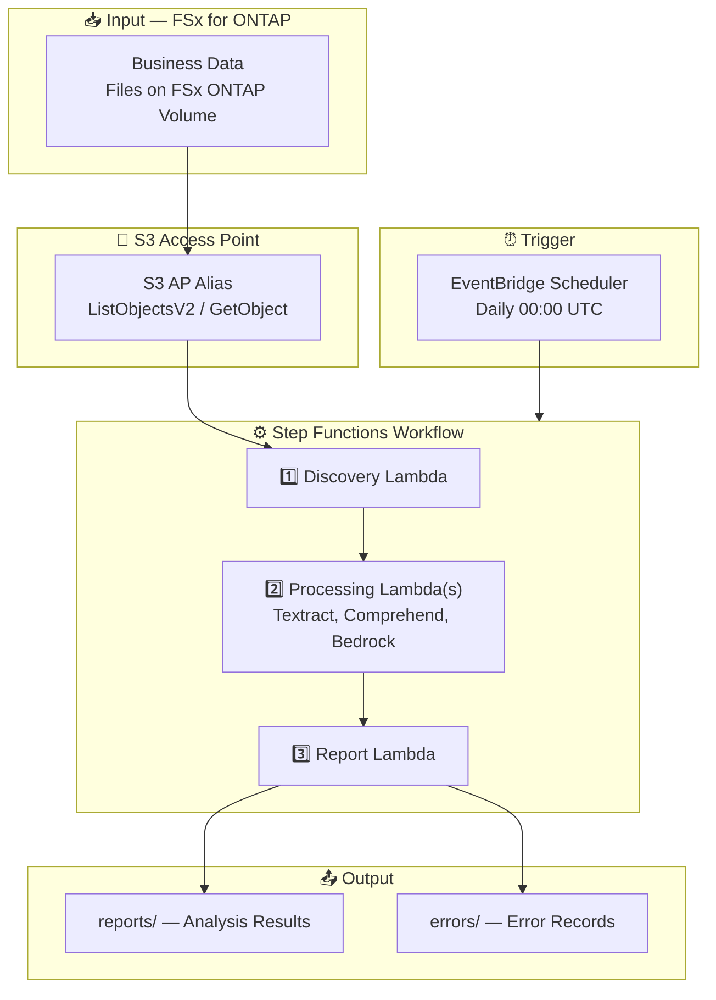

# UC27: Human Resources — Resume Screening / PII Strict Mode Architecture

🌐 **Language / 言語**: [日本語](architecture.md) | English | [한국어](architecture.ko.md) | [简体中文](architecture.zh-CN.md) | [繁體中文](architecture.zh-TW.md) | [Français](architecture.fr.md) | [Deutsch](architecture.de.md) | [Español](architecture.es.md)

## Architecture Diagram

---

## Key Design Decisions

1. **Error Isolation** — Single file failure does not block other file processing
2. **Exponential Backoff** — Unified retry via shared/retry_handler.py
3. **Polling-Based** — S3 AP does not support event notifications; uses EventBridge Scheduler
4. **Cross-Region** — Textract called in us-east-1
5. **Idempotency** — Re-processing same file does not create duplicate records

---

## AWS Services Used

| Service | Role |
|---------|------|
| FSx for ONTAP | File storage |
| S3 Access Points | Serverless access to ONTAP volumes |
| EventBridge Scheduler | Daily trigger |
| Step Functions | Workflow orchestration |
| Lambda | Compute (Discovery, Resume Extractor, Candidate Scorer, Report) |
| Amazon Textract | AI/ML processing |
| Amazon Comprehend | AI/ML processing |
| Amazon Bedrock | AI/ML processing |
| SNS | Alert notification |
| Secrets Manager | ONTAP REST API credential management |
| CloudWatch + X-Ray | Observability |
