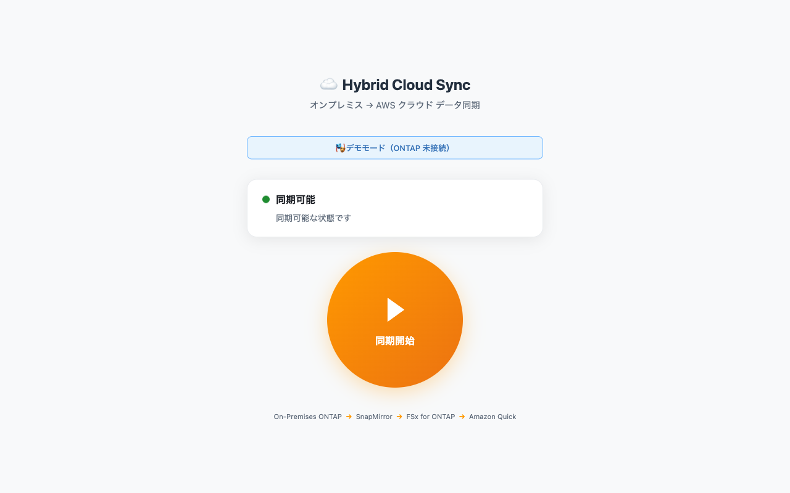

# SnapMirror One-Click Sync

[](https://scorecard.dev/viewer/?uri=github.com/Yoshiki0705/FSx-for-ONTAP-S3AccessPoints-Serverless-Patterns)

ハイブリッドクラウド環境でオンプレミス NetApp ONTAP から Amazon FSx for NetApp ONTAP へのデータ同期を、ワンクリックで実行するデモツールです。

## このリポジトリが提供するもの

| 提供する | 提供しない |
|---------|-----------|
| ✅ AWS 側インフラの CloudFormation テンプレート | ❌ オンプレミス ONTAP の初期構築手順 |
| ✅ SnapMirror 構成のガイドスクリプト | ❌ VPN 機器のベンダー固有設定 |
| ✅ ワンクリック同期 Web UI + バックエンド | ❌ Amazon Quick の詳細設定ガイド |
| ✅ S3 Access Point 構成ガイド | ❌ 本番運用向けの認証・認可設計 |
| ✅ デモ当日の運用ガイド + フォールバック計画 | ❌ データ移行や恒久的な同期設計 |
| ✅ コスト見積もり + デプロイメントタイムライン | ❌ マルチテナント / マルチリージョン構成 |

## ユースケース

オンプレミスのエンタープライズファイルデータを、SnapMirror の定期レプリケーション＋オンデマンドトリガーにより AWS 上の FSx for NetApp ONTAP へ継続的に連携し、S3 Access Points 経由で Amazon Quick による検索・分析・活用を実現するハイブリッドクラウドパターンです。

> **Note**: SnapMirror on FSx for ONTAP provides scheduled asynchronous replication (minimum 5-minute interval). Synchronous SnapMirror is not supported. This tool adds on-demand triggering for near real-time demonstration purposes. See [docs/data-freshness.md](docs/data-freshness.md) for details.

Amazon Quick は AI エージェント、BI（Quick Sight）、ドキュメント検索（Quick Index）、リサーチ、オートメーションを統合したプラットフォームです。S3 Access Points for FSx for NetApp ONTAP を介してエンタープライズファイルデータに接続し、自然言語でデータの検索・可視化・分析が可能になります。

```
┌─────────────────────────────────────────────────────────────────────┐
│  Event Venue (On-Premises)                                          │
│                                                                     │
│  [Smartphone/PC]  ──HTTP──▶  [Sync Server]       [ONTAP (Source)]   │
│   (ブラウザ)                  (Python)                               │
└─────────────────────────────────────────────────────────────────────┘
                                     │                     │
                                     │ REST API (VPN経由)   │ SnapMirror
                                     ▼                     ▼
┌─────────────────────────────────────────────────────────────────────┐
│  AWS Cloud (Tokyo Region)                                           │
│                                                                     │
│  [FSx for NetApp ONTAP]  ──S3 Access Point──▶  [Amazon Quick]       │
│   (Destination)                                 (検索・分析・活用)     │
│   ← Sync Server はここの REST API を呼び出す                           │
└─────────────────────────────────────────────────────────────────────┘
```

## 特徴



- **ワンクリック操作**: 技術者でなくてもボタン一つで SnapMirror 同期を実行
- **マルチデバイス対応**: スマートフォン、タブレット、PC のブラウザから操作可能
- **二重実行防止**: 同期中はボタンが無効化され、連打による重複実行を防止
- **進捗リアルタイム表示**: 同期の進行状況をわかりやすくアニメーション表示（UIの進捗更新がリアルタイムであり、レプリケーション自体は near real-time）
- **日本語UI**: 非技術者向けのシンプルな日本語インターフェース

## 前提条件

- オンプレミス NetApp ONTAP (9.8+) と FSx for NetApp ONTAP 間で SnapMirror 関係が確立済み
- ONTAP REST API が有効化済み（HTTPS、ポート443）
- SnapMirror 操作権限を持つ ONTAP ユーザーアカウント
- Python 3.10〜3.13 または Docker（**推奨**: Docker。Python 3.14+ は依存ライブラリの互換性問題があるため Docker を使用してください）

## クイックスタート

### Docker（推奨）

```bash
# 1. 設定ファイルを作成
cp .env.example .env
# .env を編集して ONTAP 接続情報を設定

# 2. 起動
docker compose up -d

# 3. ブラウザでアクセス
# http://<サーバーIP>:8080
```

### 直接実行

```bash
# 1. 依存関係インストール
cd backend
pip install -r requirements.txt

# 2. 設定ファイルを作成
cp ../.env.example ../.env
# .env を編集

# 3. 起動
uvicorn app.main:app --host 0.0.0.0 --port 8080

# 4. ブラウザでアクセス
# http://localhost:8080
```

## 設定項目

| 環境変数 | 説明 | 例 |
|---------|------|---|
| `ONTAP_HOST` | **FSx for ONTAP** 管理エンドポイント（VPN 経由で到達可能なこと） | `management.fs-xxx.fsx.ap-northeast-1.amazonaws.com` |
| `ONTAP_USER` | FSx ONTAP REST API ユーザー（最小権限推奨） | `sync_user` |
| `ONTAP_PASSWORD` | REST API パスワード | `****` |
| `ONTAP_VERIFY_SSL` | SSL 証明書検証 | `false` |
| `SNAPMIRROR_UUID` | SnapMirror 関係の UUID | セットアップガイド参照 |
| `AUTH_TOKEN` | API 認証トークン（空=認証無効） | `demo-secret-2026` |

## セットアップ詳細

SnapMirror UUID の取得方法、ONTAP ユーザー作成手順、全設定項目の詳細は [docs/setup-guide-ja.md](docs/setup-guide-ja.md) を参照してください。

## アーキテクチャ詳細

詳細は [docs/architecture.md](docs/architecture.md) を参照してください。

## AWS インフラストラクチャのデプロイ

CloudFormation テンプレートで AWS 側のインフラ（VPC、FSx for ONTAP、VPN）を一括構築できます。

```bash
# 1. FSx 管理パスワードを設定
export FSX_ADMIN_PASSWORD='YourSecurePassword123!'

# 2. デプロイ実行（20-30分）
./infra/deploy.sh

# 3. SnapMirror 関係を構成
./scripts/setup-snapmirror.sh

# 4. S3 Access Point を構成
./scripts/setup-s3-access-point.sh
```

詳細は以下を参照:
- [infra/template.yaml](infra/template.yaml) — CloudFormation テンプレート
- [scripts/setup-snapmirror.sh](scripts/setup-snapmirror.sh) — SnapMirror 構成手順
- [scripts/setup-s3-access-point.sh](scripts/setup-s3-access-point.sh) — S3 AP 構成手順
- [docs/snapmirror-schedule-ja.md](docs/snapmirror-schedule-ja.md) — 同期間隔のチューニング

## コスト見積もり

デモ環境の概算コスト（1週間利用時 ~$89、月額 ~$442）。

詳細は [docs/cost-estimate-ja.md](docs/cost-estimate-ja.md) を参照してください。

## セキュリティ上の注意

- このツールはデモ・PoC 用途を想定しています
- ONTAP 認証情報は `.env` ファイルで管理し、Git にコミットしないでください
- 本番環境では適切な認証・認可機構を追加してください
- イベント会場など信頼できるネットワーク内での使用を想定しています

### 供給チェーンセキュリティ

このリポジトリは以下のセキュリティツールを自動実行します:

| ツール | 目的 | トリガー |
|--------|------|---------|
| [gitleaks](.github/workflows/gitleaks.yml) | シークレット検出 | Push/PR/Daily |
| [zizmor](.github/workflows/zizmor.yml) | GitHub Actions セキュリティ | Workflow ファイル変更時/Weekly |
| [OpenSSF Scorecard](.github/workflows/scorecard.yml) | セキュリティスコア | Push to main/Weekly |

ローカル開発では pre-commit フックで保護:
```bash
# セットアップ
git config core.hooksPath .githooks
# または
pip install pre-commit && pre-commit install
```

## デモモード（ONTAP 接続なし）

ONTAP 環境がなくても UI の動作確認やリハーサルが可能です:

```bash
# .env で有効化
DEMO_MODE=true

# 起動
docker compose up -d
# → http://localhost:8080 で同期ボタンを押すと
#   5-12秒のシミュレート転送が実行される
```

デモモード時は画面上部に「🎭 デモモード（ONTAP 未接続）」バッジが表示されます。

### デモモードで検証できる範囲

| ✅ 検証可能 | ❌ 検証不可 |
|------------|------------|
| UI の操作感（ボタン、進捗表示） | 実際の SnapMirror 転送 |
| 二重実行防止 | VPN 経由の FSx 接続 |
| 完了/エラー画面の表示 | S3 AP 経由のデータ確認 |
| 監査ログ出力 | Amazon Quick での検索 |
| E2E テストスクリプトの動作 | 転送速度の実測 |

## Feature Boundaries

| Component | Is | Is NOT |
|-----------|------|--------|
| SnapMirror | Scheduled async replication (min 5-min interval) + on-demand trigger | Synchronous replication or transaction sharing |
| FSx S3 Access Points | S3 API access to ONTAP file data | A standard S3 bucket |
| Amazon Quick | Consumption / insight / visualization layer | Source of truth for data |
| This tool | On-demand SnapMirror update trigger with UI | Data migration or ETL pipeline |

> The goal is not to demonstrate a dashboard. The goal is to demonstrate how existing enterprise file data can become actionable through AWS analytics and AI services without first moving it into a separate data lake.

## Documentation

| Document | Audience | Content |
|----------|----------|---------|
| [Partner One-Pager](docs/partner-one-pager.md) | Partner/SI sales & pre-sales | Target customer, pain points, demo talk track |
| [Data Freshness & RPO](docs/data-freshness.md) | Storage architect, security | Replication model, RPO, consistency |
| [Governance & Audit](docs/governance-and-audit.md) | Security, compliance, public sector | Data classification, responsibility, audit trail |
| [Architecture](docs/architecture.md) | Technical | Component details, network, API |
| [Setup Guide](docs/setup-guide-ja.md) | Engineer | Step-by-step deployment |
| [Operation Guide](docs/operation-guide-ja.md) | Demo operator | Day-of-event procedures |
| [SnapMirror Schedule](docs/snapmirror-schedule-ja.md) | Engineer | Schedule tuning, interval design |
| [Cost Estimate](docs/cost-estimate-ja.md) | PM / Finance | AWS cost breakdown |
| [Deployment Timeline](docs/deployment-timeline-ja.md) | PM / Engineer | Day-by-day plan |
| [Network Alternatives](docs/network-alternatives-ja.md) | Network engineer | VPN alternatives for venues |
| [Handover Guide](docs/handover-ja.md) | Partner receiving the tool | Quick start + checklist |

## ライセンス

MIT License
