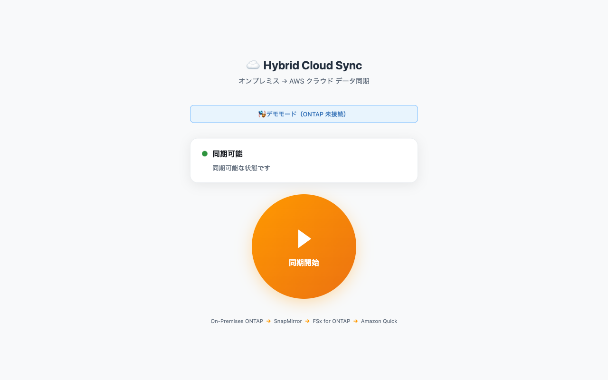
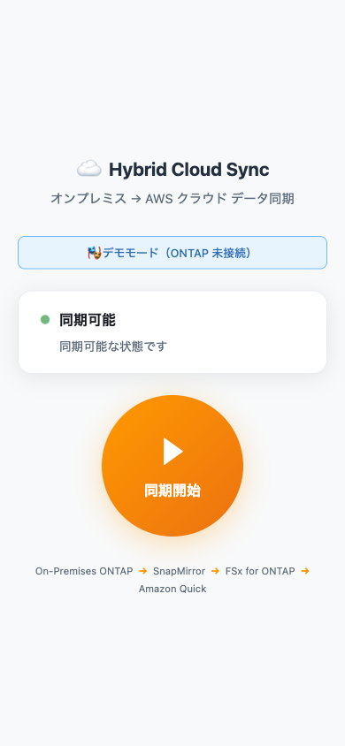
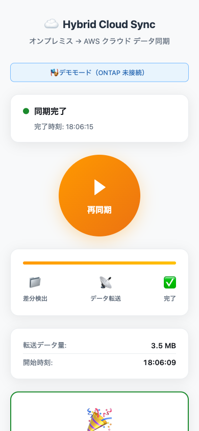
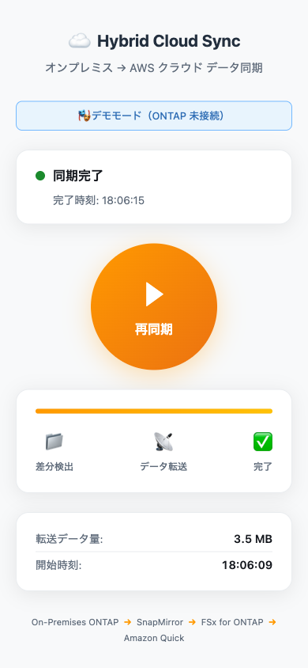
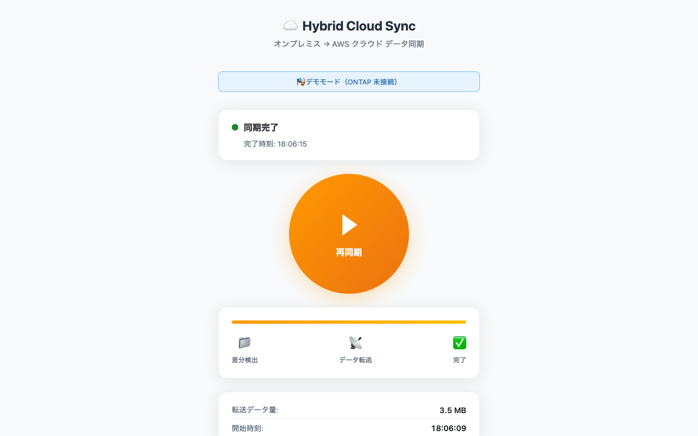

# デモ当日 運用ガイド

## デモの流れ

```
1. 来場者がオンプレミス ONTAP の共有フォルダにファイルを保存
2. 担当者がスマートフォン/PCで「同期ボタン」を押す
3. 画面上で同期進捗が表示される（数秒〜十数秒）
4. 「同期完了」が表示される
5. Amazon Quick で先ほどのファイルを検索・分析してみせる
```

### SnapMirror の同期モデル

このデモでは **定期スケジュール + ワンクリック割り込み** の2つを組み合わせます:

| 同期方式 | 動作 | 用途 |
|---------|------|------|
| **定期スケジュール（5分毎）** | ONTAP が自動で `snapmirror update` を実行 | バックグラウンド保護（デモ中も継続） |
| **ワンクリック（このツール）** | ボタン押下で即時 `snapmirror update` を割り込み実行 | 来場者の目の前でリアルタイム同期を演出 |

```
時間軸 →
──┬────┬────┬────┬────┬────┬──
  │    │    │    │    │    │    ← 5分毎の定期 update（自動、バックグラウンド）
  
        ▲         ▲              ← ワンクリック割り込み（デモ用）
        │         │
     ファイル保存  ファイル保存
     直後にボタン  直後にボタン
```

**ポイント**: 定期スケジュールだけでもデータは同期されますが、「来場者がファイルを保存した瞬間→ボタン→すぐ同期完了」を見せることでリアルタイム性をアピールします。

詳細なスケジュール設定・チューニング方法は [docs/snapmirror-schedule-ja.md](../docs/snapmirror-schedule-ja.md) を参照してください。

---

## スマートフォンからのアクセス方法

### 課題: 会場ネットワークの制約

イベント会場では以下の制約が一般的です:
- 来場者は会場 WiFi を使えるが、**端末間の直接通信（same-subnet）がブロックされている**場合が多い
- 展示ブース専用の WiFi を確保できない場合がある
- 来場者のスマホと Sync Server PC が異なるネットワークセグメントに配置される

### 接続方式の選択肢

| 方式 | 難易度 | 説明 | 推奨場面 |
|------|--------|------|---------|
| **A: モバイルホットスポット** | ★☆☆ | PC からテザリングを共有し、スマホを接続 | **最も確実（推奨）** |
| B: ポータブルルーター | ★☆☆ | 持ち込みルーターで専用 WiFi を構築 | 複数人が操作する場合 |
| C: USB テザリング + WiFi 共有 | ★★☆ | スマホで USB テザリング → PC が WiFi AP になる | バックアップ |
| D: 会場 WiFi（運が良い場合） | ★☆☆ | 端末間通信が許可されていればそのまま使用 | 事前確認済みの場合 |

### 方式 A: モバイルホットスポット（推奨）

**Sync Server PC 自身をホットスポットにして、スマホをそこに接続する方式**。
会場ネットワークの制約に一切依存しないため、最も確実です。

```
[Sync Server PC]
  ├── WiFi AP として動作（ホットスポット ON）
  ├── Sync Server (localhost:8080)
  └── AWS VPN（会場 WiFi or モバイル回線経由）

[操作用スマートフォン]
  └── PC のホットスポットに WiFi 接続
      → http://172.20.10.1:8080 にアクセス
```

#### macOS の場合

1. **System Settings → General → Sharing → Internet Sharing**
2. 「Share your connection from」: 会場 WiFi（または Ethernet）
3. 「To computers using」: Wi-Fi にチェック
4. Wi-Fi Options でネットワーク名/パスワードを設定
5. Internet Sharing を ON

```bash
# PC のホットスポット IP を確認
ifconfig bridge0  # 通常 192.168.2.1
# または
ifconfig en0      # Wi-Fi の IP
```

スマホからは `http://192.168.2.1:8080` でアクセス。

#### Windows の場合

1. **Settings → Network & Internet → Mobile hotspot**
2. 「Share my Internet connection from」: WiFi
3. 「Share over」: Wi-Fi
4. ホットスポット ON

スマホからは `http://192.168.137.1:8080` でアクセス（Windows のデフォルト）。

### 方式 B: ポータブルルーター

小型の WiFi ルーター（例: GL.iNet GL-MT300N）を会場に持ち込み:

```
[ポータブルルーター]  ←── 有線 or WiFi で上流に接続（必須ではない）
  ├── PC（有線 or WiFi 接続）
  └── スマホ（WiFi 接続）
      → 同一セグメントで通信可能
```

- ルーター価格: 3,000〜5,000円
- 事前にルーターの SSID/パスワードを設定しておく
- 上流インターネット接続がなくても Sync Server へのアクセスは可能（AWS VPN は PC のモバイル回線で別途確保）

### スマホでの接続手順（来場者向けにブースに掲示）

```
┌────────────────────────────────────────┐
│                                        │
│   📱 SnapMirror Sync デモ               │
│                                        │
│   1. 下の QR コードを読み取る             │
│   2. ブラウザが開きます                   │
│   3. オレンジのボタンを押してください        │
│                                        │
│        ┌──────────┐                    │
│        │ QR CODE  │                    │
│        │          │                    │
│        └──────────┘                    │
│                                        │
│   WiFi: Demo-Sync                      │
│   Pass: xxxxxxxx                       │
│                                        │
└────────────────────────────────────────┘
```

### QR コード生成方法

```bash
# Python で生成（事前にインストール: pip install qrcode[pil]）
python3 -c "
import qrcode
# Sync Server の URL を QR コード化
url = 'http://192.168.2.1:8080'  # ← PC のホットスポット IP に合わせて変更
img = qrcode.make(url)
img.save('docs/images/sync-qr.png')
print(f'QR code saved: {url}')
"

# WiFi 接続情報も QR コード化（スマホでスキャン→自動接続）
python3 -c "
import qrcode
# WiFi 自動接続用 QR コード（SSID と パスワード）
wifi_config = 'WIFI:T:WPA;S:Demo-Sync;P:your-password;;'
img = qrcode.make(wifi_config)
img.save('docs/images/wifi-qr.png')
print('WiFi QR code saved')
"
```

### ホーム画面に追加（アプリ風に使う）

接続できたら、ショートカットを追加すると次回以降ワンタップで開けます:

- **iOS**: Safari → 共有ボタン (□↑) → 「ホーム画面に追加」
- **Android**: Chrome → ⋮ メニュー → 「ホーム画面に追加」

---

## 事前準備チェックリスト

### 前日まで

- [ ] SnapMirror 関係が正常に動作することを確認済み
- [ ] Sync Server が正常に起動することを確認済み
- [ ] 実際のデータ同期が完了することをテスト済み
- [ ] Amazon Quick でデータが検索・表示可能なことを確認済み
- [ ] デモ用ファイル（来場者に入力してもらうテンプレート等）を準備

### 当日（会場セットアップ）

- [ ] オンプレミス ONTAP の電源投入・起動確認
- [ ] ONTAP と AWS 間の VPN / 接続が確立
- [ ] Sync Server を起動
- [ ] **スマホ接続用ネットワークの準備**（ホットスポット or ポータブルルーター）
- [ ] Sync Server の IP アドレスを確認（ホットスポット IP）
- [ ] スマートフォンからホットスポットに WiFi 接続
- [ ] スマートフォンから `http://<IP>:8080` にアクセスできることを確認
- [ ] QR コードを印刷 or PC 画面に表示
- [ ] 一度テスト同期を実行して動作確認

---

## 通常操作

### 画面の見方

**PC 表示（待機状態）**:



**スマートフォン表示（待機状態）**:



- 上部: ステータス表示（緑＝同期可能）
- 中央: 同期ボタン（オレンジの大きな丸）
- 下部: アーキテクチャフロー

### 同期の実行

1. ブラウザで同期画面を開く
2. 緑色の「同期可能」ステータスを確認
3. オレンジ色の大きなボタンをタップ
4. 進捗表示を確認（差分検出 → データ転送 → 完了）

**同期中の画面**:



5. 「🎉 データ同期が完了しました！」を確認

**完了画面**:





### 連続実行する場合

- 完了後、10秒待つと自動的にボタンが再度有効になります
- 急ぎの場合は「再同期」ボタンをすぐに押せます

---

## よくあるシナリオと対応

### シナリオ1: ボタンを2回押してしまった

**問題なし。** サーバー側で二重実行を防止しています。  
画面に「同期は既に実行中です」と表示されます。

### シナリオ2: 画面が「同期中」のまま動かない

**原因**: ネットワーク断 or ONTAP 側の問題

**対応**:
1. まず 30秒待つ
2. それでも変わらない場合、ページをリロード（F5 / プルダウン更新）
3. それでも改善しない場合:
   ```
   http://<IP>:8080/api/reset を POST で呼び出し
   ```
   またはブラウザで以下を開く:
   ```
   http://<IP>:8080/api/health
   ```
   で接続状態を確認

### シナリオ3: 「接続エラー」が表示される

**対応**:
1. Sync Server の PC が起動しているか確認
2. WiFi 接続が正常か確認
3. Docker が起動しているか確認:
   ```bash
   docker compose ps
   ```
4. ONTAP の管理 LIF に ping が通るか確認

### シナリオ4: 同期は成功したが Amazon Quick で検索できない

**原因**: Amazon Quick のデータソース再同期が必要

**対応**:
1. AWS コンソールで Amazon Quick を開く
2. データソースの同期スケジュールを確認
3. 手動でデータソース同期をトリガー（必要に応じて）

※ S3 Access Points 経由のデータソースの場合、Quick Index の同期間隔設定に依存

---

## ⚠️ 注意事項

### スループット共有について

FSx for ONTAP の 128 MBps スループットキャパシティは NFS/SMB/S3 AP/SnapMirror で共有されます。
- **SnapMirror Initialize（初回同期）**: 大量データ転送。Amazon Quick のアクセス性能に影響する可能性あり
- **SnapMirror Update（増分同期 = デモ中のワンクリック）**: 差分のみで数秒〜十数秒。影響は軽微

### Amazon Quick のインデックス反映ラグ

SnapMirror 同期完了後、Amazon Quick で検索可能になるまでタイムラグがある場合があります:
1. SnapMirror 完了 → S3 AP で即座に読み取り可能（秒単位）
2. S3 AP → Amazon Quick Index 反映 → Quick Index の同期スケジュールに依存

**デモ時の対策**:
- Quick Index のデータソースを On-demand sync に設定し、同期完了後に手動トリガー
- または「SnapMirror が完了したので、Quick のインデックスを更新します」とトーキング
- **Day -1 リハーサルで Quick Index 同期レイテンシを計測**し、目安値を把握しておく（通常 30-60 秒以内が目標）

---

## 緊急時の対応

### フォールバックプラン

| 障害 | Plan A | Plan B | Plan C（最終手段） |
|------|--------|--------|-------------------|
| VPN 断 | VPN 再接続を試みる (1分) | モバイルテザリング + WireGuard | 事前録画のデモ動画を再生 |
| ONTAP 応答なし | Sync Server 再起動 | ONTAP CLI で直接 `snapmirror update` | 事前録画のデモ動画を再生 |
| Quick が検索不可 | Quick Index の手動同期 | 事前にインデックス済みのデータで検索デモ | — |
| Sync Server ダウン | `docker compose restart` | PC 再起動 → Docker 自動起動 | ONTAP CLI で直接実行 |

**事前準備**: デモ動画（30秒程度）を USB に保存し、会場 PC に配置しておくこと。

### Sync Server の再起動

```bash
# Docker の場合
docker compose restart

# 直接実行の場合
# Ctrl+C で停止後、再度起動
uvicorn app.main:app --host 0.0.0.0 --port 8080
```

### 状態の強制リセット

```bash
curl -X POST http://localhost:8080/api/reset
```

### ONTAP 側で SnapMirror を手動更新（緊急時）

```bash
# ONTAP CLI（SSH接続）
snapmirror update -destination-path <svm_dst:vol_demo>
```

---

## クリーンアップ手順

検証終了後のリソース削除手順。依存関係の逆順で削除する必要があります。

### 削除順序（正しい手順）

```
1. Destination で SnapMirror 関係を削除（destination_only）
2. Source で SnapMirror source 情報を削除（source_info_only）
3. 双方で SVM Peer を force 削除
4. 双方で Cluster Peer を削除
5. AWS FSx API で Volume → SVM → File System を削除
```

### Step 1: SnapMirror 関係の削除

```bash
# Destination 側（FSx REST API）
curl -sk -u fsxadmin:<password> -X DELETE \
  "https://<Dest_Management_IP>/api/snapmirror/relationships/<UUID>?destination_only=true"

# Source 側（list-destinations 情報を削除 = snapmirror release 相当）
curl -sk -u fsxadmin:<password> -X DELETE \
  "https://<Source_Management_IP>/api/snapmirror/relationships/<UUID>?source_info_only=true"
```

> ⚠️ `destination_only=true` だけでは Source 側に追跡情報が残り、
> 後続の SVM peer 削除がブロックされます。必ず Source 側でも実行してください。

### Step 2: SVM Peer の削除

```bash
# 双方で force 削除（リクエストボディに force: true を指定）
curl -sk -u fsxadmin:<password> -X DELETE \
  "https://<Source_Management_IP>/api/svm/peers/<UUID>" \
  -H "Content-Type: application/json" \
  -d '{"force": true}'

curl -sk -u fsxadmin:<password> -X DELETE \
  "https://<Dest_Management_IP>/api/svm/peers/<UUID>" \
  -H "Content-Type: application/json" \
  -d '{"force": true}'
```

> ⚠️ `force` はクエリパラメータではなく**リクエストボディ**で渡す必要があります。

### Step 3: Cluster Peer の削除

```bash
curl -sk -u fsxadmin:<password> -X DELETE \
  "https://<Source_Management_IP>/api/cluster/peers/<UUID>"

curl -sk -u fsxadmin:<password> -X DELETE \
  "https://<Dest_Management_IP>/api/cluster/peers/<UUID>"
```

### Step 4: AWS リソースの削除

```bash
# ボリューム削除
aws fsx delete-volume --volume-id <vol-id> \
  --ontap-configuration SkipFinalBackup=true --region ap-northeast-1

# SVM 削除（ボリューム削除完了後）
aws fsx delete-storage-virtual-machine \
  --storage-virtual-machine-id <svm-id> --region ap-northeast-1

# ファイルシステム削除（SVM 削除完了後）
aws fsx delete-file-system --file-system-id <fs-id> --region ap-northeast-1
```

---

## デモのトーキングポイント

### ボタンを押す前

> 「オンプレミスの NetApp ストレージに先ほどファイルを保存しました。
>   これから SnapMirror でクラウドに同期します。
>   通常は定期スケジュールで自動実行されますが、
>   今回はリアルタイム性を見せるためにワンクリックで実行します。」

### 同期中

> 「今、SnapMirror が差分データのみを転送しています。
>   変更されたブロックだけを効率的に転送するので、
>   ファイル全体の再コピーは不要です。」

### 同期完了後

> 「同期が完了しました。
>   AWS 上の FSx for NetApp ONTAP にデータが反映されたので、
>   Amazon Quick で先ほどのファイルを検索してみましょう。」

---

## 技術仕様メモ（担当者向け）

| 項目 | 値 |
|------|---|
| Sync Server ポート | 8080 |
| ポーリング間隔（通常時） | 3秒 |
| ポーリング間隔（同期中） | 1.5秒 |
| 最大監視時間 | 10分（`SYNC_TIMEOUT_SECONDS` で変更可） |
| 二重実行防止 | フロントエンド + バックエンド + ONTAP 3層 |
| API 認証 | Bearer Token（`AUTH_TOKEN` 設定時のみ有効） |
| 監査ログ | `audit.jsonl`（JSON Lines 形式） |
| API Base Path | `/api/sync`, `/api/status`, `/api/health`, `/api/reset` |
| REST API 接続先 | FSx for ONTAP 管理エンドポイント（VPN 経由） |
| HTTPS (Sync Server) | オプション（`--ssl-keyfile`, `--ssl-certfile` で有効化） |
