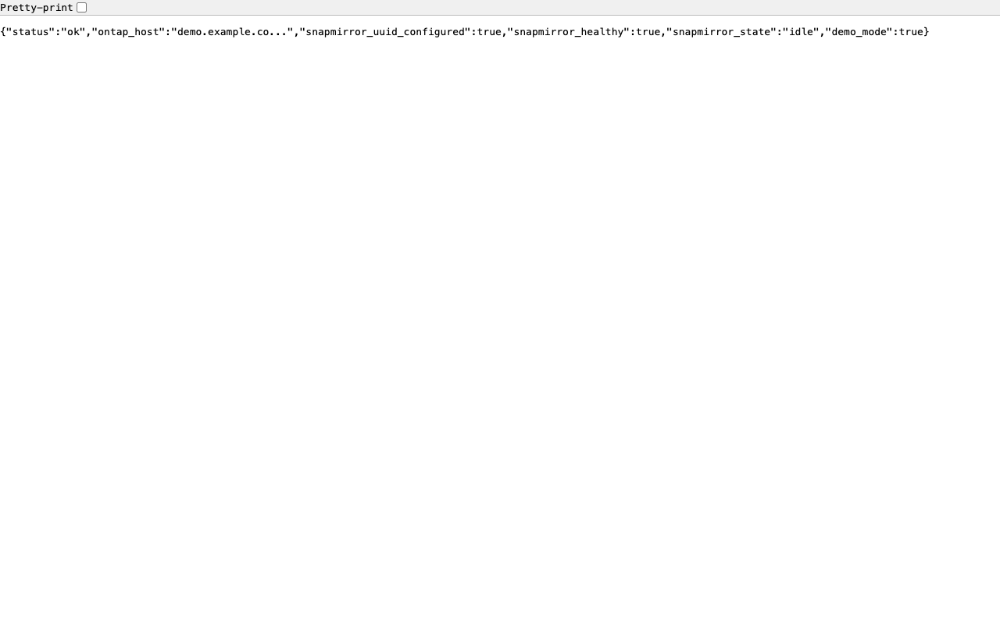

# セットアップガイド

[日本語](setup-guide-ja.md) | [English](setup-guide-en.md)

## 前提条件

### ハードウェア/ソフトウェア

- Sync Server 実行用 PC（Windows/Mac/Linux いずれでも可）
  - Docker Desktop がインストール済み（**推奨**）、**または**
  - Python 3.10〜3.13 がインストール済み（3.14+ は非対応）
- オンプレミス NetApp ONTAP (9.8 以上)
- AWS 上の FSx for NetApp ONTAP
- 両者間で SnapMirror 関係が確立済み

### ネットワーク

- Sync Server から ONTAP 管理 LIF へ HTTPS (443) で通信可能
- クライアントデバイスから Sync Server へ HTTP (8080) で通信可能
- 同一ネットワーク（イベント会場 WiFi 等）内での利用を想定

---

## 既存 FSx 環境を使う場合

CloudFormation テンプレート (`infra/template.yaml`) は新規に VPC + FSx を作成します。
既に FSx for ONTAP が稼働している環境では、テンプレートのデプロイは **不要** です。

必要な情報を既存環境から取得してください:

```bash
# FSx ファイルシステムの管理エンドポイントを確認
aws fsx describe-file-systems \
  --query 'FileSystems[*].[FileSystemId,DNSName]' \
  --output table \
  --region ap-northeast-1

# SnapMirror 関係の UUID を REST API で取得
curl -k -u fsxadmin:<password> \
  https://<FSx管理エンドポイント>/api/snapmirror/relationships \
  | python3 -m json.tool
```

取得した情報を `.env` に設定:
```ini
ONTAP_HOST=management.fs-xxxxxxxxxx.fsx.ap-northeast-1.amazonaws.com
SNAPMIRROR_UUID=<取得したUUID>
```

→ 以下の Step 1〜3 は確認のみ行い、Step 4 に進んでください。

---

## Step 1: SnapMirror 関係の確認

### ONTAP CLI で確認

```bash
# SnapMirror 関係一覧
snapmirror show

# 期待される出力例:
# Source Path:      svm_src:vol_demo
# Destination Path: svm_dst:vol_demo
# State:            Snapmirrored
# Status:           Idle
```

### ONTAP REST API で UUID を取得

```bash
# FSx for ONTAP の管理エンドポイントに対して実行
# （VPN 経由でアクセスが必要）
curl -k -u fsxadmin:<password> \
  https://management.fs-xxxxxxxxxx.fsx.ap-northeast-1.amazonaws.com/api/snapmirror/relationships \
  | python3 -m json.tool
```

レスポンス例:
```json
{
  "records": [
    {
      "uuid": "a1b2c3d4-e5f6-7890-abcd-ef1234567890",
      "source": {
        "path": "svm_src:vol_demo",
        "svm": {"name": "svm_src"}
      },
      "destination": {
        "path": "svm_dst:vol_demo",
        "svm": {"name": "svm_dst"}
      },
      "state": "snapmirrored",
      "healthy": true
    }
  ]
}
```

上記の `uuid` をメモしてください。

---

## Step 2: 設定ファイルの準備

```bash
# プロジェクトディレクトリに移動
cd snapmirror-one-click-sync

# 設定ファイルを作成
cp .env.example .env
```

`.env` を編集:

```ini
# ⚠️ 重要: FSx for ONTAP（Destination 側）の管理エンドポイントを指定
# SnapMirror 関係は Destination クラスタが所有するため
ONTAP_HOST=management.fs-xxxxxxxxxxxxxxxxx.fsx.ap-northeast-1.amazonaws.com

# FSx ONTAP の管理ユーザー
ONTAP_USER=fsxadmin
ONTAP_PASSWORD=YourSecurePassword

# 自己署名証明書の場合は false
ONTAP_VERIFY_SSL=false

# Step 1 で取得した UUID
SNAPMIRROR_UUID=a1b2c3d4-e5f6-7890-abcd-ef1234567890

# API 認証トークン（オプション — 設定推奨）
AUTH_TOKEN=demo-secret-token-2026

# サーバー設定（通常変更不要）
SERVER_HOST=0.0.0.0
SERVER_PORT=8080
LOG_LEVEL=INFO
```

**セキュリティ**: 設定ファイルのパーミッションを制限:
```bash
chmod 600 .env
```

---

## Step 3: 起動

### 方法 A: Docker（推奨）

```bash
# ビルド＆起動
docker compose up -d

# ログ確認
docker compose logs -f

# 停止
docker compose down
```

### 方法 B: 直接実行

```bash
# 仮想環境作成
python3 -m venv .venv
source .venv/bin/activate   # Windows: .venv\Scripts\activate

# 依存関係インストール
pip install -r backend/requirements.txt

# 起動
cd backend
uvicorn app.main:app --host 0.0.0.0 --port 8080
```

### 方法 C: HTTPS で起動（オプション）

```bash
# 自己署名証明書の生成
openssl req -x509 -newkey rsa:2048 -keyout key.pem -out cert.pem -days 30 -nodes \
  -subj "/CN=sync-demo"

# HTTPS で起動
cd backend
uvicorn app.main:app --host 0.0.0.0 --port 8443 \
  --ssl-keyfile ../key.pem --ssl-certfile ../cert.pem
```

ブラウザで `https://<IP>:8443` にアクセス（自己署名証明書の警告を許可）。

---

## Step 4: 動作確認

### ブラウザでアクセス

```
http://<Sync ServerのIPアドレス>:8080
```

※ Sync Server が `192.168.1.50` で動いている場合:
```
http://192.168.1.50:8080
```

### ヘルスチェック

```bash
curl http://localhost:8080/api/health
```

期待される応答:



```json
{
  "status": "ok",
  "ontap_host": "management.fs-x...",
  "snapmirror_uuid_configured": true,
  "snapmirror_healthy": true,
  "snapmirror_state": "idle",
  "demo_mode": false
}
```

### ステータス確認

```bash
curl http://localhost:8080/api/status
```

### 手動トリガーテスト

```bash
curl -X POST http://localhost:8080/api/sync
```

---

## Step 5: クライアントデバイスからのアクセス

1. クライアントデバイス（スマートフォン等）を同じネットワークに接続
2. ブラウザで `http://<Sync ServerのIP>:8080` にアクセス
3. 大きな同期ボタンが表示されることを確認
4. ボタンを押して SnapMirror 転送が開始されることを確認

### スマートフォンでの操作のコツ

- ホーム画面にショートカットを追加すると、アプリのように使える
  - iOS: Safari → 共有 → ホーム画面に追加
  - Android: Chrome → メニュー → ホーム画面に追加

### IP アドレスの安定化（イベント会場向け）

イベント会場の WiFi では DHCP により IP アドレスが変わる場合があります。以下で対策:

**方法 A: mDNS（Bonjour）を利用** — macOS ではデフォルト有効
```
http://<コンピュータ名>.local:8080
```
例: `http://demo-pc.local:8080`

※ iOS/macOS のブラウザは mDNS に対応。Android は機種による。

**方法 B: 固定 IP を設定**
```bash
# macOS: System Settings → Network → Wi-Fi → Details → TCP/IP → Configure IPv4: Manually
# IP: 192.168.1.200 (会場ネットワークの空きIPを使用)

# Linux:
sudo ip addr add 192.168.1.200/24 dev wlan0
```

**方法 C: QR コード生成**（デモ開始時にスマートフォンでスキャン）
```bash
# qrencode がインストール済みの場合
qrencode -t UTF8 "http://$(hostname).local:8080"

# Python で生成
pip install qrcode
python3 -c "import qrcode; qrcode.make('http://192.168.1.200:8080').save('sync-qr.png')"
```

---

## トラブルシューティング

### 接続エラーが表示される

1. ONTAP 管理 LIF の IP アドレスが正しいか確認
2. Sync Server から ONTAP に ping が通るか確認
3. ONTAP の REST API が有効か確認:
   ```bash
   # ONTAP CLI
   system services web show
   ```

### SnapMirror UUID が見つからない

1. SnapMirror 関係が正しく確立されているか確認:
   ```bash
   # ONTAP CLI
   snapmirror show -fields relationship-id
   ```

2. REST API で直接確認:
   ```bash
   curl -k -u admin:password https://<ONTAP_IP>/api/snapmirror/relationships
   ```

### 同期がタイムアウトする

- 大量のデータ変更がある場合、初回同期には時間がかかる
- `backend/app/sync_manager.py` の `max_polls` と `poll_interval` を調整可能
- 通常のデモサイズ（数MB）であれば数秒〜数十秒で完了

### ボタンが「同期中」のまま戻らない

```bash
# 状態リセット
curl -X POST http://localhost:8080/api/reset
```

---

## ONTAP ユーザー権限の設定（必須）

セキュリティのため、SnapMirror 操作専用ユーザーを作成します:

```bash
# FSx ONTAP CLI に SSH 接続
ssh fsxadmin@<FSx_Management_IP>

# SnapMirror 操作用ロール作成（最小権限）
security login role create -role snapmirror_trigger -cmddirname "snapmirror update" -access all
security login role create -role snapmirror_trigger -cmddirname "snapmirror show" -access readonly

# REST API アクセス用ユーザー作成
security login create -user-or-group-name sync_user -application http -authentication-method password -role snapmirror_trigger
security login create -user-or-group-name sync_user -application ontapi -authentication-method password -role snapmirror_trigger
```

`.env` で `ONTAP_USER=sync_user` を指定してください。

> ⚠️ `fsxadmin` をそのまま使用することも可能ですが、万一認証情報が漏洩した場合の
> 影響範囲を限定するため、専用ユーザーの使用を強く推奨します。
