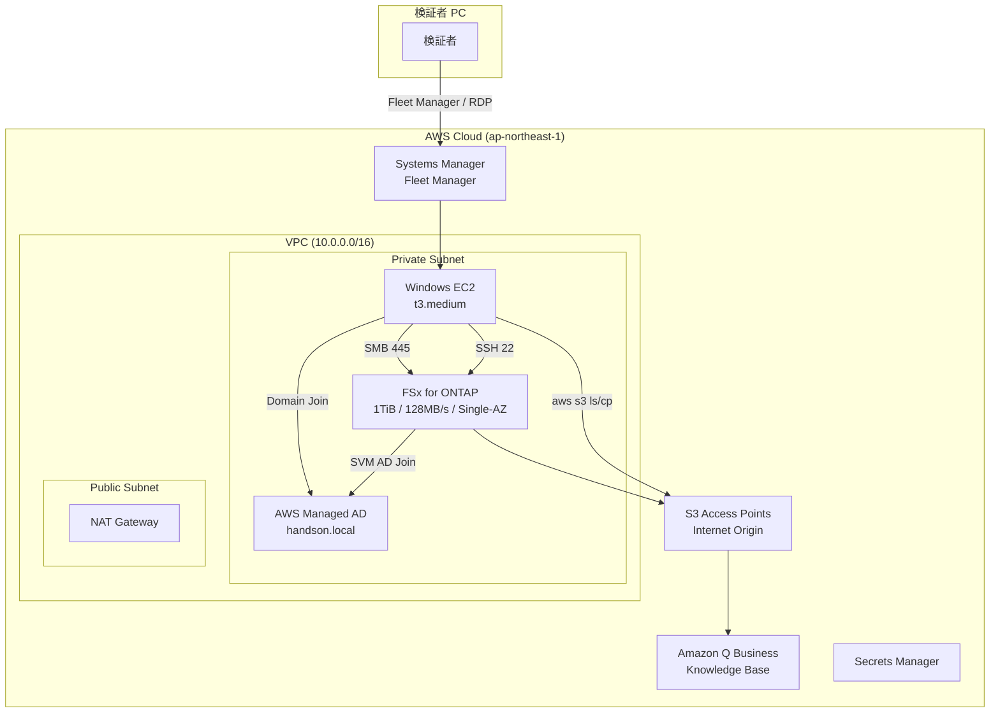

# FSx for ONTAP ハンズオン Lab 環境 (IaC)

> **ひとことで**: FSx for ONTAP の S3 Access Points によるデータ活用と、Tamperproof Snapshot によるランサムウェア対策を、1人で2-3時間で体験できるCloudFormation環境です。

Amazon FSx for NetApp ONTAP の S3 Access Points と Amazon Q Business を活用したハンズオン環境を、CloudFormation で自動構築するプロジェクトです。

## 概要

AWS Summit Japan 2026 フォローアップセミナーで実施したハンズオンの内容を、個人が1人で全ステップを検証・再現できる構成にIaC化しています。

### ハンズオン内容

| パート | テーマ | 利用サービス |
|--------|--------|-------------|
| 前半 | FSx for ONTAP データの検索・活用 | Amazon Q Business + S3 Access Points |
| 後半 | ランサムウェア対策と迅速な復旧体験 | Snapshot / Tamperproof Snapshot / FlexClone |

### アーキテクチャ



テキスト版:
```
[検証者 PC]
    │
    │ Systems Manager Fleet Manager / Session Manager
    │
[Windows EC2] ─── SMB ─── [Amazon FSx for NetApp ONTAP]
    │                              │
    │ (aws s3 ls/cp)         [S3 Access Points]
    │                              │
    └──────────────────────── [Amazon Q Business]
                               (Knowledge Base)
```

### 学習目標

このハンズオンを通じて以下を体験・理解できます:

1. **マルチプロトコルアクセス**: 同一ボリュームに NFS/SMB/S3 API で同時アクセスする仕組み
2. **S3 Access Points**: ファイルストレージのデータを S3 API で活用し AI/ML サービスと連携する方法
3. **Tamperproof Snapshot**: 管理者でも削除不可の Snapshot による確実なデータ保護
4. **FlexClone**: 保護された Snapshot から瞬時にボリュームを複製し業務継続する手法
5. **インシデント対応**: ランサムウェア被害からの復旧手順と判断基準

### 所要時間の目安

| フェーズ | 所要時間 | 備考 |
|----------|---------|------|
| デプロイ (フル) | 45-60分 | FSx for ONTAP 作成が律速 |
| デプロイ (既存FSx利用) | 15-20分 | AD + EC2 のみ |
| ONTAP 追加設定 | 10-15分 | SSH + CLI 操作 |
| 前半ハンズオン | 20-30分 | S3 AP + Amazon Q |
| 後半ハンズオン | 30-40分 | ランサムウェア対策 |
| クリーンアップ | 15-30分 | スタック削除 |
| **合計** | **約2-3時間** | |

---

## 前提条件

- AWS CLI v2 (`aws --version` >= 2.x)
- Python 3.12+ (setup_quick.py 用)
- cfn-lint (`pip install cfn-lint`)
- AWSアカウント (東京リージョン ap-northeast-1)
- IAM ユーザー/ロール: CloudFormation, FSx, Directory Service, EC2, IAM, Lambda, S3, SSM 操作権限
- S3 バケット (テンプレート・Lambda パッケージのアップロード先)

---

## クイックスタート

### 1. Secrets Manager にパスワードを格納

```bash
# AD 管理者パスワード (8-64文字, 大小英数+特殊文字)
aws secretsmanager create-secret \
  --name fsx-handson-ad-admin \
  --secret-string 'YourAdminP@ss2026!' \
  --region ap-northeast-1

# ハンズオンユーザー (user01) パスワード
aws secretsmanager create-secret \
  --name fsx-handson-user01 \
  --secret-string 'User01P@ss2026!' \
  --region ap-northeast-1

# FSx for ONTAP fsxadmin パスワード
aws secretsmanager create-secret \
  --name fsx-handson-fsxadmin \
  --secret-string 'FsxAdm1nP@ss2026!' \
  --region ap-northeast-1
```

### 2. デプロイ用 S3 バケット作成

```bash
aws s3 mb s3://my-handson-deploy-$(aws sts get-caller-identity --query Account --output text) \
  --region ap-northeast-1
```

### 3. デプロイ実行

```bash
cd infrastructure/handson-lab

# フルデプロイ (新規環境, 約45-60分)
DEPLOY_S3_BUCKET=my-handson-deploy-123456789012 \
  ./scripts/deploy.sh --stack-name fsx-ontap-handson

# 既存 FSx for ONTAP を利用する場合 (約15-20分)
DEPLOY_S3_BUCKET=my-handson-deploy-123456789012 \
  ./scripts/deploy.sh --stack-name fsx-ontap-handson --existing-fsx
```

### 4. ONTAP 追加設定 (Tamperproof Snapshot)

```bash
# デプロイ結果の確認 (ONTAP 管理IP、S3 AP エイリアス等)
aws cloudformation describe-stacks \
  --stack-name fsx-ontap-handson \
  --query "Stacks[0].Outputs" \
  --output table

# ONTAP 追加設定
./scripts/setup_ontap.sh --stack-name fsx-ontap-handson
```

### 5. Amazon Q Business 設定 (オプション)

```bash
python3 ./scripts/setup_quick.py --stack-name fsx-ontap-handson
```

### 6. ハンズオン実施

1. AWS Console → Systems Manager → Fleet Manager でWindows EC2に接続
2. デスクトップの `map_drives.ps1` を実行 (X:, Y: ドライブマッピング)
3. `docs/handson_guide.md` に従ってハンズオンを実施

---

## 既存リソース活用モード

コスト最適化や迅速な再デプロイのため、既存の VPC / FSx for ONTAP を再利用できます。

### 既存 VPC を利用

```bash
./scripts/deploy.sh --existing-vpc \
  --params cloudformation/parameters/existing-vpc.json
```

`parameters/existing-vpc.json` に `ExistingVpcId`, `ExistingPrivateSubnet1Id` 等を記載。

### 既存 FSx for ONTAP を利用

```bash
./scripts/deploy.sh --existing-fsx \
  --params cloudformation/parameters/existing-fsx.json
```

`parameters/existing-fsx.json` に `ExistingFileSystemId`, `ExistingSvmId`, `ExistingVolumeId`, `ExistingManagementIp` を記載。

---

## ディレクトリ構成

```
infrastructure/handson-lab/
├── README.md                          # 本ファイル
├── cloudformation/
│   ├── main.yaml                      # 親スタック
│   ├── network.yaml                   # VPC, Subnet, NAT, SG, VPC Endpoints
│   ├── ad.yaml                        # AWS Managed AD, DHCP, AD User Lambda
│   ├── iam.yaml                       # IAM Roles, Instance Profiles
│   ├── fsx-ontap.yaml                 # FSx for ONTAP (FS, SVM, Volume)
│   ├── s3-access-point.yaml           # S3 AP Custom Resource
│   ├── ec2-windows.yaml               # Windows EC2, UserData, Domain Join
│   └── parameters/
│       ├── dev.json                   # 開発用パラメータ
│       └── parameters.example.json    # テンプレート
├── lambda/
│   ├── custom_resource_ad_user/       # AD ユーザー作成 Lambda
│   └── custom_resource_s3ap/          # S3 AP 作成 Lambda
├── scripts/
│   ├── deploy.sh                      # デプロイスクリプト
│   ├── setup_ontap.sh                 # ONTAP CLI 設定 (Tamperproof等)
│   ├── setup_quick.py                 # Amazon Q Business 設定
│   └── cleanup.sh                     # クリーンアップ
└── docs/
    ├── handson_guide.md               # ハンズオン手順書
    └── cost_estimate.md               # コスト見積もり
```

---

## ハンズオン実施手順 (概要)

詳細は `docs/handson_guide.md` を参照。

### 前半: Amazon Q + S3 Access Points

1. S3 Access Point 経由でファイルの一覧・取得を確認
2. Amazon Q Business でナレッジベースを検索
3. ファイルの追加・更新が即座に反映されることを確認

### 後半: ランサムウェア対策と復旧

1. X: ドライブのファイルを確認
2. ランサムウェアシミュレーター実行 (`ransomware_simulator.ps1`)
3. Snapshot 削除を試行 → Tamperproof Snapshot は削除不可であることを確認
4. FlexClone を作成し、保護された Snapshot から復旧
5. クローンボリュームの SMB 共有で業務継続を確認

---

## コスト見積もり

詳細は `docs/cost_estimate.md` を参照。

| リソース | 月額概算 (USD) | 時間単価 | 備考 |
|----------|---------------|---------|------|
| FSx for ONTAP (1TB, 128MB/s, Single-AZ) | ~$194 | ~$0.27/h | 律速リソース |
| AWS Managed AD (Standard) | ~$72 | ~$0.10/h | 2 DC |
| NAT Gateway | ~$32 | ~$0.045/h | +データ転送 |
| Windows EC2 (t3.medium) | ~$34 | ~$0.046/h | 常時起動の場合 |
| VPC Endpoints (x3) | ~$22 | ~$0.03/h | SSM用 |
| Lambda (Custom Resources) | <$1 | - | デプロイ時のみ |
| **合計** | **~$355/月** | **~$0.50/h** | 検証時のみ起動推奨 |

> **コスト注意**: 4時間のハンズオン実施で約$2。検証後は `./scripts/cleanup.sh` で全リソースを削除してください。
> EC2 は検証しない時間帯に停止することで ~$34/月 を節約できます。

---

## クリーンアップ

```bash
# 対話的クリーンアップ (Tamperproof Snapshot 確認あり)
./scripts/cleanup.sh --stack-name fsx-ontap-handson

# 強制削除 (確認スキップ)
./scripts/cleanup.sh --stack-name fsx-ontap-handson --force
```

### 注意: Tamperproof Snapshot

Tamperproof Snapshot のロック期間が未満了のボリュームは削除できません。
削除前に ONTAP CLI で確認してください:

```bash
ssh fsxadmin@<management-ip>
snapshot show -vserver svm01 -volume user01 -fields snaplock-expiry-time
```

すべてのエントリが `-` (未設定) または過去の日時であれば削除可能です。

---

## トラブルシューティング

| 症状 | 原因 | 対処 |
|------|------|------|
| EC2 が SSM に表示されない | VPC Endpoint 未作成 or IAM ロール不足 | `EnableVpcEndpoints=true` 確認, EC2 ロールに `AmazonSSMManagedInstanceCore` 確認 |
| Fleet Manager で接続できるが画面が黒い | ドメイン参加完了前 or DNS 未反映 | 5分待って再接続。UserData ログ確認: `C:\handson-setup.log` |
| ドメイン参加失敗 | DNS が AD を指していない | UserData で DNS を AD IP に設定済みか確認。DHCP Options Set の関連付け確認 |
| SMB 接続失敗 (`net use X:` エラー) | SVM AD 参加未完了 | `aws fsx describe-storage-virtual-machines` で Lifecycle 確認 (CREATED = 正常) |
| S3 AP AccessDenied (ListObjects) | WindowsUser に domain prefix あり | `user01` のみ指定 (`HANDSON\user01` は NG) |
| S3 AP AccessDenied (HeadBucket OK だが data ops NG) | AD DC 到達不能 | SVM の CIFS ドメイン発見確認 (ONTAP REST API) |
| スタック削除失敗 (DELETE_FAILED) | Tamperproof Snapshot ロック中 | ロック期限切れ待ち。`snapshot show -fields snaplock-expiry-time` で確認 |
| FSx 作成タイムアウト | 30-60分必要 | CloudFormation のタイムアウトはデフォルト60分で十分。再試行で解決する場合あり |
| `setup_ontap.sh` で接続失敗 | EC2 からのみ SSH 可能 (Private Subnet) | EC2 内の PowerShell から `ssh fsxadmin@<IP>` を実行 |

---

## 技術的な補足事項

> **スループット共有に関する補足**: FSx for ONTAP の 128 MB/s スループットは NFS, SMB, S3 Access Points, ONTAP REST API で共有されます。ハンズオン中に大量データ転送を並行実行すると応答が遅くなる場合があります。

> **S3 Access Point NetworkOrigin に関する補足**: S3 AP は作成時に `Internet` または `VPC` の NetworkOrigin を指定し、作成後は変更不可です。本テンプレートでは Internet Origin を使用しており、VPC 外の Lambda や CLI からもアクセス可能です。VPC Origin の場合は S3 Gateway VPC Endpoint が必要ですが、Internet Origin AP には S3 Gateway Endpoint は使用できません。

> **Tamperproof Snapshot と SnapLock の違いに関する補足**: Tamperproof Snapshot はボリュームの Snapshot に対して WORM 保護を適用する機能で、SnapLock (ファイルレベル WORM) とは異なる機能です。CloudFormation の `SnaplockConfiguration` ではなく、ONTAP CLI の `volume snapshot locking modify` で有効化します。

> **セキュリティグループ設計に関する補足**: EC2 の Egress は 0.0.0.0/0 を許可しています。これは SSM Agent の通信、Windows Update、winget によるパッケージインストールに必要です。本番環境ではプロキシまたは VPC Endpoint 経由に制限することを推奨します。

> **監査証跡に関する補足**: 本テンプレートでは CloudTrail はアカウントレベルで有効化されている前提です。S3 AP のデータアクセスログは S3 Server Access Logging または CloudTrail S3 data events で取得できます。コンプライアンス要件がある場合は明示的に有効化してください。

---

## 関連ドキュメント

- [FSx for ONTAP S3 Access Points ドキュメント](https://docs.aws.amazon.com/fsx/latest/ONTAPGuide/s3-access-points.html)
- [Amazon Q Business ドキュメント](https://docs.aws.amazon.com/amazonq/latest/business-use-dg/what-is.html)
- [FSx for ONTAP Tamperproof Snapshot](https://docs.aws.amazon.com/fsx/latest/ONTAPGuide/tamperproof-snapshots.html)
- [本リポジトリ: AD統合パターン](../../infrastructure/demo-ad-environment.yaml)
- [本リポジトリ: AGENTS.md (S3 AP ベストプラクティス)](../../AGENTS.md)
