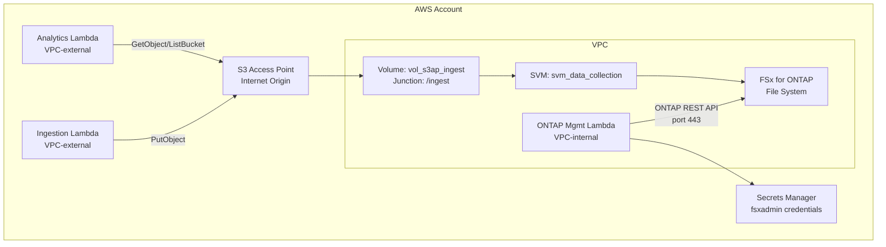
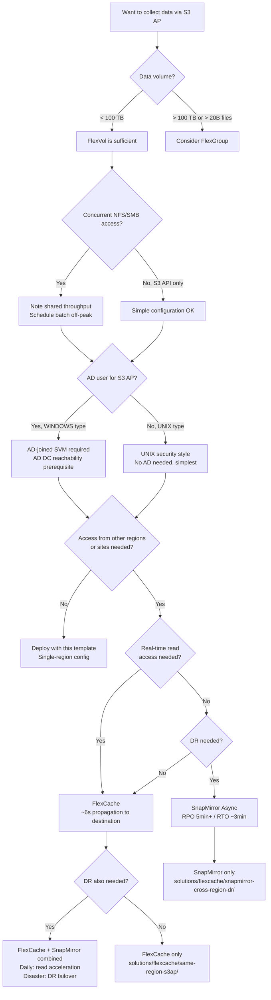

# FSx for ONTAP S3 Access Points — Data Collection Infrastructure Deployment Guide

> 🌐 Language: [日本語](README.md) | [English](README.en.md)

A guide to deploying an FSx for ONTAP environment for S3 API data collection using CloudFormation. Design considerations are integrated at each step, enabling smooth progression from PoC to production.

---

## Time Estimate

| Phase | Duration | Content |
|-------|:--------:|---------|
| Template deployment | ~30 min | FSx file system + SVM + Volume + IAM Roles creation |
| S3 AP creation + verification | ~5 min | Attach S3 AP via AWS CLI + test write |
| Design decisions (first time only) | ~15 min | Read this guide while determining parameters |

---

## Architecture Overview



---

## Step 1: Design Decisions

### Throughput Capacity Selection

> 📐 **Design point**: Throughput is shared across NFS/SMB/S3 AP. Schedule batch processing (high S3 API call volume) for off-peak hours.

| Workload | Recommended Throughput | Rationale |
|---------|:---------------------:|-----------|
| PoC / Development | 128 MBps | Low cost. Sufficient for single Lambda testing |
| NFS + S3 AP coexistence (daily batch) | 256 MBps | NFS clients and S3 AP batch coexist |
| High-frequency IoT writes + real-time NFS | 512+ MBps | Handle concurrent write peaks |

### Volume and Directory Design

> 📐 **Design point**: S3 object key "/" maps directly to directories. Target <100K files per directory.

```
# Recommended: Hive-style partitioning
s3://<ap-alias>/data/year=2026/month=07/day=22/sensor_001.json

# Avoid: Flat structure with massive file concentration
s3://<ap-alias>/all_data/sensor_001.json  ← 1M files → LIST delays
```

| Design Item | Recommended Value | Reason |
|------------|-------------------|--------|
| Junction Path | `/ingest` | Prefixes the NFS path before S3 keys |
| Partitioning | `year=/month=/day=/` | Daily partitions with ~10K files/day is safe |
| Volume type | FlexVol | PoC/single workload. PB-scale → FlexGroup |
| Security style | UNIX | Optimal for Lambda S3 AP. No AD required |

**Reference**: [How do I avoid maxdir-size issues (NetApp KB)](https://kb.netapp.com/on-prem/ontap/Ontap_OS/OS-KBs/How_do_I_avoid_maxdir-size_issues)

### Directory Design for FlexCache / SnapMirror Distribution

When distributing data via FlexCache or SnapMirror, directory structure affects cache efficiency and transfer efficiency:

| Distribution Method | Impact on Directory Design |
|--------------------|---------------------------|
| FlexCache | Files in the same directory tend to reside on the same FlexGroup constituent. Distributing across directories enables cache hits on multiple nodes |
| SnapMirror | Many small files across multiple directories yield better incremental transfer efficiency. Appending to a single large file generates large transfer volumes each time |

**Design guidance**: Hive partitioning (`year=/month=/day=/`) suits both FlexCache distributed caching and SnapMirror incremental efficiency.

Details: [FlexCache / SnapMirror Considerations (fsxn-lakehouse-integrations)](https://github.com/Yoshiki0705/fsxn-lakehouse-integrations/blob/main/docs/en/s3ap-flexcache-snapmirror-considerations.md)

### S3 Access Point Design

> 📐 **Design point**: Multiple S3 APs can be created on a single volume. Purpose-based separation simplifies IAM management.

| Purpose | AP Name Example | IAM Actions |
|---------|----------------|-------------|
| Data ingestion (Write) | `fsxn-ingest-write` | `s3:PutObject` only |
| Analytics (Read) | `fsxn-analytics-read` | `s3:GetObject`, `s3:ListBucket` |
| Audit (Read, different user) | `fsxn-audit-read` | `s3:GetObject`, `s3:ListBucket` |

### NetworkOrigin Selection

> 📐 **Design point**: For serverless patterns, Internet origin + VPC-external Lambda is simplest.

| Origin | Lambda Placement | Use Case |
|--------|:---------------:|----------|
| **Internet** | VPC-external | S3 AP data read/write (most patterns) |
| **VPC** | VPC-internal | Compliance requiring VPC-only networking |

⚠️ S3 Gateway VPC Endpoint does NOT work with S3 AP (Internet origin). VPC-internal Lambda accessing Internet-origin AP requires NAT Gateway.

---

## Step 2: Deploy

```bash
# Edit parameter file
cp params.example.json params.json
# → Set VpcId, SubnetId, SecurityGroupId, FsxAdminPassword

# Deploy (~30 min)
aws cloudformation deploy \
  --template-file template.yaml \
  --stack-name fsxn-s3ap-data-collection \
  --parameter-overrides file://params.json \
  --capabilities CAPABILITY_NAMED_IAM \
  --region ap-northeast-1
```

> ⏱ FSx for ONTAP file system creation takes 15-30 minutes. Wait for stack outputs before proceeding.

---

## Step 3: Create S3 Access Point

CloudFormation does not natively support S3 AP creation, so we use AWS CLI:

```bash
# Get Volume ID from stack outputs
VOLUME_ID=$(aws cloudformation describe-stacks \
  --stack-name fsxn-s3ap-data-collection \
  --query "Stacks[0].Outputs[?OutputKey=='DataVolumeId'].OutputValue" \
  --output text)

# Create S3 AP
aws fsx create-and-attach-s3-access-point \
  --cli-input-json "{
    \"Name\": \"fsxn-data-ingest\",
    \"Type\": \"ONTAP\",
    \"OntapConfiguration\": {
      \"VolumeId\": \"${VOLUME_ID}\",
      \"FileSystemIdentity\": {
        \"Type\": \"UNIX\",
        \"UnixUser\": {\"Name\": \"fsxadmin\"}
      }
    }
  }"
```

> 📐 **UNIX user selection**: `fsxadmin` (UID 0) is convenient for PoC. For production, create a dedicated user and align NFS permissions. Files created via S3 AP are owned by this UID.

---

## Step 4: Verify

```bash
# Get account ID
ACCOUNT_ID=$(aws sts get-caller-identity --query Account --output text)
AP_ALIAS="fsxn-data-ingest-${ACCOUNT_ID}-s3alias"

# Write test file
echo '{"sensor": "temp-01", "value": 23.5, "ts": "2026-07-22T10:00:00Z"}' > /tmp/test.json
aws s3api put-object \
  --bucket "${AP_ALIAS}" \
  --key "data/year=2026/month=07/day=22/temp-01.json" \
  --body /tmp/test.json

# Read back
aws s3api get-object \
  --bucket "${AP_ALIAS}" \
  --key "data/year=2026/month=07/day=22/temp-01.json" \
  /tmp/result.json
cat /tmp/result.json

# ListObjectsV2 (prefix-scoped)
aws s3api list-objects-v2 \
  --bucket "${AP_ALIAS}" \
  --prefix "data/year=2026/month=07/day=22/"
```

> 📐 **ListObjectsV2 best practice**: Always specify `--prefix`. Root-level full LIST incurs directory traversal + in-memory sort costs. Noticeably slower at 100K+ files.

---

## Step 5: NFS Verification (Multi-Protocol)

```bash
# NFS mount (use FSx SVM NFS LIF IP)
sudo mount -t nfs -o vers=4.1 <svm-nfs-lif-ip>:/ingest /mnt/ingest

# Files written via S3 AP are visible via NFS
cat /mnt/ingest/data/year=2026/month=07/day=22/temp-01.json
# → {"sensor": "temp-01", "value": 23.5, "ts": "2026-07-22T10:00:00Z"}

# Check file ownership
ls -la /mnt/ingest/data/year=2026/month=07/day=22/temp-01.json
# → Owned by S3 AP FileSystemIdentity (fsxadmin) UID
```

> 📐 **Multi-protocol consistency**:
> - After S3 AP PutObject completes → NFS reads immediately consistent data (WAFL atomic commit)
> - Avoid concurrent writes to the same file (S3 + NFS). Limit write protocol to one per file

---

## Design Decision Flowchart



---

## Feature Compatibility Notes

Key differences when implementing serverless patterns on this infrastructure:

| Note | Impact | Mitigation |
|------|--------|-----------|
| **Conditional writes unsupported** | Delta Lake / Iceberg commit protocol won't work | Place metastore on standard S3, data on S3 AP |
| **S3 Event Notification unsupported** | Can't use PutObject-triggered Lambda | FPolicy + EventBridge for event-driven |
| **Versioning unsupported** | No object generation management | ONTAP Snapshot (volume-level point-in-time) |
| **ListObjectsV2 performance** | Delay with large file directories | Hive partitioning + prefix-limited + external catalog |
| **PutObject 5 GB limit** | Large files need splitting | Multipart Upload (ONTAP 9.16.1+) |

Details: [Design Considerations](../../docs/design-considerations-en.md)

### S3 AP + FlexCache / SnapMirror Compatibility

| Configuration | Supported | Condition | Reference |
|--------------|:---------:|-----------|-----------|
| S3 AP volume → SnapMirror Async source | ✅ | ONTAP 9.12.1+ | [S3 multiprotocol](https://docs.netapp.com/us-en/ontap/s3-multiprotocol/index.html) |
| S3 AP volume → FlexCache Origin | ✅ | ONTAP 9.12.1+ | [FlexCache features](https://docs.netapp.com/us-en/ontap/flexcache/supported-unsupported-features-concept.html) |
| FlexCache Cache Volume → S3 AP attach | ✅ | **ONTAP 9.18.1+** | [FlexCache duality FAQ](https://docs.netapp.com/us-en/ontap/flexcache/flexcache-duality-faq.html) |
| SnapMirror Synchronous + S3 NAS bucket | ❌ | — | S3 NAS bucket unsupported |
| SVM-DR + S3 NAS bucket | ❌ | — | S3 NAS bucket unsupported |
| FlexCache write-back + S3 AP same file | ⚠️ | Avoid same-file | XLD revoke discards Cache data |

---

## Clean Up

```bash
# 1. Detach and delete S3 AP (MUST be done before volume deletion)
aws fsx detach-and-delete-s3-access-point \
  --s3-access-point-arn <ap-arn-from-describe>

# 2. Delete CloudFormation stack
aws cloudformation delete-stack --stack-name fsxn-s3ap-data-collection
```

⚠️ Attempting to delete a volume with an attached S3 AP will fail. Always detach the AP first.

---

## Next Steps

| Goal | Pattern |
|------|---------|
| Auto-analyze IoT data | [manufacturing-analytics](../../solutions/industry/manufacturing-analytics/) |
| Process NAS data with AI | [genai/kb-selfservice-curation](../../solutions/genai/kb-selfservice-curation/) |
| FlexCache read acceleration | [flexcache/same-region-s3ap](../../solutions/flexcache/same-region-s3ap/) |
| Cross-region DR | [flexcache/snapmirror-cross-region-dr](../../solutions/flexcache/snapmirror-cross-region-dr/) |
| Deep-dive design guide | [docs/design-considerations-en.md](../../docs/design-considerations-en.md) |

---

## Related Resources (Cross-Project)

- [S3 AP Design Considerations (detailed)](https://github.com/Yoshiki0705/fsxn-lakehouse-integrations/blob/main/docs/en/s3ap-design-considerations.md)
- [FlexCache / SnapMirror Additional Considerations](https://github.com/Yoshiki0705/fsxn-lakehouse-integrations/blob/main/docs/en/s3ap-flexcache-snapmirror-considerations.md)
- [SnapMirror + FlexCache Research & Validation (41 findings, 12 demo guides)](https://github.com/Yoshiki0705/fsxn-lakehouse-integrations/tree/main/integrations/snapmirror-flexcache-multicloud)
- [Cross-region deploy/test/teardown scripts](https://github.com/Yoshiki0705/fsxn-lakehouse-integrations/tree/main/integrations/snapmirror-flexcache-multicloud/scripts/validation)

---

## References

- [AWS Docs: FSx for ONTAP S3 Access Points](https://docs.aws.amazon.com/fsx/latest/ONTAPGuide/accessing-data-via-s3-access-points.html)
- [AWS Docs: Optimizing S3 Performance](https://docs.aws.amazon.com/AmazonS3/latest/userguide/optimizing-performance.html)
- [NetApp KB: How do I avoid maxdir-size issues](https://kb.netapp.com/on-prem/ontap/Ontap_OS/OS-KBs/How_do_I_avoid_maxdir-size_issues)
- [NetApp Docs: S3 multiprotocol](https://docs.netapp.com/us-en/ontap/s3-multiprotocol/index.html)
- [NetApp Docs: FlexGroup volumes](https://docs.netapp.com/us-en/ontap/flexgroup/definition-concept.html)
