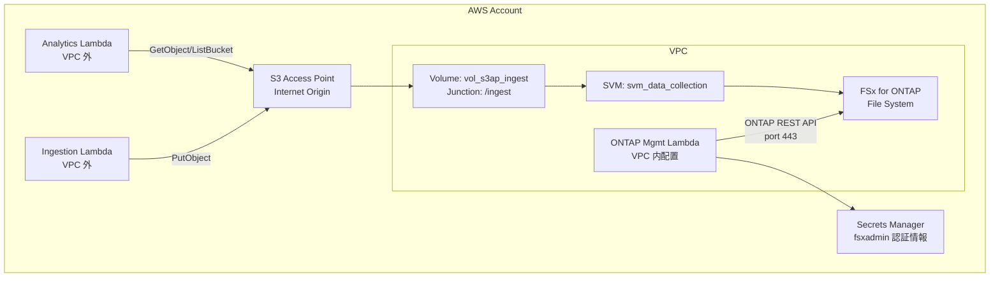
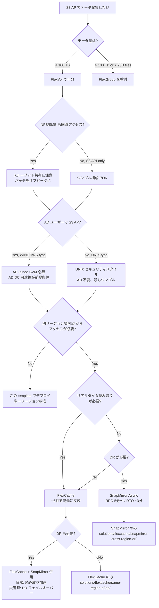

# FSx for ONTAP S3 Access Points — データ収集インフラ デプロイガイド

> 🌐 Language: [日本語](README.md) | [English](README.en.md)

S3 API でデータを収集する FSx for ONTAP 環境を CloudFormation で構築するガイド。各ステップに設計考慮事項を組み込み、PoC から本番移行まで迷わずに進められる構成。

---

## 所要時間

| フェーズ | 所要時間 | 内容 |
|---------|:-------:|------|
| テンプレートのデプロイ | ~30 分 | FSx ファイルシステム + SVM + Volume + IAM Roles 作成 |
| S3 AP 作成 + 検証 | ~5 分 | AWS CLI で S3 AP アタッチ + テスト書き込み |
| 設計決定（初回のみ） | ~15 分 | 以下のガイドを読みながらパラメータ決定 |

---

## アーキテクチャ概要



---

## Step 1: パラメータの設計判断

### スループット容量の選択

> 📐 **設計ポイント**: スループットは NFS/SMB/S3 AP で共有。バッチ処理（大量 S3 API コール）はオフピーク実行が望ましい。

| ワークロード | 推奨スループット | 根拠 |
|------------|:--------------:|------|
| PoC / 開発 | 128 MBps | 低コスト。Lambda 単体テストには十分 |
| NFS + S3 AP 併用（日次バッチ） | 256 MBps | NFS クライアントと S3 AP バッチが共存 |
| 高頻度 IoT 書き込み + リアルタイム NFS | 512+ MBps | 同時書き込みピーク対応 |

### ボリュームとディレクトリ設計

> 📐 **設計ポイント**: S3 オブジェクトキーの "/" はそのままディレクトリに変換される。1 ディレクトリ 10 万件以内を目指す。

```
# 推奨: Hive-style パーティション
s3://<ap-alias>/data/year=2026/month=07/day=22/sensor_001.json

# 避ける: フラット構造に大量ファイル
s3://<ap-alias>/all_data/sensor_001.json  ← 100万件集中 → LIST 遅延
```

| 設計項目 | 推奨値 | 理由 |
|---------|--------|------|
| Junction Path | `/ingest` | S3 キーの先頭に NFS パスが付く |
| パーティション | `year=/month=/day=/` | 日次パーティションで ~10K ファイル/日 なら安全 |
| ボリュームタイプ | FlexVol | PoC/単一ワークロード。PB 規模は FlexGroup |
| セキュリティスタイル | UNIX | Lambda S3 AP に最適。AD 不要 |

**参考**: [How do I avoid maxdir-size issues (NetApp KB)](https://kb.netapp.com/on-prem/ontap/Ontap_OS/OS-KBs/How_do_I_avoid_maxdir-size_issues)

### FlexCache / SnapMirror 利用時のディレクトリ設計追加ポイント

FlexCache や SnapMirror でデータを配信する場合、ディレクトリ構造がキャッシュ効率と転送効率に影響する:

| 配信方法 | ディレクトリ設計への影響 |
|---------|----------------------|
| FlexCache | 同一ディレクトリ内ファイルは同一 FlexGroup constituent に配置される傾向。ディレクトリを分散させると複数ノードでキャッシュヒットさせやすい |
| SnapMirror | 小ファイル × 多ディレクトリの方が増分転送効率が良い。1 つの巨大ファイルへの追記は毎回大きな転送量が発生 |

**設計指針**: Hive パーティション（`year=/month=/day=/`）は FlexCache の分散キャッシュと SnapMirror の増分効率の両方に適している。

詳細: [FlexCache / SnapMirror 考慮事項（fsxn-lakehouse-integrations）](https://github.com/Yoshiki0705/fsxn-lakehouse-integrations/blob/main/docs/ja/s3ap-flexcache-snapmirror-considerations.md)

### S3 Access Point の設計

> 📐 **設計ポイント**: 1 つのボリュームに複数の S3 AP を作成できる。用途別に分離すると IAM 管理が容易。

| 用途 | AP 名例 | IAM アクション |
|------|--------|---------------|
| データ収集 (Write) | `fsxn-ingest-write` | `s3:PutObject` のみ |
| 分析 (Read) | `fsxn-analytics-read` | `s3:GetObject`, `s3:ListBucket` |
| 監査 (Read, 別ユーザー) | `fsxn-audit-read` | `s3:GetObject`, `s3:ListBucket` |

### NetworkOrigin の選択

> 📐 **設計ポイント**: サーバーレスパターンでは Internet origin + VPC 外 Lambda が最もシンプル。

| Origin | Lambda 配置 | 用途 |
|--------|:----------:|------|
| **Internet** | VPC 外 | S3 AP のデータ読み書き（大半のパターン） |
| **VPC** | VPC 内 | VPC 閉域網が必須のコンプライアンス要件 |

⚠️ S3 Gateway VPC Endpoint は S3 AP (Internet origin) では機能しない。VPC 内 Lambda から Internet-origin AP にアクセスするには NAT Gateway が必要。

---

## Step 2: デプロイ

```bash
# パラメータファイルを編集
cp params.example.json params.json
# → VpcId, SubnetId, SecurityGroupId, FsxAdminPassword を設定

# デプロイ（~30 分）
aws cloudformation deploy \
  --template-file template.yaml \
  --stack-name fsxn-s3ap-data-collection \
  --parameter-overrides file://params.json \
  --capabilities CAPABILITY_NAMED_IAM \
  --region ap-northeast-1
```

> ⏱ FSx for ONTAP ファイルシステムの作成に 15-30 分かかる。スタック出力を確認するまで待つ。

---

## Step 3: S3 Access Point の作成

CloudFormation では S3 AP のネイティブ作成がサポートされていないため、AWS CLI で作成する:

```bash
# スタック出力から Volume ID を取得
VOLUME_ID=$(aws cloudformation describe-stacks \
  --stack-name fsxn-s3ap-data-collection \
  --query "Stacks[0].Outputs[?OutputKey=='DataVolumeId'].OutputValue" \
  --output text)

# S3 AP を作成
aws fsx create-and-attach-s3-access-point \
  --cli-input-json "{
    \"Name\": \"fsxn-data-ingest\",
    \"Type\": \"ONTAP\",
    \"OntapConfiguration\": {
      \"VolumeId\": \"${VOLUME_ID}\",
      \"FileSystemIdentity\": {
        \"Type\": \"UNIX\",
        \"UnixUser\": {\"Name\": \"fsxadmin\"}
      }
    }
  }"
```

> 📐 **UNIX ユーザーの選択**: `fsxadmin` (UID 0) は PoC に便利。本番では専用ユーザーを作成し、NFS 側の パーミッションと整合させること。ファイル所有者がこの UID になる。

---

## Step 4: 動作検証

```bash
# アカウント ID を取得
ACCOUNT_ID=$(aws sts get-caller-identity --query Account --output text)
AP_ALIAS="fsxn-data-ingest-${ACCOUNT_ID}-s3alias"

# テストファイル書き込み
echo '{"sensor": "temp-01", "value": 23.5, "ts": "2026-07-22T10:00:00Z"}' > /tmp/test.json
aws s3api put-object \
  --bucket "${AP_ALIAS}" \
  --key "data/year=2026/month=07/day=22/temp-01.json" \
  --body /tmp/test.json

# 読み取り確認
aws s3api get-object \
  --bucket "${AP_ALIAS}" \
  --key "data/year=2026/month=07/day=22/temp-01.json" \
  /tmp/result.json
cat /tmp/result.json

# ListObjectsV2 (Prefix 限定)
aws s3api list-objects-v2 \
  --bucket "${AP_ALIAS}" \
  --prefix "data/year=2026/month=07/day=22/"
```

> 📐 **ListObjectsV2 のベストプラクティス**: 常に `--prefix` を指定。ルートでの全件 LIST はディレクトリ走査 + インメモリソートのコストが大きい。10 万件超で顕著に遅延する。

---

## Step 5: NFS からの確認（マルチプロトコル検証）

```bash
# NFS マウント（FSx SVM の NFS LIF IP を使用）
sudo mount -t nfs -o vers=4.1 <svm-nfs-lif-ip>:/ingest /mnt/ingest

# S3 AP で書いたファイルが NFS から見える
cat /mnt/ingest/data/year=2026/month=07/day=22/temp-01.json
# → {"sensor": "temp-01", "value": 23.5, "ts": "2026-07-22T10:00:00Z"}

# ファイル所有者の確認
ls -la /mnt/ingest/data/year=2026/month=07/day=22/temp-01.json
# → S3 AP の FileSystemIdentity (fsxadmin) の UID で所有
```

> 📐 **マルチプロトコル整合性**:
> - S3 AP PutObject 完了 → NFS で即座に一貫したデータが読める（WAFL 原子コミット）
> - 同一ファイルへの同時書き込み（S3 + NFS）は避ける。書き込みプロトコルは 1 つに限定を推奨

---

## 設計判断フローチャート



---

## 機能互換性の注意点

このインフラ上でサーバーレスパターンを実装する際の重要な差分:

| 注意点 | 影響 | 対策 |
|--------|------|------|
| **条件付き書き込み非対応** | Delta Lake / Iceberg のコミットプロトコルが動作しない | メタストアを通常 S3 に配置、データのみ S3 AP |
| **S3 Event Notification 非対応** | PutObject トリガーの Lambda は使えない | FPolicy + EventBridge でイベント駆動を実現 |
| **Versioning 非対応** | オブジェクトの世代管理ができない | ONTAP Snapshot（ボリューム単位のポイントインタイム）で代替 |
| **ListObjectsV2 性能特性** | 大量ファイルディレクトリで遅延 | Hive パーティション + Prefix 限定 + 外部カタログ |
| **PutObject 上限 5 GB** | 大ファイルは分割が必要 | Multipart Upload (ONTAP 9.16.1+) |

詳細: [設計考慮事項](../../docs/design-considerations.md)

### S3 AP + FlexCache / SnapMirror 互換性

| 構成 | サポート | 条件 | 参考 |
|------|:--------:|------|------|
| S3 AP volume → SnapMirror Async source | ✅ | ONTAP 9.12.1+ | [S3 multiprotocol](https://docs.netapp.com/us-en/ontap/s3-multiprotocol/index.html) |
| S3 AP volume → FlexCache Origin | ✅ | ONTAP 9.12.1+ | [FlexCache features](https://docs.netapp.com/us-en/ontap/flexcache/supported-unsupported-features-concept.html) |
| FlexCache Cache Volume → S3 AP attach | ✅ | **ONTAP 9.18.1+** | [FlexCache duality FAQ](https://docs.netapp.com/us-en/ontap/flexcache/flexcache-duality-faq.html) |
| SnapMirror Synchronous + S3 NAS bucket | ❌ | — | S3 NAS bucket 非対応 |
| SVM-DR + S3 NAS bucket | ❌ | — | S3 NAS bucket 非対応 |
| FlexCache write-back + S3 AP 同一ファイル | ⚠️ | 同一ファイル回避 | XLD revoke で Cache データ破棄 |

---

## クリーンアップ

```bash
# 1. S3 AP をデタッチ・削除（ボリューム削除前に必須）
aws fsx detach-and-delete-s3-access-point \
  --s3-access-point-arn <ap-arn-from-describe>

# 2. CloudFormation スタック削除
aws cloudformation delete-stack --stack-name fsxn-s3ap-data-collection
```

⚠️ S3 AP がアタッチされたままボリュームを削除しようとするとエラーになる。必ず先に AP をデタッチすること。

---

## 次のステップ

| やりたいこと | パターン |
|------------|---------|
| IoT データを自動分析 | [manufacturing-analytics](../../solutions/industry/manufacturing-analytics/) |
| NAS データを AI で処理 | [genai/kb-selfservice-curation](../../solutions/genai/kb-selfservice-curation/) |
| FlexCache で読み取り加速 | [flexcache/same-region-s3ap](../../solutions/flexcache/same-region-s3ap/) |
| クロスリージョン DR | [flexcache/snapmirror-cross-region-dr](../../solutions/flexcache/snapmirror-cross-region-dr/) |
| 設計考慮事項を深掘り | [docs/design-considerations.md](../../docs/design-considerations.md) |

---

## 関連リソース（Cross-Project）

- [S3 AP 設計考慮事項（詳細版）](https://github.com/Yoshiki0705/fsxn-lakehouse-integrations/blob/main/docs/ja/s3ap-design-considerations.md)
- [FlexCache / SnapMirror 追加考慮事項](https://github.com/Yoshiki0705/fsxn-lakehouse-integrations/blob/main/docs/ja/s3ap-flexcache-snapmirror-considerations.md)
- [SnapMirror + FlexCache 調査・検証（41 findings, 12 demo guides）](https://github.com/Yoshiki0705/fsxn-lakehouse-integrations/tree/main/integrations/snapmirror-flexcache-multicloud)
- [Cross-region deploy/test/teardown スクリプト](https://github.com/Yoshiki0705/fsxn-lakehouse-integrations/tree/main/integrations/snapmirror-flexcache-multicloud/scripts/validation)

---

## 参考資料

- [AWS Docs: FSx for ONTAP S3 Access Points](https://docs.aws.amazon.com/fsx/latest/ONTAPGuide/accessing-data-via-s3-access-points.html)
- [AWS Docs: Optimizing S3 Performance](https://docs.aws.amazon.com/AmazonS3/latest/userguide/optimizing-performance.html)
- [NetApp KB: How do I avoid maxdir-size issues](https://kb.netapp.com/on-prem/ontap/Ontap_OS/OS-KBs/How_do_I_avoid_maxdir-size_issues)
- [NetApp Docs: S3 multiprotocol](https://docs.netapp.com/us-en/ontap/s3-multiprotocol/index.html)
- [NetApp Docs: FlexGroup volumes](https://docs.netapp.com/us-en/ontap/flexgroup/definition-concept.html)
