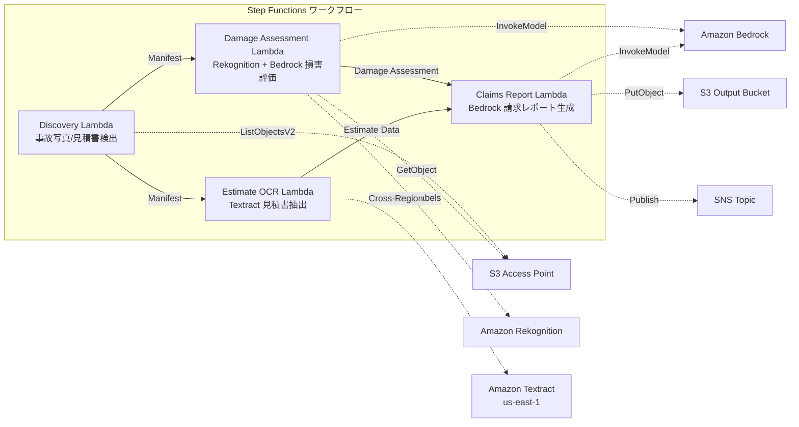

# UC14: Versicherung / Schadensbewertung — Unfallfoto-Schadensbewertung, Kostenvoranschlag OCR und Bewertungsbericht

🌐 **Language / 言語**: [日本語](README.md) | [English](README.en.md) | [한국어](README.ko.md) | [简体中文](README.zh-CN.md) | [繁體中文](README.zh-TW.md) | [Français](README.fr.md) | Deutsch | [Español](README.es.md)

## Überblick
FSx for NetApp ONTAP nutzt S3 Access Points, um serverlose Workflows für Schadenbewertungen anhand von Unfallfotos, OCR-Textextraktion aus Angeboten und automatische Generierung von Versicherungsberichten zu ermöglichen.
### Fälle, in denen dieses Muster geeignet ist
- Unfallfotos und Kostenvoranschläge werden in FSx ONTAP gespeichert
- Die Schadensermittlung von Unfallfotos mittels Rekognition (Fahrzeugschadenslabel, Schweregrad, betroffene Bereiche) soll automatisiert werden
- OCR von Kostenvoranschlägen mittels Textract (Reparaturpunkte, Kosten, Arbeitszeit, Teile) soll durchgeführt werden
- Ein umfassender Versicherungsanspruchsbericht, der Foto-basierte Schadensbewertungen und Kostenvoranschlagsdaten korreliert, wird benötigt
- Die Verwaltung der manuellen Überprüfungsflags bei nicht erkannten Schadenslabels soll automatisiert werden
### Fälle, in denen dieses Muster nicht geeignet ist
- Ein System zur Verarbeitung von Versicherungsansprüchen in Echtzeit ist erforderlich
- Eine vollständige Versicherungsbewertungs-Engine (dedizierte Software ist angemessen)
- Es ist das Training eines großen Betrugserkennungsmodells erforderlich
- Umgebungen, in denen keine Netzwerkreichweite zur ONTAP REST API möglich ist
### Hauptfunktionen
- Automatische Erkennung von Unfallfotos (.jpg,.jpeg,.png) und Angeboten (.pdf,.tiff) über S3 AP
- Schadensermittlung mit Rekognition (damage_type, severity_level, affected_components)
- Generierung einer strukturierten Schadenbewertung mit Bedrock
- OCR für Angebote mit Textract (Cross-Region) (Reparaturpositionen, Kosten, Arbeitsstunden, Teile)
- Generierung eines umfassenden Versicherungsanspruchsberichts mit Bedrock (JSON + menschenlesbarer Format)
- Sofortige Freigabe der Ergebnisse durch SNS-Benachrichtigungen
## Architektur



### Workflow-Schritte
1. **Discovery**: Unfälle-Fotos und Kostenvoranschläge von S3 AP entdecken
2. **Schadensbegutachtung**: Schadenserkennung mit Rekognition, strukturierte Schadensbewertungserstellung mit Bedrock
3. **Estimate OCR**: Text- und Tabellenextraktion aus Kostenvoranschlägen mit Textract (Cross-Region)
4. **Anspruchsbericht**: Erstellung eines umfassenden Berichts mit Bedrock durch Korrelation der Schadensbewertung und Kostenvoranschlagsdaten
## Voraussetzungen
- AWS-Konto und entsprechende IAM-Berechtigungen
- FSx for NetApp ONTAP-Dateisystem (ONTAP 9.17.1P4D3 und höher)
- S3 Access Point aktivierter Volume (zur Speicherung von Unfallfotos und Angeboten)
- VPC, private Subnetz
- Amazon Bedrock-Modellzugriff aktiviert (Claude / Nova)
- **Cross-Region**: Da Textract ap-northeast-1 nicht unterstützt, ist ein Cross-Region-Aufruf nach us-east-1 erforderlich
## Bereitstellungsschritte

### 1. Überprüfung der standortübergreifenden Parameter
Textract wird in der Tokyo-Region nicht unterstützt, daher wird der Cross-Region-Aufruf mit dem `CrossRegionTarget`-Parameter eingerichtet.
### 2. CloudFormation-Bereitstellung

```bash
aws cloudformation deploy \
  --template-file insurance-claims/template.yaml \
  --stack-name fsxn-insurance-claims \
  --parameter-overrides \
    S3AccessPointAlias=<your-volume-ext-s3alias> \
    S3AccessPointName=<your-s3ap-name> \
    VpcId=<your-vpc-id> \
    PrivateSubnetIds=<subnet-1>,<subnet-2> \
    ScheduleExpression="rate(1 hour)" \
    NotificationEmail=<your-email@example.com> \
    CrossRegionTarget=us-east-1 \
    EnableVpcEndpoints=false \
    EnableCloudWatchAlarms=false \
  --capabilities CAPABILITY_IAM CAPABILITY_AUTO_EXPAND \
  --region ap-northeast-1
```

## Liste der Konfigurationsparameter

| パラメータ | 説明 | デフォルト | 必須 |
|-----------|------|----------|------|
| `S3AccessPointAlias` | FSx ONTAP S3 AP Alias（入力用） | — | ✅ |
| `S3AccessPointName` | S3 AP 名（ARN ベースの IAM 権限付与用。省略時は Alias ベースのみ） | `""` | ⚠️ 推奨 |
| `ScheduleExpression` | EventBridge Scheduler のスケジュール式 | `rate(1 hour)` | |
| `VpcId` | VPC ID | — | ✅ |
| `PrivateSubnetIds` | プライベートサブネット ID リスト | — | ✅ |
| `NotificationEmail` | SNS 通知先メールアドレス | — | ✅ |
| `CrossRegionTarget` | Textract のターゲットリージョン | `us-east-1` | |
| `MapConcurrency` | Map ステートの並列実行数 | `10` | |
| `LambdaMemorySize` | Lambda メモリサイズ (MB) | `512` | |
| `LambdaTimeout` | Lambda タイムアウト (秒) | `300` | |
| `EnableVpcEndpoints` | Interface VPC Endpoints の有効化 | `false` | |
| `EnableCloudWatchAlarms` | CloudWatch Alarms の有効化 | `false` | |

## Bereinigung

```bash
aws s3 rm s3://fsxn-insurance-claims-output-${AWS_ACCOUNT_ID} --recursive

aws cloudformation delete-stack \
  --stack-name fsxn-insurance-claims \
  --region ap-northeast-1

aws cloudformation wait stack-delete-complete \
  --stack-name fsxn-insurance-claims \
  --region ap-northeast-1
```

## Unterstützte Regionen
UC14 verwendet die folgenden Dienste:
| サービス | リージョン制約 |
|---------|-------------|
| Amazon Rekognition | ほぼ全リージョンで利用可能 |
| Amazon Textract | ap-northeast-1 非対応。`TEXTRACT_REGION` パラメータで対応リージョン（us-east-1 等）を指定 |
| Amazon Bedrock | 対応リージョンを確認（[Bedrock 対応リージョン](https://docs.aws.amazon.com/general/latest/gr/bedrock.html)） |
| AWS X-Ray | ほぼ全リージョンで利用可能 |
| CloudWatch EMF | ほぼ全リージョンで利用可能 |
> Rufen Sie die Textract API über den Cross-Region Client auf. Überprüfen Sie die Datenresidenzanforderungen. Weitere Informationen finden Sie in der [Regionskompatibilitätsmatrix](../docs/region-compatibility.md).
## Referenzlinks
- [FSx ONTAP S3 Access Points 概要](https://docs.aws.amazon.com/fsx/latest/ONTAPGuide/accessing-data-via-s3-access-points.html)
- [Amazon Rekognition Labelerkennung](https://docs.aws.amazon.com/rekognition/latest/dg/labels.html)
- [Amazon Textract Dokumente](https://docs.aws.amazon.com/textract/latest/dg/what-is.html)
- [Amazon Bedrock API Referenz](https://docs.aws.amazon.com/bedrock/latest/APIReference/API_runtime_InvokeModel.html)