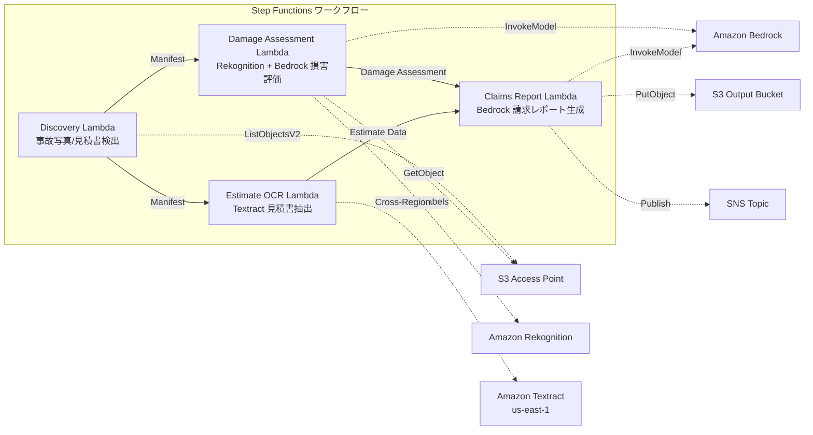

# UC14: Insurance / Damage Assessment — Accident Photo Damage Evaluation and Invoice OCR, Assessment Report

🌐 **Language / 言語**: [日本語](README.md) | English | [한국어](README.ko.md) | [简体中文](README.zh-CN.md) | [繁體中文](README.zh-TW.md) | [Français](README.fr.md) | [Deutsch](README.de.md) | [Español](README.es.md)

📚 **Documentation**: [Architecture Diagram](docs/architecture.en.md) | [Demo Guide](docs/demo-guide.en.md)

## Overview
Leveraging S3 Access Points in Amazon FSx for NetApp ONTAP, this serverless workflow enables damage assessment of accident photos, OCR text extraction from estimates, and automatic generation of insurance claim reports.
### Cases where this pattern is suitable
- Accident photos and estimates are stored on Amazon FSx for NetApp ONTAP
- We want to automate damage detection on accident photos (vehicle damage labels, severity index, affected areas) using Rekognition
- We want to implement OCR on estimates (repair items, costs, labor hours, parts) using Textract
- We need a comprehensive claim report that correlates photo-based damage assessment and estimate data
- We want to automate the management of manual review flags for undetected damage labels
### Cases where this pattern is not suitable
- A real-time claims processing system is needed
- A complete claim evaluation engine (dedicated software is suitable)
- Training of large-scale fraud detection models is necessary
- Environment where network reachability to ONTAP REST API cannot be ensured
### Main Features
- Automatic detection of accident photos (.jpg,.jpeg, .png) and estimates (.pdf, .tiff) via S3 AP
- Damage detection with Rekognition (damage_type, severity_level, affected_components)
- Generation of structured damage assessment with Bedrock
- Estimate OCR (repair items, costs, labor hours, parts) with Textract (cross-region)
- Generation of comprehensive insurance claim report with Bedrock (JSON + human-readable format)
- Immediate sharing of results via SNS notification
## Architecture



### Workflow Steps
1. **Discovery**: Detect accident photos and estimates from S3 AP
2. **Damage Assessment**: Detect damage with Rekognition, generate structured damage assessment with Bedrock
3. **Estimate OCR**: Extract text and tables from estimates with Textract (cross-region)
4. **Claims Report**: Generate a comprehensive report correlating damage assessment and estimate data with Bedrock
## Prerequisites
- AWS account and appropriate IAM permissions
- FSx for NetApp ONTAP file systems (ONTAP 9.17.1P4D3 or later)
- S3 Access Point enabled volumes (for storing accident photos and estimates)
- VPC, private subnets
- Amazon Bedrock model access enabled (Claude / Nova)
- **Cross-region**: Textract is not supported in ap-northeast-1, so a cross-region call to us-east-1 is required
## Deployment Steps

### 1. Check Cross-Region Parameters
Since Textract is not available in the Tokyo region, configure cross-region calls with the `CrossRegionTarget` parameter.
### 2. CloudFormation Deployment

```bash
aws cloudformation deploy \
  --template-file insurance-claims/template.yaml \
  --stack-name fsxn-insurance-claims \
  --parameter-overrides \
    S3AccessPointAlias=<your-volume-ext-s3alias> \
    S3AccessPointName=<your-s3ap-name> \
    VpcId=<your-vpc-id> \
    PrivateSubnetIds=<subnet-1>,<subnet-2> \
    ScheduleExpression="rate(1 hour)" \
    NotificationEmail=<your-email@example.com> \
    CrossRegionTarget=us-east-1 \
    EnableVpcEndpoints=false \
    EnableCloudWatchAlarms=false \
  --capabilities CAPABILITY_IAM CAPABILITY_AUTO_EXPAND \
  --region ap-northeast-1
```

## List of Configuration Parameters

| パラメータ | 説明 | デフォルト | 必須 |
|-----------|------|----------|------|
| `S3AccessPointAlias` | FSx ONTAP S3 AP Alias（入力用） | — | ✅ |
| `S3AccessPointName` | S3 AP 名（ARN ベースの IAM 権限付与用。省略時は Alias ベースのみ） | `""` | ⚠️ 推奨 |
| `ScheduleExpression` | EventBridge Scheduler のスケジュール式 | `rate(1 hour)` | |
| `VpcId` | VPC ID | — | ✅ |
| `PrivateSubnetIds` | プライベートサブネット ID リスト | — | ✅ |
| `NotificationEmail` | SNS 通知先メールアドレス | — | ✅ |
| `CrossRegionTarget` | Textract のターゲットリージョン | `us-east-1` | |
| `MapConcurrency` | Map ステートの並列実行数 | `10` | |
| `LambdaMemorySize` | Lambda メモリサイズ (MB) | `512` | |
| `LambdaTimeout` | Lambda タイムアウト (秒) | `300` | |
| `EnableVpcEndpoints` | Interface VPC Endpoints の有効化 | `false` | |
| `EnableCloudWatchAlarms` | CloudWatch Alarms の有効化 | `false` | |
| `EnableSnapStart` | Enable Lambda SnapStart (cold start reduction) | `false` | |

## Cleanup

```bash
aws s3 rm s3://fsxn-insurance-claims-output-${AWS_ACCOUNT_ID} --recursive

aws cloudformation delete-stack \
  --stack-name fsxn-insurance-claims \
  --region ap-northeast-1

aws cloudformation wait stack-delete-complete \
  --stack-name fsxn-insurance-claims \
  --region ap-northeast-1
```

## Supported Regions
UC14 uses the following services:
| サービス | リージョン制約 |
|---------|-------------|
| Amazon Rekognition | ほぼ全リージョンで利用可能 |
| Amazon Textract | ap-northeast-1 非対応。`TEXTRACT_REGION` パラメータで対応リージョン（us-east-1 等）を指定 |
| Amazon Bedrock | 対応リージョンを確認（[Bedrock 対応リージョン](https://docs.aws.amazon.com/general/latest/gr/bedrock.html)） |
| AWS X-Ray | ほぼ全リージョンで利用可能 |
| CloudWatch EMF | ほぼ全リージョンで利用可能 |
> Call the Textract API via the Cross-Region Client. Please check the data residency requirements. For more details, refer to the [Region Compatibility Matrix](../docs/region-compatibility.md).
## References
- [FSx for NetApp ONTAP S3 Access Points Overview](https://docs.aws.amazon.com/fsx/latest/ONTAPGuide/accessing-data-via-s3-access-points.html)
- [Amazon Rekognition Label Detection](https://docs.aws.amazon.com/rekognition/latest/dg/labels.html)
- [Amazon Textract Documentation](https://docs.aws.amazon.com/textract/latest/dg/what-is.html)
- [Amazon Bedrock API Reference](https://docs.aws.amazon.com/bedrock/latest/APIReference/API_runtime_InvokeModel.html)