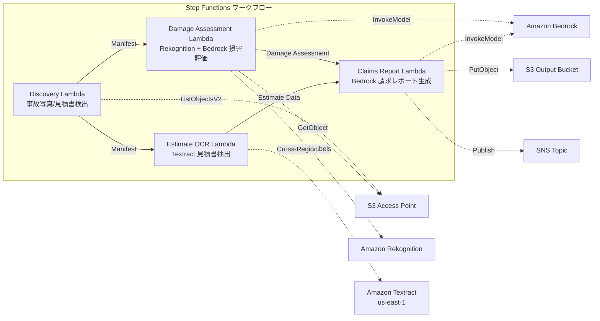

# UC14: Seguro / Evaluación de daños — Evaluación de daños en fotos de accidentes, OCR de presupuestos y reportes de evaluación

🌐 **Language / 言語**: [日本語](README.md) | [English](README.en.md) | [한국어](README.ko.md) | [简体中文](README.zh-CN.md) | [繁體中文](README.zh-TW.md) | [Français](README.fr.md) | [Deutsch](README.de.md) | Español

## Resumen
Este es un flujo de trabajo sin servidor que aprovecha los Puntos de Acceso S3 de FSx for NetApp ONTAP para la evaluación de daños en fotografías de accidentes, la extracción de texto OCR de presupuestos y la generación automática de informes de reclamaciones de seguros.
### Casos en los que este patrón es apropiado
- Las fotografías de accidentes y las facturas se están almacenando en FSx ONTAP
- Desea automatizar la detección de daños en fotografías de accidentes (etiquetas de daños en vehículos, índice de gravedad, áreas afectadas) con Rekognition
- Desea realizar OCR de las facturas (artículos de reparación, costos, horas de trabajo, piezas) con Textract
- Se necesita un informe integral de reclamación de seguros que correlacione la evaluación de daños basada en fotografías y los datos de las facturas
- Desea automatizar la gestión de la bandera de revisión manual cuando las etiquetas de daño no se detectan
### Casos en los que este patrón no es apropiado
- Necesitamos un sistema de procesamiento de reclamaciones de seguros en tiempo real
- Un motor de evaluación de seguros completo (el software personalizado es adecuado)
- Requiere el entrenamiento de modelos de detección de fraude a gran escala
- Entorno donde no se puede garantizar el acceso a la red para la API REST de ONTAP
### Características principales
- Detección automática de imágenes de accidentes (.jpg,.jpeg,.png) y presupuestos (.pdf, .tiff) a través de S3 AP
- Detección de daños con Rekognition (tipo_de_daño, nivel_de_severidad, componentes_afectados)
- Generación de evaluación estructurada de daños con Bedrock
- OCR de presupuestos con Textract (cross-region) (ítems de reparación, costos, horas-hombre, piezas)
- Generación de informes de reclamación de seguros completos con Bedrock (JSON + formato legible por humanos)
- Compartir resultados de inmediato mediante notificaciones SNS
## Arquitectura



### Pasos del flujo de trabajo
1. **Descubrimiento**: Detectar imágenes del accidente y presupuestos desde S3 AP
2. **Evaluación de daños**: Detectar daños con Rekognition, generar evaluación de daños estructurada con Bedrock
3. **Estimar OCR**: Extraer texto y tablas de los presupuestos con Textract (entre regiones)
4. **Informe de reclamaciones**: Generar un informe completo correlacionando la evaluación de daños y los datos del presupuesto con Bedrock
## Requisitos previos
- Cuenta de AWS y permisos IAM adecuados
- Sistema de archivos FSx for NetApp ONTAP (ONTAP 9.17.1P4D3 o superior)
- Punto de acceso de S3 habilitado para volúmenes (almacenamiento de fotografías de accidentes y presupuestos)
- VPC, subredes privadas
- Acceso al modelo de Amazon Bedrock habilitado (Claude / Nova)
- **Cross-region**: Textract no es compatible con ap-northeast-1, por lo que se necesita una llamada cross-region a us-east-1
## Pasos de implementación

### 1. Verificación de parámetros entre regiones
Textract no es compatible con la región de Tokio, por lo que se configura una llamada entre regiones con el parámetro `CrossRegionTarget`.
### 2. Despliegue de CloudFormation

```bash
aws cloudformation deploy \
  --template-file insurance-claims/template.yaml \
  --stack-name fsxn-insurance-claims \
  --parameter-overrides \
    S3AccessPointAlias=<your-volume-ext-s3alias> \
    S3AccessPointName=<your-s3ap-name> \
    VpcId=<your-vpc-id> \
    PrivateSubnetIds=<subnet-1>,<subnet-2> \
    ScheduleExpression="rate(1 hour)" \
    NotificationEmail=<your-email@example.com> \
    CrossRegionTarget=us-east-1 \
    EnableVpcEndpoints=false \
    EnableCloudWatchAlarms=false \
  --capabilities CAPABILITY_IAM CAPABILITY_AUTO_EXPAND \
  --region ap-northeast-1
```

## Lista de parámetros de configuración

| パラメータ | 説明 | デフォルト | 必須 |
|-----------|------|----------|------|
| `S3AccessPointAlias` | FSx ONTAP S3 AP Alias（入力用） | — | ✅ |
| `S3AccessPointName` | S3 AP 名（ARN ベースの IAM 権限付与用。省略時は Alias ベースのみ） | `""` | ⚠️ 推奨 |
| `ScheduleExpression` | EventBridge Scheduler のスケジュール式 | `rate(1 hour)` | |
| `VpcId` | VPC ID | — | ✅ |
| `PrivateSubnetIds` | プライベートサブネット ID リスト | — | ✅ |
| `NotificationEmail` | SNS 通知先メールアドレス | — | ✅ |
| `CrossRegionTarget` | Textract のターゲットリージョン | `us-east-1` | |
| `MapConcurrency` | Map ステートの並列実行数 | `10` | |
| `LambdaMemorySize` | Lambda メモリサイズ (MB) | `512` | |
| `LambdaTimeout` | Lambda タイムアウト (秒) | `300` | |
| `EnableVpcEndpoints` | Interface VPC Endpoints の有効化 | `false` | |
| `EnableCloudWatchAlarms` | CloudWatch Alarms の有効化 | `false` | |
| `EnableSnapStart` | Habilitar Lambda SnapStart (reducción de arranque en frío) | `false` | |

## Limpieza

```bash
aws s3 rm s3://fsxn-insurance-claims-output-${AWS_ACCOUNT_ID} --recursive

aws cloudformation delete-stack \
  --stack-name fsxn-insurance-claims \
  --region ap-northeast-1

aws cloudformation wait stack-delete-complete \
  --stack-name fsxn-insurance-claims \
  --region ap-northeast-1
```

## Regiones compatibles
UC14 utiliza los siguientes servicios:
| サービス | リージョン制約 |
|---------|-------------|
| Amazon Rekognition | ほぼ全リージョンで利用可能 |
| Amazon Textract | ap-northeast-1 非対応。`TEXTRACT_REGION` パラメータで対応リージョン（us-east-1 等）を指定 |
| Amazon Bedrock | 対応リージョンを確認（[Bedrock 対応リージョン](https://docs.aws.amazon.com/general/latest/gr/bedrock.html)） |
| AWS X-Ray | ほぼ全リージョンで利用可能 |
| CloudWatch EMF | ほぼ全リージョンで利用可能 |
> Llame a la API de Textract a través del cliente de región cruzada. Verifique los requisitos de residencia de datos. Para más detalles, consulte la [matriz de compatibilidad de regiones](../docs/region-compatibility.md).
## Enlaces de referencia
- [Puntos de acceso a Amazon S3 de FSx para NetApp ONTAP](https://docs.aws.amazon.com/fsx/latest/ONTAPGuide/accessing-data-via-s3-access-points.html)
- [Amazon Rekognition Detección de etiquetas](https://docs.aws.amazon.com/rekognition/latest/dg/labels.html)
- [Documentación de Amazon Textract](https://docs.aws.amazon.com/textract/latest/dg/what-is.html)
- [Referencia de la API de Amazon Bedrock](https://docs.aws.amazon.com/bedrock/latest/APIReference/API_runtime_InvokeModel.html)