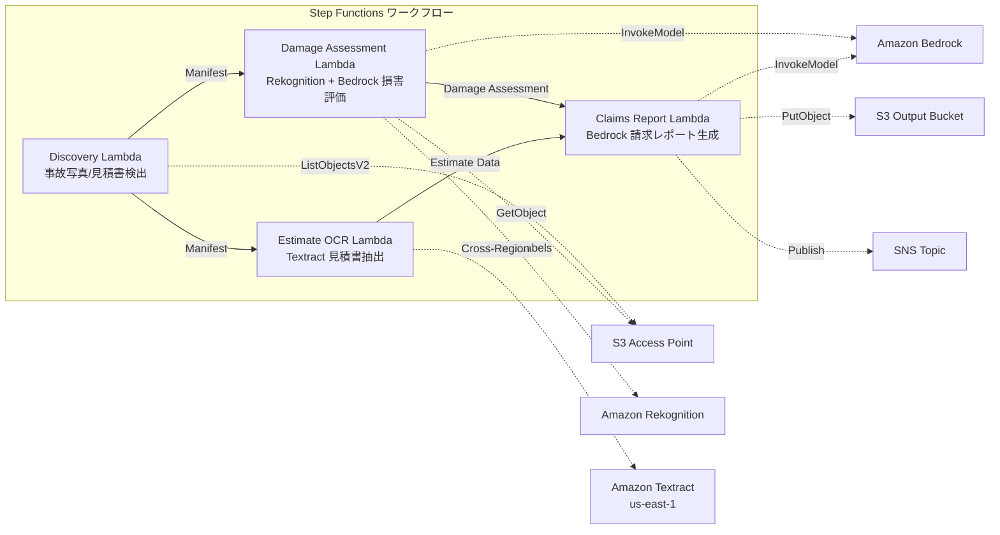

# UC14 : Assurance / Évaluation des dommages — Évaluation des dommages sur les photos d'accidents, OCR des devis et rapports d'évaluation

🌐 **Language / 言語**: [日本語](README.md) | [English](README.en.md) | [한국어](README.ko.md) | [简体中文](README.zh-CN.md) | [繁體中文](README.zh-TW.md) | Français | [Deutsch](README.de.md) | [Español](README.es.md)

## Aperçu
Un workflow sans serveur qui exploite les Points d'accès S3 de FSx pour NetApp ONTAP, permettant l'évaluation des dommages des photos d'accidents, l'extraction de texte OCR des devis et la génération automatique de rapports de réclamations d'assurance.
### Cas où ce modèle est approprié
- Les photos d'accident et les devis sont stockés sur FSx ONTAP
- Nous souhaitons automatiser la détection des dommages sur les photos d'accident (étiquettes de dommages aux véhicules, indicateurs de gravité, zones affectées) avec Rekognition
- Nous voulons mettre en œuvre l'OCR des devis avec Textract (éléments de réparation, coûts, heures-hommes, pièces)
- Nous avons besoin d'un rapport de réclamation d'assurance complet qui corrèle l'évaluation des dommages basée sur les photos avec les données des devis
- Nous souhaitons automatiser la gestion des indicateurs de révision manuelle lorsque les étiquettes de dommages ne sont pas détectées
### Cas où ce modèle ne convient pas
- Nécessité d'un système de traitement des réclamations d'assurance en temps réel
- Moteur complet d'évaluation des sinistres (un logiciel dédié est approprié)
- Nécessité de former un modèle de détection de fraude à grande échelle
- Environnements où la connectivité réseau vers l'API REST ONTAP n'est pas possible
### Principales fonctionnalités
- Détection automatique des photos d'accident (.jpg,.jpeg, .png) et des devis (.pdf, .tiff) via S3 AP
- Détection des dommages par Rekognition (type_de_dommage, niveau_de_gravité, composants_affectés)
- Génération d'une évaluation structurée des dommages par Bedrock
- OCR des devis par Textract (cross-région) (éléments de réparation, coûts, heures de travail, pièces)
- Génération d'un rapport de réclamation d'assurance complet par Bedrock (JSON + format lisible par l'homme)
- Partage immédiat des résultats par notification SNS
## Architecture



### Étapes du flux de travail
1. **Découverte** : Détecter les photos de dommages et les devis à partir de S3 AP
2. **Évaluation des dommages** : Détection des dommages avec Rekognition, génération d'une évaluation structurée des dommages avec Bedrock
3. **Estimation OCR** : Extraction de texte et de tableaux des devis avec Textract (inter-régions)
4. **Rapport de réclamation** : Génération d'un rapport complet corrélant l'évaluation des dommages et les données du devis avec Bedrock
## Conditions préalables
- Compte AWS et permissions IAM appropriées
- Système de fichiers FSx for NetApp ONTAP (ONTAP 9.17.1P4D3 ou supérieur)
- Point d'accès S3 activé pour le volume (stockage des photos d'accidents et des devis)
- VPC, sous-réseaux privés
- Accès aux modèles Amazon Bedrock activé (Claude / Nova)
- **Cross-région** : Textract n'est pas pris en charge par ap-northeast-1, donc un appel cross-région vers us-east-1 est nécessaire
## Étapes de déploiement

### 1. Vérification des paramètres de région croisée
Textract n'est pas pris en charge dans la région Tokyo, donc configurez un appel inter-régions avec le paramètre `CrossRegionTarget`.
### 2. Déploiement CloudFormation

```bash
aws cloudformation deploy \
  --template-file insurance-claims/template.yaml \
  --stack-name fsxn-insurance-claims \
  --parameter-overrides \
    S3AccessPointAlias=<your-volume-ext-s3alias> \
    S3AccessPointName=<your-s3ap-name> \
    VpcId=<your-vpc-id> \
    PrivateSubnetIds=<subnet-1>,<subnet-2> \
    ScheduleExpression="rate(1 hour)" \
    NotificationEmail=<your-email@example.com> \
    CrossRegionTarget=us-east-1 \
    EnableVpcEndpoints=false \
    EnableCloudWatchAlarms=false \
  --capabilities CAPABILITY_IAM CAPABILITY_AUTO_EXPAND \
  --region ap-northeast-1
```

## Liste des paramètres de configuration

| パラメータ | 説明 | デフォルト | 必須 |
|-----------|------|----------|------|
| `S3AccessPointAlias` | FSx ONTAP S3 AP Alias（入力用） | — | ✅ |
| `S3AccessPointName` | S3 AP 名（ARN ベースの IAM 権限付与用。省略時は Alias ベースのみ） | `""` | ⚠️ 推奨 |
| `ScheduleExpression` | EventBridge Scheduler のスケジュール式 | `rate(1 hour)` | |
| `VpcId` | VPC ID | — | ✅ |
| `PrivateSubnetIds` | プライベートサブネット ID リスト | — | ✅ |
| `NotificationEmail` | SNS 通知先メールアドレス | — | ✅ |
| `CrossRegionTarget` | Textract のターゲットリージョン | `us-east-1` | |
| `MapConcurrency` | Map ステートの並列実行数 | `10` | |
| `LambdaMemorySize` | Lambda メモリサイズ (MB) | `512` | |
| `LambdaTimeout` | Lambda タイムアウト (秒) | `300` | |
| `EnableVpcEndpoints` | Interface VPC Endpoints の有効化 | `false` | |
| `EnableCloudWatchAlarms` | CloudWatch Alarms の有効化 | `false` | |

## Nettoyage

```bash
aws s3 rm s3://fsxn-insurance-claims-output-${AWS_ACCOUNT_ID} --recursive

aws cloudformation delete-stack \
  --stack-name fsxn-insurance-claims \
  --region ap-northeast-1

aws cloudformation wait stack-delete-complete \
  --stack-name fsxn-insurance-claims \
  --region ap-northeast-1
```

## Régions prises en charge
UC14 utilise les services suivants :
| サービス | リージョン制約 |
|---------|-------------|
| Amazon Rekognition | ほぼ全リージョンで利用可能 |
| Amazon Textract | ap-northeast-1 非対応。`TEXTRACT_REGION` パラメータで対応リージョン（us-east-1 等）を指定 |
| Amazon Bedrock | 対応リージョンを確認（[Bedrock 対応リージョン](https://docs.aws.amazon.com/general/latest/gr/bedrock.html)） |
| AWS X-Ray | ほぼ全リージョンで利用可能 |
| CloudWatch EMF | ほぼ全リージョンで利用可能 |
> Appelez l'API Textract via le client Cross-Region. Vérifiez les exigences de résidence des données. Pour plus de détails, consultez la [Matrice de compatibilité des régions](../docs/region-compatibility.md).
## Liens utiles
- [FSx ONTAP S3 Access Points 概要](https://docs.aws.amazon.com/fsx/latest/ONTAPGuide/accessing-data-via-s3-access-points.html)
- [Détection de labels avec Amazon Rekognition](https://docs.aws.amazon.com/rekognition/latest/dg/labels.html)
- [Documentation Amazon Textract](https://docs.aws.amazon.com/textract/latest/dg/what-is.html)
- [Référence API Amazon Bedrock](https://docs.aws.amazon.com/bedrock/latest/APIReference/API_runtime_InvokeModel.html)