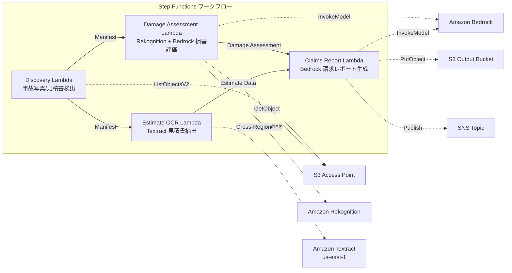

# UC14: 보험 / 손해 평가 — 사고 사진 손해 평가 및 견적서 OCR 및 평가 보고서

🌐 **Language / 言語**: [日本語](README.md) | [English](README.en.md) | 한국어 | [简体中文](README.zh-CN.md) | [繁體中文](README.zh-TW.md) | [Français](README.fr.md) | [Deutsch](README.de.md) | [Español](README.es.md)

## 개요
FSx for NetApp ONTAP의 S3 액세스 포인트를 활용하여 사고 사진의 손해 평가, 견적서의 OCR 텍스트 추출, 보험금 청구 보고서의 자동 생성을 가능하게 하는 서버리스 워크플로입니다.
### 이 패턴이 적합한 경우
- 사고 사진과 견적서가 FSx ONTAP에 저장되어 있습니다.
- Rekognition을 사용하여 사고 사진의 손상 감지(차량 손상 라벨, 심각도 지표, 영향 부위)를 자동화하고 싶습니다.
- Textract를 사용하여 견적서의 OCR(수리 항목, 비용, 작업량, 부품)을 실시하고 싶습니다.
- 사진 기반 손해 평가와 견적서 데이터를 연관시킨 종합 보험 청구 보고서가 필요합니다.
- 손해 라벨이 검출되지 않은 경우의 수동 검토 플래그 관리를 자동화하고 싶습니다.
### 이 패턴이 적합하지 않은 경우
- 실시간 보험금 청구 처리 시스템이 필요함
- 완전한 보험금 평가 엔진(전용 소프트웨어가 적합)
- 대규모 부정 감지 모델의 학습이 필요함
- ONTAP REST API 네트워크 접근성을 보장할 수 없는 환경
### 주요 기능
- S3 AP를 통해 사고 사진(.jpg,.jpeg,.png)과 견적서(.pdf,.tiff)를 자동 감지
- Rekognition을 통한 손상 감지(damage_type, severity_level, affected_components)
- Bedrock을 통한 구조화된 손해 평가 생성
- Textract(크로스 리전)을 통한 견적서 OCR(수리 항목, 비용, 공수, 부품)
- Bedrock을 통한 종합적인 보험금 청구 보고서 생성(JSON + 인간 가독 가능 형식)
- SNS 알림을 통한 결과의 즉시 공유
## 아키텍처



### 워크플로우 단계
1. **Discovery**: S3 AP에서 사고 사진과 견적서를 검색
2. **Damage Assessment**: Rekognition으로 손상 탐지, Bedrock으로 구조화된 손상 평가 생성
3. **Estimate OCR**: Textract(교차 리전)으로 견적서에서 텍스트 및 테이블 추출
4. **Claims Report**: Bedrock으로 손상 평가 및 견적서 데이터를 상호 연관시킨 포괄적 보고서 생성
## 전제 조건
- AWS 계정과 적절한 IAM 권한
- NetApp ONTAP용 FSx 파일 시스템(ONTAP 9.17.1P4D3 이상)
- S3 Access Point가 활성화된 볼륨(사고 사진 및 견적서 저장)
- VPC, 프라이빗 서브넷
- Amazon Bedrock 모델 액세스 활성화(Claude / Nova)
- **크로스 리전**: Textract는 ap-northeast-1을 지원하지 않으므로, us-east-1로의 크로스 리전 호출이 필요
## 배포 절차

### 1. 크로스 리전 파라미터 확인
Textract는 도쿄 리전을 지원하지 않기 때문에 `CrossRegionTarget` 파라미터로 크로스 리전 호출을 설정합니다.
### 2. CloudFormation 배포

```bash
aws cloudformation deploy \
  --template-file insurance-claims/template.yaml \
  --stack-name fsxn-insurance-claims \
  --parameter-overrides \
    S3AccessPointAlias=<your-volume-ext-s3alias> \
    S3AccessPointName=<your-s3ap-name> \
    VpcId=<your-vpc-id> \
    PrivateSubnetIds=<subnet-1>,<subnet-2> \
    ScheduleExpression="rate(1 hour)" \
    NotificationEmail=<your-email@example.com> \
    CrossRegionTarget=us-east-1 \
    EnableVpcEndpoints=false \
    EnableCloudWatchAlarms=false \
  --capabilities CAPABILITY_IAM CAPABILITY_AUTO_EXPAND \
  --region ap-northeast-1
```

## 설정 매개변수 목록

| パラメータ | 説明 | デフォルト | 必須 |
|-----------|------|----------|------|
| `S3AccessPointAlias` | FSx ONTAP S3 AP Alias（入力用） | — | ✅ |
| `S3AccessPointName` | S3 AP 名（ARN ベースの IAM 権限付与用。省略時は Alias ベースのみ） | `""` | ⚠️ 推奨 |
| `ScheduleExpression` | EventBridge Scheduler のスケジュール式 | `rate(1 hour)` | |
| `VpcId` | VPC ID | — | ✅ |
| `PrivateSubnetIds` | プライベートサブネット ID リスト | — | ✅ |
| `NotificationEmail` | SNS 通知先メールアドレス | — | ✅ |
| `CrossRegionTarget` | Textract のターゲットリージョン | `us-east-1` | |
| `MapConcurrency` | Map ステートの並列実行数 | `10` | |
| `LambdaMemorySize` | Lambda メモリサイズ (MB) | `512` | |
| `LambdaTimeout` | Lambda タイムアウト (秒) | `300` | |
| `EnableVpcEndpoints` | Interface VPC Endpoints の有効化 | `false` | |
| `EnableCloudWatchAlarms` | CloudWatch Alarms の有効化 | `false` | |

## 정리

```bash
aws s3 rm s3://fsxn-insurance-claims-output-${AWS_ACCOUNT_ID} --recursive

aws cloudformation delete-stack \
  --stack-name fsxn-insurance-claims \
  --region ap-northeast-1

aws cloudformation wait stack-delete-complete \
  --stack-name fsxn-insurance-claims \
  --region ap-northeast-1
```

## 지원되는 리전
UC14는 다음 서비스를 사용합니다:  
- Amazon Bedrock  
- AWS Step Functions  
- Amazon Athena  
- Amazon S3  
- AWS Lambda  
- Amazon FSx for NetApp ONTAP  
- Amazon CloudWatch  
- AWS CloudFormation
| サービス | リージョン制約 |
|---------|-------------|
| Amazon Rekognition | ほぼ全リージョンで利用可能 |
| Amazon Textract | ap-northeast-1 非対応。`TEXTRACT_REGION` パラメータで対応リージョン（us-east-1 等）を指定 |
| Amazon Bedrock | 対応リージョンを確認（[Bedrock 対応リージョン](https://docs.aws.amazon.com/general/latest/gr/bedrock.html)） |
| AWS X-Ray | ほぼ全リージョンで利用可能 |
| CloudWatch EMF | ほぼ全リージョンで利用可能 |
> Cross-Region Client을 통해 Textract API를 호출합니다. 데이터 거주 요건을 확인하세요. 자세한 내용은 [리전 호환성 매트릭스](../docs/region-compatibility.md)를 참조하세요.
## 참고 링크
- [FSx ONTAP S3 액세스 포인트 개요](https://docs.aws.amazon.com/fsx/latest/ONTAPGuide/accessing-data-via-s3-access-points.html)
- [Amazon Rekognition 라벨 감지](https://docs.aws.amazon.com/rekognition/latest/dg/labels.html)
- [Amazon Textract 문서](https://docs.aws.amazon.com/textract/latest/dg/what-is.html)
- [Amazon Bedrock API 참조](https://docs.aws.amazon.com/bedrock/latest/APIReference/API_runtime_InvokeModel.html)