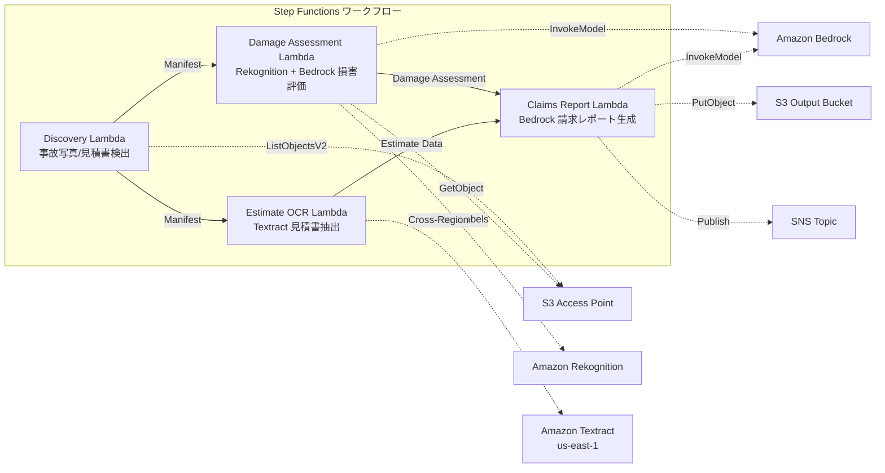

# UC14: 保险 / 损害评估 — 事故照片损害评估与报价单 OCR 与评估报告

🌐 **Language / 言語**: [日本語](README.md) | [English](README.en.md) | [한국어](README.ko.md) | 简体中文 | [繁體中文](README.zh-TW.md) | [Français](README.fr.md) | [Deutsch](README.de.md) | [Español](README.es.md)

## 概述
利用 Amazon FSx for NetApp ONTAP 的 S3 Access Points，实现事故照片损害评估、发票的 OCR 文本提取和自动生成理赔报告的无服务器工作流。
### 适用场景
- 事故写真和见积书存储在 FSx ONTAP 上
- 希望自动化使用 Rekognition 进行事故照片损伤检测（车辆损伤标签、严重程度指标、影响部分）
- 希望使用 Textract 进行见积书 OCR（维修项目、费用、工时、零件）
- 需要基于照片的损伤评估和见积书数据的综合保险索赔报告
- 希望自动化损伤标签未检测到时的手动审查标记管理
### 不适用的情况

当该模式不适用时：

### 适用场景

以下是该模式不适用的情况：

- 当使用 Amazon Bedrock 或 AWS Step Functions 时。
- 在 Amazon Athena 或 Amazon S3 环境中。
- 使用 AWS Lambda 或 Amazon FSx for NetApp ONTAP 时。
- 在 Amazon CloudWatch 或 AWS CloudFormation 中。

### 技术术语

以下是一些在文本中不应翻译的技术术语：

- GDSII
- DRC
- OASIS
- GDS
- Lambda
- tapeout

### 代码、文件路径和URL

以下内容应保持不变：

- 内联代码 (`...`)
- 文件路径
- URL
- 需要一个实时理赔处理系统
- 需要一个完整的理赔评估引擎（专用软件最合适）
- 需要训练大规模欺诈检测模型
- 环境中无法确保对 ONTAP REST API 的网络访问
### 主要功能
- 通过 S3 AP 自动检测事故照片（.jpg,.jpeg,.png）和报价单（.pdf,.tiff）
- 使用 Rekognition 检测损害（损害类型、严重程度、受影响的组件）
- 使用 Bedrock 生成结构化损害评估
- 使用 Textract（跨区域）对报价单进行 OCR（维修项目、费用、工时、零件）
- 使用 Bedrock 生成全面的保险索赔报告（JSON + 人类可读格式）
- 通过 SNS 通知即时共享结果
## 架构



### 工作流程步骤

使用以下 AWS 服务：
- Amazon Bedrock
- AWS Step Functions
- Amazon Athena
- Amazon S3
- AWS Lambda
- Amazon FSx for NetApp ONTAP
- Amazon CloudWatch
- AWS CloudFormation

保持技术术语不翻译（GDSII、DRC、OASIS、GDS、Lambda、tapeout 等）。
保持内联代码 (`...`) 不翻译。
保持文件路径和 URL 不翻译。
1. **发现**：从 S3 AP 中检测事故照片和报价单
2. **损害评估**：使用 Rekognition 进行损害检测，使用 Bedrock 生成结构化损害评估
3. **估算 OCR**：使用 Textract（跨区域）从报价单中提取文本和表格
4. **索赔报告**：使用 Bedrock 生成关联损害评估和报价单数据的全面报告
## 前提条件
- AWS 账户和适当的 IAM 权限
- FSx for NetApp ONTAP 文件系统（ONTAP 9.17.1P4D3 及以上）
- 已启用 S3 Access Point 的卷（存储事故照片和发票）
- VPC、私有子网
- 启用 Amazon Bedrock 模型访问（Claude / Nova）
- **跨区域**：由于 Textract 不支持 ap-northeast-1，因此需要跨区域调用 us-east-1
## 部署步骤

### 1. 确认跨区域参数
Textract 不支持东京地区，因此使用 `CrossRegionTarget` 参数设置跨地区调用。
### 2. CloudFormation 部署

```bash
aws cloudformation deploy \
  --template-file insurance-claims/template.yaml \
  --stack-name fsxn-insurance-claims \
  --parameter-overrides \
    S3AccessPointAlias=<your-volume-ext-s3alias> \
    S3AccessPointName=<your-s3ap-name> \
    VpcId=<your-vpc-id> \
    PrivateSubnetIds=<subnet-1>,<subnet-2> \
    ScheduleExpression="rate(1 hour)" \
    NotificationEmail=<your-email@example.com> \
    CrossRegionTarget=us-east-1 \
    EnableVpcEndpoints=false \
    EnableCloudWatchAlarms=false \
  --capabilities CAPABILITY_IAM CAPABILITY_AUTO_EXPAND \
  --region ap-northeast-1
```

## 配置参数列表

| パラメータ | 説明 | デフォルト | 必須 |
|-----------|------|----------|------|
| `S3AccessPointAlias` | FSx ONTAP S3 AP Alias（入力用） | — | ✅ |
| `S3AccessPointName` | S3 AP 名（ARN ベースの IAM 権限付与用。省略時は Alias ベースのみ） | `""` | ⚠️ 推奨 |
| `ScheduleExpression` | EventBridge Scheduler のスケジュール式 | `rate(1 hour)` | |
| `VpcId` | VPC ID | — | ✅ |
| `PrivateSubnetIds` | プライベートサブネット ID リスト | — | ✅ |
| `NotificationEmail` | SNS 通知先メールアドレス | — | ✅ |
| `CrossRegionTarget` | Textract のターゲットリージョン | `us-east-1` | |
| `MapConcurrency` | Map ステートの並列実行数 | `10` | |
| `LambdaMemorySize` | Lambda メモリサイズ (MB) | `512` | |
| `LambdaTimeout` | Lambda タイムアウト (秒) | `300` | |
| `EnableVpcEndpoints` | Interface VPC Endpoints の有効化 | `false` | |
| `EnableCloudWatchAlarms` | CloudWatch Alarms の有効化 | `false` | |
| `EnableSnapStart` | 启用 Lambda SnapStart（冷启动缩短） | `false` | |

## 清理

```bash
aws s3 rm s3://fsxn-insurance-claims-output-${AWS_ACCOUNT_ID} --recursive

aws cloudformation delete-stack \
  --stack-name fsxn-insurance-claims \
  --region ap-northeast-1

aws cloudformation wait stack-delete-complete \
  --stack-name fsxn-insurance-claims \
  --region ap-northeast-1
```

## 支持的区域
UC14 使用以下服务：
| サービス | リージョン制約 |
|---------|-------------|
| Amazon Rekognition | ほぼ全リージョンで利用可能 |
| Amazon Textract | ap-northeast-1 非対応。`TEXTRACT_REGION` パラメータで対応リージョン（us-east-1 等）を指定 |
| Amazon Bedrock | 対応リージョンを確認（[Bedrock 対応リージョン](https://docs.aws.amazon.com/general/latest/gr/bedrock.html)） |
| AWS X-Ray | ほぼ全リージョンで利用可能 |
| CloudWatch EMF | ほぼ全リージョンで利用可能 |
> 通过跨区域客户端调用 Textract API。请确认数据驻留要求。详情请参阅 [区域兼容性矩阵](../docs/region-compatibility.md)。
## 参考链接
- [FSx for NetApp ONTAP S3 访问点概述](https://docs.aws.amazon.com/fsx/latest/ONTAPGuide/accessing-data-via-s3-access-points.html)
- [Amazon Rekognition 标签检测](https://docs.aws.amazon.com/rekognition/latest/dg/labels.html)
- [Amazon Textract 文档](https://docs.aws.amazon.com/textract/latest/dg/what-is.html)
- [Amazon Bedrock API 参考](https://docs.aws.amazon.com/bedrock/latest/APIReference/API_runtime_InvokeModel.html)