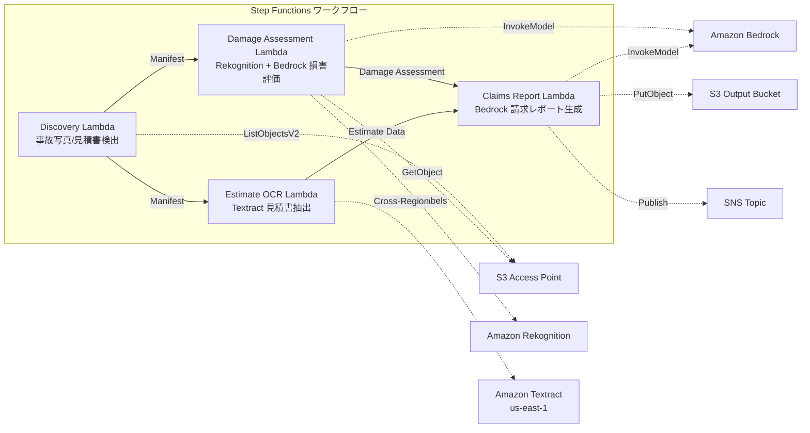

# UC14: 保險 / 損害估價 — 事故照片損害評估・報價單 OCR・估價報告

🌐 **Language / 言語**: [日本語](README.md) | [English](README.en.md) | [한국어](README.ko.md) | [简体中文](README.zh-CN.md) | 繁體中文 | [Français](README.fr.md) | [Deutsch](README.de.md) | [Español](README.es.md)

## 概述
利用 FSx for NetApp ONTAP 的 S3 Access Points，建立一個無伺服器工作流程，實現事故照片的損害評估、報價單的 OCR 文字提取以及保險索賠報告的自動生成。
### 此模式適用的情況
- 事故写真和見積書已儲存在 FSx ONTAP 上
- 希望自動化 Rekognition 對事故照片進行損害檢測（車輛損害標籤、嚴重程度指標、影響範圍）
- 希望使用 Textract 對見積書進行 OCR（維修項目、費用、工時、零件）
- 需要一個全面的保險索賠報告，將照片基礎的損害評估和見積書數據相關聯
- 希望自動化損害標籤未檢測到時的手動審核標記管理
### 此模式不適用的情況
- 需要一個實時理賠處理系統
- 完整的理賠評估引擎（專用軟件適合）
- 需要訓練大規模的欺詐檢測模型
- 環境無法確保對 ONTAP REST API 的網絡訪問
### 主要功能
- 透過 S3 AP 自動檢測事故照片（.jpg,.jpeg,.png）和報價單（.pdf,.tiff）
- 使用 Rekognition 進行損害檢測（損害類型、嚴重程度、受影響的部件）
- 使用 Bedrock 生成結構化損害評估
- 使用 Textract（跨區域）進行報價單 OCR（維修項目、費用、工時、零件）
- 使用 Bedrock 生成全面賠償申請報告（JSON + 人類可讀格式）
- 使用 SNS 通知即時分享結果
## 架構



### 工作流程步驟
1. **發現**：從 S3 AP 中檢測事故照片和報價單
2. **損害評估**：使用 Rekognition 檢測損害，使用 Bedrock 生成結構化損害評估
3. **估算 OCR**：使用 Textract（跨區域）從報價單中提取文本和表格
4. **索賠報告**：使用 Bedrock 生成損害評估和報價單數據相關聯的綜合報告
## 先決條件
- AWS 帳戶及適當的 IAM 權限
- FSx for NetApp ONTAP 文件系統（ONTAP 9.17.1P4D3 或更高版本）
- 已啟用 S3 Access Point 的卷（用於存儲事故照片和報價單）
- VPC、私有子網
- 已啟用 Amazon Bedrock 模型訪問（Claude / Nova）
- **跨區域**: 由於 Textract 不支援 ap-northeast-1，需要向 us-east-1 進行跨區域調用
## 部署步驟

### 1. 確認跨區域參數
Textract 不支援東京區域，因此請使用 `CrossRegionTarget` 參數設定跨區域呼叫。
### 2. CloudFormation 部署

```bash
aws cloudformation deploy \
  --template-file insurance-claims/template.yaml \
  --stack-name fsxn-insurance-claims \
  --parameter-overrides \
    S3AccessPointAlias=<your-volume-ext-s3alias> \
    S3AccessPointName=<your-s3ap-name> \
    VpcId=<your-vpc-id> \
    PrivateSubnetIds=<subnet-1>,<subnet-2> \
    ScheduleExpression="rate(1 hour)" \
    NotificationEmail=<your-email@example.com> \
    CrossRegionTarget=us-east-1 \
    EnableVpcEndpoints=false \
    EnableCloudWatchAlarms=false \
  --capabilities CAPABILITY_IAM CAPABILITY_AUTO_EXPAND \
  --region ap-northeast-1
```

## 設定參數列表

| パラメータ | 説明 | デフォルト | 必須 |
|-----------|------|----------|------|
| `S3AccessPointAlias` | FSx ONTAP S3 AP Alias（入力用） | — | ✅ |
| `S3AccessPointName` | S3 AP 名（ARN ベースの IAM 権限付与用。省略時は Alias ベースのみ） | `""` | ⚠️ 推奨 |
| `ScheduleExpression` | EventBridge Scheduler のスケジュール式 | `rate(1 hour)` | |
| `VpcId` | VPC ID | — | ✅ |
| `PrivateSubnetIds` | プライベートサブネット ID リスト | — | ✅ |
| `NotificationEmail` | SNS 通知先メールアドレス | — | ✅ |
| `CrossRegionTarget` | Textract のターゲットリージョン | `us-east-1` | |
| `MapConcurrency` | Map ステートの並列実行数 | `10` | |
| `LambdaMemorySize` | Lambda メモリサイズ (MB) | `512` | |
| `LambdaTimeout` | Lambda タイムアウト (秒) | `300` | |
| `EnableVpcEndpoints` | Interface VPC Endpoints の有効化 | `false` | |
| `EnableCloudWatchAlarms` | CloudWatch Alarms の有効化 | `false` | |

## 清理

```bash
aws s3 rm s3://fsxn-insurance-claims-output-${AWS_ACCOUNT_ID} --recursive

aws cloudformation delete-stack \
  --stack-name fsxn-insurance-claims \
  --region ap-northeast-1

aws cloudformation wait stack-delete-complete \
  --stack-name fsxn-insurance-claims \
  --region ap-northeast-1
```

## 支援的區域
UC14 使用以下服務：
| サービス | リージョン制約 |
|---------|-------------|
| Amazon Rekognition | ほぼ全リージョンで利用可能 |
| Amazon Textract | ap-northeast-1 非対応。`TEXTRACT_REGION` パラメータで対応リージョン（us-east-1 等）を指定 |
| Amazon Bedrock | 対応リージョンを確認（[Bedrock 対応リージョン](https://docs.aws.amazon.com/general/latest/gr/bedrock.html)） |
| AWS X-Ray | ほぼ全リージョンで利用可能 |
| CloudWatch EMF | ほぼ全リージョンで利用可能 |
> 透過 Cross-Region Client 呼叫 Textract API。請確認資料常駐要求。詳細請參閱 [區域相容性矩陣](../docs/region-compatibility.md)。
## 參考連結
- [FSx for NetApp ONTAP S3 存取點概觀](https://docs.aws.amazon.com/fsx/latest/ONTAPGuide/accessing-data-via-s3-access-points.html)
- [Amazon Rekognition 標籤偵測](https://docs.aws.amazon.com/rekognition/latest/dg/labels.html)
- [Amazon Textract 文件](https://docs.aws.amazon.com/textract/latest/dg/what-is.html)
- [Amazon Bedrock API 參考](https://docs.aws.amazon.com/bedrock/latest/APIReference/API_runtime_InvokeModel.html)