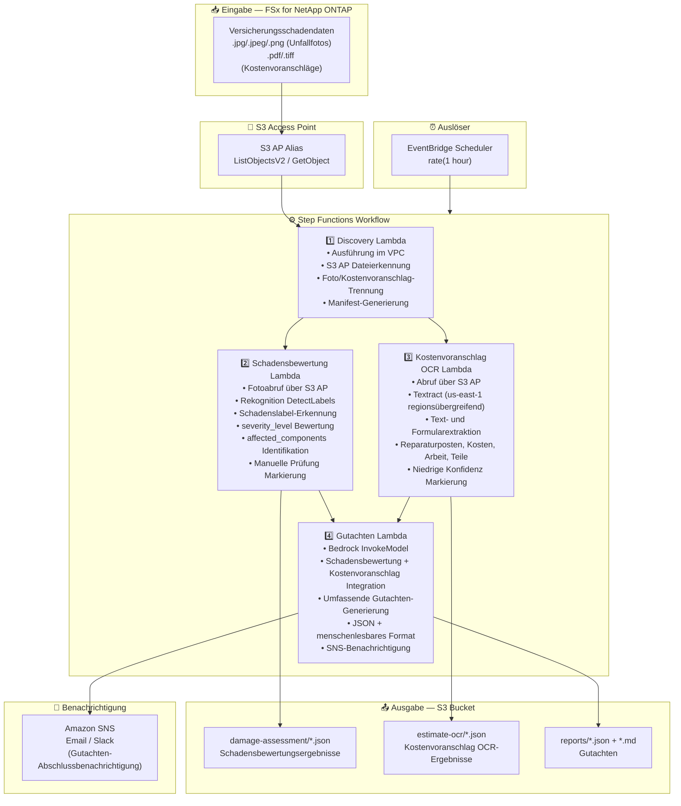

# UC14: Versicherung/Schadenregulierung — Unfallbild-Schadensbewertung, Kostenvoranschlag-OCR und Gutachten

🌐 **Language / 言語**: [日本語](architecture.md) | [English](architecture.en.md) | [한국어](architecture.ko.md) | [简体中文](architecture.zh-CN.md) | [繁體中文](architecture.zh-TW.md) | [Français](architecture.fr.md) | Deutsch | [Español](architecture.es.md)

## End-to-End-Architektur (Eingabe → Ausgabe)

---

## Architekturdiagramm

---

## Datenfluss im Detail

### Eingabe
| Element | Beschreibung |
|---------|--------------|
| **Quelle** | FSx for NetApp ONTAP Volume |
| **Dateitypen** | .jpg/.jpeg/.png (Unfallfotos), .pdf/.tiff (Kostenvoranschläge) |
| **Zugriffsmethode** | S3 Access Point (ListObjectsV2 + GetObject) |
| **Lesestrategie** | Vollständiger Bild-/PDF-Abruf (erforderlich für Rekognition / Textract) |

### Verarbeitung
| Schritt | Service | Funktion |
|---------|---------|----------|
| Erkennung | Lambda (VPC) | Erkennung von Unfallfotos und Kostenvoranschlägen über S3 AP, Manifest-Generierung nach Typ |
| Schadensbewertung | Lambda + Rekognition | DetectLabels zur Schadenslabel-Erkennung, Schweregradbewertung, Identifikation betroffener Komponenten |
| Kostenvoranschlag OCR | Lambda + Textract | Text- und Formularextraktion aus Kostenvoranschlägen (Reparaturposten, Kosten, Arbeit, Teile) |
| Gutachten | Lambda + Bedrock | Integration von Schadensbewertung + Kostenvoranschlagsdaten für umfassendes Gutachten |

### Ausgabe
| Artefakt | Format | Beschreibung |
|----------|--------|--------------|
| Schadensbewertung | `damage-assessment/YYYY/MM/DD/{claim}_damage.json` | Schadensbewertungsergebnisse (damage_type, severity_level, affected_components) |
| Kostenvoranschlag OCR | `estimate-ocr/YYYY/MM/DD/{claim}_estimate.json` | Kostenvoranschlag OCR-Ergebnisse (Reparaturposten, Kosten, Arbeit, Teile) |
| Gutachten (JSON) | `reports/YYYY/MM/DD/{claim}_report.json` | Strukturiertes Gutachten |
| Gutachten (MD) | `reports/YYYY/MM/DD/{claim}_report.md` | Menschenlesbares Gutachten |
| SNS-Benachrichtigung | Email | Gutachten-Abschlussbenachrichtigung |

---

## Wichtige Designentscheidungen

1. **Parallelverarbeitung (Schadensbewertung + Kostenvoranschlag OCR)** — Unfallbild-Schadensbewertung und Kostenvoranschlag-OCR sind unabhängig; über Step Functions Parallel State parallelisiert für verbesserten Durchsatz
2. **Rekognition gestufte Schadensbewertung** — Markierung zur manuellen Prüfung wenn keine Schadenslabels erkannt werden, fördert menschliche Verifizierung
3. **Textract regionsübergreifend** — Textract nur in us-east-1 verfügbar; regionsübergreifender Aufruf verwendet
4. **Bedrock integriertes Gutachten** — Korreliert Schadensbewertungs- und Kostenvoranschlagsdaten zur Generierung eines umfassenden Gutachtens in JSON + menschenlesbarem Format
5. **Niedrige-Konfidenz-Markierung** — Markierung zur manuellen Prüfung wenn Rekognition / Textract Konfidenzwerte unter dem Schwellenwert liegen
6. **Polling (nicht ereignisgesteuert)** — S3 AP unterstützt keine Ereignisbenachrichtigungen, daher wird periodische geplante Ausführung verwendet

---

## Verwendete AWS-Services

| Service | Rolle |
|---------|-------|
| FSx for NetApp ONTAP | Speicherung von Unfallfotos und Kostenvoranschlägen |
| S3 Access Points | Serverloser Zugriff auf ONTAP-Volumes |
| EventBridge Scheduler | Periodischer Auslöser |
| Step Functions | Workflow-Orchestrierung (Unterstützung paralleler Pfade) |
| Lambda | Compute (Erkennung, Schadensbewertung, Kostenvoranschlag OCR, Gutachten) |
| Amazon Rekognition | Unfallbild-Schadenserkennung (DetectLabels) |
| Amazon Textract | Kostenvoranschlag OCR Text- und Formularextraktion (us-east-1 regionsübergreifend) |
| Amazon Bedrock | Gutachten-Generierung (Claude / Nova) |
| SNS | Gutachten-Abschlussbenachrichtigung |
| Secrets Manager | ONTAP REST API Anmeldedatenverwaltung |
| CloudWatch + X-Ray | Observability |
