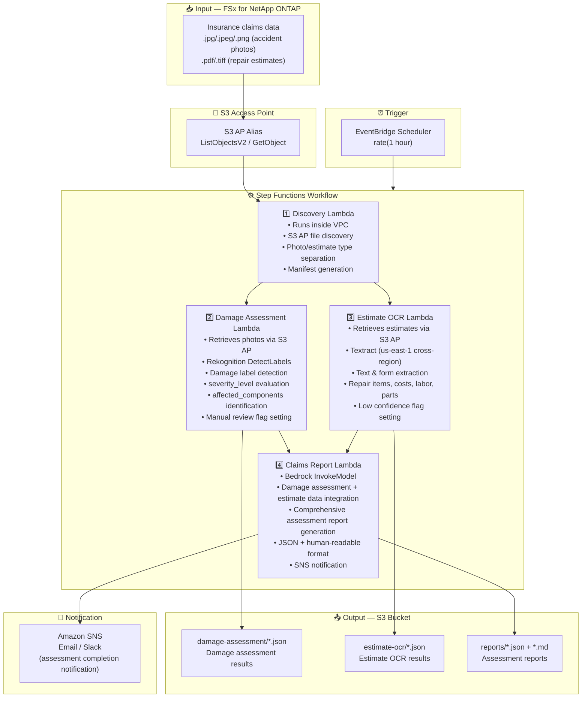

# UC14: Insurance / Claims — Accident Photo Damage Assessment, Estimate OCR & Assessment Report

🌐 **Language / 言語**: [日本語](architecture.md) | English | [한국어](architecture.ko.md) | [简体中文](architecture.zh-CN.md) | [繁體中文](architecture.zh-TW.md) | [Français](architecture.fr.md) | [Deutsch](architecture.de.md) | [Español](architecture.es.md)

## End-to-End Architecture (Input → Output)

---

## High-Level Flow

```
┌─────────────────────────────────────────────────────────────────────────────┐
│                         FSx for NetApp ONTAP                                 │
│                                                                              │
│  /vol/claims_data/                                                           │
│  ├── photos/claim_001/front_damage.jpg     (Accident photo — front damage)   │
│  ├── photos/claim_001/side_damage.png      (Accident photo — side damage)    │
│  ├── photos/claim_002/rear_damage.jpeg     (Accident photo — rear damage)    │
│  ├── estimates/claim_001/repair_est.pdf    (Repair estimate PDF)             │
│  └── estimates/claim_002/repair_est.tiff   (Repair estimate TIFF)            │
│                                                                              │
└──────────────────────────────────┬───────────────────────────────────────────┘
                                   │
                                   ▼
┌──────────────────────────────────────────────────────────────────────────────┐
│                      S3 Access Point (Data Path)                              │
│                                                                              │
│  Alias: fsxn-claims-vol-ext-s3alias                                          │
│  • ListObjectsV2 (accident photo & estimate discovery)                       │
│  • GetObject (image & PDF retrieval)                                         │
│  • No NFS/SMB mount required from Lambda                                     │
│                                                                              │
└──────────────────────────────────┬───────────────────────────────────────────┘
                                   │
                                   ▼
┌──────────────────────────────────────────────────────────────────────────────┐
│                    EventBridge Scheduler (Trigger)                            │
│                                                                              │
│  Schedule: rate(1 hour) — configurable                                       │
│  Target: Step Functions State Machine                                        │
│                                                                              │
└──────────────────────────────────┬───────────────────────────────────────────┘
                                   │
                                   ▼
┌──────────────────────────────────────────────────────────────────────────────┐
│                    AWS Step Functions (Orchestration)                         │
│                                                                              │
│  ┌─────────────┐    ┌──────────────────────┐                                │
│  │  Discovery   │───▶│  Damage Assessment   │──┐                             │
│  │  Lambda      │    │  Lambda              │  │                             │
│  │             │    │                      │  │                             │
│  │  • VPC内     │    │  • Rekognition       │  │                             │
│  │  • S3 AP List│    │  • Damage label      │  │                             │
│  │  • Photo/PDF │    │    detection         │  │                             │
│  └──────┬──────┘    └──────────────────────┘  │                             │
│         │                                      │                             │
│         │            ┌──────────────────────┐  │    ┌────────────────────┐   │
│         └───────────▶│  Estimate OCR        │──┼───▶│  Claims Report     │   │
│                      │  Lambda              │  │    │  Lambda            │   │
│                      │                      │  │    │                   │   │
│                      │  • Textract          │──┘    │  • Bedrock         │   │
│                      │  • Estimate text     │       │  • Assessment      │   │
│                      │    extraction        │       │    report          │   │
│                      │  • Form analysis     │       │  • SNS notification│   │
│                      └──────────────────────┘       └────────────────────┘   │
│                                                                              │
└──────────────────────────────────────────────────────────────────────────────┘
                                   │
                                   ▼
┌──────────────────────────────────────────────────────────────────────────────┐
│                         Output (S3 Bucket)                                    │
│                                                                              │
│  s3://{stack}-output-{account}/                                              │
│  ├── damage-assessment/YYYY/MM/DD/                                           │
│  │   ├── claim_001_damage.json             ← Damage assessment results      │
│  │   └── claim_002_damage.json                                               │
│  ├── estimate-ocr/YYYY/MM/DD/                                                │
│  │   ├── claim_001_estimate.json           ← Estimate OCR results           │
│  │   └── claim_002_estimate.json                                             │
│  └── reports/YYYY/MM/DD/                                                     │
│      ├── claim_001_report.json             ← Assessment report (JSON)       │
│      └── claim_001_report.md               ← Assessment report (readable)   │
│                                                                              │
└──────────────────────────────────────────────────────────────────────────────┘
```

---

## Mermaid Diagram



---

## Data Flow Detail

### Input
| Item | Description |
|------|-------------|
| **Source** | FSx for NetApp ONTAP volume |
| **File Types** | .jpg/.jpeg/.png (accident photos), .pdf/.tiff (repair estimates) |
| **Access Method** | S3 Access Point (ListObjectsV2 + GetObject) |
| **Read Strategy** | Full image/PDF retrieval (required for Rekognition / Textract) |

### Processing
| Step | Service | Function |
|------|---------|----------|
| Discovery | Lambda (VPC) | Discover accident photos & estimates via S3 AP, generate manifest by type |
| Damage Assessment | Lambda + Rekognition | DetectLabels for damage label detection, severity evaluation, affected component identification |
| Estimate OCR | Lambda + Textract | Estimate text & form extraction (repair items, costs, labor, parts) |
| Claims Report | Lambda + Bedrock | Integrate damage assessment + estimate data for comprehensive assessment report |

### Output
| Artifact | Format | Description |
|----------|--------|-------------|
| Damage Assessment | `damage-assessment/YYYY/MM/DD/{claim}_damage.json` | Damage assessment results (damage_type, severity_level, affected_components) |
| Estimate OCR | `estimate-ocr/YYYY/MM/DD/{claim}_estimate.json` | Estimate OCR results (repair items, costs, labor, parts) |
| Claims Report (JSON) | `reports/YYYY/MM/DD/{claim}_report.json` | Structured assessment report |
| Claims Report (MD) | `reports/YYYY/MM/DD/{claim}_report.md` | Human-readable assessment report |
| SNS Notification | Email | Assessment completion notification |

---

## Key Design Decisions

1. **Parallel processing (Damage Assessment + Estimate OCR)** — Accident photo damage assessment and estimate OCR are independent; parallelized via Step Functions Parallel State for improved throughput
2. **Rekognition tiered damage assessment** — Manual review flag set when no damage labels detected, promoting human verification
3. **Textract cross-region** — Textract available only in us-east-1; cross-region invocation used
4. **Bedrock integrated report** — Correlates damage assessment and estimate data to generate comprehensive claims report in JSON + human-readable format
5. **Low confidence flag management** — Manual review flag set when Rekognition / Textract confidence scores fall below threshold
6. **Polling (not event-driven)** — S3 AP does not support event notifications, so periodic scheduled execution is used

---

## AWS Services Used

| Service | Role |
|---------|------|
| FSx for NetApp ONTAP | Accident photo & estimate storage |
| S3 Access Points | Serverless access to ONTAP volumes |
| EventBridge Scheduler | Periodic trigger |
| Step Functions | Workflow orchestration (parallel path support) |
| Lambda | Compute (Discovery, Damage Assessment, Estimate OCR, Claims Report) |
| Amazon Rekognition | Accident photo damage detection (DetectLabels) |
| Amazon Textract | Estimate OCR text & form extraction (us-east-1 cross-region) |
| Amazon Bedrock | Assessment report generation (Claude / Nova) |
| SNS | Assessment completion notification |
| Secrets Manager | ONTAP REST API credential management |
| CloudWatch + X-Ray | Observability |
