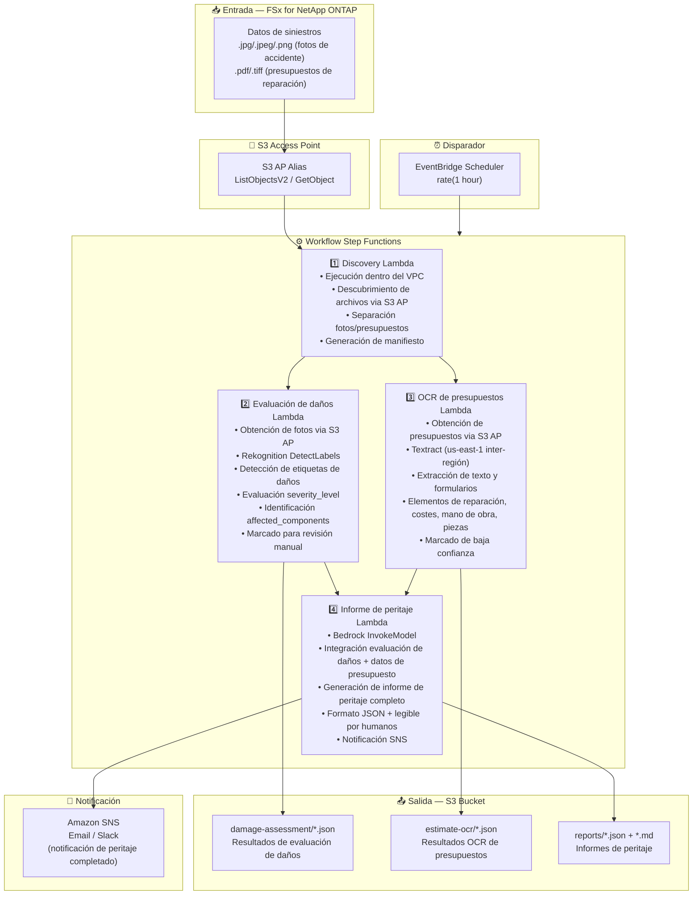

# UC14: Seguros/Siniestros — Evaluación de daños por fotos, OCR de presupuestos e informe de peritaje

🌐 **Language / 言語**: [日本語](architecture.md) | [English](architecture.en.md) | [한국어](architecture.ko.md) | [简体中文](architecture.zh-CN.md) | [繁體中文](architecture.zh-TW.md) | [Français](architecture.fr.md) | [Deutsch](architecture.de.md) | Español

## Arquitectura de extremo a extremo (Entrada → Salida)

---

## Flujo de alto nivel

```
┌─────────────────────────────────────────────────────────────────────────────┐
│                         FSx for NetApp ONTAP                                 │
│                                                                              │
│  /vol/claims_data/                                                           │
│  ├── photos/claim_001/front_damage.jpg     (Accident photo — front damage)   │
│  ├── photos/claim_001/side_damage.png      (Accident photo — side damage)    │
│  ├── photos/claim_002/rear_damage.jpeg     (Accident photo — rear damage)    │
│  ├── estimates/claim_001/repair_est.pdf    (Repair estimate PDF)             │
│  └── estimates/claim_002/repair_est.tiff   (Repair estimate TIFF)            │
│                                                                              │
└──────────────────────────────────┬───────────────────────────────────────────┘
                                   │
                                   ▼
┌──────────────────────────────────────────────────────────────────────────────┐
│                      S3 Access Point (Data Path)                              │
│                                                                              │
│  Alias: fsxn-claims-vol-ext-s3alias                                          │
│  • ListObjectsV2 (accident photo & estimate discovery)                       │
│  • GetObject (image & PDF retrieval)                                         │
│  • No NFS/SMB mount required from Lambda                                     │
│                                                                              │
└──────────────────────────────────┬───────────────────────────────────────────┘
                                   │
                                   ▼
┌──────────────────────────────────────────────────────────────────────────────┐
│                    EventBridge Scheduler (Trigger)                            │
│                                                                              │
│  Schedule: rate(1 hour) — configurable                                       │
│  Target: Step Functions State Machine                                        │
│                                                                              │
└──────────────────────────────────┬───────────────────────────────────────────┘
                                   │
                                   ▼
┌──────────────────────────────────────────────────────────────────────────────┐
│                    AWS Step Functions (Orchestration)                         │
│                                                                              │
│  ┌─────────────┐    ┌──────────────────────┐                                │
│  │  Discovery   │───▶│  Damage Assessment   │──┐                             │
│  │  Lambda      │    │  Lambda              │  │                             │
│  │             │    │                      │  │                             │
│  │  • VPC内     │    │  • Rekognition       │  │                             │
│  │  • S3 AP List│    │  • Damage label      │  │                             │
│  │  • Photo/PDF │    │    detection         │  │                             │
│  └──────┬──────┘    └──────────────────────┘  │                             │
│         │                                      │                             │
│         │            ┌──────────────────────┐  │    ┌────────────────────┐   │
│         └───────────▶│  Estimate OCR        │──┼───▶│  Claims Report     │   │
│                      │  Lambda              │  │    │  Lambda            │   │
│                      │                      │  │    │                   │   │
│                      │  • Textract          │──┘    │  • Bedrock         │   │
│                      │  • Estimate text     │       │  • Assessment      │   │
│                      │    extraction        │       │    report          │   │
│                      │  • Form analysis     │       │  • SNS notification│   │
│                      └──────────────────────┘       └────────────────────┘   │
│                                                                              │
└──────────────────────────────────────────────────────────────────────────────┘
                                   │
                                   ▼
┌──────────────────────────────────────────────────────────────────────────────┐
│                         Output (S3 Bucket)                                    │
│                                                                              │
│  s3://{stack}-output-{account}/                                              │
│  ├── damage-assessment/YYYY/MM/DD/                                           │
│  │   ├── claim_001_damage.json             ← Damage assessment results      │
│  │   └── claim_002_damage.json                                               │
│  ├── estimate-ocr/YYYY/MM/DD/                                                │
│  │   ├── claim_001_estimate.json           ← Estimate OCR results           │
│  │   └── claim_002_estimate.json                                             │
│  └── reports/YYYY/MM/DD/                                                     │
│      ├── claim_001_report.json             ← Assessment report (JSON)       │
│      └── claim_001_report.md               ← Assessment report (readable)   │
│                                                                              │
└──────────────────────────────────────────────────────────────────────────────┘
```

---

## Diagrama Mermaid



---

## Detalle del flujo de datos

### Entrada
| Elemento | Descripción |
|----------|-------------|
| **Origen** | Volumen FSx for NetApp ONTAP |
| **Tipos de archivo** | .jpg/.jpeg/.png (fotos de accidente), .pdf/.tiff (presupuestos de reparación) |
| **Método de acceso** | S3 Access Point (ListObjectsV2 + GetObject) |
| **Estrategia de lectura** | Obtención completa de imagen/PDF (requerido para Rekognition / Textract) |

### Procesamiento
| Paso | Servicio | Función |
|------|----------|---------|
| Descubrimiento | Lambda (VPC) | Descubrimiento de fotos de accidente y presupuestos via S3 AP, generación de manifiesto por tipo |
| Evaluación de daños | Lambda + Rekognition | DetectLabels para detección de etiquetas de daños, evaluación de gravedad, identificación de componentes afectados |
| OCR de presupuestos | Lambda + Textract | Extracción de texto y formularios de presupuestos (elementos de reparación, costes, mano de obra, piezas) |
| Informe de peritaje | Lambda + Bedrock | Integración de evaluación de daños + datos de presupuesto para informe de peritaje completo |

### Salida
| Artefacto | Formato | Descripción |
|-----------|---------|-------------|
| Evaluación de daños | `damage-assessment/YYYY/MM/DD/{claim}_damage.json` | Resultados de evaluación de daños (damage_type, severity_level, affected_components) |
| OCR de presupuestos | `estimate-ocr/YYYY/MM/DD/{claim}_estimate.json` | Resultados OCR de presupuestos (elementos de reparación, costes, mano de obra, piezas) |
| Informe de peritaje (JSON) | `reports/YYYY/MM/DD/{claim}_report.json` | Informe de peritaje estructurado |
| Informe de peritaje (MD) | `reports/YYYY/MM/DD/{claim}_report.md` | Informe de peritaje legible por humanos |
| Notificación SNS | Email | Notificación de peritaje completado |

---

## Decisiones de diseño clave

1. **Procesamiento paralelo (Evaluación de daños + OCR de presupuestos)** — La evaluación de daños en fotos de accidente y el OCR de presupuestos son independientes; paralelizados mediante Step Functions Parallel State para mejorar el rendimiento
2. **Evaluación de daños por niveles con Rekognition** — Marcado para revisión manual cuando no se detectan etiquetas de daños, promoviendo la verificación humana
3. **Textract inter-región** — Textract disponible solo en us-east-1; se utiliza invocación inter-región
4. **Informe integrado con Bedrock** — Correlaciona datos de evaluación de daños y presupuestos para generar un informe de peritaje completo en formato JSON + legible por humanos
5. **Gestión de marcado de baja confianza** — Marcado para revisión manual cuando las puntuaciones de confianza de Rekognition / Textract están por debajo del umbral
6. **Sondeo periódico (no basado en eventos)** — S3 AP no admite notificaciones de eventos, por lo que se utiliza ejecución programada periódica

---

## Servicios AWS utilizados

| Servicio | Rol |
|----------|-----|
| FSx for NetApp ONTAP | Almacenamiento de fotos de accidente y presupuestos |
| S3 Access Points | Acceso serverless a volúmenes ONTAP |
| EventBridge Scheduler | Disparador periódico |
| Step Functions | Orquestación del workflow (soporte de rutas paralelas) |
| Lambda | Cómputo (Descubrimiento, Evaluación de daños, OCR de presupuestos, Informe de peritaje) |
| Amazon Rekognition | Detección de daños en fotos de accidente (DetectLabels) |
| Amazon Textract | Extracción OCR de texto y formularios de presupuestos (us-east-1 inter-región) |
| Amazon Bedrock | Generación de informe de peritaje (Claude / Nova) |
| SNS | Notificación de peritaje completado |
| Secrets Manager | Gestión de credenciales ONTAP REST API |
| CloudWatch + X-Ray | Observabilidad |
