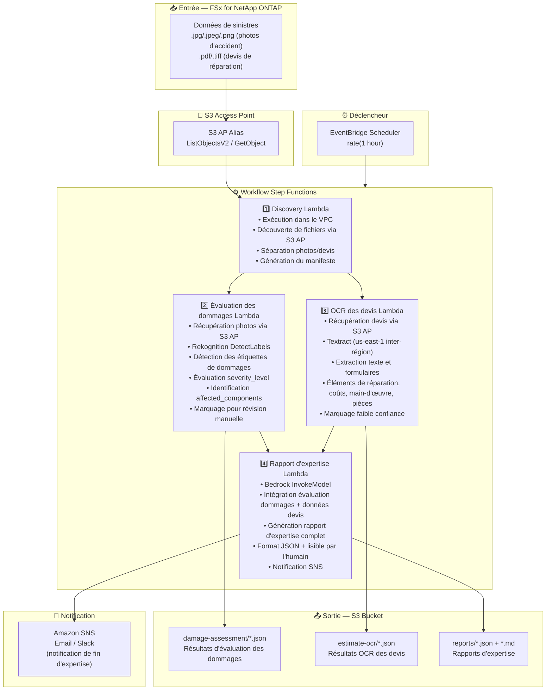

# UC14: Assurance/Sinistres — Évaluation des dommages, OCR de devis et rapport d'expertise

🌐 **Language / 言語**: [日本語](architecture.md) | [English](architecture.en.md) | [한국어](architecture.ko.md) | [简体中文](architecture.zh-CN.md) | [繁體中文](architecture.zh-TW.md) | Français | [Deutsch](architecture.de.md) | [Español](architecture.es.md)

## Architecture de bout en bout (Entrée → Sortie)

---

## Diagramme d'architecture

---

## Détail du flux de données

### Entrée
| Élément | Description |
|---------|-------------|
| **Source** | Volume FSx for NetApp ONTAP |
| **Types de fichiers** | .jpg/.jpeg/.png (photos d'accident), .pdf/.tiff (devis de réparation) |
| **Méthode d'accès** | S3 Access Point (ListObjectsV2 + GetObject) |
| **Stratégie de lecture** | Récupération complète image/PDF (requis pour Rekognition / Textract) |

### Traitement
| Étape | Service | Fonction |
|-------|---------|----------|
| Découverte | Lambda (VPC) | Découverte des photos d'accident et devis via S3 AP, génération du manifeste par type |
| Évaluation des dommages | Lambda + Rekognition | DetectLabels pour la détection des étiquettes de dommages, évaluation de la gravité, identification des composants affectés |
| OCR des devis | Lambda + Textract | Extraction texte et formulaires des devis (éléments de réparation, coûts, main-d'œuvre, pièces) |
| Rapport d'expertise | Lambda + Bedrock | Intégration évaluation des dommages + données de devis pour un rapport d'expertise complet |

### Sortie
| Artefact | Format | Description |
|----------|--------|-------------|
| Évaluation des dommages | `damage-assessment/YYYY/MM/DD/{claim}_damage.json` | Résultats d'évaluation des dommages (damage_type, severity_level, affected_components) |
| OCR des devis | `estimate-ocr/YYYY/MM/DD/{claim}_estimate.json` | Résultats OCR des devis (éléments de réparation, coûts, main-d'œuvre, pièces) |
| Rapport d'expertise (JSON) | `reports/YYYY/MM/DD/{claim}_report.json` | Rapport d'expertise structuré |
| Rapport d'expertise (MD) | `reports/YYYY/MM/DD/{claim}_report.md` | Rapport d'expertise lisible par l'humain |
| Notification SNS | Email | Notification de fin d'expertise |

---

## Décisions de conception clés

1. **Traitement parallèle (Évaluation des dommages + OCR des devis)** — L'évaluation des dommages sur photos et l'OCR des devis sont indépendants ; parallélisés via Step Functions Parallel State pour améliorer le débit
2. **Évaluation des dommages par niveaux Rekognition** — Marquage pour révision manuelle lorsqu'aucune étiquette de dommage n'est détectée, favorisant la vérification humaine
3. **Textract inter-région** — Textract disponible uniquement dans us-east-1 ; invocation inter-région utilisée
4. **Rapport intégré Bedrock** — Corrèle les données d'évaluation des dommages et de devis pour générer un rapport d'expertise complet en format JSON + lisible par l'humain
5. **Gestion des marquages de faible confiance** — Marquage pour révision manuelle lorsque les scores de confiance Rekognition / Textract sont inférieurs au seuil
6. **Interrogation périodique (non événementiel)** — S3 AP ne prend pas en charge les notifications d'événements, une exécution planifiée périodique est donc utilisée

---

## Services AWS utilisés

| Service | Rôle |
|---------|------|
| FSx for NetApp ONTAP | Stockage des photos d'accident et devis |
| S3 Access Points | Accès serverless aux volumes ONTAP |
| EventBridge Scheduler | Déclencheur périodique |
| Step Functions | Orchestration du workflow (support des chemins parallèles) |
| Lambda | Calcul (Découverte, Évaluation des dommages, OCR des devis, Rapport d'expertise) |
| Amazon Rekognition | Détection des dommages sur photos d'accident (DetectLabels) |
| Amazon Textract | Extraction OCR texte et formulaires des devis (us-east-1 inter-région) |
| Amazon Bedrock | Génération du rapport d'expertise (Claude / Nova) |
| SNS | Notification de fin d'expertise |
| Secrets Manager | Gestion des identifiants ONTAP REST API |
| CloudWatch + X-Ray | Observabilité |
