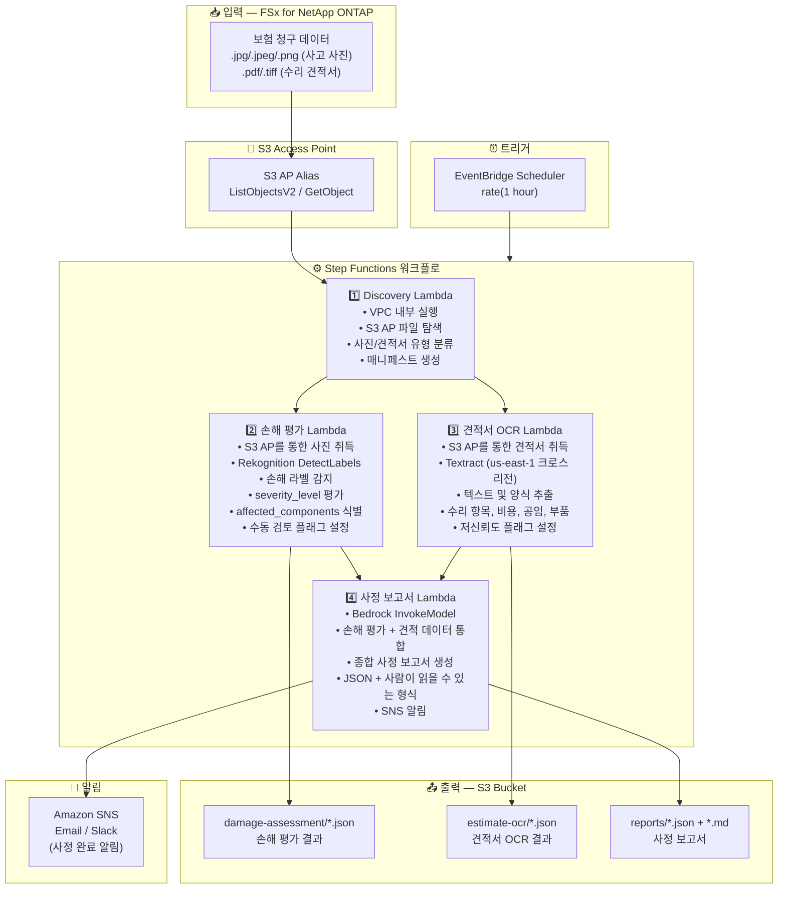

# UC14: 보험/손해 사정 — 사고 사진 손해 평가, 견적서 OCR 및 사정 보고서

🌐 **Language / 言語**: [日本語](architecture.md) | [English](architecture.en.md) | 한국어 | [简体中文](architecture.zh-CN.md) | [繁體中文](architecture.zh-TW.md) | [Français](architecture.fr.md) | [Deutsch](architecture.de.md) | [Español](architecture.es.md)

## 엔드투엔드 아키텍처 (입력 → 출력)

---

## 상위 수준 흐름

```
┌─────────────────────────────────────────────────────────────────────────────┐
│                         FSx for NetApp ONTAP                                 │
│                                                                              │
│  /vol/claims_data/                                                           │
│  ├── photos/claim_001/front_damage.jpg     (Accident photo — front damage)   │
│  ├── photos/claim_001/side_damage.png      (Accident photo — side damage)    │
│  ├── photos/claim_002/rear_damage.jpeg     (Accident photo — rear damage)    │
│  ├── estimates/claim_001/repair_est.pdf    (Repair estimate PDF)             │
│  └── estimates/claim_002/repair_est.tiff   (Repair estimate TIFF)            │
│                                                                              │
└──────────────────────────────────┬───────────────────────────────────────────┘
                                   │
                                   ▼
┌──────────────────────────────────────────────────────────────────────────────┐
│                      S3 Access Point (Data Path)                              │
│                                                                              │
│  Alias: fsxn-claims-vol-ext-s3alias                                          │
│  • ListObjectsV2 (accident photo & estimate discovery)                       │
│  • GetObject (image & PDF retrieval)                                         │
│  • No NFS/SMB mount required from Lambda                                     │
│                                                                              │
└──────────────────────────────────┬───────────────────────────────────────────┘
                                   │
                                   ▼
┌──────────────────────────────────────────────────────────────────────────────┐
│                    EventBridge Scheduler (Trigger)                            │
│                                                                              │
│  Schedule: rate(1 hour) — configurable                                       │
│  Target: Step Functions State Machine                                        │
│                                                                              │
└──────────────────────────────────┬───────────────────────────────────────────┘
                                   │
                                   ▼
┌──────────────────────────────────────────────────────────────────────────────┐
│                    AWS Step Functions (Orchestration)                         │
│                                                                              │
│  ┌─────────────┐    ┌──────────────────────┐                                │
│  │  Discovery   │───▶│  Damage Assessment   │──┐                             │
│  │  Lambda      │    │  Lambda              │  │                             │
│  │             │    │                      │  │                             │
│  │  • VPC内     │    │  • Rekognition       │  │                             │
│  │  • S3 AP List│    │  • Damage label      │  │                             │
│  │  • Photo/PDF │    │    detection         │  │                             │
│  └──────┬──────┘    └──────────────────────┘  │                             │
│         │                                      │                             │
│         │            ┌──────────────────────┐  │    ┌────────────────────┐   │
│         └───────────▶│  Estimate OCR        │──┼───▶│  Claims Report     │   │
│                      │  Lambda              │  │    │  Lambda            │   │
│                      │                      │  │    │                   │   │
│                      │  • Textract          │──┘    │  • Bedrock         │   │
│                      │  • Estimate text     │       │  • Assessment      │   │
│                      │    extraction        │       │    report          │   │
│                      │  • Form analysis     │       │  • SNS notification│   │
│                      └──────────────────────┘       └────────────────────┘   │
│                                                                              │
└──────────────────────────────────────────────────────────────────────────────┘
                                   │
                                   ▼
┌──────────────────────────────────────────────────────────────────────────────┐
│                         Output (S3 Bucket)                                    │
│                                                                              │
│  s3://{stack}-output-{account}/                                              │
│  ├── damage-assessment/YYYY/MM/DD/                                           │
│  │   ├── claim_001_damage.json             ← Damage assessment results      │
│  │   └── claim_002_damage.json                                               │
│  ├── estimate-ocr/YYYY/MM/DD/                                                │
│  │   ├── claim_001_estimate.json           ← Estimate OCR results           │
│  │   └── claim_002_estimate.json                                             │
│  └── reports/YYYY/MM/DD/                                                     │
│      ├── claim_001_report.json             ← Assessment report (JSON)       │
│      └── claim_001_report.md               ← Assessment report (readable)   │
│                                                                              │
└──────────────────────────────────────────────────────────────────────────────┘
```

---

## Mermaid 다이어그램



---

## 데이터 흐름 상세

### 입력
| 항목 | 설명 |
|------|------|
| **소스** | FSx for NetApp ONTAP 볼륨 |
| **파일 유형** | .jpg/.jpeg/.png (사고 사진), .pdf/.tiff (수리 견적서) |
| **접근 방식** | S3 Access Point (ListObjectsV2 + GetObject) |
| **읽기 전략** | 전체 이미지/PDF 취득 (Rekognition / Textract에 필요) |

### 처리
| 단계 | 서비스 | 기능 |
|------|--------|------|
| 탐색 | Lambda (VPC) | S3 AP를 통한 사고 사진 및 견적서 탐색, 유형별 매니페스트 생성 |
| 손해 평가 | Lambda + Rekognition | DetectLabels를 통한 손해 라벨 감지, 심각도 평가, 영향 부위 식별 |
| 견적서 OCR | Lambda + Textract | 견적서 텍스트 및 양식 추출 (수리 항목, 비용, 공임, 부품) |
| 사정 보고서 | Lambda + Bedrock | 손해 평가 + 견적 데이터를 통합하여 종합 사정 보고서 생성 |

### 출력
| 산출물 | 형식 | 설명 |
|--------|------|------|
| 손해 평가 | `damage-assessment/YYYY/MM/DD/{claim}_damage.json` | 손해 평가 결과 (damage_type, severity_level, affected_components) |
| 견적서 OCR | `estimate-ocr/YYYY/MM/DD/{claim}_estimate.json` | 견적서 OCR 결과 (수리 항목, 비용, 공임, 부품) |
| 사정 보고서 (JSON) | `reports/YYYY/MM/DD/{claim}_report.json` | 구조화된 사정 보고서 |
| 사정 보고서 (MD) | `reports/YYYY/MM/DD/{claim}_report.md` | 사람이 읽을 수 있는 사정 보고서 |
| SNS 알림 | Email | 사정 완료 알림 |

---

## 주요 설계 결정

1. **병렬 처리 (손해 평가 + 견적서 OCR)** — 사고 사진 손해 평가와 견적서 OCR은 독립적이므로 Step Functions Parallel State를 통해 병렬화하여 처리량 향상
2. **Rekognition 단계별 손해 평가** — 손해 라벨이 감지되지 않을 경우 수동 검토 플래그를 설정하여 사람의 확인을 촉진
3. **Textract 크로스 리전** — Textract는 us-east-1에서만 사용 가능하므로 크로스 리전 호출 사용
4. **Bedrock 통합 보고서** — 손해 평가와 견적 데이터를 상관 분석하여 JSON + 사람이 읽을 수 있는 형식의 종합 사정 보고서 생성
5. **저신뢰도 플래그 관리** — Rekognition / Textract 신뢰도 점수가 임계값 미만일 경우 수동 검토 플래그 설정
6. **폴링 (이벤트 기반 아님)** — S3 AP는 이벤트 알림을 지원하지 않으므로 주기적 스케줄 실행 사용

---

## 사용 AWS 서비스

| 서비스 | 역할 |
|--------|------|
| FSx for NetApp ONTAP | 사고 사진 및 견적서 저장소 |
| S3 Access Points | ONTAP 볼륨에 대한 서버리스 접근 |
| EventBridge Scheduler | 주기적 트리거 |
| Step Functions | 워크플로 오케스트레이션 (병렬 경로 지원) |
| Lambda | 컴퓨팅 (탐색, 손해 평가, 견적서 OCR, 사정 보고서) |
| Amazon Rekognition | 사고 사진 손해 감지 (DetectLabels) |
| Amazon Textract | 견적서 OCR 텍스트 및 양식 추출 (us-east-1 크로스 리전) |
| Amazon Bedrock | 사정 보고서 생성 (Claude / Nova) |
| SNS | 사정 완료 알림 |
| Secrets Manager | ONTAP REST API 자격 증명 관리 |
| CloudWatch + X-Ray | 관측 가능성 |
