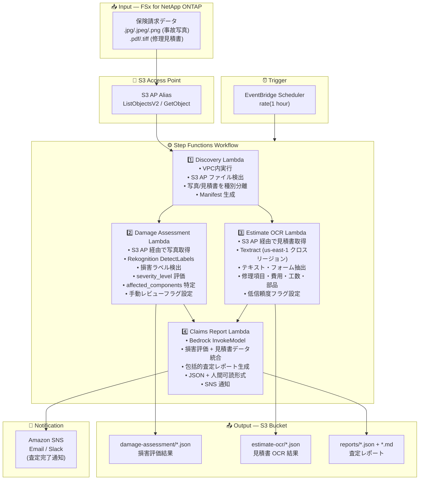

# UC14: 保険 / 損害査定 — 事故写真損害評価・見積書 OCR・査定レポート

🌐 **Language / 言語**: 日本語 | [English](architecture.en.md) | [한국어](architecture.ko.md) | [简体中文](architecture.zh-CN.md) | [繁體中文](architecture.zh-TW.md) | [Français](architecture.fr.md) | [Deutsch](architecture.de.md) | [Español](architecture.es.md)

## End-to-End Architecture (Input → Output)

---

## Architecture Diagram

---

## Data Flow Detail

### Input
| Item | Description |
|------|-------------|
| **Source** | FSx for NetApp ONTAP volume |
| **File Types** | .jpg/.jpeg/.png (事故写真), .pdf/.tiff (修理見積書) |
| **Access Method** | S3 Access Point (ListObjectsV2 + GetObject) |
| **Read Strategy** | 画像・PDF 全体を取得 (Rekognition / Textract に必要) |

### Processing
| Step | Service | Function |
|------|---------|----------|
| Discovery | Lambda (VPC) | S3 AP で事故写真・見積書検出、種別ごとに Manifest 生成 |
| Damage Assessment | Lambda + Rekognition | DetectLabels で損害ラベル検出、重大度評価、影響箇所特定 |
| Estimate OCR | Lambda + Textract | 見積書のテキスト・フォーム抽出 (修理項目、費用、工数、部品) |
| Claims Report | Lambda + Bedrock | 損害評価 + 見積書データを統合した包括的査定レポート生成 |

### Output
| Artifact | Format | Description |
|----------|--------|-------------|
| Damage Assessment | `damage-assessment/YYYY/MM/DD/{claim}_damage.json` | 損害評価結果 (damage_type, severity_level, affected_components) |
| Estimate OCR | `estimate-ocr/YYYY/MM/DD/{claim}_estimate.json` | 見積書 OCR 結果 (修理項目、費用、工数、部品) |
| Claims Report (JSON) | `reports/YYYY/MM/DD/{claim}_report.json` | 構造化査定レポート |
| Claims Report (MD) | `reports/YYYY/MM/DD/{claim}_report.md` | 人間可読査定レポート |
| SNS Notification | Email | 査定完了通知 |

---

## Key Design Decisions

1. **並列処理 (Damage Assessment + Estimate OCR)** — 事故写真の損害評価と見積書 OCR は独立して実行可能。Step Functions の Parallel State で並列化しスループット向上
2. **Rekognition による段階的損害評価** — 損害ラベル未検出時は手動レビューフラグを設定し、人間による確認を促進
3. **Textract クロスリージョン** — Textract は us-east-1 でのみ利用可能なため、クロスリージョン呼び出しで対応
4. **Bedrock による統合レポート** — 損害評価と見積書データを相関させ、包括的な保険金請求レポートを JSON + 人間可読形式で生成
5. **低信頼度フラグ管理** — Rekognition / Textract の信頼度スコアが閾値未満の場合、手動レビューフラグを設定
6. **ポーリングベース** — S3 AP はイベント通知非対応のため、定期スケジュール実行

---

## AWS Services Used

| Service | Role |
|---------|------|
| FSx for NetApp ONTAP | 事故写真・見積書ストレージ |
| S3 Access Points | ONTAP ボリュームへのサーバーレスアクセス |
| EventBridge Scheduler | 定期トリガー |
| Step Functions | ワークフローオーケストレーション (並列パス対応) |
| Lambda | コンピュート (Discovery, Damage Assessment, Estimate OCR, Claims Report) |
| Amazon Rekognition | 事故写真の損害検出 (DetectLabels) |
| Amazon Textract | 見積書 OCR テキスト・フォーム抽出 (us-east-1 クロスリージョン) |
| Amazon Bedrock | 査定レポート生成 (Claude / Nova) |
| SNS | 査定完了通知 |
| Secrets Manager | ONTAP REST API 認証情報管理 |
| CloudWatch + X-Ray | オブザーバビリティ |
