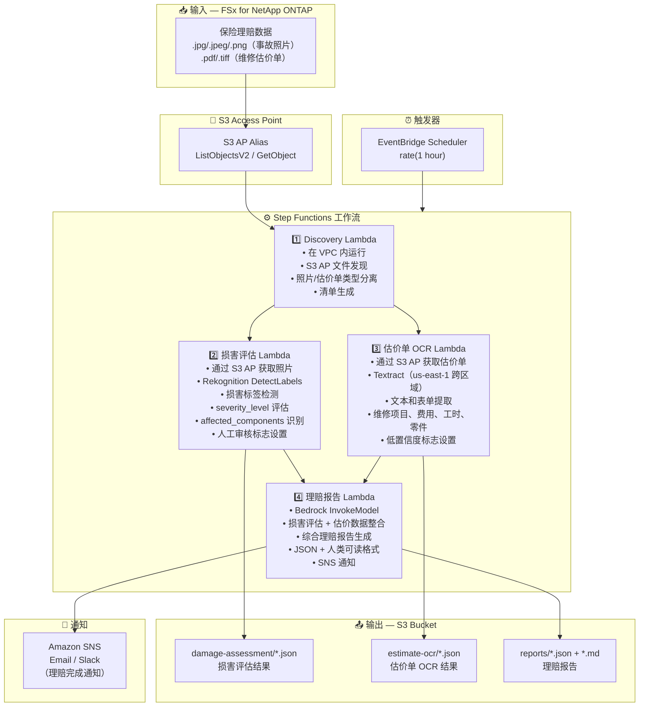

# UC14: 保险/理赔 — 事故照片损害评估、估价单OCR与理赔报告

🌐 **Language / 言語**: [日本語](architecture.md) | [English](architecture.en.md) | [한국어](architecture.ko.md) | 简体中文 | [繁體中文](architecture.zh-TW.md) | [Français](architecture.fr.md) | [Deutsch](architecture.de.md) | [Español](architecture.es.md)

## 端到端架构（输入 → 输出）

---

## 高层级流程

```
┌─────────────────────────────────────────────────────────────────────────────┐
│                         FSx for NetApp ONTAP                                 │
│                                                                              │
│  /vol/claims_data/                                                           │
│  ├── photos/claim_001/front_damage.jpg     (Accident photo — front damage)   │
│  ├── photos/claim_001/side_damage.png      (Accident photo — side damage)    │
│  ├── photos/claim_002/rear_damage.jpeg     (Accident photo — rear damage)    │
│  ├── estimates/claim_001/repair_est.pdf    (Repair estimate PDF)             │
│  └── estimates/claim_002/repair_est.tiff   (Repair estimate TIFF)            │
│                                                                              │
└──────────────────────────────────┬───────────────────────────────────────────┘
                                   │
                                   ▼
┌──────────────────────────────────────────────────────────────────────────────┐
│                      S3 Access Point (Data Path)                              │
│                                                                              │
│  Alias: fsxn-claims-vol-ext-s3alias                                          │
│  • ListObjectsV2 (accident photo & estimate discovery)                       │
│  • GetObject (image & PDF retrieval)                                         │
│  • No NFS/SMB mount required from Lambda                                     │
│                                                                              │
└──────────────────────────────────┬───────────────────────────────────────────┘
                                   │
                                   ▼
┌──────────────────────────────────────────────────────────────────────────────┐
│                    EventBridge Scheduler (Trigger)                            │
│                                                                              │
│  Schedule: rate(1 hour) — configurable                                       │
│  Target: Step Functions State Machine                                        │
│                                                                              │
└──────────────────────────────────┬───────────────────────────────────────────┘
                                   │
                                   ▼
┌──────────────────────────────────────────────────────────────────────────────┐
│                    AWS Step Functions (Orchestration)                         │
│                                                                              │
│  ┌─────────────┐    ┌──────────────────────┐                                │
│  │  Discovery   │───▶│  Damage Assessment   │──┐                             │
│  │  Lambda      │    │  Lambda              │  │                             │
│  │             │    │                      │  │                             │
│  │  • VPC内     │    │  • Rekognition       │  │                             │
│  │  • S3 AP List│    │  • Damage label      │  │                             │
│  │  • Photo/PDF │    │    detection         │  │                             │
│  └──────┬──────┘    └──────────────────────┘  │                             │
│         │                                      │                             │
│         │            ┌──────────────────────┐  │    ┌────────────────────┐   │
│         └───────────▶│  Estimate OCR        │──┼───▶│  Claims Report     │   │
│                      │  Lambda              │  │    │  Lambda            │   │
│                      │                      │  │    │                   │   │
│                      │  • Textract          │──┘    │  • Bedrock         │   │
│                      │  • Estimate text     │       │  • Assessment      │   │
│                      │    extraction        │       │    report          │   │
│                      │  • Form analysis     │       │  • SNS notification│   │
│                      └──────────────────────┘       └────────────────────┘   │
│                                                                              │
└──────────────────────────────────────────────────────────────────────────────┘
                                   │
                                   ▼
┌──────────────────────────────────────────────────────────────────────────────┐
│                         Output (S3 Bucket)                                    │
│                                                                              │
│  s3://{stack}-output-{account}/                                              │
│  ├── damage-assessment/YYYY/MM/DD/                                           │
│  │   ├── claim_001_damage.json             ← Damage assessment results      │
│  │   └── claim_002_damage.json                                               │
│  ├── estimate-ocr/YYYY/MM/DD/                                                │
│  │   ├── claim_001_estimate.json           ← Estimate OCR results           │
│  │   └── claim_002_estimate.json                                             │
│  └── reports/YYYY/MM/DD/                                                     │
│      ├── claim_001_report.json             ← Assessment report (JSON)       │
│      └── claim_001_report.md               ← Assessment report (readable)   │
│                                                                              │
└──────────────────────────────────────────────────────────────────────────────┘
```

---

## Mermaid 图表



---

## 数据流详情

### 输入
| 项目 | 说明 |
|------|------|
| **来源** | FSx for NetApp ONTAP 卷 |
| **文件类型** | .jpg/.jpeg/.png（事故照片）、.pdf/.tiff（维修估价单） |
| **访问方式** | S3 Access Point（ListObjectsV2 + GetObject） |
| **读取策略** | 完整图像/PDF 获取（Rekognition / Textract 所需） |

### 处理
| 步骤 | 服务 | 功能 |
|------|------|------|
| 发现 | Lambda (VPC) | 通过 S3 AP 发现事故照片和估价单，按类型生成清单 |
| 损害评估 | Lambda + Rekognition | 通过 DetectLabels 进行损害标签检测、严重程度评估、受影响部件识别 |
| 估价单 OCR | Lambda + Textract | 估价单文本和表单提取（维修项目、费用、工时、零件） |
| 理赔报告 | Lambda + Bedrock | 整合损害评估 + 估价数据生成综合理赔报告 |

### 输出
| 产出物 | 格式 | 说明 |
|--------|------|------|
| 损害评估 | `damage-assessment/YYYY/MM/DD/{claim}_damage.json` | 损害评估结果（damage_type、severity_level、affected_components） |
| 估价单 OCR | `estimate-ocr/YYYY/MM/DD/{claim}_estimate.json` | 估价单 OCR 结果（维修项目、费用、工时、零件） |
| 理赔报告（JSON） | `reports/YYYY/MM/DD/{claim}_report.json` | 结构化理赔报告 |
| 理赔报告（MD） | `reports/YYYY/MM/DD/{claim}_report.md` | 人类可读理赔报告 |
| SNS 通知 | Email | 理赔完成通知 |

---

## 关键设计决策

1. **并行处理（损害评估 + 估价单 OCR）** — 事故照片损害评估与估价单 OCR 相互独立，通过 Step Functions Parallel State 并行化以提高吞吐量
2. **Rekognition 分级损害评估** — 未检测到损害标签时设置人工审核标志，促进人工验证
3. **Textract 跨区域** — Textract 仅在 us-east-1 可用，使用跨区域调用
4. **Bedrock 综合报告** — 关联损害评估和估价数据，生成 JSON + 人类可读格式的综合理赔报告
5. **低置信度标志管理** — 当 Rekognition / Textract 置信度分数低于阈值时设置人工审核标志
6. **轮询（非事件驱动）** — S3 AP 不支持事件通知，因此使用定期计划执行

---

## 使用的 AWS 服务

| 服务 | 角色 |
|------|------|
| FSx for NetApp ONTAP | 事故照片和估价单存储 |
| S3 Access Points | 对 ONTAP 卷的无服务器访问 |
| EventBridge Scheduler | 定期触发 |
| Step Functions | 工作流编排（支持并行路径） |
| Lambda | 计算（发现、损害评估、估价单 OCR、理赔报告） |
| Amazon Rekognition | 事故照片损害检测（DetectLabels） |
| Amazon Textract | 估价单 OCR 文本和表单提取（us-east-1 跨区域） |
| Amazon Bedrock | 理赔报告生成（Claude / Nova） |
| SNS | 理赔完成通知 |
| Secrets Manager | ONTAP REST API 凭证管理 |
| CloudWatch + X-Ray | 可观测性 |
