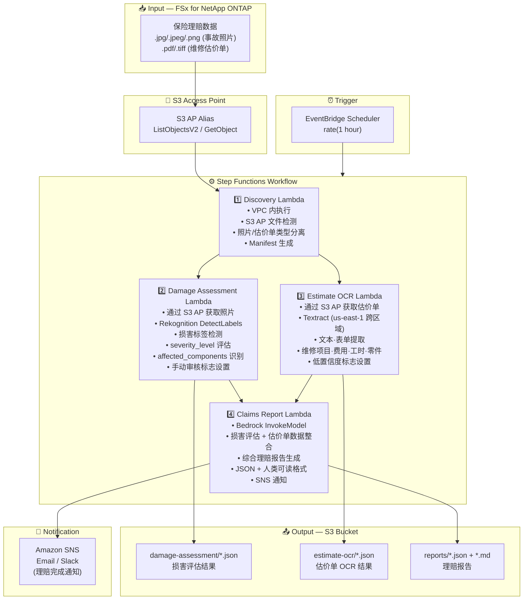

# UC14: 保险 / 损失评估 — 事故照片损害评估·估价单 OCR·评估报告

🌐 **Language / 언어 / 语言 / 語言 / Langue / Sprache / Idioma**: [日本語](architecture.md) | [English](architecture.en.md) | [한국어](architecture.ko.md) | 简体中文 | [繁體中文](architecture.zh-TW.md) | [Français](architecture.fr.md) | [Deutsch](architecture.de.md) | [Español](architecture.es.md)

> 注意：此翻译由 Amazon Bedrock Claude 生成。欢迎对翻译质量提出改进建议。

## End-to-End Architecture (Input → Output)

---

## Architecture Diagram

---

## Data Flow Detail

### Input
| Item | Description |
|------|-------------|
| **Source** | FSx for NetApp ONTAP volume |
| **File Types** | .jpg/.jpeg/.png (事故照片), .pdf/.tiff (维修估价单) |
| **Access Method** | S3 Access Point (ListObjectsV2 + GetObject) |
| **Read Strategy** | 获取完整图像·PDF (Rekognition / Textract 所需) |

### Processing
| Step | Service | Function |
|------|---------|----------|
| Discovery | Lambda (VPC) | 通过 S3 AP 检测事故照片·估价单,按类型生成 Manifest |
| Damage Assessment | Lambda + Rekognition | 使用 DetectLabels 检测损害标签,评估严重程度,识别受影响部位 |
| Estimate OCR | Lambda + Textract | 估价单文本·表单提取 (维修项目、费用、工时、零件) |
| Claims Report | Lambda + Bedrock | 整合损害评估 + 估价单数据生成综合理赔报告 |

### Output
| Artifact | Format | Description |
|----------|--------|-------------|
| Damage Assessment | `damage-assessment/YYYY/MM/DD/{claim}_damage.json` | 损害评估结果 (damage_type, severity_level, affected_components) |
| Estimate OCR | `estimate-ocr/YYYY/MM/DD/{claim}_estimate.json` | 估价单 OCR 结果 (维修项目、费用、工时、零件) |
| Claims Report (JSON) | `reports/YYYY/MM/DD/{claim}_report.json` | 结构化理赔报告 |
| Claims Report (MD) | `reports/YYYY/MM/DD/{claim}_report.md` | 人类可读理赔报告 |
| SNS Notification | Email | 理赔完成通知 |

---

## Key Design Decisions

1. **并行处理 (Damage Assessment + Estimate OCR)** — 事故照片的损害评估与估价单 OCR 可独立执行。通过 Step Functions 的 Parallel State 实现并行化以提高吞吐量
2. **基于 Rekognition 的分级损害评估** — 未检测到损害标签时设置手动审核标志,促进人工确认
3. **Textract 跨区域** — Textract 仅在 us-east-1 可用,因此通过跨区域调用实现
4. **基于 Bedrock 的整合报告** — 关联损害评估与估价单数据,生成 JSON + 人类可读格式的综合保险理赔报告
5. **低置信度标志管理** — 当 Rekognition / Textract 的置信度分数低于阈值时,设置手动审核标志
6. **基于轮询** — S3 AP 不支持事件通知,因此采用定期计划执行

---

## AWS Services Used

| Service | Role |
|---------|------|
| FSx for NetApp ONTAP | 事故照片·估价单存储 |
| S3 Access Points | 对 ONTAP 卷的无服务器访问 |
| EventBridge Scheduler | 定期触发器 |
| Step Functions | 工作流编排 (支持并行路径) |
| Lambda | 计算 (Discovery, Damage Assessment, Estimate OCR, Claims Report) |
| Amazon Rekognition | 事故照片损害检测 (DetectLabels) |
| Amazon Textract | 估价单 OCR 文本·表单提取 (us-east-1 跨区域) |
| Amazon Bedrock | 理赔报告生成 (Claude / Nova) |
| SNS | 理赔完成通知 |
| Secrets Manager | ONTAP REST API 凭证管理 |
| CloudWatch + X-Ray | 可观测性 |
