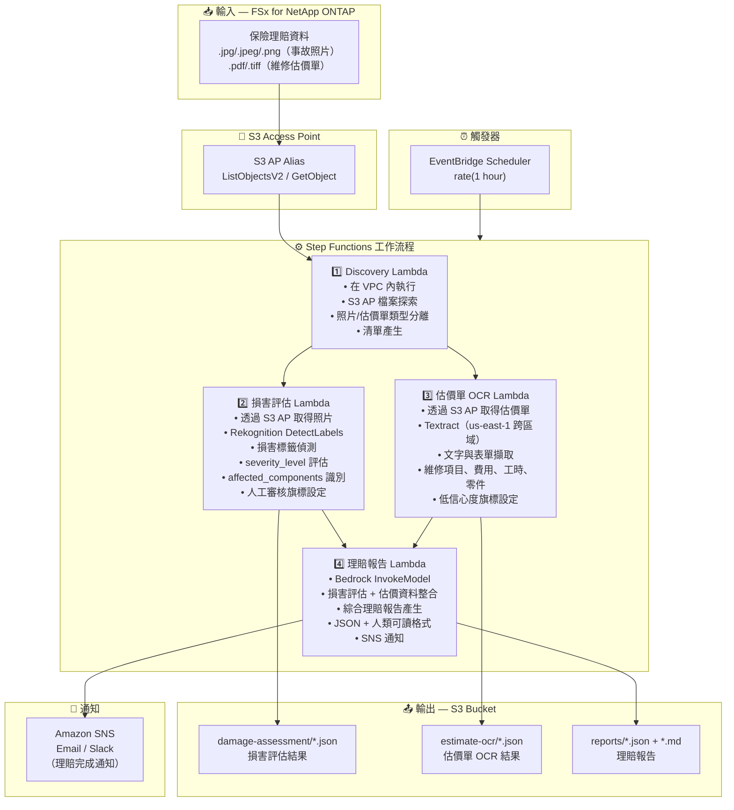

# UC14: 保險/理賠 — 事故照片損害評估、估價單OCR與理賠報告

🌐 **Language / 言語**: [日本語](architecture.md) | [English](architecture.en.md) | [한국어](architecture.ko.md) | [简体中文](architecture.zh-CN.md) | 繁體中文 | [Français](architecture.fr.md) | [Deutsch](architecture.de.md) | [Español](architecture.es.md)

## 端對端架構（輸入 → 輸出）

---

## 高層級流程

```
┌─────────────────────────────────────────────────────────────────────────────┐
│                         FSx for NetApp ONTAP                                 │
│                                                                              │
│  /vol/claims_data/                                                           │
│  ├── photos/claim_001/front_damage.jpg     (Accident photo — front damage)   │
│  ├── photos/claim_001/side_damage.png      (Accident photo — side damage)    │
│  ├── photos/claim_002/rear_damage.jpeg     (Accident photo — rear damage)    │
│  ├── estimates/claim_001/repair_est.pdf    (Repair estimate PDF)             │
│  └── estimates/claim_002/repair_est.tiff   (Repair estimate TIFF)            │
│                                                                              │
└──────────────────────────────────┬───────────────────────────────────────────┘
                                   │
                                   ▼
┌──────────────────────────────────────────────────────────────────────────────┐
│                      S3 Access Point (Data Path)                              │
│                                                                              │
│  Alias: fsxn-claims-vol-ext-s3alias                                          │
│  • ListObjectsV2 (accident photo & estimate discovery)                       │
│  • GetObject (image & PDF retrieval)                                         │
│  • No NFS/SMB mount required from Lambda                                     │
│                                                                              │
└──────────────────────────────────┬───────────────────────────────────────────┘
                                   │
                                   ▼
┌──────────────────────────────────────────────────────────────────────────────┐
│                    EventBridge Scheduler (Trigger)                            │
│                                                                              │
│  Schedule: rate(1 hour) — configurable                                       │
│  Target: Step Functions State Machine                                        │
│                                                                              │
└──────────────────────────────────┬───────────────────────────────────────────┘
                                   │
                                   ▼
┌──────────────────────────────────────────────────────────────────────────────┐
│                    AWS Step Functions (Orchestration)                         │
│                                                                              │
│  ┌─────────────┐    ┌──────────────────────┐                                │
│  │  Discovery   │───▶│  Damage Assessment   │──┐                             │
│  │  Lambda      │    │  Lambda              │  │                             │
│  │             │    │                      │  │                             │
│  │  • VPC内     │    │  • Rekognition       │  │                             │
│  │  • S3 AP List│    │  • Damage label      │  │                             │
│  │  • Photo/PDF │    │    detection         │  │                             │
│  └──────┬──────┘    └──────────────────────┘  │                             │
│         │                                      │                             │
│         │            ┌──────────────────────┐  │    ┌────────────────────┐   │
│         └───────────▶│  Estimate OCR        │──┼───▶│  Claims Report     │   │
│                      │  Lambda              │  │    │  Lambda            │   │
│                      │                      │  │    │                   │   │
│                      │  • Textract          │──┘    │  • Bedrock         │   │
│                      │  • Estimate text     │       │  • Assessment      │   │
│                      │    extraction        │       │    report          │   │
│                      │  • Form analysis     │       │  • SNS notification│   │
│                      └──────────────────────┘       └────────────────────┘   │
│                                                                              │
└──────────────────────────────────────────────────────────────────────────────┘
                                   │
                                   ▼
┌──────────────────────────────────────────────────────────────────────────────┐
│                         Output (S3 Bucket)                                    │
│                                                                              │
│  s3://{stack}-output-{account}/                                              │
│  ├── damage-assessment/YYYY/MM/DD/                                           │
│  │   ├── claim_001_damage.json             ← Damage assessment results      │
│  │   └── claim_002_damage.json                                               │
│  ├── estimate-ocr/YYYY/MM/DD/                                                │
│  │   ├── claim_001_estimate.json           ← Estimate OCR results           │
│  │   └── claim_002_estimate.json                                             │
│  └── reports/YYYY/MM/DD/                                                     │
│      ├── claim_001_report.json             ← Assessment report (JSON)       │
│      └── claim_001_report.md               ← Assessment report (readable)   │
│                                                                              │
└──────────────────────────────────────────────────────────────────────────────┘
```

---

## Mermaid 圖表



---

## 資料流程詳情

### 輸入
| 項目 | 說明 |
|------|------|
| **來源** | FSx for NetApp ONTAP 磁碟區 |
| **檔案類型** | .jpg/.jpeg/.png（事故照片）、.pdf/.tiff（維修估價單） |
| **存取方式** | S3 Access Point（ListObjectsV2 + GetObject） |
| **讀取策略** | 完整影像/PDF 取得（Rekognition / Textract 所需） |

### 處理
| 步驟 | 服務 | 功能 |
|------|------|------|
| 探索 | Lambda (VPC) | 透過 S3 AP 探索事故照片與估價單，依類型產生清單 |
| 損害評估 | Lambda + Rekognition | 透過 DetectLabels 進行損害標籤偵測、嚴重程度評估、受影響部件識別 |
| 估價單 OCR | Lambda + Textract | 估價單文字與表單擷取（維修項目、費用、工時、零件） |
| 理賠報告 | Lambda + Bedrock | 整合損害評估 + 估價資料產生綜合理賠報告 |

### 輸出
| 產出物 | 格式 | 說明 |
|--------|------|------|
| 損害評估 | `damage-assessment/YYYY/MM/DD/{claim}_damage.json` | 損害評估結果（damage_type、severity_level、affected_components） |
| 估價單 OCR | `estimate-ocr/YYYY/MM/DD/{claim}_estimate.json` | 估價單 OCR 結果（維修項目、費用、工時、零件） |
| 理賠報告（JSON） | `reports/YYYY/MM/DD/{claim}_report.json` | 結構化理賠報告 |
| 理賠報告（MD） | `reports/YYYY/MM/DD/{claim}_report.md` | 人類可讀理賠報告 |
| SNS 通知 | Email | 理賠完成通知 |

---

## 關鍵設計決策

1. **並行處理（損害評估 + 估價單 OCR）** — 事故照片損害評估與估價單 OCR 相互獨立，透過 Step Functions Parallel State 並行化以提升吞吐量
2. **Rekognition 分級損害評估** — 未偵測到損害標籤時設定人工審核旗標，促進人工驗證
3. **Textract 跨區域** — Textract 僅在 us-east-1 可用，使用跨區域呼叫
4. **Bedrock 綜合報告** — 關聯損害評估與估價資料，產生 JSON + 人類可讀格式的綜合理賠報告
5. **低信心度旗標管理** — 當 Rekognition / Textract 信心度分數低於閾值時設定人工審核旗標
6. **輪詢（非事件驅動）** — S3 AP 不支援事件通知，因此使用定期排程執行

---

## 使用的 AWS 服務

| 服務 | 角色 |
|------|------|
| FSx for NetApp ONTAP | 事故照片與估價單儲存 |
| S3 Access Points | 對 ONTAP 磁碟區的無伺服器存取 |
| EventBridge Scheduler | 定期觸發 |
| Step Functions | 工作流程編排（支援並行路徑） |
| Lambda | 運算（探索、損害評估、估價單 OCR、理賠報告） |
| Amazon Rekognition | 事故照片損害偵測（DetectLabels） |
| Amazon Textract | 估價單 OCR 文字與表單擷取（us-east-1 跨區域） |
| Amazon Bedrock | 理賠報告產生（Claude / Nova） |
| SNS | 理賠完成通知 |
| Secrets Manager | ONTAP REST API 憑證管理 |
| CloudWatch + X-Ray | 可觀測性 |
