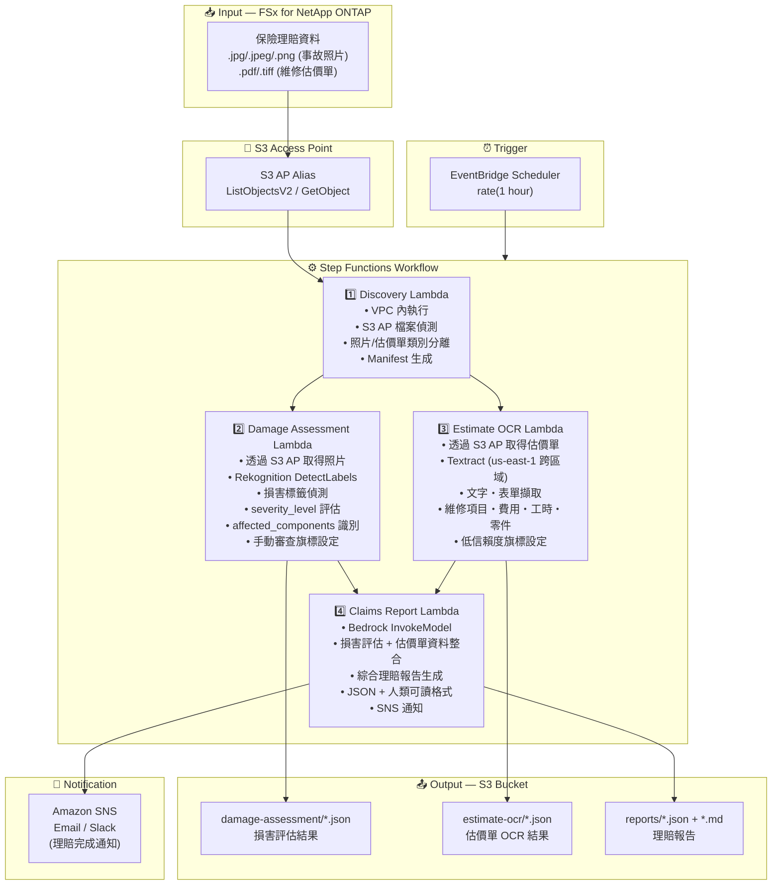

# UC14: 保險 / 損害查定 — 事故照片損害評估・估價單 OCR・查定報告

🌐 **Language / 언어 / 语言 / 語言 / Langue / Sprache / Idioma**: [日本語](architecture.md) | [English](architecture.en.md) | [한국어](architecture.ko.md) | [简体中文](architecture.zh-CN.md) | 繁體中文 | [Français](architecture.fr.md) | [Deutsch](architecture.de.md) | [Español](architecture.es.md)

> 注意：此翻譯由 Amazon Bedrock Claude 產生。歡迎對翻譯品質提出改進建議。

## End-to-End Architecture (Input → Output)

---

## Architecture Diagram

---

## Data Flow Detail

### Input
| Item | Description |
|------|-------------|
| **Source** | FSx for NetApp ONTAP volume |
| **File Types** | .jpg/.jpeg/.png (事故照片), .pdf/.tiff (維修估價單) |
| **Access Method** | S3 Access Point (ListObjectsV2 + GetObject) |
| **Read Strategy** | 取得完整影像・PDF (Rekognition / Textract 所需) |

### Processing
| Step | Service | Function |
|------|---------|----------|
| Discovery | Lambda (VPC) | 透過 S3 AP 偵測事故照片・估價單，依類別生成 Manifest |
| Damage Assessment | Lambda + Rekognition | 使用 DetectLabels 偵測損害標籤，評估嚴重程度，識別影響部位 |
| Estimate OCR | Lambda + Textract | 估價單文字・表單擷取 (維修項目、費用、工時、零件) |
| Claims Report | Lambda + Bedrock | 整合損害評估 + 估價單資料生成綜合理賠報告 |

### Output
| Artifact | Format | Description |
|----------|--------|-------------|
| Damage Assessment | `damage-assessment/YYYY/MM/DD/{claim}_damage.json` | 損害評估結果 (damage_type, severity_level, affected_components) |
| Estimate OCR | `estimate-ocr/YYYY/MM/DD/{claim}_estimate.json` | 估價單 OCR 結果 (維修項目、費用、工時、零件) |
| Claims Report (JSON) | `reports/YYYY/MM/DD/{claim}_report.json` | 結構化理賠報告 |
| Claims Report (MD) | `reports/YYYY/MM/DD/{claim}_report.md` | 人類可讀理賠報告 |
| SNS Notification | Email | 理賠完成通知 |

---

## Key Design Decisions

1. **並行處理 (Damage Assessment + Estimate OCR)** — 事故照片的損害評估與估價單 OCR 可獨立執行。透過 Step Functions 的 Parallel State 並行化以提升吞吐量
2. **Rekognition 階段式損害評估** — 未偵測到損害標籤時設定手動審查旗標，促進人工確認
3. **Textract 跨區域** — Textract 僅在 us-east-1 可用，因此採用跨區域呼叫對應
4. **Bedrock 整合報告** — 關聯損害評估與估價單資料，以 JSON + 人類可讀格式生成綜合保險理賠報告
5. **低信賴度旗標管理** — 當 Rekognition / Textract 的信賴度分數低於閾值時，設定手動審查旗標
6. **輪詢基礎** — S3 AP 不支援事件通知，因此採用定期排程執行

---

## AWS Services Used

| Service | Role |
|---------|------|
| FSx for NetApp ONTAP | 事故照片・估價單儲存 |
| S3 Access Points | ONTAP 磁碟區的無伺服器存取 |
| EventBridge Scheduler | 定期觸發器 |
| Step Functions | 工作流程編排 (支援並行路徑) |
| Lambda | 運算 (Discovery, Damage Assessment, Estimate OCR, Claims Report) |
| Amazon Rekognition | 事故照片損害偵測 (DetectLabels) |
| Amazon Textract | 估價單 OCR 文字・表單擷取 (us-east-1 跨區域) |
| Amazon Bedrock | 理賠報告生成 (Claude / Nova) |
| SNS | 理賠完成通知 |
| Secrets Manager | ONTAP REST API 認證資訊管理 |
| CloudWatch + X-Ray | 可觀測性 |
