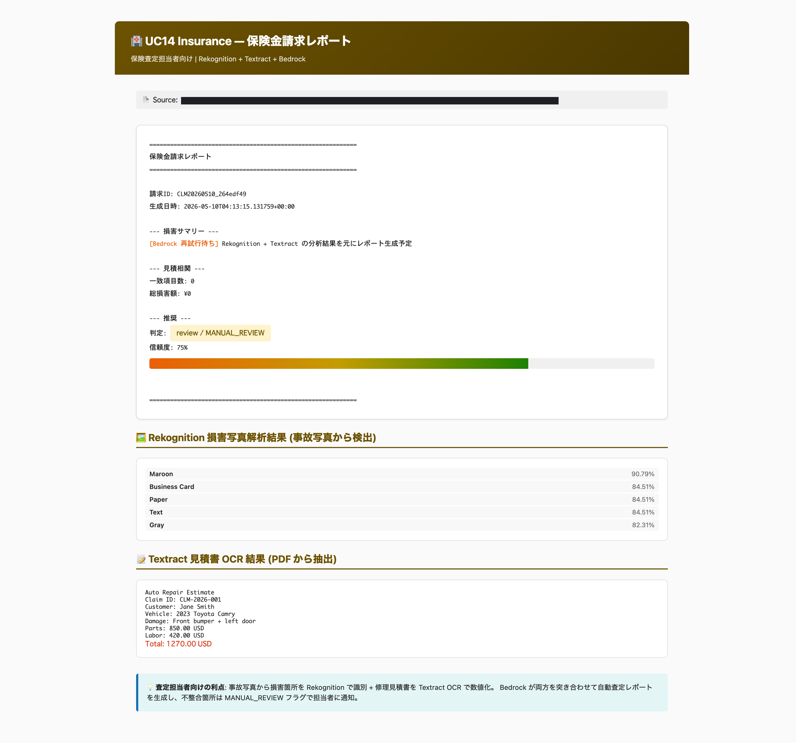
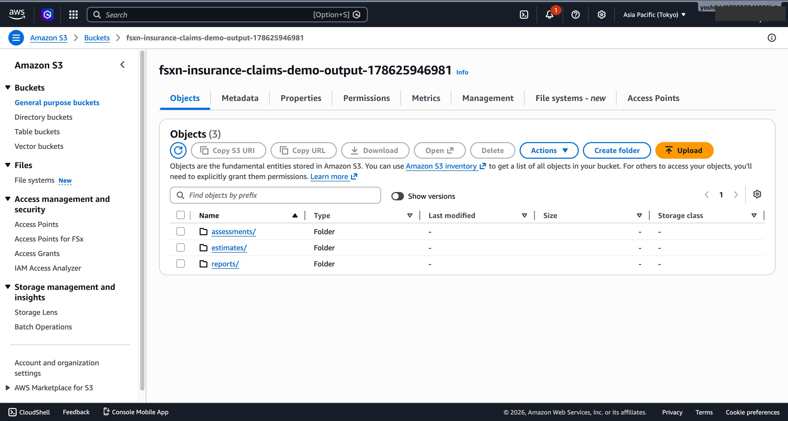

# 事故照片損害查定・保險金報告 — Demo Guide

🌐 **Language / 언어 / 语言 / 語言 / Langue / Sprache / Idioma**: [日本語](demo-guide.md) | [English](demo-guide.en.md) | [한국어](demo-guide.ko.md) | [简体中文](demo-guide.zh-CN.md) | 繁體中文 | [Français](demo-guide.fr.md) | [Deutsch](demo-guide.de.md) | [Español](demo-guide.es.md)

> 注意：此翻譯由 Amazon Bedrock Claude 產生。歡迎對翻譯品質提出改進建議。

## Executive Summary

本示範展示了從事故照片進行損害評估與保險理賠報告自動生成的流程。透過影像分析進行損害評估與 AI 報告生成，提升評估流程的效率。

**示範核心訊息**：AI 自動分析事故照片，即時生成損害程度評估與保險理賠報告。

**預估時間**：3〜5 分鐘

---

## Target Audience & Persona

| 項目 | 詳細 |
|------|------|
| **職位** | 損害評估人員 / 理賠調整員 |
| **日常業務** | 確認事故照片、損害評估、保險金額計算、報告撰寫 |
| **挑戰** | 需要快速處理大量理賠案件 |
| **期望成果** | 加速評估流程並確保一致性 |

### Persona：小林先生（損害評估人員）

- 每月處理 100+ 件保險理賠申請
- 從照片判斷損害程度並撰寫報告
- 「希望自動化初步評估，專注於複雜案件」

---

## Demo Scenario：汽車事故損害評估

### 整體工作流程

```
事故照片         影像分析        損害評估          理賠報告
(多張)      →   損傷偵測    →   程度判定    →    AI 生成
                 部位識別        金額估算
```

---

## Storyboard（5 個段落 / 3〜5 分鐘）

### Section 1: Problem Statement（0:00–0:45）

**旁白要點**：
> 每月 100 件以上的保險理賠申請。每個案件需確認多張事故照片、評估損害程度並撰寫報告。手動處理無法負荷。

**Key Visual**：保險理賠案件清單、事故照片範例

### Section 2: Photo Upload（0:45–1:30）

**旁白要點**：
> 上傳事故照片後，自動評估流程啟動。以案件為單位進行處理。

**Key Visual**：照片上傳 → 工作流程自動啟動

### Section 3: Damage Detection（1:30–2:30）

**旁白要點**：
> AI 分析照片並偵測損傷位置。識別損傷類型（凹陷、刮痕、破損）與部位（保險桿、車門、葉子板等）。

**Key Visual**：損傷偵測結果、部位對應

### Section 4: Assessment（2:30–3:45）

**旁白要點**：
> 評估損傷程度，判斷維修/更換並計算概估金額。同時與過去類似案件進行比較。

**Key Visual**：損害評估結果表格、金額估算

### Section 5: Claims Report（3:45–5:00）

**旁白要點**：
> AI 自動生成保險理賠報告。包含損害摘要、估算金額、建議處理方式。評估人員僅需確認與核准。

**Key Visual**：AI 生成理賠報告（損害摘要 + 金額估算）

---

## Screen Capture Plan

| # | 畫面 | 段落 |
|---|------|-----------|
| 1 | 理賠案件清單 | Section 1 |
| 2 | 照片上傳・流程啟動 | Section 2 |
| 3 | 損傷偵測結果 | Section 3 |
| 4 | 損害評估・金額估算 | Section 4 |
| 5 | 保險理賠報告 | Section 5 |

---

## Narration Outline

| 段落 | 時間 | 關鍵訊息 |
|-----------|------|--------------|
| Problem | 0:00–0:45 | 「每月 100 件理賠手動評估已達極限」 |
| Upload | 0:45–1:30 | 「上傳照片即開始自動評估」 |
| Detection | 1:30–2:30 | 「AI 自動偵測損傷位置與類型」 |
| Assessment | 2:30–3:45 | 「自動估算損害程度與維修金額」 |
| Report | 3:45–5:00 | 「自動生成理賠報告，僅需確認與核准」 |

---

## Sample Data Requirements

| # | 資料 | 用途 |
|---|--------|------|
| 1 | 輕微損傷照片（5 件） | 基本評估示範 |
| 2 | 中度損傷照片（3 件） | 評估精度示範 |
| 3 | 嚴重損傷照片（2 件） | 全損判定示範 |

---

## Timeline

### 1 週內可達成

| 任務 | 所需時間 |
|--------|---------|
| 準備範例照片資料 | 2 小時 |
| 確認流程執行 | 2 小時 |
| 取得畫面截圖 | 2 小時 |
| 撰寫旁白稿 | 2 小時 |
| 影片編輯 | 4 小時 |

### Future Enhancements

- 從影片偵測損傷
- 與維修廠估價自動比對
- 詐欺理賠偵測

---

## Technical Notes

| 元件 | 角色 |
|--------------|------|
| Step Functions | 工作流程編排 |
| Lambda (Image Analyzer) | 透過 Bedrock/Rekognition 進行損傷偵測 |
| Lambda (Damage Assessor) | 損害程度評估・金額估算 |
| Lambda (Report Generator) | 透過 Bedrock 生成理賠報告 |
| Amazon Athena | 參照・比較過去案件資料 |

### 備援方案

| 情境 | 對應 |
|---------|------|
| 影像分析精度不足 | 使用預先分析結果 |
| Bedrock 延遲 | 顯示預先生成報告 |

---

*本文件為技術簡報用示範影片的製作指南。*

---

## 已驗證的 UI/UX 截圖（2026-05-10 AWS 驗證）

與 Phase 7 相同方針，拍攝**保險評估人員在日常業務中實際使用的 UI/UX 畫面**。
排除技術人員畫面（Step Functions 圖表等）。

### 輸出目的地選擇：標準 S3 vs FSxN S3AP

UC14 在 2026-05-10 的更新中支援了 `OutputDestination` 參數。
**將 AI 成果寫回同一 FSx 磁碟區**，讓理賠處理人員能在
理賠案件的目錄結構內檢視損害評估 JSON、OCR 結果、理賠報告
（「no data movement」模式，在 PII 保護觀點上也有利）。

```bash
# STANDARD_S3 模式（預設，與以往相同）
--parameter-overrides OutputDestination=STANDARD_S3 ...

# FSXN_S3AP 模式（將 AI 成果寫回 FSx ONTAP 磁碟區）
--parameter-overrides \
  OutputDestination=FSXN_S3AP \
  OutputS3APPrefix=ai-outputs/ \
  ...
```

AWS 規格限制與因應措施請參閱[專案 README 的「AWS 規格限制與因應措施」
段落](../../README.md#aws-仕様上の制約と回避策)。

### 1. 保險理賠報告 — 評估人員摘要

整合事故照片 Rekognition 分析 + 估價單 Textract OCR + 評估建議判定的報告。
判定 `MANUAL_REVIEW` + 信賴度 75%，由人員審查無法自動化的項目。

<!-- SCREENSHOT: uc14-claims-report.png
     內容: 保險理賠報告（理賠 ID、損害摘要、估價相關性、建議判定）
            + Rekognition 偵測標籤清單 + Textract OCR 結果
     遮罩: 帳戶 ID、儲存貯體名稱 -->


### 2. S3 輸出儲存貯體 — 評估成果總覽

評估人員確認各理賠案件成果的畫面。
`assessments/`（Rekognition 分析）+ `estimates/`（Textract OCR）+ `reports/`（整合報告）。

<!-- SCREENSHOT: uc14-s3-output-bucket.png
     內容: S3 主控台顯示 assessments/, estimates/, reports/ 前綴
     遮罩: 帳戶 ID -->


### 實測值（2026-05-10 AWS 部署驗證）

- **Step Functions 執行**：SUCCEEDED
- **Rekognition**：事故照片偵測到 `Maroon` 90.79%、`Business Card` 84.51% 等
- **Textract**：透過跨區域 us-east-1 從估價單 PDF OCR 出 `Total: 1270.00 USD` 等
- **生成成果**：assessments/*.json、estimates/*.json、reports/*.txt
- **實際堆疊**：`fsxn-insurance-claims-demo`（ap-northeast-1，2026-05-10 驗證時）
