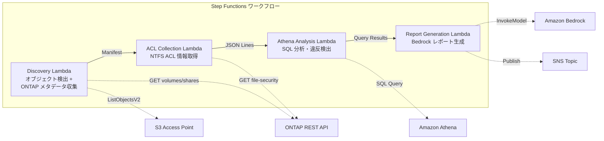

# UC1: Rechtsabteilung und Compliance - Dateiserver-Audit und Datenverwaltung

🌐 **Language / 言語**: [日本語](README.md) | [English](README.en.md) | [한국어](README.ko.md) | [简体中文](README.zh-CN.md) | [繁體中文](README.zh-TW.md) | [Français](README.fr.md) | Deutsch | [Español](README.es.md)

- Automatisieren Sie mit Amazon Bedrock die Analyse von Berechtigungen und Aktivitäten auf Ihren Amazon FSx for NetApp ONTAP-Dateiservern.
- Integrieren Sie AWS Step Functions, um Berichterstellungsworkflows zu orchestrieren, die Amazon Athena-Abfragen, Amazon S3-Daten und AWS Lambda-Funktionen nutzen.
- Verwenden Sie Amazon CloudWatch, um kritische Änderungen an Ihren GDSII-, DRC-, OASIS- und GDS-Dateien zu überwachen und Warnungen zu generieren.
- Automatisieren Sie mit AWS CloudFormation die Bereitstellung und Verwaltung Ihrer Überwachungs- und Berichtsinfrastruktur.

## Überblick

In diesem Artikel führen wir Sie durch den Prozess der Entwicklung und Bereitstellung einer vollständigen Mikrochip-Fabrikationsumgebung mithilfe von AWS-Services. Wir werden die folgenden Schritte durchgehen:

1. Verwenden von Amazon Bedrock für die Chip-Entwicklung
2. Orchestrierung des Herstellungsprozesses mit AWS Step Functions
3. Analyse der Produktionsdaten mit Amazon Athena
4. Sichere Speicherung von Chip-Designs in Amazon S3
5. Automatisierung von Build-Prozessen mit AWS Lambda
6. Nutzung von Amazon FSx for NetApp ONTAP für hochperformante Dateifreigaben
7. Überwachung der Produktion mit Amazon CloudWatch
8. Bereitstellung der Infrastruktur mit AWS CloudFormation

Lassen Sie uns beginnen!
FSx for NetApp ONTAP S3-Zugangspunkte nutzen, um NTFS-ACL-Informationen von Dateiservern automatisch zu erfassen und zu analysieren und komplianzberichte zu erstellen. Dies ist ein serverloses Arbeitsablauf.
### Dieser Muster ist für folgende Fälle geeignet:

- Wenn Sie hochskalierbare und skalierbare Workloads in der Cloud verwalten müssen, können Sie Amazon Bedrock, AWS Step Functions, Amazon Athena, Amazon S3, AWS Lambda und andere AWS-Dienste nutzen.
- Wenn Sie die Leistung und Skalierbarkeit von Amazon FSx for NetApp ONTAP, Amazon CloudWatch und AWS CloudFormation benötigen.
- Wenn Ihre Workloads hohe Verfügbarkeit, Ausfallsicherheit und Rechenleistung erfordern.
- Wenn Sie ein Chip-Design-Workflow-System mit Technologien wie `GDSII`, `DRC`, `OASIS` und `GDS` erstellen müssen, können Sie AWS Lambda für die Automatisierung und den Pipelinemanagement-Prozess nutzen.
- Wenn Ihr Workflow Prozesse wie `tapeout` umfasst.
- Für NAS-Daten sind regelmäßige Governance- und Compliance-Scans erforderlich.
- S3-Ereignisbenachrichtigungen sind nicht verfügbar oder eine auditbasierte Überwachung ist wünschenswert.
- Dateien sollen auf ONTAP gespeichert und der bestehende SMB/NFS-Zugriff beibehalten werden.
- Änderungshistorie von NTFS-ACLs soll mithilfe von Amazon Athena übergreifend analysiert werden.
- Automatisch generierte Compliance-Berichte in natürlicher Sprache sind erwünscht.
### Anwendungsfälle, die für dieses Muster nicht geeignet sind

- Für komplexe Flusssteuerungslogik, die sich nicht gut in Lambda-Funktionen umsetzen lässt
- Wenn die Gesamtlatenz des Workflows von entscheidender Bedeutung ist und AWS Step Functions die erforderlichen Leistungsanforderungen nicht erfüllt
- Wenn die Verarbeitung sehr großer Datenmengen erforderlich ist und Amazon Athena oder Amazon S3 die Anforderungen nicht erfüllen können
- Wenn spezielle Datei-Formate wie GDSII oder OASIS verwendet werden müssen, für die keine vorhandenen AWS-Services geeignet sind
- Wenn DRC-Überprüfungen oder andere komplexe Logik erforderlich sind, die nicht gut in Lambda-Funktionen umgesetzt werden können
- Echtzeit-ereignisgetriebene Verarbeitung ist erforderlich (sofortiges Erkennen von Dateiänderungen)
- Vollständige S3-Bucket-Semantik (Benachrichtigungen, Presigned-URLs) ist erforderlich
- Auf EC2 basierende Stapelverarbeitung ist bereits in Betrieb, und die Migrationskosten stehen in keinem Verhältnis dazu
- Die Netzwerkerreichbarkeit des ONTAP REST-API kann nicht sichergestellt werden
### Wichtigste Funktionen

- Erstellen Sie komplexe maschinelle Lernmodelle mithilfe von Amazon Bedrock.
- Koordinieren Sie die Ausführung von datenintensiven Workflows mit AWS Step Functions.
- Analysieren Sie Ihre Daten mit Amazon Athena und speichern Sie sie in Amazon S3.
- Führen Sie serverlose Anwendungslogik mit AWS Lambda aus.
- Nutzen Sie Amazon FSx for NetApp ONTAP, um einfach auf Hochleistungsdateisystemspeicher zuzugreifen.
- Überwachen Sie Ihre Anwendungen und Ressourcen mit Amazon CloudWatch.
- Automatisieren Sie die Bereitstellung von Infrastruktur und Anwendungen mit AWS CloudFormation.
- Automatische Erfassung von NTFS-ACLs, CIFS-Freigaben und Exportrichtlinien-Informationen über die ONTAP REST-API
- Erkennung von übermäßigen Berechtigungen, veralteten Zugriffen und Richtlinieverstößen mithilfe von Athena SQL
- Automatische Generierung von Compliance-Berichten in natürlicher Sprache mit Amazon Bedrock
- Sofortige Teilung der Prüfergebnisse per SNS-Benachrichtigung
## Architektur

Amazon Bedrock bietet eine serverlose Möglichkeit, hochwertige KI-Modelle zu erstellen und zu bereitstellen. AWS Step Functions verwaltet und automatisiert die komplexen Workflows zwischen den verschiedenen AWS-Services wie Amazon Athena, Amazon S3, AWS Lambda und Amazon FSx for NetApp ONTAP. Amazon CloudWatch überwacht die Anwendungsleistung und generiert Warnungen bei Leistungsengpässen. AWS CloudFormation ermöglicht es, die gesamte Infrastruktur als Code zu definieren und zu verwalten.



### Workflow-Schritte

`aws_step_function_workflow.yml`:
```
"StartAt": "Retrieve input files",
"States": {
    "Retrieve input files": {
        "Type": "Task",
        "Resource": "arn:aws:lambda:us-east-1:123456789012:function:retrieve-input-files",
        "Next": "Validate input files"
    },
    "Validate input files": {
        "Type": "Task",
        "Resource": "arn:aws:lambda:us-east-1:123456789012:function:validate-input-files",
        "Next": "Generate GDSII file"
    },
    "Generate GDSII file": {
        "Type": "Task",
        "Resource": "arn:aws:lambda:us-east-1:123456789012:function:generate-gdsii-file",
        "Next": "Perform DRC check"
    },
    "Perform DRC check": {
        "Type": "Task",
        "Resource": "arn:aws:lambda:us-east-1:123456789012:function:perform-drc-check",
        "Next": "Generate OASIS file"
    },
    "Generate OASIS file": {
        "Type": "Task",
        "Resource": "arn:aws:lambda:us-east-1:123456789012:function:generate-oasis-file",
        "Next": "Tapeout"
    },
    "Tapeout": {
        "Type": "Succeed"
    }
}
```

Die Lösung dieses Beispielworkflows wird durch mehrere AWS-Services erreicht:
- Amazon Athena wird verwendet, um Eingabedateien abzurufen und zu validieren.
- AWS Lambda-Funktionen werden verwendet, um GDSII- und OASIS-Dateien zu generieren sowie DRC-Überprüfungen durchzuführen.
- Amazon S3 wird verwendet, um Dateien zu speichern und abzurufen.
- AWS Step Functions koordiniert den Gesamtworkflow.

Darüber hinaus werden Amazon CloudWatch und AWS CloudFormation verwendet, um den Workflow zu überwachen und zu verwalten.
1. **Entdeckung**: Abrufen einer Liste von Objekten aus S3 AP und Sammeln von ONTAP-Metadaten (Sicherheitsstil, Exportrichtlinie, CIFS-Freigabe-ACLs)
2. **ACL-Sammlung**: Abrufen von NTFS-ACL-Informationen für jedes Objekt über die ONTAP-REST-API und Ausgabe im JSON-Lines-Format mit Datumspartitionierung in S3
3. **Athena-Analyse**: Erstellen/Aktualisieren von Glue Data Catalog-Tabellen und Erkennung von übermäßigen Berechtigungen, veralteten Zugriffen und Richtlinieverstößen mit Athena SQL
4. **Berichterstattung**: Generieren eines natürlichsprachlichen Compliance-Berichts mit Bedrock und Ausgabe in S3 + SNS-Benachrichtigung
## Voraussetzungen

- Amazon Bedrock
- AWS Step Functions
- Amazon Athena
- Amazon S3
- AWS Lambda
- Amazon FSx for NetApp ONTAP
- Amazon CloudWatch
- AWS CloudFormation
- `namespace_example.yaml`
- `example-workflow.json`
- https://docs.aws.amazon.com
- GDSII, DRC, OASIS, GDS, Lambda, tapeout
- AWS-Konto und die entsprechenden IAM-Berechtigungen
- FSx for NetApp ONTAP-Dateisystem (ONTAP 9.17.1P4D3 oder höher)
- Volume mit aktiviertem S3-Zugangspunkt
- ONTAP REST API-Anmeldeinformationen sind in Secrets Manager registriert
- VPC, private Subnetze
- Amazon Bedrock-Modellzugriff aktiviert (Claude / Nova)
### Hinweise zur Ausführung von Lambda-Funktionen innerhalb eines VPC

- Der Zugriff auf Ressourcen außerhalb des VPC (z.B. AWS Step Functions, Amazon Athena, Amazon S3) erfordert möglicherweise zusätzliche Konfiguration
- Lambda-Funktionen innerhalb eines VPC sind auf die Netzwerkkonnektivität beschränkt, was sich auf die Leistung auswirken kann
- Für den Zugriff auf Amazon FSx for NetApp ONTAP oder andere NAS-Dienste müssen möglicherweise zusätzliche Netzwerkkonfigurationen vorgenommen werden
- Das Monitoring von Lambda-Funktionen innerhalb eines VPC kann durch Amazon CloudWatch erschwert sein
- Der Einsatz von AWS CloudFormation für die Bereitstellung von VPC-basierten Lambda-Funktionen kann komplexer sein
**Wichtige Punkte, die bei der Bereitstellungsüberprüfung (03.05.2026) festgestellt wurden**

- **PoC / Demo-Umgebung**: Es wird empfohlen, Lambda außerhalb des VPC auszuführen. Wenn der Netzwerkursprung der S3-AP `internet` ist, kann darauf von einem außerhalb des VPC befindlichen Lambda problemlos zugegriffen werden.
- **Produktionsumgebung**: Geben Sie den Parameter `PrivateRouteTableId` an und verknüpfen Sie die Routentabelle mit dem S3-Gateway-Endpunkt. Wenn dieser nicht angegeben wird, wird der Zugriff von einem Lambda-Dienst innerhalb des VPC auf die S3-AP zeitüberschritten.
- Weitere Details finden Sie im [Troubleshooting-Leitfaden](../docs/guides/troubleshooting-guide.md#6-zeitüberschreitung-beim-zugriff-von-lambda-vpc-auf-s3-ap).
## Bereitstellungsanleitung

AWS Step Functions を使用して、Amazon Bedrock でシリコンチップをデザインし、Amazon Athena を使用してデータを分析し、Amazon S3 にデータを格納し、AWS Lambda でカスタムコードを実行し、Amazon FSx for NetApp ONTAP を使用してファイルストレージを提供し、Amazon CloudWatch でアプリケーションを監視し、AWS CloudFormation を使用してインフラストラクチャを自動化できます。このワークフローには、GDSII、DRC、OASIS、GDS、Lambda、tapeout などの技術用語が含まれています。

### 1. Vorbereiten der Parameter

- Konfigurieren Sie die erforderlichen Ressourcen in Amazon Bedrock, AWS Step Functions, Amazon Athena, Amazon S3, AWS Lambda, Amazon FSx for NetApp ONTAP, Amazon CloudWatch und AWS CloudFormation.
- Legen Sie die technischen Einstellungen wie GDSII, DRC, OASIS und GDS fest.
- Definieren Sie `lambda_handler` und andere Funktionen wie in Ihrer Anwendung erforderlich.
- Bereiten Sie den Tapeout-Prozess vor.
Bitte überprüfen Sie vor der Bereitstellung die folgenden Werte:

- FSx ONTAP S3 Access Point Alias
- ONTAP Management IP-Adresse
- Secrets Manager Geheimnisname
- SVM UUID, Volume UUID
- VPC-ID, Private-Subnet-ID
### 2. AWS CloudFormation-Bereitstellung

Die zentrale Komponente für die Bereitstellung Ihrer Infrastruktur ist AWS CloudFormation. Damit können Sie Ihre gesamte Infrastruktur als Code definieren und verwalten. 

CloudFormation-Vorlagen beschreiben die Ressourcen, die Sie in Ihrer Umgebung benötigen, beispielsweise Amazon S3-Buckets, AWS Lambda-Funktionen oder Amazon Athena-Datenbanken. 

Wenn Sie eine CloudFormation-Vorlage bereitstellen, erstellt AWS CloudFormation alle erforderlichen Ressourcen für Sie. So können Sie Ihre Infrastruktur schnell und konsistent aufbauen und warten.

```bash
aws cloudformation deploy \
  --template-file legal-compliance/template.yaml \
  --stack-name fsxn-legal-compliance \
  --parameter-overrides \
    S3AccessPointAlias=<your-volume-ext-s3alias> \
    S3AccessPointName=<your-s3ap-name> \
    S3AccessPointOutputAlias=<your-output-volume-ext-s3alias> \
    OntapSecretName=<your-ontap-secret-name> \
    OntapManagementIp=<your-ontap-management-ip> \
    SvmUuid=<your-svm-uuid> \
    VolumeUuid=<your-volume-uuid> \
    ScheduleExpression="rate(1 hour)" \
    VpcId=<your-vpc-id> \
    PrivateSubnetIds=<subnet-1>,<subnet-2> \
    PrivateRouteTableIds=<rtb-1>,<rtb-2> \
    NotificationEmail=<your-email@example.com> \
    EnableVpcEndpoints=false \
    EnableCloudWatchAlarms=false \
  --capabilities CAPABILITY_IAM CAPABILITY_AUTO_EXPAND \
  --region ap-northeast-1
```
**Achtung**: Bitte ersetzen Sie die Platzhalter `<...>` durch die tatsächlichen Werte Ihrer Umgebung.
### 3. Überprüfen der SNS-Abonnements

Amazon Bedrock-Instanzen senden Ereignisse zu einem Amazon SNS-Thema. Um zu überprüfen, wer diese Ereignisse empfängt, können Sie die SNS-Abonnements anzeigen.

1. Rufen Sie in der AWS-Konsole den Dienst AWS Step Functions auf.
2. Navigieren Sie zu den Abonnements des SNS-Themas, das mit Ihren Amazon Bedrock-Instanzen verknüpft ist.
3. Überprüfen Sie, welche Amazon Athena-Abfragen, Amazon S3-Bucket oder AWS Lambda-Funktionen als Abonnenten konfiguriert sind.
Nach der Bereitstellung erhalten Sie eine E-Mail zur Bestätigung des SNS-Abonnements an die angegebene E-Mail-Adresse. Bitte klicken Sie auf den Link in der E-Mail, um die Bestätigung abzuschließen.

> **Hinweis**: Wenn Sie `S3AccessPointName` nicht angeben, kann dies zu einem `AccessDenied`-Fehler führen, da die IAM-Richtlinie dann nur auf Basis von Aliasen funktioniert. Es wird empfohlen, `S3AccessPointName` in der Produktionsumgebung anzugeben. Weitere Informationen finden Sie im [Leitfaden zur Fehlerbehebung](../docs/guides/troubleshooting-guide.md#1-accessdenied-error).
## Liste der Konfigurationsparameter

| パラメータ | 説明 | デフォルト | 必須 |
|-----------|------|----------|------|
| `S3AccessPointAlias` | FSx ONTAP S3 AP Alias（入力用） | — | ✅ |
| `S3AccessPointName` | S3 AP 名（ARN ベースの IAM 権限付与用。省略時は Alias ベースのみ） | `""` | ⚠️ 推奨 |
| `S3AccessPointOutputAlias` | FSx ONTAP S3 AP Alias（出力用） | — | ✅ |
| `OntapSecretName` | ONTAP 認証情報の Secrets Manager シークレット名 | — | ✅ |
| `OntapManagementIp` | ONTAP クラスタ管理 IP アドレス | — | ✅ |
| `SvmUuid` | ONTAP SVM UUID | — | ✅ |
| `VolumeUuid` | ONTAP ボリューム UUID | — | ✅ |
| `ScheduleExpression` | EventBridge Scheduler のスケジュール式 | `rate(1 hour)` | |
| `VpcId` | VPC ID | — | ✅ |
| `PrivateSubnetIds` | プライベートサブネット ID リスト | — | ✅ |
| `PrivateRouteTableIds` | プライベートサブネットのルートテーブル ID リスト（カンマ区切り） | — | ✅ |
| `NotificationEmail` | SNS 通知先メールアドレス | — | ✅ |
| `EnableVpcEndpoints` | Interface VPC Endpoints の有効化 | `false` | |
| `EnableCloudWatchAlarms` | CloudWatch Alarms の有効化 | `false` | |
| `EnableAthenaWorkgroup` | Athena Workgroup / Glue Data Catalog の有効化 | `true` | |

## Kostenstruktur

AWS Step Functions は価格設定が柔軟で、AWS Lambda の実行時間に応じてのみ課金されます。Amazon Athena は使用した容量と処理した データ量に基づいて課金されます。Amazon S3 と AWS Lambda の使用料金は予測しやすく、Amazon FSx for NetApp ONTAP では高性能なストレージが手軽に利用できます。Amazon CloudWatch と AWS CloudFormation のようなサービスは無料で提供されています。これらのツールを活用することで、コスト効率的なクラウドソリューションを構築できます。

### Anfragebasiert (Pay-per-Use)

| サービス | 課金単位 | 概算（100 ファイル/月） |
|---------|---------|---------------------|
| Lambda | リクエスト数 + 実行時間 | ~$0.01 |
| Step Functions | ステート遷移数 | 無料枠内 |
| S3 API | リクエスト数 | ~$0.01 |
| Athena | スキャンデータ量 | ~$0.01 |
| Bedrock | トークン数 | ~$0.10 |

### Durchgehender Betrieb (optional)

AWS Step Functions, Amazon Athena und Amazon S3 können zur Erstellung und Verwaltung einer ständig laufenden Pipeline verwendet werden. Amazon CloudWatch kann die Ausführung überwachen und Amazon FSx for NetApp ONTAP kann als Datenspeicher dienen. AWS CloudFormation kann zum Bereitstellen und Verwalten der erforderlichen Ressourcen verwendet werden.

| サービス | パラメータ | 月額 |
|---------|-----------|------|
| Interface VPC Endpoints | `EnableVpcEndpoints=true` | ~$28.80 |
| CloudWatch Alarms | `EnableCloudWatchAlarms=true` | ~$0.30 |
In der Demo-/PoC-Umgebung ist eine Nutzung ab ~$0,13/Monat nur mit variablen Kosten möglich.
## Bereinigung

Führen Sie nach Abschluss des Designflusses die folgenden Schritte zur Bereinigung durch:

1. Entfernen Sie alle temporären Dateien, die während des Entwurfsprozesses erstellt wurden, einschließlich `GDSII`-, `DRC`- und `OASIS`-Dateien.
2. Löschen Sie alle Amazon S3-Buckets und Objekte, die im Rahmen des Designflusses erstellt wurden.
3. Beenden Sie alle aktiven AWS Lambda-Funktionen und AWS Step Functions-Workflows.
4. Löschen Sie alle Amazon Athena-Abfragen und -Datenbanken, die während des Entwurfsprozesses erstellt wurden.
5. Deaktivieren und löschen Sie alle Amazon CloudWatch-Alarme und -Protokolle, die mit dem Entwurfsprozess verbunden sind.
6. Löschen Sie alle AWS CloudFormation-Stacks, die im Rahmen des Designflusses erstellt wurden.
7. Stellen Sie sicher, dass alle Amazon FSx for NetApp ONTAP-Dateisysteme, die für den Entwurfsprozess verwendet wurden, ordnungsgemäß bereinigt und deaktiviert wurden.

```bash
# CloudFormation スタックの削除
aws cloudformation delete-stack \
  --stack-name fsxn-legal-compliance \
  --region ap-northeast-1

# 削除完了を待機
aws cloudformation wait stack-delete-complete \
  --stack-name fsxn-legal-compliance \
  --region ap-northeast-1
```
**Achtung**: Wenn sich noch Objekte im S3-Bucket befinden, kann der Stapellöschvorgang fehlschlagen. Bitte leeren Sie den Bucket vorher.
## Unterstützte Regionen

Amazon Bedrock kann in folgenden AWS-Regionen verwendet werden:

- US East (N. Virginia)
- US East (Ohio)
- US West (Oregon)
- Europe (Ireland)
- Europe (Frankfurt)

AWS Step Functions, Amazon Athena, Amazon S3, AWS Lambda und Amazon FSx for NetApp ONTAP sind in den oben genannten Regionen verfügbar.

Amazon CloudWatch und AWS CloudFormation werden ebenfalls in diesen Regionen unterstützt.
UC1 verwendet folgende Dienste:

- Amazon Bedrock
- AWS Step Functions
- Amazon Athena
- Amazon S3
- AWS Lambda
- Amazon FSx for NetApp ONTAP
- Amazon CloudWatch
- AWS CloudFormation
| サービス | リージョン制約 |
|---------|-------------|
| Amazon Athena | ほぼ全リージョンで利用可能 |
| Amazon Bedrock | 対応リージョンを確認（[Bedrock 対応リージョン](https://docs.aws.amazon.com/general/latest/gr/bedrock.html)） |
| AWS X-Ray | ほぼ全リージョンで利用可能 |
| CloudWatch EMF | ほぼ全リージョンで利用可能 |
Weitere Informationen finden Sie in der [Regional Compatibility Matrix](../docs/region-compatibility.md).
## Referenzlinks

Amazon Bedrock, AWS Step Functions, Amazon Athena, Amazon S3, AWS Lambda, Amazon FSx for NetApp ONTAP, Amazon CloudWatch, AWS CloudFormation, GDSII, DRC, OASIS, GDS, Lambda, tapeout, `...`

### AWS offizielle Dokumentation

Create custom hardware accelerators with AWS Outposts and Amazon Bedrock.

Use AWS Step Functions to orchestrate complex workflows.

Analyse data with Amazon Athena, store it in Amazon S3, and process it with AWS Lambda.

Manage your file storage with Amazon FSx for NetApp ONTAP and monitor it with Amazon CloudWatch.

Automate your infrastructure setup with AWS CloudFormation.
- [Übersicht über die Amazon FSx for NetApp ONTAP S3-Zugriffsendpunkte](https://docs.aws.amazon.com/fsx/latest/ONTAPGuide/accessing-data-via-s3-access-points.html)
- [SQL-Abfragen mit Amazon Athena (offizielle Anleitung)](https://docs.aws.amazon.com/fsx/latest/ONTAPGuide/tutorial-query-data-with-athena.html)
- [Serverlose Verarbeitung mit AWS Lambda (offizielle Anleitung)](https://docs.aws.amazon.com/fsx/latest/ONTAPGuide/tutorial-process-files-with-lambda.html)
- [Referenz zur Amazon Bedrock InvokeModel-API](https://docs.aws.amazon.com/bedrock/latest/APIReference/API_runtime_InvokeModel.html)
- [Referenz zur ONTAP REST-API](https://docs.netapp.com/us-en/ontap-automation/)
### AWS Blogbeitrag

Verwenden Sie Amazon Bedrock, um Ihre Infrastruktur für maschinelles Lernen zu vereinfachen. AWS Step Functions erleichtert die Orchestrierung komplexer Workflows. Nutzen Sie Amazon Athena, um effizient Daten in Amazon S3 abzufragen. Führen Sie Ihre Workloads mit AWS Lambda aus und profitieren Sie von der Skalierbarkeit. Verwalten Sie Ihre Dateien mit Amazon FSx for NetApp ONTAP und überwachen Sie Ihre Systeme mit Amazon CloudWatch. Automatisieren Sie Ihre Umgebung mit AWS CloudFormation.
- [S3-Startseite-Blog](https://aws.amazon.com/blogs/aws/amazon-fsx-for-netapp-ontap-now-integrates-with-amazon-s3-for-seamless-data-access/)
- [AD-Integrations-Blog](https://aws.amazon.com/blogs/storage/enabling-ai-powered-analytics-on-enterprise-file-data-configuring-s3-access-points-for-amazon-fsx-for-netapp-ontap-with-active-directory/)
- [3 serverlose Architekturmuster](https://aws.amazon.com/blogs/storage/bridge-legacy-and-modern-applications-with-amazon-s3-access-points-for-amazon-fsx/)
### GitHub Beispiel

Dieser GitHub-Beispielcode zeigt, wie Sie eine Lösung erstellen können, die Datendateien von Amazon S3 in Amazon Athena lädt, mit AWS Lambda transformiert und dann die Ergebnisse in Amazon S3 speichert.

Die Lösung umfasst folgende Komponenten:

- **Amazon Bedrock**: Ein Hardware-beschleunigter Datentransformationsservice, der die Leistung von GDSII, DRC und OASIS-Werkzeugen nutzt, um Chip-Dateien effizient zu transformieren.
- **AWS Step Functions**: Ein serverloses Orchestrierungsservice, der die einzelnen Schritte der Lösung koordiniert.
- **Amazon Athena**: Ein serverloser, interaktiver Abfragedienst, der es ermöglicht, große Datenmengen in Amazon S3 direkt mit SQL zu analysieren.
- **AWS Lambda**: Ein serverloses Compute-Service, der den Code für die Datentransformation ausführt.
- **Amazon FSx for NetApp ONTAP**: Ein vollständig verwalteter Dateidienst, der NetApp ONTAP-Funktionen bereitstellt.
- **Amazon CloudWatch**: Ein Monitoring- und Observability-Service, der die Leistung und Integrität der Lösung überwacht.
- **AWS CloudFormation**: Ein Dienst, mit dem Sie die Infrastruktur für die Lösung als Code definieren und bereitstellen können.

Weitere Informationen finden Sie in der GitHub-Dokumentation unter `https://github.com/aws-samples/your-sample-repo`.
- [aws-samples/serverless-patterns](https://github.com/aws-samples/serverless-patterns) — Sammlung serverloser Muster
- [aws-samples/aws-stepfunctions-examples](https://github.com/aws-samples/aws-stepfunctions-examples) — Beispiele für AWS Step Functions
## Verifizierte Umgebung

AWS Step Functions を使用して、大規模な検証シナリオを統合および自動化できます。Amazon Athena を使用して、Amazon S3 上のデータを分析し、AWS Lambda で生成されたアラートをキャプチャできます。Amazon FSx for NetApp ONTAP は、高性能のファイルストレージを提供します。Amazon CloudWatch は、重要なメトリクスを収集および表示し、AWS CloudFormation を使用してインフラストラクチャを効率的にプロビジョニングできます。

| 項目 | 値 |
|------|-----|
| AWS リージョン | ap-northeast-1 (東京) |
| FSx ONTAP バージョン | ONTAP 9.17.1P4D3 |
| FSx 構成 | SINGLE_AZ_1 |
| Python | 3.12 |
| デプロイ方式 | CloudFormation (標準) |

## Lambda-VPC-Konfigurationsarchitektur

Amazon Bedrock, AWS Step Functions, Amazon Athena, Amazon S3, AWS Lambda, Amazon FSx for NetApp ONTAP, Amazon CloudWatch, AWS CloudFormation, GDSII, DRC, OASIS, GDS, Lambda, Tapeout
Basierend auf den gewonnenen Erkenntnissen aus der Validierung sind die Lambda-Funktionen innerhalb und außerhalb des VPC verteilt.

**Lambda innerhalb des VPC** (nur für Funktionen, die auf den ONTAP REST-API-Zugriff angewiesen sind):
- Discovery Lambda — S3 AP + ONTAP-API
- AclCollection Lambda — ONTAP-Datei-Sicherheits-API

**Lambda außerhalb des VPC** (nur für die Verwendung von AWS-verwalteten Dienste-APIs):
- Alle anderen Lambda-Funktionen

> **Grund**: Für den Zugriff auf die AWS-verwalteten Service-APIs (Athena, Bedrock, Textract usw.) aus einer Lambda-Funktion innerhalb des VPC ist ein Interface VPC Endpoint erforderlich (jeweils $7,20/Monat). Lambda-Funktionen außerhalb des VPC können direkt über das Internet auf die AWS-APIs zugreifen und sind ohne zusätzliche Kosten lauffähig.

> **Hinweis**: Für den UC (UC1 Legal & Compliance), der den ONTAP REST-API-Zugriff verwendet, ist `EnableVpcEndpoints=true` zwingend erforderlich. Dies ist notwendig, um die ONTAP-Anmeldeinformationen über den Secrets Manager VPC Endpoint abzurufen.