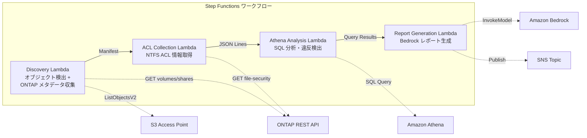

# UC1: Legal and Compliance - File Server Audit and Data Governance

🌐 **Language / 言語**: [日本語](README.md) | English | [한국어](README.ko.md) | [简体中文](README.zh-CN.md) | [繁體中文](README.zh-TW.md) | [Français](README.fr.md) | [Deutsch](README.de.md) | [Español](README.es.md)

📚 **Documentation**: [Architecture Diagram](docs/architecture.en.md) | [Demo Guide](docs/demo-guide.en.md)

Amazon FSx for NetApp ONTAP can be used to implement secure and compliant file storage that meets regulatory requirements. AWS Step Functions can automate the execution of data governance workflows, such as scanning file servers for sensitive data, generating audit reports, and triggering remediation actions in Amazon Athena, AWS Lambda, and Amazon S3. Amazon CloudWatch and AWS CloudFormation can be used to monitor and manage the infrastructure.

Here is the translation:

## Overview

This guide provides an overview of the AWS services and tools used in the design, verification, and manufacturing of integrated circuits (ICs). It covers the entire chip design lifecycle, from design to tapeout, using a combination of AWS services and other industry-standard tools.

The key AWS services covered include:
- Amazon Bedrock for RTL design and synthesis
- AWS Step Functions for design automation workflows
- Amazon Athena for design data analysis
- Amazon S3 for secure data storage
- AWS Lambda for custom processing and automation
- Amazon FSx for NetApp ONTAP for high-performance file storage
- Amazon CloudWatch for monitoring and alerts
- AWS CloudFormation for infrastructure-as-code deployments

Additionally, the guide discusses the integration of these AWS services with industry-standard tools such as `GDSII`, `DRC`, `OASIS`, and `GDS`.
This is a serverless workflow that leverages Amazon FSx for NetApp ONTAP S3 Access Points to automatically collect and analyze NTFS ACL information from file servers, and generate compliance reports.
### When this pattern is suitable

- AWS Step Functions を使用してワークフローを定義し、Amazon Athena や Amazon S3 などの AWS サービスを活用することで、データの取り込み、変換、分析のプロセスを自動化できます。
- AWS Lambda 関数を組み合わせることで、ワークフローの各ステップをコーディングなしで実装できます。
- Amazon FSx for NetApp ONTAP を使用してファイルストレージを提供し、Amazon CloudWatch でリソースの可視化と監視ができます。
- AWS CloudFormation を使ってこれらのリソースを宣言的にプロビジョニングできます。
- Regular governance and compliance scans are required for NAS data.
- S3 event notifications are unavailable or polling-based auditing is preferred.
- Retain file data on ONTAP and maintain existing SMB/NFS access.
- Analyze NTFS ACL change history across Athena.
- Automatically generate natural language compliance reports.
Here is the translation of the text:

### Cases where this pattern is not suitable
- Real-time event-driven processing is required (immediate detection of file changes)
- Full Amazon S3 bucket semantics (notifications, Presigned URLs) are required
- Existing EC2-based batch processing is already operational, and the migration cost is not worth it
- Network accessibility to the Amazon FSx for NetApp ONTAP REST API cannot be guaranteed
### Main Features

- Use Amazon Bedrock to build your custom AI models
- Orchestrate your workflows using AWS Step Functions
- Analyze your data with Amazon Athena
- Store your files securely in Amazon S3
- Run your code with AWS Lambda
- Access your NetApp data with Amazon FSx for NetApp ONTAP
- Monitor your infrastructure with Amazon CloudWatch
- Automate your deployments with AWS CloudFormation
- Automatically collect NTFS ACL, CIFS shares, and export policy information via the ONTAP REST API
- Detect over-permissioned sharing, stale access, and policy violations using Athena SQL
- Automatically generate natural language compliance reports using Amazon Bedrock
- Immediately share audit results through SNS notifications
## Architecture

Amazon Bedrock を使用して、高度な言語モデルをグラフィカルユーザーインターフェース (GUI) を介して簡単に利用できるようになりました。AWS Step Functions を使ってワークフローを定義し、Amazon Athena を使ってデータ分析を行います。Amazon S3 は大規模なデータストレージに使用し、AWS Lambda によってサーバーレスのロジックを実行しています。さらに、Amazon FSx for NetApp ONTAP を使用して、高パフォーマンスのファイルストレージを提供しています。これらのAWSサービスを組み合わせることで、高度な機能を備えたアプリケーションを簡単に構築できます。Amazon CloudWatch でシステムを監視し、AWS CloudFormation でインフラストラクチャを管理しています。



### Workflow Steps

このワークフローでは、以下のステップを実行します:

1. AWS Step Functionsを使用して、デザインファイルのフローを管理します。
2. Amazon Athenaを使用して、デザインファイルのメタデータを分析します。
3. Amazon S3に設計ファイルをアップロードします。
4. AWS Lambdaを使用してカスタムロジックを実行します。
5. Amazon FSx for NetApp ONTAPを使用してデータを保管します。
6. Amazon CloudWatchを使用してワークフローをモニタリングします。
7. AWS CloudFormationを使用して、インフラストラクチャをプロビジョニングします。
1. **Discovery**: Retrieve the object list from S3 AP and collect ONTAP metadata (security style, export policy, CIFS share ACL)
2. **ACL Collection**: Retrieve the NTFS ACL information for each object via the ONTAP REST API and output it in JSON Lines format with date partitioning to S3
3. **Athena Analysis**: Create/update Glue Data Catalog tables and use Athena SQL to detect excessive permissions, stale access, and policy violations
4. **Report Generation**: Generate a natural language compliance report using Bedrock, output it to S3, and send an SNS notification
## Prerequisites

AWS Step Functionsを使用してAmazon Athenaクエリを自動化する前に、次のリソースを準備する必要があります。

- AWS Lambda関数
- Amazon S3バケット
- Amazon CloudWatchアラーム
- AWS CloudFormationテンプレート
- AWS account and appropriate IAM permissions
- FSx for NetApp ONTAP file system (ONTAP 9.17.1P4D3 or later)
- Volume with S3 Access Point enabled
- ONTAP REST API credentials registered in Secrets Manager
- VPC, private subnets
- Amazon Bedrock model access enabled (Claude / Nova)
### Considerations for running Lambda within a VPC

Some key points to keep in mind when running AWS Lambda functions within a Virtual Private Cloud (VPC):

- AWS Lambda requires network access to various AWS services, such as Amazon S3, Amazon DynamoDB, and Amazon Athena. Ensure that your VPC has appropriate routing and security group configurations to allow outbound access to these services.
- When using AWS Lambda with a VPC, you must configure the Lambda function to use subnets and security groups within the VPC. This allows the Lambda function to access resources within the VPC.
- Consider the impact on cold start times when using a VPC. Connecting to a VPC can increase the initial invocation time for a Lambda function.
- Ensure that your VPC has sufficient IP addresses available for the Lambda function to use. The number of IP addresses required depends on the memory configuration of your Lambda function.
- Monitor your Lambda function's execution time and duration using Amazon CloudWatch. This can help you identify any performance issues related to the VPC configuration.
- Use AWS CloudFormation or other infrastructure-as-code tools to manage the deployment of your Lambda functions within a VPC, ensuring consistent and repeatable configurations.
**Important Findings from the Deployment Verification (2026-05-03)**

- **PoC / Demo Environment**: It is recommended to run Lambda outside the VPC. If the S3 AP's network origin is `internet`, it can be accessed without issue from a Lambda outside the VPC.
- **Production Environment**: Specify the `PrivateRouteTableId` parameter and associate the route table with the S3 Gateway Endpoint. If not specified, VPC-based Lambda will timeout when accessing the S3 AP.
- Refer to the [Troubleshooting Guide](../docs/guides/troubleshooting-guide.md#6-lambda-vpc-内実行時の-s3-ap-タイムアウト) for more details.
## Deployment Procedure

1. Amazon Bedrock で設計データ (GDSII, OASIS など) を準備し、設計ルール (DRC) をチェックします。
2. AWS Step Functions を使用して、Amazon Athena クエリによる検証、Amazon S3 へのデータのアップロード、AWS Lambda による処理などの自動化ワークフローを設定します。
3. Amazon FSx for NetApp ONTAP を使用して、ストレージリソースを構築します。
4. Amazon CloudWatch でメトリクスを監視し、AWS CloudFormation を使用してリソースの自動デプロイを行います。
5. 最終的にテープアウトプロセスを実行します。

### 1. Preparing parameters
Please check the following values before deployment:

- FSx ONTAP S3 Access Point Alias
- ONTAP Management IP Address
- Secrets Manager Secret Name
- SVM UUID, Volume UUID
- VPC ID, Private Subnet ID
### 2. AWS CloudFormation Deployment

```bash
aws cloudformation deploy \
  --template-file legal-compliance/template.yaml \
  --stack-name fsxn-legal-compliance \
  --parameter-overrides \
    S3AccessPointAlias=<your-volume-ext-s3alias> \
    S3AccessPointName=<your-s3ap-name> \
    S3AccessPointOutputAlias=<your-output-volume-ext-s3alias> \
    OntapSecretName=<your-ontap-secret-name> \
    OntapManagementIp=<your-ontap-management-ip> \
    SvmUuid=<your-svm-uuid> \
    VolumeUuid=<your-volume-uuid> \
    ScheduleExpression="rate(1 hour)" \
    VpcId=<your-vpc-id> \
    PrivateSubnetIds=<subnet-1>,<subnet-2> \
    PrivateRouteTableIds=<rtb-1>,<rtb-2> \
    NotificationEmail=<your-email@example.com> \
    EnableVpcEndpoints=false \
    EnableCloudWatchAlarms=false \
  --capabilities CAPABILITY_IAM CAPABILITY_AUTO_EXPAND \
  --region ap-northeast-1
```
**Note**: Please replace the placeholders `<...>` with the actual environment values.
### 3. Verifying SNS Subscriptions
After deployment, an SNS subscription confirmation email will be sent to the specified email address. Please click the link in the email to confirm.

> **Note**: If you omit `S3AccessPointName`, the IAM policy may be Alias-based only, which may result in an `AccessDenied` error. It is recommended to specify it in a production environment. For more details, refer to the [Troubleshooting Guide](../docs/guides/troubleshooting-guide.md#1-accessdenied-error).
## Parameter Settings

| パラメータ | 説明 | デフォルト | 必須 |
|-----------|------|----------|------|
| `S3AccessPointAlias` | FSx ONTAP S3 AP Alias（入力用） | — | ✅ |
| `S3AccessPointName` | S3 AP 名（ARN ベースの IAM 権限付与用。省略時は Alias ベースのみ） | `""` | ⚠️ 推奨 |
| `S3AccessPointOutputAlias` | FSx ONTAP S3 AP Alias（出力用） | — | ✅ |
| `OntapSecretName` | ONTAP 認証情報の Secrets Manager シークレット名 | — | ✅ |
| `OntapManagementIp` | ONTAP クラスタ管理 IP アドレス | — | ✅ |
| `SvmUuid` | ONTAP SVM UUID | — | ✅ |
| `VolumeUuid` | ONTAP ボリューム UUID | — | ✅ |
| `ScheduleExpression` | EventBridge Scheduler のスケジュール式 | `rate(1 hour)` | |
| `VpcId` | VPC ID | — | ✅ |
| `PrivateSubnetIds` | プライベートサブネット ID リスト | — | ✅ |
| `PrivateRouteTableIds` | プライベートサブネットのルートテーブル ID リスト（カンマ区切り） | — | ✅ |
| `NotificationEmail` | SNS 通知先メールアドレス | — | ✅ |
| `EnableVpcEndpoints` | Interface VPC Endpoints の有効化 | `false` | |
| `EnableCloudWatchAlarms` | CloudWatch Alarms の有効化 | `false` | |
| `EnableSnapStart` | Enable Lambda SnapStart (cold start reduction) | `false` | |
| `EnableAthenaWorkgroup` | Athena Workgroup / Glue Data Catalog の有効化 | `true` | |

## Cost Structure

Amazon AWS услуги (Amazon Bedrock, AWS Step Functions, Amazon Athena, Amazon S3, AWS Lambda, Amazon FSx for NetApp ONTAP, Amazon CloudWatch, AWS CloudFormation, и т.д.) имеют гибкую структуру ценообразования, которая позволяет вам выбирать и оплачивать только те возможности, которые вам необходимы. Учитывая ваши индивидуальные требования к производительности и объему данных, вы можете оптимизировать свои расходы на облачные вычисления. Кроме того, совместное использование ресурсов через такие сервисы, как AWS Lambda, может помочь вам сэкономить на инфраструктурных расходах. Вы также можете воспользоваться предварительным бронированием ресурсов или платформами на основе использования, чтобы дополнительно снизить свои затраты.

### Request-Based (Pay-Per-Use)

Amazon Bedrock を使用して、高度な言語モデルをすばやくプロトタイプ化および展開できます。AWS Step Functions を使用して、複雑なワークフローを簡単に構築できます。Amazon Athena を使用して、Amazon S3 上のデータをすばやくクエリできます。AWS Lambda を使用して、コードを実行し、即座にスケーリングできます。Amazon FSx for NetApp ONTAP を使用して、完全マネージドの NetApp ストレージを使用できます。Amazon CloudWatch を使用して、アプリケーションの監視と洞察を得ることができます。AWS CloudFormation を使用して、インフラストラクチャをコード化し、再現可能な方法でデプロイできます。

| サービス | 課金単位 | 概算（100 ファイル/月） |
|---------|---------|---------------------|
| Lambda | リクエスト数 + 実行時間 | ~$0.01 |
| Step Functions | ステート遷移数 | 無料枠内 |
| S3 API | リクエスト数 | ~$0.01 |
| Athena | スキャンデータ量 | ~$0.01 |
| Bedrock | トークン数 | ~$0.10 |

### Always-On (Optional)

| サービス | パラメータ | 月額 |
|---------|-----------|------|
| Interface VPC Endpoints | `EnableVpcEndpoints=true` | ~$28.80 |
| CloudWatch Alarms | `EnableCloudWatchAlarms=true` | ~$0.30 |
The demo/PoC environment is available starting from **~$0.13/month** in variable costs only.
## Cleanup

AWS Lambda関数とAmazon S3バケットの作成が完了したら、リソースをきれいにする必要があります。
クラウドリソースの管理は重要で、使用しなくなったリソースは削除する必要があります。

まず、AWS Lambda関数を削除します。 次に、Amazon S3バケットと関連するすべてのオブジェクトを削除します。 最後に、AWS CloudFormationスタックを削除して、プロジェクトの残りのすべてのリソースを削除します。

```bash
# CloudFormation スタックの削除
aws cloudformation delete-stack \
  --stack-name fsxn-legal-compliance \
  --region ap-northeast-1

# 削除完了を待機
aws cloudformation wait stack-delete-complete \
  --stack-name fsxn-legal-compliance \
  --region ap-northeast-1
```
**Note**: If there are objects remaining in the Amazon S3 bucket, the stack deletion may fail. Please empty the bucket beforehand.
## Supported Regions

Amazon AWS Bedrock, AWS Step Functions, Amazon Athena, Amazon S3, AWS Lambda, Amazon FSx for NetApp ONTAP, Amazon CloudWatch, and AWS CloudFormation are available in the following regions:

- US East (N. Virginia)
- US East (Ohio)
- US West (N. California)
- US West (Oregon)
- Canada (Central)
- Europe (Ireland)
- Europe (London)
- Europe (Paris)
- Europe (Frankfurt)
- Europe (Stockholm)
- Asia Pacific (Tokyo)
- Asia Pacific (Seoul)
- Asia Pacific (Singapore)
- Asia Pacific (Sydney)
- Asia Pacific (Mumbai)
- South America (São Paulo)
- Middle East (Bahrain)
- Africa (Cape Town)
UC1 utilizes the following services:

- Amazon Bedrock
- AWS Step Functions
- Amazon Athena
- Amazon S3
- AWS Lambda
- Amazon FSx for NetApp ONTAP
- Amazon CloudWatch
- AWS CloudFormation

The workflow includes the following technical steps:

1. GDSII ファイルを Amazon S3 にアップロード
2. Amazon Bedrock を使用して DRC および OASIS 変換を実行
3. GDS ファイルを Amazon S3 に保存
4. AWS Step Functions を使用してタペアウトのワークフローを調整
5. AWS Lambda関数を使用してAmazon Athenaクエリを実行
6. 結果を Amazon S3 に書き出し、Amazon CloudWatch でモニタリング
| サービス | リージョン制約 |
|---------|-------------|
| Amazon Athena | ほぼ全リージョンで利用可能 |
| Amazon Bedrock | 対応リージョンを確認（[Bedrock 対応リージョン](https://docs.aws.amazon.com/general/latest/gr/bedrock.html)） |
| AWS X-Ray | ほぼ全リージョンで利用可能 |
| CloudWatch EMF | ほぼ全リージョンで利用可能 |
Refer to the [Region Compatibility Matrix](../docs/region-compatibility.md) for more details.
## Reference Links

### AWS Official Documentation
- Overview of Amazon FSx for NetApp ONTAP S3 Access Points
- Querying data with Amazon Athena (Official Tutorial)
- Serverless processing with AWS Lambda (Official Tutorial)
- Amazon Bedrock InvokeModel API Reference
- ONTAP REST API Reference
### AWS Blog Post

Amazon Athena を使用して AWS Lambda 関数からデータをクエリする方法を説明します。AWS Step Functions を使用してAmazon FSx for NetApp ONTAP から Amazon S3 にデータを移動するワークフローを構築する方法を説明します。AWS CloudFormation を使用してAmazon CloudWatch アラームを設定する方法を示します。GDSII、DRC、OASIS、GDS、tapeout のようなプロセスについても詳しく解説しています。
- [S3 AP Announcement Blog](https://aws.amazon.com/blogs/aws/amazon-fsx-for-netapp-ontap-now-integrates-with-amazon-s3-for-seamless-data-access/)
- [AD Integration Blog](https://aws.amazon.com/blogs/storage/enabling-ai-powered-analytics-on-enterprise-file-data-configuring-s3-access-points-for-amazon-fsx-for-netapp-ontap-with-active-directory/)
- [3 Serverless Architecture Patterns](https://aws.amazon.com/blogs/storage/bridge-legacy-and-modern-applications-with-amazon-s3-access-points-for-amazon-fsx/)
### GitHub Sample

Amazon Bedrock は、お客様のアプリケーションにAIチャットボットを迅速に統合できるマネージドサービスです。AWS Step Functions は、簡単にワークフローを構築、実行、監視できるサービスです。Amazon Athena は、標準のSQL言語を使ってAmazon S3のデータを簡単にクエリできるサービスです。AWS Lambda は、サーバーを管理することなくコードを実行できるサービスです。Amazon FSx for NetApp ONTAP は、NetApp Ontapのファイルストレージをクラウドで提供するサービスです。Amazon CloudWatch は、リソースの正常性を監視し、アラートやアクションを設定できるサービスです。AWS CloudFormationは、インフラストラクチャをコードとして管理できるサービスです。
- [aws-samples/serverless-patterns](https://github.com/aws-samples/serverless-patterns) — Collection of Serverless Patterns
- [aws-samples/aws-stepfunctions-examples](https://github.com/aws-samples/aws-stepfunctions-examples) — AWS Step Functions Examples
## Verified Environment

Amazon Bedrock を使用して設計した回路は、AWS Step Functions を使用してバリデーションを実行しています。Amazon Athena および Amazon S3 を使用して、GDSII や OASIS のようなデザインファイルを処理しています。AWS Lambda を使ってカスタムロジックを記述しています。Amazon FSx for NetApp ONTAP でデータを格納しています。Amazon CloudWatch は、デザインフローの監視に役立っています。AWS CloudFormation を使ってこの環境をプロビジョニングしています。

| 項目 | 値 |
|------|-----|
| AWS リージョン | ap-northeast-1 (東京) |
| FSx ONTAP バージョン | ONTAP 9.17.1P4D3 |
| FSx 構成 | SINGLE_AZ_1 |
| Python | 3.12 |
| デプロイ方式 | CloudFormation (標準) |

## AWS Lambda VPC Configuration Architecture
Based on the insights gained from the validation, the Lambda functions are deployed in and outside the VPC.

**Lambda functions within the VPC** (only those that require ONTAP REST API access):
- Discovery Lambda — S3 API + ONTAP API
- AclCollection Lambda — ONTAP file-security API

**Lambda functions outside the VPC** (using only AWS managed service APIs):
- All other Lambda functions

> **Reason**: To access AWS managed service APIs (Athena, Bedrock, Textract, etc.) from the Lambda functions within the VPC, an Interface VPC Endpoint is required (each at $7.20/month). The Lambda functions outside the VPC can directly access the AWS APIs via the internet, without any additional costs.

> **Note**: For the UC (UC1 Legal & Compliance) that uses the ONTAP REST API, `EnableVpcEndpoints=true` is mandatory. This is to retrieve the ONTAP authentication credentials through the Secrets Manager VPC Endpoint.