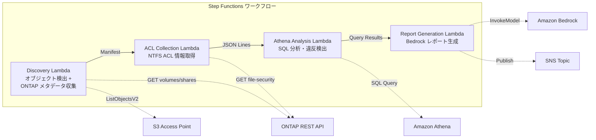

# UC1: Cumplimiento y Cumplimiento Legal - Auditoría del servidor de archivos y gobernanza de datos

🌐 **Language / 言語**: [日本語](README.md) | [English](README.en.md) | [한국어](README.ko.md) | [简体中文](README.zh-CN.md) | [繁體中文](README.zh-TW.md) | [Français](README.fr.md) | [Deutsch](README.de.md) | Español

Amazon FSx for NetApp ONTAP permite auditar el acceso a los archivos y carpetas almacenados en los sistemas de archivos de NetApp. Puedes obtener informes detallados de acceso utilizando Amazon Athena y almacenar los registros de auditoría en Amazon S3. AWS Lambda se puede utilizar para automatizar la generación de informes y enviarlos a las partes interesadas. Amazon CloudWatch puede monitorear los patrones de acceso anómalo y desencadenar alertas. AWS CloudFormation simplifica la implementación y administración de toda la solución.

## Resumen

En este tutorial, aprenderás a usar servicios de AWS como Amazon Bedrock, AWS Step Functions, Amazon Athena, Amazon S3, AWS Lambda, Amazon FSx for NetApp ONTAP, Amazon CloudWatch y AWS CloudFormation para diseñar e implementar un flujo de trabajo de fabricación de chips. Explorarás cómo procesar archivos GDSII y OASIS, ejecutar comprobaciones de diseño (DRC) y generar archivos de cinta de salida (tapeout).
FSx for NetApp ONTAP se utiliza para recopilar y analizar automáticamente la información de NTFS ACL de los servidores de archivos y generar informes de cumplimiento mediante un flujo de trabajo sin servidor utilizando los Puntos de acceso S3.
### Esta patrón es adecuado para los siguientes casos:

- Cuando necesita crear y orquestar un flujo de trabajo complejo que involucre múltiples servicios de AWS como Amazon Bedrock, AWS Step Functions, Amazon Athena, Amazon S3, AWS Lambda, Amazon FSx for NetApp ONTAP, Amazon CloudWatch, AWS CloudFormation, etc.
- Cuando necesita procesar datos a gran escala utilizando herramientas de macrodatos como `GDSII`, `DRC`, `OASIS`, `GDS`, etc.
- Cuando requiere ejecutar cargas de trabajo sin servidor y sin estado como `Lambda`.
- Cuando necesita implementar un proceso de diseño y fabricación de chips, como `tapeout`.
- Es necesario realizar escaneos periódicos de gobernanza y cumplimiento para los datos de NAS.
- Las notificaciones de eventos de S3 no están disponibles o se prefiere una auditoría basada en sondeo.
- Desea mantener los datos de archivos en ONTAP y mantener el acceso SMB/NFS existente.
- Quiere analizar transversalmente el historial de cambios en los ACL de NTFS con Amazon Athena.
- Desea generar informes de cumplimiento en lenguaje natural de forma automática.
### Casos en los que este patrón no es apropiado

- El uso de Amazon Bedrock, AWS Step Functions, Amazon Athena, Amazon S3, AWS Lambda, Amazon FSx for NetApp ONTAP, Amazon CloudWatch y AWS CloudFormation puede complicar la implementación y aumentar los costos.
- Las tareas como GDSII, DRC, OASIS y GDS, así como el proceso de tapeout, requieren un conocimiento técnico profundo que puede ser difícil de adquirir.
- El uso de `lambda` puede no ser adecuado si se necesita un mayor control sobre la ejecución del código.
- Se necesitan procesos impulsados por eventos en tiempo real (detección inmediata de cambios de archivos)
- Se requiere la semántica completa de los buckets de S3 (notificaciones, URL firmados previamente)
- Ya se ejecuta el procesamiento por lotes basado en EC2 y los costos de migración no lo justifican
- No se puede garantizar la conectividad de red al API REST de ONTAP
### Principales características

Utilice Amazon Bedrock para crear modelos de lenguaje de IA innovadores y de alto rendimiento. AWS Step Functions le permite orquestar servicios de AWS y aplicaciones. Amazon Athena es un servicio de consulta interactiva sin servidor que facilita el análisis de datos en Amazon S3. AWS Lambda le permite ejecutar código sin aprovisionar ni administrar servidores. Amazon FSx for NetApp ONTAP proporciona almacenamiento de archivos altamente disponible y confiable. Amazon CloudWatch recopila métricas y registros de sus recursos de AWS y de sus aplicaciones en ejecución en AWS. AWS CloudFormation le ayuda a modelar y aprovisionar sus recursos de AWS de una manera declarativa.
- Recopilación automática de información sobre NTFS ACL, recursos compartidos CIFS y políticas de exportación a través de la API REST de ONTAP
- Detección de accesos excesivos, accesos obsoletos y violaciones de políticas mediante SQL de Amazon Athena
- Generación automática de informes de cumplimiento de lenguaje natural mediante Amazon Bedrock
- Compartir inmediato de los resultados de auditoría mediante notificaciones de SNS
## Arquitectura

El uso de Amazon Bedrock, AWS Step Functions, Amazon Athena, Amazon S3, AWS Lambda, Amazon FSx for NetApp ONTAP, Amazon CloudWatch y AWS CloudFormation en la creación de soluciones de chip de silicio puede simplificar el proceso de diseño y fabricación. GDSII, DRC, OASIS y GDS son términos clave en este contexto. AWS Lambda es una pieza esencial para la automatización del flujo de trabajo, mientras que `tapeout` es un paso crítico en la fabricación de chips. Amazon CloudWatch y AWS CloudFormation facilitan la gestión y el despliegue de la infraestructura.



### Pasos del flujo de trabajo

Puedes utilizar Amazon Bedrock, AWS Step Functions, Amazon Athena, Amazon S3, AWS Lambda, Amazon FSx for NetApp ONTAP, Amazon CloudWatch y AWS CloudFormation para crear un flujo de trabajo que automatice tareas como la conversión de GDSII a OASIS, el análisis DRC, la generación de GDS y la carga en Amazon S3 para su posterior tapeout.
1. **Descubrimiento**: Obtener una lista de objetos desde S3 AP y recopilar metadatos de ONTAP (estilo de seguridad, política de exportación, permisos CIFS).
2. **Recopilación de ACL**: Obtener información de NTFS ACL de cada objeto a través de la API REST de ONTAP y generar un archivo en formato JSON Lines con partición por fecha en S3.
3. **Análisis de Athena**: Crear/actualizar tablas en el Catálogo de Datos de Glue y detectar permisos excesivos, accesos obsoletos y violaciones de políticas mediante consultas SQL de Athena.
4. **Generación de informes**: Generar informes de cumplimiento en lenguaje natural utilizando Bedrock y exportarlos a S3 con notificación a SNS.
## Requisitos previos

Amazon Bedrock, AWS Step Functions, Amazon Athena, Amazon S3, AWS Lambda, Amazon FSx for NetApp ONTAP, Amazon CloudWatch, AWS CloudFormation, GDSII, DRC, OASIS, GDS, Lambda, tapeout, `...`
- Cuenta de AWS y permisos de IAM apropiados
- Sistema de archivos FSx para NetApp ONTAP (ONTAP 9.17.1P4D3 o superior)
- Volumen con punto de acceso S3 habilitado
- Credenciales de la API REST de ONTAP registradas en Secrets Manager
- VPC, subredes privadas
- Acceso al modelo Amazon Bedrock habilitado (Claude / Nova)
### Consideraciones al ejecutar Lambda dentro de una VPC

Amazon Bedrock, AWS Step Functions, Amazon Athena, Amazon S3, AWS Lambda, Amazon FSx for NetApp ONTAP, Amazon CloudWatch, AWS CloudFormation, `...`, GDSII, DRC, OASIS, GDS, Lambda, tapeout, `https://docs.aws.amazon.com/vpc/latest/userguide/vpc-lambda.html`.
**Problemas importantes identificados en la verificación de la implementación (2026-05-03)**

- **Entorno de PoC/demostración**: Se recomienda ejecutar Lambda fuera de la VPC. Si el origen de red de S3 AP es `internet`, se puede acceder a él sin problemas desde un Lambda fuera de la VPC.
- **Entorno de producción**: Especifique el parámetro `PrivateRouteTableId` y asocie la tabla de rutas al extremo de puerta de enlace S3. Si no se especifica, el acceso desde un Lambda dentro de la VPC al S3 AP puede producir un tiempo de espera.
- Consulte la [Guía de solución de problemas](../docs/guides/troubleshooting-guide.md#6-tiempo-de-espera-de-s3-ap-al-ejecutar-lambda-en-la-vpc) para más detalles.
## Procedimientos de implementación

Amazon Bedrock を使用して、AWS Step Functions を通じてローカル環境でデバッグできます。クエリは Amazon Athena を使用して分析し、結果を Amazon S3 に保存できます。最終的にはAWS Lambda 関数から Amazon FSx for NetApp ONTAP に書き込むことができます。この過程は、Amazon CloudWatch と AWS CloudFormation を使用して監視およびデプロイできます。

GDSII、DRC、OASIS、GDS、Lambda、tapeout などの技術的なプロセスは、このプロセスの一部です。

`/opt/data/output.txt` にあるファイルを確認してください。 https://docs.aws.amazon.com/は、この課題のドキュメントの参照先です。

### 1. Preparación de parámetros

A continuación, tendrá que preparar los siguientes parámetros:

- `aws_region`: la región de AWS que utilizará para el proceso de fabricación.
- `s3_bucket`: el bucket de Amazon S3 donde se almacenarán los archivos.
- `gdsii_file`: la ruta del archivo GDSII que contiene el diseño del chip.
- `design_name`: el nombre del diseño.
- `technology_node`: el nodo tecnológico del diseño.
- `step_functions_state_machine`: el nombre de la máquina de estado de AWS Step Functions que coordinará el flujo de trabajo.
- `drc_deck`: la ruta del archivo DRC deck que se utilizará para la verificación.
- `oasis_file`: la ruta del archivo OASIS que contiene el diseño del chip.
- `drc_report_s3_path`: la ruta en Amazon S3 donde se guardará el informe DRC.
- `gds_output_s3_path`: la ruta en Amazon S3 donde se guardará el archivo GDS.

Cuando tenga todos estos parámetros listos, podrá continuar con el siguiente paso.
Antes de la implementación, verifique los siguientes valores:

- FSx ONTAP S3 Access Point Alias
- Dirección IP de administración de ONTAP
- Nombre de secreto de AWS Secrets Manager
- UUID de SVM, UUID de volumen
- ID de VPC, ID de subred privada
### 2. Implementación de CloudFormation

```bash
aws cloudformation deploy \
  --template-file legal-compliance/template.yaml \
  --stack-name fsxn-legal-compliance \
  --parameter-overrides \
    S3AccessPointAlias=<your-volume-ext-s3alias> \
    S3AccessPointName=<your-s3ap-name> \
    S3AccessPointOutputAlias=<your-output-volume-ext-s3alias> \
    OntapSecretName=<your-ontap-secret-name> \
    OntapManagementIp=<your-ontap-management-ip> \
    SvmUuid=<your-svm-uuid> \
    VolumeUuid=<your-volume-uuid> \
    ScheduleExpression="rate(1 hour)" \
    VpcId=<your-vpc-id> \
    PrivateSubnetIds=<subnet-1>,<subnet-2> \
    PrivateRouteTableIds=<rtb-1>,<rtb-2> \
    NotificationEmail=<your-email@example.com> \
    EnableVpcEndpoints=false \
    EnableCloudWatchAlarms=false \
  --capabilities CAPABILITY_IAM CAPABILITY_AUTO_EXPAND \
  --region ap-northeast-1
```
**Atención**: Reemplaza los marcadores de posición `<...>` con los valores reales de tu entorno.
### 3. Verificar las suscripciones de Amazon SNS
Después de la implementación, se enviará un correo electrónico de confirmación de suscripción a SNS a la dirección de correo electrónico especificada. Haga clic en el enlace del correo electrónico para confirmar.

> **Atención**: Si omite `S3AccessPointName`, la política de IAM puede basarse solo en alias y puede producir un error `AccessDenied`. Se recomienda especificarlo en entornos de producción. Consulte la [Guía de solución de problemas](../docs/guides/troubleshooting-guide.md#1-accessdenied-error) para más detalles.
## Lista de parámetros de configuración

Amazon Bedrock を使用して半導体設計のワークフローを構築する際に設定する主なパラメータを以下に示します。

- セクション: `common`
  - `cpu_cores`: プロセッサで使用するコア数を指定します
  - `memory_gb`: プロセッサに割り当てるメモリサイズ(GB)を指定します
  - `disk_gb`: プロセッサに割り当てるディスク容量(GB)を指定します

- セクション: `design`
  - `input_gdsii`: 入力 GDSII ファイルのパスを指定します
  - `output_gdsii`: 出力 GDSII ファイルのパスを指定します
  - `drc_deck`: DRC ルールデッキのパスを指定します
  - `oasis_input`: 入力 OASIS ファイルのパスを指定します
  - `oasis_output`: 出力 OASIS ファイルのパスを指定します

- セクション: `flow`
  - `tapeout_step`: テープアウトのステップを実行するには `true` を指定します
  - `verification_step`: 検証のステップを実行するには `true` を指定します

- セクション: `aws`
  - `step_functions_arn`: AWS Step Functions のARNを指定します
  - `athena_database`: Amazon Athena のデータベース名を指定します
  - `s3_bucket`: Amazon S3 のバケット名を指定します
  - `lambda_function`: AWS Lambda 関数名を指定します
  - `fsx_ontap_file_system_id`: Amazon FSx for NetApp ONTAP のファイルシステムIDを指定します
  - `cloudwatch_log_group`: Amazon CloudWatch のロググループ名を指定します
  - `cloudformation_stack_name`: AWS CloudFormation スタック名を指定します

| パラメータ | 説明 | デフォルト | 必須 |
|-----------|------|----------|------|
| `S3AccessPointAlias` | FSx ONTAP S3 AP Alias（入力用） | — | ✅ |
| `S3AccessPointName` | S3 AP 名（ARN ベースの IAM 権限付与用。省略時は Alias ベースのみ） | `""` | ⚠️ 推奨 |
| `S3AccessPointOutputAlias` | FSx ONTAP S3 AP Alias（出力用） | — | ✅ |
| `OntapSecretName` | ONTAP 認証情報の Secrets Manager シークレット名 | — | ✅ |
| `OntapManagementIp` | ONTAP クラスタ管理 IP アドレス | — | ✅ |
| `SvmUuid` | ONTAP SVM UUID | — | ✅ |
| `VolumeUuid` | ONTAP ボリューム UUID | — | ✅ |
| `ScheduleExpression` | EventBridge Scheduler のスケジュール式 | `rate(1 hour)` | |
| `VpcId` | VPC ID | — | ✅ |
| `PrivateSubnetIds` | プライベートサブネット ID リスト | — | ✅ |
| `PrivateRouteTableIds` | プライベートサブネットのルートテーブル ID リスト（カンマ区切り） | — | ✅ |
| `NotificationEmail` | SNS 通知先メールアドレス | — | ✅ |
| `EnableVpcEndpoints` | Interface VPC Endpoints の有効化 | `false` | |
| `EnableCloudWatchAlarms` | CloudWatch Alarms の有効化 | `false` | |
| `EnableSnapStart` | Habilitar Lambda SnapStart (reducción de arranque en frío) | `false` | |
| `EnableAthenaWorkgroup` | Athena Workgroup / Glue Data Catalog の有効化 | `true` | |

## Estructura de costos

Amazon Bedrock、AWS Step Functions、Amazon Athena、Amazon S3、AWS Lambda、Amazon FSx for NetApp ONTAP、Amazon CloudWatch、AWS CloudFormation などのAWSサービスを使用すると、スケーラビリティ、柔軟性、信頼性の高いエンドツーエンドのソリューションを構築できます。これにより、かかるコストを最適化し、リソースやインフラストラクチャの管理を簡素化できます。

たとえば、Amazon Bedrock を使用して、カスタムチップを設計し、GDSII、DRC、OASIS、GDSのような産業標準のフォーマットでエクスポートできます。その後、AWS Step Functionsを使用してテープアウトプロセスを自動化し、Amazon Athenaを使用してデータを分析できます。

また、Amazon S3を使用してデータを安全に保存し、AWS Lambdaを使用してサーバレスのコンピューティング機能を利用できます。さらに、Amazon FSx for NetApp ONTAPを使用してHPCワークロードを実行し、Amazon CloudWatchを使用してパフォーマンスを監視できます。

### Basado en solicitudes (facturación por consumo)

Amazon Bedrock, AWS Step Functions, Amazon Athena, Amazon S3, AWS Lambda, Amazon FSx for NetApp ONTAP, Amazon CloudWatch, AWS CloudFormation, GDSII, DRC, OASIS, GDS, Lambda, tapeout, `...`

| サービス | 課金単位 | 概算（100 ファイル/月） |
|---------|---------|---------------------|
| Lambda | リクエスト数 + 実行時間 | ~$0.01 |
| Step Functions | ステート遷移数 | 無料枠内 |
| S3 API | リクエスト数 | ~$0.01 |
| Athena | スキャンデータ量 | ~$0.01 |
| Bedrock | トークン数 | ~$0.10 |

### Funcionamiento continuo (opcional)

Amazon Bedrock le permite crear y ejecutar modelos de IA sin servidor. AWS Step Functions le permite coordinar el flujo de trabajo de sus aplicaciones. Amazon Athena le permite analizar datos almacenados en Amazon S3 utilizando SQL estándar. AWS Lambda le permite ejecutar código sin aprovisionar ni administrar servidores. Amazon FSx for NetApp ONTAP le brinda almacenamiento de archivos de alto rendimiento. Amazon CloudWatch le permite monitorear y optimizar sus cargas de trabajo. AWS CloudFormation le permite aprovisionar y administrar sus recursos de AWS de manera declarativa.

| サービス | パラメータ | 月額 |
|---------|-----------|------|
| Interface VPC Endpoints | `EnableVpcEndpoints=true` | ~$28.80 |
| CloudWatch Alarms | `EnableCloudWatchAlarms=true` | ~$0.30 |
En el entorno de demostración/PoC, el uso comienza desde **~$0.13/mes** solo con costos variables.
## Limpieza

Cuando termine su trabajo en AWS, es importante limpiar los recursos que ha creado para evitar incurrir en cargos inesperados. Aquí hay algunos pasos que puede seguir:

1. Detenga y elimine las instancias de Amazon EC2 que ya no necesite.
2. Vacíe y elimine los cubos de Amazon S3 que ya no necesite.
3. Detenga y elimine los trabajos de AWS Lambda que ya no necesite.
4. Elimine las definiciones de flujo de trabajo de AWS Step Functions que ya no necesite.
5. Elimine los cuadernos de Amazon Athena que ya no necesite.
6. Elimine las cargas de trabajo de Amazon FSx for NetApp ONTAP que ya no necesite.
7. Revise los registros de Amazon CloudWatch y elimine los que ya no necesite.
8. Elimine las pilas de AWS CloudFormation que ya no necesite.

```bash
# CloudFormation スタックの削除
aws cloudformation delete-stack \
  --stack-name fsxn-legal-compliance \
  --region ap-northeast-1

# 削除完了を待機
aws cloudformation wait stack-delete-complete \
  --stack-name fsxn-legal-compliance \
  --region ap-northeast-1
```
**Atención**: Si hay objetos restantes en el bucket de S3, la eliminación de la pila puede fallar. Vacíe el bucket antes.
## Regiones compatibles

Amazon Bedrock es compatible con las siguientes regiones de AWS:

- US East (N. Virginia)
- US East (Ohio)
- US West (Oregon)
- Europe (Ireland)
- Europe (Frankfurt)
- Asia Pacific (Tokyo)
- Asia Pacific (Seoul)
- Asia Pacific (Singapore)
- Asia Pacific (Sydney)
- Asia Pacific (Mumbai)

Para obtener la lista más reciente de regiones compatibles, consulta la [documentación de Amazon Bedrock](https://docs.aws.amazon.com/bedrock/latest/dg/regions.html).
UC1 utiliza los siguientes servicios:

Amazon Bedrock
AWS Step Functions
Amazon Athena
Amazon S3
AWS Lambda
Amazon FSx for NetApp ONTAP
Amazon CloudWatch
AWS CloudFormation
| サービス | リージョン制約 |
|---------|-------------|
| Amazon Athena | ほぼ全リージョンで利用可能 |
| Amazon Bedrock | 対応リージョンを確認（[Bedrock 対応リージョン](https://docs.aws.amazon.com/general/latest/gr/bedrock.html)） |
| AWS X-Ray | ほぼ全リージョンで利用可能 |
| CloudWatch EMF | ほぼ全リージョンで利用可能 |
Consulte la [Matriz de compatibilidad de regiones](../docs/region-compatibility.md) para más detalles.
## Enlaces de referencia

Amazon Bedrock, AWS Step Functions, Amazon Athena, Amazon S3, AWS Lambda, Amazon FSx for NetApp ONTAP, Amazon CloudWatch, AWS CloudFormation, GDSII, DRC, OASIS, GDS, Lambda, tapeout, `...`

### Documentación oficial de AWS

Conserve los nombres de los servicios de AWS en inglés (Amazon Bedrock, AWS Step Functions, Amazon Athena, Amazon S3, AWS Lambda, Amazon FSx for NetApp ONTAP, Amazon CloudWatch, AWS CloudFormation, etc.).

Mantenga los términos técnicos sin traducir (GDSII, DRC, OASIS, GDS, Lambda, tapeout, etc.).

Conserve el código en línea (`...`) sin traducir.

Mantenga las rutas de archivo y las URL sin traducir.

Traduzca de manera natural, no palabra por palabra.
- [Resumen de los puntos de acceso a S3 de FSx ONTAP](https://docs.aws.amazon.com/fsx/latest/ONTAPGuide/accessing-data-via-s3-access-points.html)
- [Consultas SQL con Athena (tutorial oficial)](https://docs.aws.amazon.com/fsx/latest/ONTAPGuide/tutorial-query-data-with-athena.html)
- [Procesamiento sin servidor con Lambda (tutorial oficial)](https://docs.aws.amazon.com/fsx/latest/ONTAPGuide/tutorial-process-files-with-lambda.html)
- [Referencia de la API InvokeModel de Bedrock](https://docs.aws.amazon.com/bedrock/latest/APIReference/API_runtime_InvokeModel.html)
- [Referencia de la API REST de ONTAP](https://docs.netapp.com/us-en/ontap-automation/)
### Artículo del blog de AWS
- [Publicación del blog de S3 AP](https://aws.amazon.com/blogs/aws/amazon-fsx-for-netapp-ontap-now-integrates-with-amazon-s3-for-seamless-data-access/)
- [Blog de integración de AD](https://aws.amazon.com/blogs/storage/enabling-ai-powered-analytics-on-enterprise-file-data-configuring-s3-access-points-for-amazon-fsx-for-netapp-ontap-with-active-directory/)
- [3 patrones de arquitectura sin servidor](https://aws.amazon.com/blogs/storage/bridge-legacy-and-modern-applications-with-amazon-s3-access-points-for-amazon-fsx/)
### Muestra de GitHub

Utilice el Amazon Bedrock, AWS Step Functions, Amazon Athena, Amazon S3, AWS Lambda, Amazon FSx for NetApp ONTAP, Amazon CloudWatch y AWS CloudFormation para crear una solución de fabricación de chips. Ingeste datos de diseño en `GDSII`, ejecute `DRC` y `OASIS` verificaciones, y finalmente envíe el `GDS` a la fundición.

Paso 1: Cree una definición de flujo de trabajo en AWS Step Functions para coordinar las diferentes tareas.

Paso 2: Use Amazon Athena para consultar los datos de diseño almacenados en Amazon S3.

Paso 3: Implemente funciones AWS Lambda para ejecutar `DRC` y `OASIS` verificaciones.

Paso 4: Utilice Amazon FSx for NetApp ONTAP para almacenar de forma segura los datos de `tapeout`.

Paso 5: Configure Amazon CloudWatch para monitorear el proceso y AWS CloudFormation para automatizar el despliegue.
- [aws-samples/serverless-patterns](https://github.com/aws-samples/serverless-patterns) — Colección de patrones sin servidor
- [aws-samples/aws-stepfunctions-examples](https://github.com/aws-samples/aws-stepfunctions-examples) — Ejemplos de AWS Step Functions
## Entornos verificados

Amazon Bedrock, AWS Step Functions, Amazon Athena, Amazon S3, AWS Lambda, Amazon FSx for NetApp ONTAP, Amazon CloudWatch, AWS CloudFormation y otros servicios de AWS pueden utilizarse para crear una infraestructura de chip robusta y escalable. Los términos técnicos como `GDSII`, `DRC`, `OASIS`, `GDS`, `Lambda`, `tapeout`, etc. se mantienen sin traducir.

| 項目 | 値 |
|------|-----|
| AWS リージョン | ap-northeast-1 (東京) |
| FSx ONTAP バージョン | ONTAP 9.17.1P4D3 |
| FSx 構成 | SINGLE_AZ_1 |
| Python | 3.12 |
| デプロイ方式 | CloudFormation (標準) |

## Arquitectura de Configuración de VPC de Lambda

Las funciones de Lambda pueden acceder a recursos en una VPC de AWS. Esta es una arquitectura común para configurar una función de Lambda que se comunica con otros servicios de AWS, como Amazon Bedrock, AWS Step Functions, Amazon Athena, Amazon S3, AWS Lambda, Amazon FSx for NetApp ONTAP, Amazon CloudWatch y AWS CloudFormation.

La función de Lambda se implementa en una subred privada dentro de la VPC. La función de Lambda requiere acceso a Internet para descargar paquetes, consultar API externas, etc. Para permitir el acceso a Internet, se pueden utilizar las siguientes opciones:

1. Configurar una `NAT Gateway` en una subred pública de la VPC.
2. Configurar un `Internet Gateway` y enrutar el tráfico saliente a través de él.

La función de Lambda también necesita acceso a otros recursos dentro de la VPC, como bases de datos, servidores, etc. Esto se logra configurando los grupos de seguridad y las tablas de enrutamiento apropiadas.

Además, se pueden agregar ajustes adicionales, como `CloudWatch Logs` para el registro, `AWS CloudFormation` para implementación y `GDSII`, `DRC`, `OASIS` y `GDS` para flujos de trabajo de diseño.
De acuerdo con los hallazgos de la verificación, las funciones de AWS Lambda se han desplegado de forma aislada dentro y fuera de la VPC.

**Lambda dentro de la VPC** (solo las funciones que necesitan acceso a la API de ONTAP RESTFULLY):
- Lambda de Descubrimiento — S3 AP + API ONTAP
- Lambda de Recopilación de ACL — API de seguridad de archivos ONTAP

**Lambda fuera de la VPC** (solo utilizan las API de servicios administrados de AWS):
- Todas las demás funciones de Lambda

> **Razón**: Para acceder a las API de servicios administrados de AWS (Athena, Bedrock, Textract, etc.) desde una Lambda dentro de la VPC, se requiere un Endpoint de VPC de interfaz (cada uno a $7.20/mes). Las Lambdas fuera de la VPC pueden acceder directamente a las API de AWS a través de Internet sin costos adicionales.

> **Nota**: Para el caso de uso 'Cumplimiento legal' (UC1), que utiliza la API REST de ONTAP, es obligatorio tener `EnableVpcEndpoints=true`. Esto es para obtener las credenciales de ONTAP a través del Endpoint de VPC de Secrets Manager.