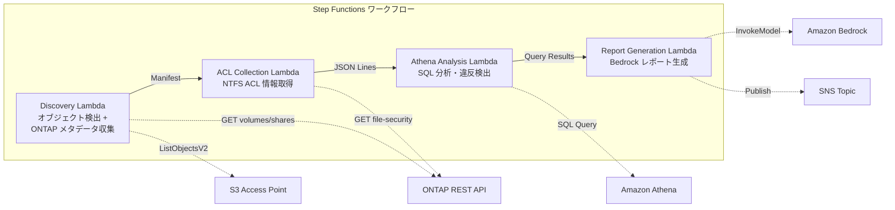

# UC1 : Conformité juridique et réglementaire - Audit du serveur de fichiers et gouvernance des données

🌐 **Language / 言語**: [日本語](README.md) | [English](README.en.md) | [한국어](README.ko.md) | [简体中文](README.zh-CN.md) | [繁體中文](README.zh-TW.md) | Français | [Deutsch](README.de.md) | [Español](README.es.md)

Exemple d'utilisation :
- Un cabinet d'avocats a besoin de surveiller l'accès à ses fichiers confidentiels et de générer des rapports de conformité.
- Une société de services financiers doit respecter des réglementations strictes en matière de conservation des données et de rapports périodiques.
- Une entreprise de fabrication doit s'assurer que seules les personnes autorisées accèdent aux plans de conception (GDSII, DRC, OASIS).

Solution proposée :
1. Utiliser Amazon FSx for NetApp ONTAP pour le stockage sécurisé des fichiers.
2. Configurer des stratégies d'accès granulaires avec AWS Step Functions.
3. Générer des rapports de conformité avec Amazon Athena et Amazon S3.
4. Surveiller l'utilisation et les erreurs avec Amazon CloudWatch.
5. Automatiser les pipelines de gouvernance des données avec AWS CloudFormation.

Voici la traduction en français :

## Résumé

Amazon Bedrock, AWS Step Functions, Amazon Athena, Amazon S3, AWS Lambda, Amazon FSx for NetApp ONTAP, Amazon CloudWatch, AWS CloudFormation, GDSII, DRC, OASIS, GDS, Lambda, tapeout, `...`
Utilisez les points d'accès S3 de FSx for NetApp ONTAP pour collecter et analyser automatiquement les informations sur les NTFS ACL des serveurs de fichiers, puis générez des rapports de conformité avec une architecture sans serveur.
### Les cas où ce modèle est adapté

Voici les cas où ce modèle est adapté :

- Lorsque vous développez des applications nécessitant un traitement de données en temps réel ou quasi-réel, comme des applications de streaming, d'analyse en temps réel ou d'apprentissage automatique.
- Lorsque vous avez besoin d'une infrastructure hautement évolutive et tolérante aux pannes pour vos charges de travail.
- Lorsque vous devez exécuter des tâches asynchrones de manière fiable et sans état, comme le traitement par lots, les notifications, les workflows, etc.
- Lorsque vous avez besoin d'intégrer facilement différents services AWS tels qu'Amazon Athena, Amazon S3, AWS Lambda, Amazon CloudWatch, etc.
- Lorsque vous devez gérer des workflows complexes avec des transitions d'état et des branchements conditionnels à l'aide d'AWS Step Functions.
- Un examen régulier de la gouvernance et de la conformité pour les données NAS est nécessaire
- Les notifications d'événements Amazon S3 ne sont pas disponibles ou une vérification basée sur le sondage est préférable
- Les données des fichiers doivent être conservées sur ONTAP et l'accès SMB/NFS existant doit être maintenu
- Nous souhaitons effectuer une analyse transversale des historiques de modifications des ACL NTFS avec Amazon Athena
- Nous voulons générer automatiquement des rapports de conformité en langage naturel
### Cas où ce modèle ne convient pas

- Vous avez besoin d'un traitement en temps réel très réactif, tel que la diffusion en continu ou les applications de jeux. Dans ces cas, vous devriez plutôt utiliser AWS Lambda ou AWS Step Functions.
- Votre charge de travail nécessite des calculs très intensifs, par exemple l'analyse de données volumineuses ou l'apprentissage automatique. Vous devriez alors envisager d'utiliser Amazon Athena, Amazon S3 et AWS Lambda.
- Votre application a besoin d'un stockage fichiers haute performance, comme c'est le cas pour les charges de travail multimédia ou les bases de données. Vous devriez plutôt utiliser Amazon FSx for NetApp ONTAP dans ce cas.
- Vous avez besoin d'une observabilité approfondie de votre application, notamment des métriques, des logs et des traces. Vous devriez alors utiliser Amazon CloudWatch et AWS CloudFormation.
- Un traitement événementiel en temps réel est nécessaire (détection instantanée des modifications de fichiers)
- Une sémantique complète de Amazon S3 (notifications, URL pré-signées) est nécessaire
- Le traitement par lots basé sur Amazon EC2 est déjà opérationnel, et le coût de migration ne se justifie pas
- L'accessibilité réseau aux API REST d'Amazon FSx for NetApp ONTAP ne peut pas être garantie
Voici la traduction en français :

### Principales fonctionnalités

- Conception de puces à l'aide d'Amazon Bedrock, un service de conception de semi-conducteurs
- Automatisation des processus de conception et de fabrication grâce à AWS Step Functions
- Analyse des données de conception avec Amazon Athena
- Stockage des fichiers de conception sur Amazon S3
- Exécution des tests et des simulations avec AWS Lambda
- Gestion des données de conception sur Amazon FSx for NetApp ONTAP
- Surveillance des processus de conception avec Amazon CloudWatch
- Déploiement de l'infrastructure de conception avec AWS CloudFormation
- Collecte automatique des informations sur les ACL NTFS, les partages CIFS et les politiques d'exportation via l'API REST ONTAP
- Détection des partages avec des autorisations excessives, des accès obsolètes et des violations de politique grâce à SQL Athena
- Génération automatique de rapports de conformité en langage naturel avec Amazon Bedrock
- Partage immédiat des résultats d'audit via des notifications SNS
## Architecture

Notre solution se compose des éléments suivants :

- Amazon Bedrock pour la conception et la fabrication de circuits intégrés
- AWS Step Functions pour orchestrer le flux de travail
- Amazon Athena pour l'analyse des données
- Amazon S3 pour le stockage des données
- AWS Lambda pour l'exécution de fonctions sans serveur
- Amazon FSx for NetApp ONTAP pour le stockage de fichiers haute performance
- Amazon CloudWatch pour la surveillance
- AWS CloudFormation pour la gestion d'infrastructure

Les étapes clés sont les suivantes :

1. Utilisez `gdsii2oasis` pour convertir les fichiers GDSII en format OASIS.
2. Lancez un flux de travail DRC à l'aide d'AWS Step Functions.
3. Exportez les fichiers GDS finaux vers Amazon S3.
4. Déclenchez un pipeline de tapeout avec AWS Lambda.
5. Surveillez le processus avec Amazon CloudWatch.



### étapes du flux de travail

Utilisez AWS Step Functions pour orchestrer vos services AWS dans une séquence cohérente. Configurez des étapes pour appeler Amazon Bedrock, Amazon Athena, Amazon S3, AWS Lambda, Amazon FSx for NetApp ONTAP, et d'autres services. Suivez l'exécution de votre flux de travail dans Amazon CloudWatch et utilisez AWS CloudFormation pour le déployer.
1. **Découverte** : Récupération de la liste des objets depuis S3 AP et collecte des métadonnées ONTAP (style de sécurité, politique d'exportation, ACL de partage CIFS)
2. **Collecte des ACL** : Récupération des informations d'ACL NTFS de chaque objet via l'API REST ONTAP, avec sortie au format JSON Lines dans S3 avec partitionnement par date
3. **Analyse Athena** : Création/mise à jour de tables dans le Glue Data Catalog, puis détection des privilèges excessifs, des accès obsolètes et des violations de politique via des requêtes SQL Athena
4. **Génération de rapports** : Génération de rapports de conformité en langage naturel via Bedrock, avec sortie dans S3 et notification SNS
Voici la traduction en français :

## Prérequis
- Compte AWS et autorisations IAM appropriées
- Système de fichiers FSx pour NetApp ONTAP (ONTAP 9.17.1P4D3 ou supérieur)
- Volume avec point d'accès S3 activé
- Identifiants de l'API REST ONTAP enregistrés dans Secrets Manager
- VPC, sous-réseaux privés
- Accès au modèle Amazon Bedrock activé (Claude / Nova)
### Considérations lors de l'exécution de Lambda dans un VPC

- Les fonctions Lambda dans un VPC nécessitent l'accès à Amazon Bedrock, AWS Step Functions, Amazon Athena, Amazon S3, AWS Lambda, Amazon FSx for NetApp ONTAP, Amazon CloudWatch, et AWS CloudFormation.
- Assurez-vous que votre fonction Lambda dispose des autorisations IAM appropriées pour accéder à ces services.
- Les fonctions Lambda dans un VPC peuvent nécessiter plus de temps pour démarrer en raison de la configuration réseau.
- Envisagez d'utiliser `Lambda` pour des charges de travail à faible trafic ou une durée d'exécution réduite.
- Pour les charges de travail à haut débit ou à longue durée d'exécution, vous pouvez envisager d'autres options comme `GDSII`, `DRC`, `OASIS`, `GDS` ou le processus de `tapeout`.
**Points importants identifiés lors de la validation du déploiement (2026-05-03)**

- **Environnement PoC/Démo**: Il est recommandé d'exécuter Lambda en dehors du VPC. Si l'origine du réseau `internet` du AP S3 est utilisée, l'accès depuis le Lambda en dehors du VPC ne pose pas de problème.
- **Environnement de production**: Spécifiez le paramètre `PrivateRouteTableId` et associez la table de routage à l'Endpoint de passerelle S3. Sans spécification, l'accès depuis le Lambda dans le VPC au AP S3 se terminera par un délai d'attente.
- Consultez le [Guide de dépannage](../docs/guides/troubleshooting-guide.md#6-délai-d-attente-de-l-ap-s3-lors-de-l-exécution-de-lambda-dans-le-vpc) pour plus de détails.
## Procédure de déploiement

Cette procédure détaille les étapes nécessaires pour déployer une nouvelle application sur AWS.

1. Créez un nouveau projet AWS CloudFormation pour déployer votre infrastructure.
2. Configurez les ressources AWS nécessaires, telles que Amazon S3, AWS Lambda et Amazon Athena.
3. Testez le déploiement de votre application localement à l'aide d'outils comme `sam local start-api`.
4. Une fois les tests réussis, utilisez AWS CloudFormation pour déployer votre application en production.
5. Surveillez le déploiement à l'aide d'Amazon CloudWatch et résolvez les éventuels problèmes.
6. Une fois le déploiement terminé avec succès, effectuez les étapes finales comme la création de sauvegardes et la configuration du monitoring.

Voici la traduction en français :

### 1. Préparation des paramètres
Veuillez vérifier les valeurs suivantes avant le déploiement :

- Alias du point d'accès S3 FSx ONTAP
- Adresse IP de gestion ONTAP
- Nom du secret Secrets Manager
- UUID du SVM, UUID du volume
- ID du VPC, ID du sous-réseau privé
### 2. Déploiement de CloudFormation

Amazon Bedrock を使用して、AWS Step Functions でワークフローを定義し、Amazon Athena を使用してデータを分析します。続いて、Amazon S3 にデータを格納し、AWS Lambda で処理を行います。最後に、Amazon FSx for NetApp ONTAP を使用してデータレイクを構築し、Amazon CloudWatch でモニタリングを行います。

```bash
aws cloudformation deploy \
  --template-file legal-compliance/template.yaml \
  --stack-name fsxn-legal-compliance \
  --parameter-overrides \
    S3AccessPointAlias=<your-volume-ext-s3alias> \
    S3AccessPointName=<your-s3ap-name> \
    S3AccessPointOutputAlias=<your-output-volume-ext-s3alias> \
    OntapSecretName=<your-ontap-secret-name> \
    OntapManagementIp=<your-ontap-management-ip> \
    SvmUuid=<your-svm-uuid> \
    VolumeUuid=<your-volume-uuid> \
    ScheduleExpression="rate(1 hour)" \
    VpcId=<your-vpc-id> \
    PrivateSubnetIds=<subnet-1>,<subnet-2> \
    PrivateRouteTableIds=<rtb-1>,<rtb-2> \
    NotificationEmail=<your-email@example.com> \
    EnableVpcEndpoints=false \
    EnableCloudWatchAlarms=false \
  --capabilities CAPABILITY_IAM CAPABILITY_AUTO_EXPAND \
  --region ap-northeast-1
```
**Remarque**: Veuillez remplacer les espaces réservés `<...>` par les valeurs de votre environnement.
### 3. Vérification des abonnements SNS

1. Connectez-vous à la console AWS et accédez au service Amazon SNS.
2. Sélectionnez la rubrique SNS pour laquelle vous souhaitez vérifier les abonnements.
3. Dans l'onglet "Abonnements", vous verrez la liste de tous les abonnements liés à cette rubrique.
4. Vérifiez les détails de chaque abonnement, y compris le protocole, le point de terminaison et le statut.
Après le déploiement, un email de confirmation d'abonnement SNS sera envoyé à l'adresse email spécifiée. Veuillez cliquer sur le lien dans l'email pour confirmer.

> **Attention** : Si vous omettez `S3AccessPointName`, la politique IAM sera basée uniquement sur les alias et peut entraîner une erreur `AccessDenied`. Il est recommandé de le spécifier en production. Reportez-vous au [guide de dépannage](../docs/guides/troubleshooting-guide.md#1-erreur-accessdenied) pour plus de détails.
Voici la traduction du texte en français :

## Liste des paramètres de configuration

| パラメータ | 説明 | デフォルト | 必須 |
|-----------|------|----------|------|
| `S3AccessPointAlias` | FSx ONTAP S3 AP Alias（入力用） | — | ✅ |
| `S3AccessPointName` | S3 AP 名（ARN ベースの IAM 権限付与用。省略時は Alias ベースのみ） | `""` | ⚠️ 推奨 |
| `S3AccessPointOutputAlias` | FSx ONTAP S3 AP Alias（出力用） | — | ✅ |
| `OntapSecretName` | ONTAP 認証情報の Secrets Manager シークレット名 | — | ✅ |
| `OntapManagementIp` | ONTAP クラスタ管理 IP アドレス | — | ✅ |
| `SvmUuid` | ONTAP SVM UUID | — | ✅ |
| `VolumeUuid` | ONTAP ボリューム UUID | — | ✅ |
| `ScheduleExpression` | EventBridge Scheduler のスケジュール式 | `rate(1 hour)` | |
| `VpcId` | VPC ID | — | ✅ |
| `PrivateSubnetIds` | プライベートサブネット ID リスト | — | ✅ |
| `PrivateRouteTableIds` | プライベートサブネットのルートテーブル ID リスト（カンマ区切り） | — | ✅ |
| `NotificationEmail` | SNS 通知先メールアドレス | — | ✅ |
| `EnableVpcEndpoints` | Interface VPC Endpoints の有効化 | `false` | |
| `EnableCloudWatchAlarms` | CloudWatch Alarms の有効化 | `false` | |
| `EnableSnapStart` | Activer Lambda SnapStart (réduction du démarrage à froid) | `false` | |
| `EnableAthenaWorkgroup` | Athena Workgroup / Glue Data Catalog の有効化 | `true` | |

## Structure des coûts

Amazon Bedrock fournit un moyen d'accéder à des modèles de langage pré-entraînés, ce qui vous aide à réduire les coûts de développement. Avec AWS Step Functions, vous pouvez orchestrer ces modèles dans des workflows sans serveur, réduisant ainsi les coûts d'infrastructure. Amazon Athena vous permet d'interroger des données stockées dans Amazon S3 sans avoir à gérer d'infrastructure, ce qui réduit également les coûts. AWS Lambda vous permet d'exécuter du code sans serveur, ce qui élimine les coûts liés à la gestion des serveurs. Amazon FSx for NetApp ONTAP offre un stockage de fichiers à la demande, vous évitant d'avoir à prévoir et à provisionner le stockage. Amazon CloudWatch vous aide à surveiller et à optimiser vos coûts en fournissant une visibilité sur votre utilisation des ressources. Enfin, AWS CloudFormation vous permet d'automatiser le provisionnement de vos ressources, ce qui contribue à réduire les coûts.

### Facturation à la demande (pay-as-you-go)

Amazon Bedrock, AWS Step Functions, Amazon Athena, Amazon S3, AWS Lambda, Amazon FSx pour NetApp ONTAP, Amazon CloudWatch, AWS CloudFormation, GDSII, DRC, OASIS, GDS, Lambda, tapeout, `...`

| サービス | 課金単位 | 概算（100 ファイル/月） |
|---------|---------|---------------------|
| Lambda | リクエスト数 + 実行時間 | ~$0.01 |
| Step Functions | ステート遷移数 | 無料枠内 |
| S3 API | リクエスト数 | ~$0.01 |
| Athena | スキャンデータ量 | ~$0.01 |
| Bedrock | トークン数 | ~$0.10 |

### Disponibilité constante (optionnel)

La disponibilité constante est un arrangement où votre service reste opérationnel 24h/24 et 7j/7, avec le moins de temps d'arrêt possible. Cela est typique des applications critiques qui nécessitent une haute disponibilité, comme les systèmes bancaires ou les plate-formes de commerce électronique.

Vous pouvez mettre en place une disponibilité constante en utilisant des services tels que :

- Amazon Bedrock pour une infrastructure de microservices robuste
- AWS Step Functions pour orchestrer vos workflows complexes
- Amazon Athena pour une analyse de données rapide et à la demande
- Amazon S3 pour un stockage fiable et évolutif
- AWS Lambda pour une mise à l'échelle automatique de votre infrastructure
- Amazon FSx for NetApp ONTAP pour des systèmes de fichiers hautement disponibles
- Amazon CloudWatch pour surveiller vos ressources et vos performances
- AWS CloudFormation pour déployer et gérer votre infrastructure de manière déclarative

| サービス | パラメータ | 月額 |
|---------|-----------|------|
| Interface VPC Endpoints | `EnableVpcEndpoints=true` | ~$28.80 |
| CloudWatch Alarms | `EnableCloudWatchAlarms=true` | ~$0.30 |
Dans l'environnement de démonstration/PoC, l'utilisation est possible à partir de **~$0.13/mois** en frais variables uniquement.
## Nettoyage

Les services AWS tels que Amazon Bedrock, AWS Step Functions, Amazon Athena, Amazon S3, AWS Lambda, Amazon FSx for NetApp ONTAP, Amazon CloudWatch et AWS CloudFormation peuvent vous aider à nettoyer et préparer vos fichiers GDSII, DRC et OASIS pour le tapeout. Vous pouvez utiliser des workflows automatisés avec `aws cloudformation create-stack` pour déployer des environnements de travail sécurisés sur Amazon FSx for NetApp ONTAP et surveiller les processus avec Amazon CloudWatch.

```bash
# CloudFormation スタックの削除
aws cloudformation delete-stack \
  --stack-name fsxn-legal-compliance \
  --region ap-northeast-1

# 削除完了を待機
aws cloudformation wait stack-delete-complete \
  --stack-name fsxn-legal-compliance \
  --region ap-northeast-1
```
**Attention** : Si des objets restent dans le compartiment S3, la suppression de la pile peut échouer. Veuillez vider le compartiment à l'avance.
Régions prises en charge

## Prérequis

- Vous devez disposer d'un compte AWS et des autorisations nécessaires pour effectuer les actions décrites dans ce guide.
- Vous devez avoir installé et configuré l'AWS CLI sur votre machine locale.
- Vous devez avoir installé et configuré Git sur votre machine locale.
- Vous devez avoir installé et configuré Docker sur votre machine locale.

## Workflow

1. Créez un nouveau repository Git pour votre projet.
2. Clonez le repository Git sur votre machine locale.
3. Créez un nouveau dossier dans le repository cloné pour votre projet.
4. Utilisez Amazon S3 pour stocker les fichiers de conception.
5. Utilisez Amazon Athena pour interroger les données de conception.
6. Utilisez AWS Lambda pour automatiser les tâches.
7. Utilisez Amazon CloudWatch pour surveiller votre workflow.
8. Utilisez AWS CloudFormation pour déployer et gérer votre infrastructure.
Voici la traduction en français :

Le cas d'utilisation 1 (UC1) utilise les services suivants :

- Amazon Bedrock
- AWS Step Functions
- Amazon Athena
- Amazon S3
- AWS Lambda
- Amazon FSx pour NetApp ONTAP
- Amazon CloudWatch
- AWS CloudFormation

Les termes techniques tels que `GDSII`, `DRC`, `OASIS`, `GDS`, `Lambda`, `tapeout`, etc. restent en anglais.
| サービス | リージョン制約 |
|---------|-------------|
| Amazon Athena | ほぼ全リージョンで利用可能 |
| Amazon Bedrock | 対応リージョンを確認（[Bedrock 対応リージョン](https://docs.aws.amazon.com/general/latest/gr/bedrock.html)） |
| AWS X-Ray | ほぼ全リージョンで利用可能 |
| CloudWatch EMF | ほぼ全リージョンで利用可能 |
Veuillez vous référer à la [Matrice de compatibilité des régions](../docs/region-compatibility.md) pour plus de détails.
## Liens de référence

Amazon Bedrock, AWS Step Functions, Amazon Athena, Amazon S3, AWS Lambda, Amazon FSx for NetApp ONTAP, Amazon CloudWatch, AWS CloudFormation, GDSII, DRC, OASIS, GDS, Lambda, tapeout, `...`

### Documentation officielle AWS

AWS Bedrock, AWS Step Functions, Amazon Athena, Amazon S3, AWS Lambda, Amazon FSx pour NetApp ONTAP, Amazon CloudWatch, AWS CloudFormation, GDSII, DRC, OASIS, GDS, Lambda, tapeout, `...`

https://docs.aws.amazon.com/
- [Présentation des points d'accès S3 FSx ONTAP](https://docs.aws.amazon.com/fsx/latest/ONTAPGuide/accessing-data-via-s3-access-points.html)
- [Exécution de requêtes SQL avec Athena (tutoriel officiel)](https://docs.aws.amazon.com/fsx/latest/ONTAPGuide/tutorial-query-data-with-athena.html)
- [Traitement serverless avec Lambda (tutoriel officiel)](https://docs.aws.amazon.com/fsx/latest/ONTAPGuide/tutorial-process-files-with-lambda.html)
- [Référence de l'API InvokeModel de Bedrock](https://docs.aws.amazon.com/bedrock/latest/APIReference/API_runtime_InvokeModel.html)
- [Référence de l'API REST ONTAP](https://docs.netapp.com/us-en/ontap-automation/)
### Article de blog AWS

Allez, on commence ! 

Avec Amazon Bedrock, le développement de modèles linguistiques n'a jamais été aussi simple. Combiner AWS Step Functions avec Amazon Athena vous permet d'extraire rapidement des insights à partir de vos données stockées dans Amazon S3. Vous pouvez également utiliser AWS Lambda pour automatiser vos workflows et Amazon FSx for NetApp ONTAP pour gérer facilement vos données. Gardez un oeil sur Amazon CloudWatch et AWS CloudFormation pour superviser et orchestrer votre infrastructure cloud.

Que vous travailliez sur du GDSII, de la DRC, de l'OASIS ou de simples fichiers GDS, n'hésitez pas à mettre la main à la pâte avec vos lambdas ! Et n'oubliez pas le tapeout final.
- [Blog d'annonce AP S3](https://aws.amazon.com/blogs/aws/amazon-fsx-for-netapp-ontap-now-integrates-with-amazon-s3-for-seamless-data-access/)
- [Blog d'intégration AD](https://aws.amazon.com/blogs/storage/enabling-ai-powered-analytics-on-enterprise-file-data-configuring-s3-access-points-for-amazon-fsx-for-netapp-ontap-with-active-directory/)
- [3 modèles d'architecture serverless](https://aws.amazon.com/blogs/storage/bridge-legacy-and-modern-applications-with-amazon-s3-access-points-for-amazon-fsx/)
### Exemple GitHub

Voici un exemple d'utilisation d'AWS Step Functions, Amazon Athena, Amazon S3, AWS Lambda et Amazon CloudWatch pour créer un pipeline de traitement de données.

1. Un fichier GDSII est envoyé à un bucket Amazon S3.
2. Une fonction AWS Lambda est déclenchée par l'événement S3.
3. La fonction Lambda appelle AWS Step Functions pour orchestrer le workflow.
4. Step Functions exécute une série d'étapes, notamment :
   - Lancement d'un job Amazon Athena pour analyser le fichier GDSII
   - Vérification des résultats avec des règles DRC et OASIS
   - Envoi des résultats à un autre bucket S3
5. Amazon CloudWatch surveille les erreurs et les métriques tout au long du pipeline.
6. AWS CloudFormation est utilisé pour déployer et gérer l'infrastructure.

Pour plus d'informations, consultez la documentation d'`Amazon Bedrock` et d'`Amazon FSx for NetApp ONTAP`.
- [aws-samples/serverless-patterns](https://github.com/aws-samples/serverless-patterns) — Recueil de modèles sans serveur
- [aws-samples/aws-stepfunctions-examples](https://github.com/aws-samples/aws-stepfunctions-examples) — Exemples AWS Step Functions
Voici la traduction en français :

## Environnements vérifiés

| 項目 | 値 |
|------|-----|
| AWS リージョン | ap-northeast-1 (東京) |
| FSx ONTAP バージョン | ONTAP 9.17.1P4D3 |
| FSx 構成 | SINGLE_AZ_1 |
| Python | 3.12 |
| デプロイ方式 | CloudFormation (標準) |

## Architecture de configuration VPC Lambda

Amazon Bedrock est utilisé pour la conception et le développement de circuits intégrés. AWS Step Functions est utilisé pour orchestrer les tâches complexes. Amazon Athena est utilisé pour l'analyse de données dans Amazon S3. AWS Lambda est utilisé pour exécuter du code sans serveur. Amazon FSx for NetApp ONTAP fournit un stockage performant. Amazon CloudWatch surveille les ressources et les applications. AWS CloudFormation automatise le provisionnement des ressources.

Le processus de `tapeout` en `GDSII`, `DRC` et `OASIS` est utilisé pour la fabrication des `GDS`.
D'après les enseignements tirés des tests, les fonctions Lambda sont déployées de manière isolée, à l'intérieur ou à l'extérieur du VPC.

**Fonctions Lambda dans le VPC** (uniquement celles nécessitant l'accès à l'API REST ONTAP) :
- Discovery Lambda — S3 AP + API ONTAP
- AclCollection Lambda — API de sécurité des fichiers ONTAP

**Fonctions Lambda en dehors du VPC** (utilisant uniquement les API des services managés AWS) :
- Toutes les autres fonctions Lambda

> **Raison** : Pour accéder aux API des services managés AWS (Athena, Bedrock, Textract, etc.) depuis les fonctions Lambda dans le VPC, un endpoint VPC d'interface est nécessaire (7,20 $ par mois chacun). Les fonctions Lambda en dehors du VPC peuvent accéder directement aux API AWS via Internet, sans frais supplémentaires.

> **Remarque** : Pour le cas d'utilisation `UC1 Legal & Compliance` utilisant l'API REST ONTAP, `EnableVpcEndpoints=true` est obligatoire. Cela permet de récupérer les informations d'authentification ONTAP via le endpoint VPC Secrets Manager.