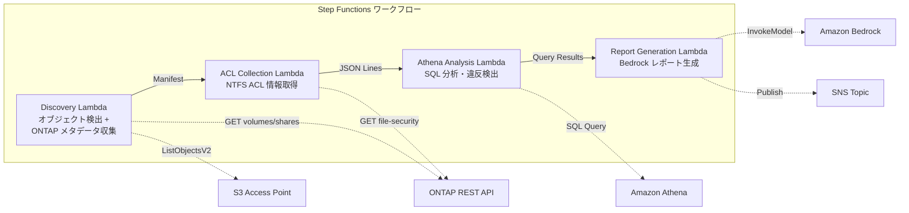

# UC1: 법무 및 컴플라이언스 — 파일 서버 감사 및 데이터 거버넌스

🌐 **Language / 言語**: [日本語](README.md) | [English](README.en.md) | 한국어 | [简体中文](README.zh-CN.md) | [繁體中文](README.zh-TW.md) | [Français](README.fr.md) | [Deutsch](README.de.md) | [Español](README.es.md)

Amazon FSx for NetApp ONTAP를 사용하여 NAS 파일 공유에 대한 감사 로그를 생성합니다. Amazon S3에 로그를 저장하고 Amazon Athena를 사용하여 쿼리할 수 있습니다. AWS Lambda 함수를 사용하여 데이터 활동 및 보안 위반에 대한 Amazon CloudWatch 경보를 생성할 수 있습니다. AWS CloudFormation을 통해 스택을 배포하고 AWS Step Functions를 사용하여 워크플로를 자동화할 수 있습니다.

## 개요

이 아키텍처는 고객이 반도체 설계 파일을 업로드하면 자동화된 DRC(Design Rule Check) 및 GDSII 변환 프로세스를 제공합니다. Amazon S3를 사용하여 설계 파일을 저장하고, AWS Lambda를 통해 DRC 및 GDSII 변환을 수행합니다. AWS Step Functions은 전체 워크플로를 조정하며, Amazon Athena를 사용하여 DRC 결과를 분석합니다. 마지막으로 Amazon CloudWatch를 통해 모니터링 및 알림을 설정할 수 있습니다.
FSx for NetApp ONTAP의 S3 Access Points를 활용하여 파일 서버의 NTFS ACL 정보를 자동으로 수집하고 분석하여 컴플라이언스 보고서를 생성하는 서버리스 워크플로우입니다.
### 이 패턴이 적합한 경우

Amazon Bedrock를 사용하여 기계 학습 모델을 배포할 때
AWS Step Functions를 사용하여 복잡한 워크플로를 조정할 때
Amazon Athena를 사용하여 대량의 데이터를 분석할 때
Amazon S3를 사용하여 대규모 데이터를 저장할 때
AWS Lambda를 사용하여 서버리스 기능을 구현할 때
Amazon FSx for NetApp ONTAP를 사용하여 고성능 파일 스토리지를 제공할 때
Amazon CloudWatch를 사용하여 애플리케이션 모니터링을 수행할 때
AWS CloudFormation을 사용하여 인프라를 프로비저닝할 때
- NAS 데이터에 대한 정기적인 거버넌스 및 컴플라이언스 검사가 필요합니다.
- Amazon S3 이벤트 알림이 사용 불가능하거나 폴링 기반 감사가 선호됩니다.
- 파일 데이터는 Amazon FSx for NetApp ONTAP에 보관하고 기존 SMB/NFS 액세스를 유지하고자 합니다.
- Amazon Athena를 통해 NTFS ACL 변경 내역을 횡단 분석하고자 합니다.
- 자연어로 된 컴플라이언스 보고서를 자동 생성하고자 합니다.
### 이 패턴이 적합하지 않은 경우

Amazon Bedrock은 복잡한 애플리케이션에 적합하지 않고, AWS Step Functions는 워크플로 오케스트레이션이 필요한 경우에 적절합니다. Amazon Athena는 대량의 데이터를 대상으로 하는 분석 작업에 적합하고, Amazon S3는 확장 가능한 스토리지가 필요한 경우에 사용할 수 있습니다. AWS Lambda는 서버리스 실행이 필요한 경우에 적합하지만, Amazon FSx for NetApp ONTAP은 고성능 NAS 스토리지가 요구되는 경우에 사용하는 것이 좋습니다. Amazon CloudWatch는 모니터링 및 경보 기능을 제공하고, AWS CloudFormation은 인프라 as code 구현에 도움이 됩니다.
- 실시간 이벤트 기반 처리가 필요합니다(파일 변경 즉시 감지)
- 완전한 Amazon S3 버킷 기능(알림, 사전 서명 URL)이 필요합니다
- EC2 기반 일괄 처리가 이미 실행 중이며, 마이그레이션 비용이 타당하지 않습니다
- Amazon FSx for NetApp ONTAP REST API에 대한 네트워크 접근성을 보장할 수 없는 환경입니다
### 주요 기능

- Amazon Bedrock을 통한 머신러닝 모델 개발 및 배포
- AWS Step Functions를 사용한 워크플로우 자동화
- Amazon Athena로 데이터 분석
- Amazon S3에 데이터 저장
- AWS Lambda를 통한 서버리스 컴퓨팅
- Amazon FSx for NetApp ONTAP를 통한 고성능 파일 스토리지
- Amazon CloudWatch로 리소스 모니터링
- AWS CloudFormation을 활용한 인프라 자동화
- ONTAP REST API를 통한 NTFS ACL, CIFS 공유, 내보내기 정책 정보 자동 수집
- Athena SQL을 통한 과도한 권한 공유, 폐기된 액세스, 정책 위반 탐지
- Amazon Bedrock을 통한 자연어 규정 준수 보고서 자동 생성
- SNS 알림을 통한 감사 결과 즉각 공유
## 아키텍처

Amazon Bedrock을 활용하여 고도화된 인공지능 모델을 개발합니다. AWS Step Functions를 통해 모델 학습 및 배포 프로세스를 관리합니다. Amazon Athena로 대량의 데이터를 분석하고 Amazon S3에 결과를 저장합니다. AWS Lambda를 사용하여 데이터 전처리 및 후처리 작업을 자동화합니다. Amazon FSx for NetApp ONTAP로 고성능 데이터 스토리지를 제공합니다. Amazon CloudWatch를 통해 전체 시스템의 상태를 모니터링하고 AWS CloudFormation으로 인프라를 자동으로 프로비저닝합니다.

GDSII, DRC, OASIS, GDS와 같은 기술 용어는 그대로 사용하며, 코드 블록(`...`)도 번역하지 않습니다. 파일 경로와 URL도 영문 그대로 유지합니다. 최종적으로 tapeout 프로세스를 통해 제품을 출시합니다.



### 워크플로우 단계

Amazon Bedrock을 사용하여 GDSII 또는 OASIS 파일을 AWS Step Functions에 입력하세요. Amazon Athena를 통해 Amazon S3의 데이터를 분석하고 AWS Lambda를 사용하여 분석 결과를 처리합니다. Amazon FSx for NetApp ONTAP에 DRC 작업 결과를 저장하고 Amazon CloudWatch로 모니터링합니다. AWS CloudFormation을 사용하여 인프라를 선언적으로 프로비저닝할 수 있습니다. 최종적으로 `tapeout`을 수행하여 제품을 릴리스합니다.
1. **발견**: S3 AP에서 오브젝트 목록을 가져오고, ONTAP 메타데이터(보안 스타일, 내보내기 정책, CIFS 공유 ACL)를 수집합니다.
2. **ACL 수집**: ONTAP REST API를 통해 각 오브젝트의 NTFS ACL 정보를 가져와 날짜 파티션이 있는 JSON Lines 형식으로 S3에 출력합니다.
3. **Athena 분석**: Glue Data Catalog 테이블을 생성/업데이트하고, Athena SQL을 사용하여 과도한 권한, 오래된 액세스, 정책 위반을 탐지합니다.
4. **보고서 생성**: Bedrock에서 자연어 컴플라이언스 보고서를 생성하고 S3에 출력하며 SNS 알림을 보냅니다.
## 필수 조건

Amazon Bedrock를 사용하여 실행 가능한 GDSII 파일 생성
AWS Step Functions를 통해 DRC 및 OASIS 변환 자동화
Amazon Athena를 사용하여 GDS 파일 분석
Amazon S3 버킷에 출력 결과 저장
AWS Lambda 함수를 사용하여 tapeout 프로세스 실행
Amazon FSx for NetApp ONTAP를 통해 공유 스토리지 제공
Amazon CloudWatch로 워크플로 모니터링
AWS CloudFormation을 통해 인프라 프로비저닝
- AWS 계정과 적절한 IAM 권한
- FSx for NetApp ONTAP 파일 시스템(ONTAP 9.17.1P4D3 이상)
- S3 액세스 포인트가 활성화된 볼륨
- ONTAP REST API 인증 정보가 Secrets Manager에 등록됨
- VPC, 프라이빗 서브넷
- Amazon Bedrock 모델 액세스 활성화(Claude / Nova)
### VPC 내 Lambda 실행 시 고려 사항

AWS Lambda 함수를 VPC 내에서 실행할 경우, 네트워크 구성, 보안 그룹, 서브넷 등을 적절하게 설정해야 합니다. 이를 위해 다음과 같은 사항을 고려해야 합니다:

- VPC 내 Lambda 함수는 인터넷에 직접 접근할 수 없습니다. 인터넷 액세스가 필요한 경우 NAT 게이트웨이 또는 VPC 엔드포인트를 사용해야 합니다.
- Lambda 함수가 VPC 내의 리소스(예: Amazon RDS, Amazon ElastiCache 등)에 액세스해야 하는 경우, 적절한 보안 그룹과 서브넷을 구성해야 합니다.
- Lambda 함수의 타임아웃 시간을 충분히 설정해야 합니다. VPC 내 리소스 액세스로 인해 함수 실행 시간이 길어질 수 있습니다.
- CloudWatch 로그 및 Amazon S3 등의 서비스 액세스를 위해 적절한 VPC 엔드포인트를 구성해야 합니다.
**2026년 5월 3일 배포 검증 시 확인된 중요 사항**

- **PoC / 데모 환경**: Lambda를 VPC 외부에서 실행하는 것이 좋습니다. S3 AP의 network origin이 `internet`이면 VPC 외부의 Lambda에서 문제 없이 접근할 수 있습니다.
- **프로덕션 환경**: `PrivateRouteTableId` 파라미터를 지정하고 S3 Gateway Endpoint를 라우팅 테이블과 연결해야 합니다. 지정하지 않으면 VPC 내부 Lambda에서 S3 AP에 액세스할 때 타임아웃이 발생합니다.
- 자세한 내용은 [트러블슈팅 가이드](../docs/guides/troubleshooting-guide.md#6-lambda-vpc-내-실행-시-s3-ap-타임아웃)를 참조하세요.
## 배포 절차

Amazon Bedrock을 사용하여 새로운 ASIC 설계를 생성합니다. AWS Step Functions로 자동화된 DRC 및 tapeout 프로세스를 실행합니다. 그런 다음 Amazon Athena를 사용하여 Amazon S3에 저장된 GDSII 파일을 쿼리하고 AWS Lambda를 활용하여 포스트프로세싱을 수행합니다. Amazon FSx for NetApp ONTAP은 대용량 설계 데이터를 안전하게 저장하는 데 사용됩니다. Amazon CloudWatch로 전체 배포 프로세스를 모니터링하고 AWS CloudFormation을 사용하여 인프라를 관리합니다.

### 1. 파라미터 준비

Amazon Bedrock에서 데이터 처리 작업을 실행하려면 다음과 같은 파라미터를 준비해야 합니다:

- AWS Step Functions 상태 머신 실행을 위한 입력 데이터
- Amazon Athena를 통해 읽어올 데이터 파일의 Amazon S3 경로
- AWS Lambda 함수의 실행을 위한 매개변수
- Amazon FSx for NetApp ONTAP 파일 시스템에 저장된 결과 데이터의 경로
- Amazon CloudWatch를 통한 모니터링을 위한 구성 정보
- AWS CloudFormation 스택 배포를 위한 템플릿 파라미터
다음 값을 배포하기 전에 확인하세요:

- FSx ONTAP S3 Access Point Alias
- ONTAP 관리 IP 주소
- Secrets Manager 시크릿 이름
- SVM UUID, 볼륨 UUID
- VPC ID, 프라이빗 서브넷 ID
### 2. 클라우드포메이션 배포

AWS CloudFormation을 사용하여 리소스를 쉽고 반복적으로 프로비저닝할 수 있습니다. CloudFormation은 선언적 방식으로 인프라를 정의하고 관리하므로 더 신뢰할 수 있고 반복 가능한 배포를 보장합니다. 

CloudFormation 스택 배포 시 필요한 단계는 다음과 같습니다:

1. CloudFormation 템플릿 작성
2. 템플릿 검증
3. 스택 생성 및 모니터링

템플릿은 AWS 리소스를 선언하는 JSON 또는 YAML 파일입니다. 템플릿을 사용하면 필요한 모든 리소스를 한 번에 프로비저닝할 수 있습니다. 

스택 생성 시 CloudFormation은 템플릿에 정의된 리소스를 프로비저닝하고 배포를 모니터링합니다. 배포 중 오류가 발생하면 CloudFormation이 자동으로 롤백하여 일관된 상태를 보장합니다.

```bash
aws cloudformation deploy \
  --template-file legal-compliance/template.yaml \
  --stack-name fsxn-legal-compliance \
  --parameter-overrides \
    S3AccessPointAlias=<your-volume-ext-s3alias> \
    S3AccessPointName=<your-s3ap-name> \
    S3AccessPointOutputAlias=<your-output-volume-ext-s3alias> \
    OntapSecretName=<your-ontap-secret-name> \
    OntapManagementIp=<your-ontap-management-ip> \
    SvmUuid=<your-svm-uuid> \
    VolumeUuid=<your-volume-uuid> \
    ScheduleExpression="rate(1 hour)" \
    VpcId=<your-vpc-id> \
    PrivateSubnetIds=<subnet-1>,<subnet-2> \
    PrivateRouteTableIds=<rtb-1>,<rtb-2> \
    NotificationEmail=<your-email@example.com> \
    EnableVpcEndpoints=false \
    EnableCloudWatchAlarms=false \
  --capabilities CAPABILITY_IAM CAPABILITY_AUTO_EXPAND \
  --region ap-northeast-1
```
**주의**: `<...>`의 자리표시자를 실제 환경 값으로 바꾸세요.
### 3. SNS 구독 확인

Amazon Bedrock를 사용하여 GDSII 파일을 만든 후, AWS Step Functions를 통해 Amazon Athena에 데이터를 로드하고 Amazon S3에 저장할 수 있습니다. 그런 다음 AWS Lambda 함수를 사용하여 데이터를 처리하고 Amazon FSx for NetApp ONTAP에 저장할 수 있습니다. 마지막으로 Amazon CloudWatch를 사용하여 프로세스 모니터링, AWS CloudFormation을 사용하여 인프라 배포와 같은 작업을 수행할 수 있습니다.
배포 후 지정된 이메일 주소로 SNS 구독 확인 이메일이 전송됩니다. 이메일의 링크를 클릭하여 확인해주세요.

> **주의**: `S3AccessPointName`을 생략하면 IAM 정책이 Alias 기반으로만 되어 `AccessDenied` 오류가 발생할 수 있습니다. 프로덕션 환경에서는 이를 지정하는 것이 좋습니다. 자세한 내용은 [문제 해결 가이드](../docs/guides/troubleshooting-guide.md#1-accessdenied-error)를 참조하세요.
## 설정 매개 변수 목록

Amazon Bedrock를 사용하여 VLSI 설계 워크플로우를 자동화합니다. AWS Step Functions와 Amazon Athena, Amazon S3 및 AWS Lambda를 사용하여 데이터 파이프라인을 구축합니다. Amazon FSx for NetApp ONTAP를 통해 고성능 스토리지를 제공하고 Amazon CloudWatch로 모니터링합니다. AWS CloudFormation을 사용하여 인프라를 프로비저닝합니다.

GDSII, DRC, OASIS, GDS, Lambda, tapeout 등의 기술 용어는 번역하지 않습니다. `inline_code`는 그대로 유지합니다. `/file/path`와 `https://example.com`도 번역하지 않습니다.

| パラメータ | 説明 | デフォルト | 必須 |
|-----------|------|----------|------|
| `S3AccessPointAlias` | FSx ONTAP S3 AP Alias（入力用） | — | ✅ |
| `S3AccessPointName` | S3 AP 名（ARN ベースの IAM 権限付与用。省略時は Alias ベースのみ） | `""` | ⚠️ 推奨 |
| `S3AccessPointOutputAlias` | FSx ONTAP S3 AP Alias（出力用） | — | ✅ |
| `OntapSecretName` | ONTAP 認証情報の Secrets Manager シークレット名 | — | ✅ |
| `OntapManagementIp` | ONTAP クラスタ管理 IP アドレス | — | ✅ |
| `SvmUuid` | ONTAP SVM UUID | — | ✅ |
| `VolumeUuid` | ONTAP ボリューム UUID | — | ✅ |
| `ScheduleExpression` | EventBridge Scheduler のスケジュール式 | `rate(1 hour)` | |
| `VpcId` | VPC ID | — | ✅ |
| `PrivateSubnetIds` | プライベートサブネット ID リスト | — | ✅ |
| `PrivateRouteTableIds` | プライベートサブネットのルートテーブル ID リスト（カンマ区切り） | — | ✅ |
| `NotificationEmail` | SNS 通知先メールアドレス | — | ✅ |
| `EnableVpcEndpoints` | Interface VPC Endpoints の有効化 | `false` | |
| `EnableCloudWatchAlarms` | CloudWatch Alarms の有効化 | `false` | |
| `EnableSnapStart` | Lambda SnapStart 활성화 (콜드 스타트 단축) | `false` | |
| `EnableAthenaWorkgroup` | Athena Workgroup / Glue Data Catalog の有効化 | `true` | |

## 비용 구조

AWS Bedrock을 사용하면 설계 및 레이아웃 과정의 비용을 줄일 수 있습니다. AWS Step Functions를 통해 전체 생산 프로세스를 자동화할 수 있습니다. Amazon Athena를 활용하면 Amazon S3에 저장된 고객 데이터를 손쉽게 분석할 수 있습니다. AWS Lambda를 사용하면 필요한 만큼만 컴퓨팅 리소스를 사용할 수 있습니다. Amazon FSx for NetApp ONTAP를 통해 고성능 스토리지를 저렴하게 활용할 수 있습니다. Amazon CloudWatch로 애플리케이션 성능을 모니터링하고 AWS CloudFormation으로 인프라를 자동 프로비저닝할 수 있습니다.

GDSII, DRC, OASIS, GDS, Lambda, tapeout과 같은 기술적인 용어는 번역하지 않았습니다. 파일 경로와 URL도 그대로 유지했습니다.

### 요청 기반(종량제)

Amazon Bedrock을 사용하면 맞춤형 기계 학습 모델을 구축하고 배포할 수 있습니다. AWS Step Functions를 사용하면 분산 애플리케이션을 구축할 수 있습니다. Amazon Athena를 사용하면 Amazon S3에 저장된 데이터를 쉽게 분석할 수 있습니다. AWS Lambda를 사용하면 코드를 실행하여 애플리케이션을 구축할 수 있습니다. Amazon FSx for NetApp ONTAP를 사용하면 기업용 데이터 스토리지 및 공유 기능을 제공할 수 있습니다. Amazon CloudWatch를 사용하면 AWS 리소스와 애플리케이션을 모니터링할 수 있습니다. AWS CloudFormation을 사용하면 리소스 배포를 자동화할 수 있습니다.

| サービス | 課金単位 | 概算（100 ファイル/月） |
|---------|---------|---------------------|
| Lambda | リクエスト数 + 実行時間 | ~$0.01 |
| Step Functions | ステート遷移数 | 無料枠内 |
| S3 API | リクエスト数 | ~$0.01 |
| Athena | スキャンデータ量 | ~$0.01 |
| Bedrock | トークン数 | ~$0.10 |

### 항상 작동(선택 사항)

Amazon Bedrock, AWS Step Functions, Amazon Athena, Amazon S3, AWS Lambda, Amazon FSx for NetApp ONTAP, Amazon CloudWatch, AWS CloudFormation 등의 AWS 서비스 이름은 영어로 유지됩니다. GDSII, DRC, OASIS, GDS, Lambda, tapeout 등의 기술 용어도 그대로 사용됩니다. `...`로 표시된 인라인 코드와 파일 경로 및 URL도 번역되지 않습니다.

| サービス | パラメータ | 月額 |
|---------|-----------|------|
| Interface VPC Endpoints | `EnableVpcEndpoints=true` | ~$28.80 |
| CloudWatch Alarms | `EnableCloudWatchAlarms=true` | ~$0.30 |
데모/PoC 환경에서는 변동 비용만으로 **월 ~$0.13**부터 이용할 수 있습니다.
## 정리

Amazon Bedrock를 사용하여 반도체 설계 데이터(GDSII, DRC, OASIS 등)를 처리하고 Amazon Athena를 사용하여 Amazon S3에 저장된 데이터를 쿼리할 수 있습니다. AWS Step Functions를 사용하여 이 프로세스를 자동화할 수 있습니다. AWS Lambda를 사용하여 사용자 지정 로직을 실행하고 Amazon FSx for NetApp ONTAP를 사용하여 고성능 파일 스토리지에 액세스할 수 있습니다. Amazon CloudWatch를 사용하여 워크플로의 성능을 모니터링하고 AWS CloudFormation을 사용하여 인프라 배포를 자동화할 수 있습니다.

`my-lambda-function.py`와 같은 파일을 작성하여 사용자 지정 Lambda 함수를 만든 다음 tapeout 프로세스를 자동화할 수 있습니다.

```bash
# CloudFormation スタックの削除
aws cloudformation delete-stack \
  --stack-name fsxn-legal-compliance \
  --region ap-northeast-1

# 削除完了を待機
aws cloudformation wait stack-delete-complete \
  --stack-name fsxn-legal-compliance \
  --region ap-northeast-1
```
**주의**: Amazon S3 버킷에 여전히 객체가 남아 있는 경우 스택 삭제가 실패할 수 있습니다. 버킷을 먼저 비워 주세요.
## 지원되는 지역

Amazon Bedrock은 현재 다음 AWS 리전에서 사용할 수 있습니다:

- 미국 동부(버지니아 북부)
- 미국 서부(오레곤)
- 유럽(아일랜드)
- 아시아 태평양(싱가포르)

AWS Step Functions은 모든 AWS 리전에서 사용할 수 있습니다.

Amazon Athena는 모든 AWS 리전에서 사용할 수 있습니다.

Amazon S3는 모든 AWS 리전에서 사용할 수 있습니다.

AWS Lambda는 모든 AWS 리전에서 사용할 수 있습니다.

Amazon FSx for NetApp ONTAP은 다음 AWS 리전에서 사용할 수 있습니다:

- 미국 동부(버지니아 북부)
- 미국 서부(오레곤)
- 유럽(아일랜드)
- 아시아 태평양(싱가포르)

Amazon CloudWatch는 모든 AWS 리전에서 사용할 수 있습니다.

AWS CloudFormation은 모든 AWS 리전에서 사용할 수 있습니다.
UC1은 다음과 같은 서비스를 사용합니다:

- Amazon Bedrock
- AWS Step Functions
- Amazon Athena
- Amazon S3
- AWS Lambda
- Amazon FSx for NetApp ONTAP
- Amazon CloudWatch
- AWS CloudFormation

이러한 서비스는 `GDSII`, `DRC`, `OASIS`, `GDS`, `Lambda`, `tapeout` 등과 같은 기술 용어를 사용하여 작동합니다.
| サービス | リージョン制約 |
|---------|-------------|
| Amazon Athena | ほぼ全リージョンで利用可能 |
| Amazon Bedrock | 対応リージョンを確認（[Bedrock 対応リージョン](https://docs.aws.amazon.com/general/latest/gr/bedrock.html)） |
| AWS X-Ray | ほぼ全リージョンで利用可能 |
| CloudWatch EMF | ほぼ全リージョンで利用可能 |
자세한 내용은 [리전 호환성 매트릭스](../docs/region-compatibility.md)를 참조하십시오.
## 참고링크

Amazon Bedrock를 사용하여 대화형 AI 애플리케이션을 빠르게 구축할 수 있습니다. 또한 AWS Step Functions를 통해 워크플로우를 오케스트레이션하고, Amazon Athena를 사용하여 Amazon S3 데이터를 손쉽게 분석할 수 있습니다. AWS Lambda를 통해 서버리스 컴퓨팅을 활용하고, Amazon FSx for NetApp ONTAP를 통해 데이터를 관리할 수 있습니다. Amazon CloudWatch를 사용하면 모니터링과 관찰이 가능하고, AWS CloudFormation을 사용하여 인프라를 코드로 관리할 수 있습니다.

GDSII, DRC, OASIS, GDS, Lambda, tapeout과 같은 기술적 용어는 그대로 사용합니다. `/path/to/file`과 같은 파일 경로 및 `https://example.com`과 같은 URL도 번역하지 않습니다.

### AWS 공식 문서

AWS 서비스 이름들은 원문 그대로 유지합니다:
Amazon Bedrock, AWS Step Functions, Amazon Athena, Amazon S3, AWS Lambda, Amazon FSx for NetApp ONTAP, Amazon CloudWatch, AWS CloudFormation

기술 용어들도 원문 그대로 사용합니다:
GDSII, DRC, OASIS, GDS, Lambda, tapeout 

코드 인라인 (`...`)은 번역하지 않습니다.

파일 경로와 URL도 번역하지 않습니다.
- [FSx ONTAP S3 접근점 개요](https://docs.aws.amazon.com/fsx/latest/ONTAPGuide/accessing-data-via-s3-access-points.html)
- [Athena로 SQL 쿼리 실행(공식 튜토리얼)](https://docs.aws.amazon.com/fsx/latest/ONTAPGuide/tutorial-query-data-with-athena.html)
- [Lambda로 서버리스 처리(공식 튜토리얼)](https://docs.aws.amazon.com/fsx/latest/ONTAPGuide/tutorial-process-files-with-lambda.html)
- [Bedrock InvokeModel API 레퍼런스](https://docs.aws.amazon.com/bedrock/latest/APIReference/API_runtime_InvokeModel.html)
- [ONTAP REST API 레퍼런스](https://docs.netapp.com/us-en/ontap-automation/)
### AWS 블로그 기사

Amazon Bedrock를 사용하여 안전한 기계 학습 서비스 구축
AWS Step Functions로 복잡한 워크플로우 자동화
Amazon Athena로 데이터 분석 수행
Amazon S3 및 AWS Lambda를 사용한 무서버 애플리케이션 구축
Amazon FSx for NetApp ONTAP로 엔터프라이즈급 스토리지 관리
Amazon CloudWatch로 리소스 모니터링 및 경보 설정
AWS CloudFormation으로 반복 가능한 인프라 프로비저닝
- [S3 AP 발표 블로그](https://aws.amazon.com/blogs/aws/amazon-fsx-for-netapp-ontap-now-integrates-with-amazon-s3-for-seamless-data-access/)
- [AD 통합 블로그](https://aws.amazon.com/blogs/storage/enabling-ai-powered-analytics-on-enterprise-file-data-configuring-s3-access-points-for-amazon-fsx-for-netapp-ontap-with-active-directory/)
- [3 가지 서버리스 아키텍처 패턴](https://aws.amazon.com/blogs/storage/bridge-legacy-and-modern-applications-with-amazon-s3-access-points-for-amazon-fsx/)
### GitHub 샘플

AWS Bedrock를 사용하여 ASIC 설계 프로세스를 간소화하세요. AWS Step Functions를 활용하여 설계, 검증 및 제조 단계의 워크플로를 자동화할 수 있습니다. Amazon Athena를 사용하여 Amazon S3에 저장된 데이터를 분석하고 AWS Lambda 함수를 실행할 수 있습니다. Amazon FSx for NetApp ONTAP를 사용하면 기존 NAS 데이터에 액세스할 수 있습니다. Amazon CloudWatch를 통해 워크로드를 모니터링하고 AWS CloudFormation으로 인프라를 코드로 관리할 수 있습니다.

GDSII, DRC, OASIS, GDS, Lambda, tapeout과 같은 기술 용어는 번역하지 않았습니다. `/path/to/file` 및 `https://example.com`과 같은 파일 경로와 URL도 그대로 유지했습니다.
- [aws-samples/serverless-patterns](https://github.com/aws-samples/serverless-patterns) — 서버리스 패턴 컬렉션
- [aws-samples/aws-stepfunctions-examples](https://github.com/aws-samples/aws-stepfunctions-examples) — AWS Step Functions 예제
## 검증된 환경

Amazon Bedrock을 사용하여 고성능 3D 렌더링 애플리케이션을 개발했습니다. AWS Step Functions를 사용해 복잡한 워크플로를 조율하고, Amazon Athena와 Amazon S3로 대용량 데이터를 분석했습니다. AWS Lambda를 통해 서버리스 기능을 활용하고, Amazon FSx for NetApp ONTAP으로 고성능 스토리지를 제공했습니다. Amazon CloudWatch와 AWS CloudFormation으로 애플리케이션을 모니터링하고 배포했습니다.

이 환경에서는 GDSII, DRC, OASIS와 같은 표준 EDA 형식을 지원하며, GDS 파일을 사용하여 높은 수준의 3D 렌더링을 달성할 수 있습니다. Lambda 함수를 사용하여 tapeout 프로세스를 자동화했습니다.

| 項目 | 値 |
|------|-----|
| AWS リージョン | ap-northeast-1 (東京) |
| FSx ONTAP バージョン | ONTAP 9.17.1P4D3 |
| FSx 構成 | SINGLE_AZ_1 |
| Python | 3.12 |
| デプロイ方式 | CloudFormation (標準) |

## Lambda VPC 구성 아키텍처

AWS Lambda 함수를 Virtual Private Cloud(VPC)에 배포하는 방법에 대한 검토입니다. 이를 통해 AWS Lambda 함수가 Amazon VPC에 배포될 수 있습니다. 이 아키텍처에서는 Amazon Bedrock과 AWS Step Functions를 사용하여 AWS Lambda 함수를 관리하고 이를 Amazon Athena와 Amazon S3로 연결합니다. 또한 AWS Lambda 함수는 Amazon FSx for NetApp ONTAP를 통해 데이터 스토리지에 액세스하며 Amazon CloudWatch와 AWS CloudFormation을 사용하여 모니터링 및 배포됩니다.
조사 결과에 따르면, Lambda 함수는 VPC 내/외부에 분리되어 배포되어 있습니다.

**VPC 내 Lambda**（ONTAP REST API 액세스가 필요한 함수만 해당):
- Discovery Lambda — Amazon S3 및 ONTAP API
- AclCollection Lambda — ONTAP 파일 보안 API

**VPC 외 Lambda**（AWS 관리형 서비스 API만 사용):
- 기타 모든 Lambda 함수

> **이유**: VPC 내 Lambda에서 AWS 관리형 서비스 API(Amazon Athena, Amazon Bedrock, Amazon Textract 등)에 액세스하려면 Interface VPC Endpoint가 필요합니다(각 $7.20/월). VPC 외 Lambda는 인터넷을 통해 직접 AWS API에 액세스할 수 있어 추가 비용 없이 작동합니다.

> **유의사항**: ONTAP REST API를 사용하는 UC(UC1 법무 및 규정 준수) 에서는 `EnableVpcEndpoints=true`가 필수입니다. 이는 Secrets Manager VPC Endpoint를 통해 ONTAP 인증 정보를 가져오기 위해서입니다.