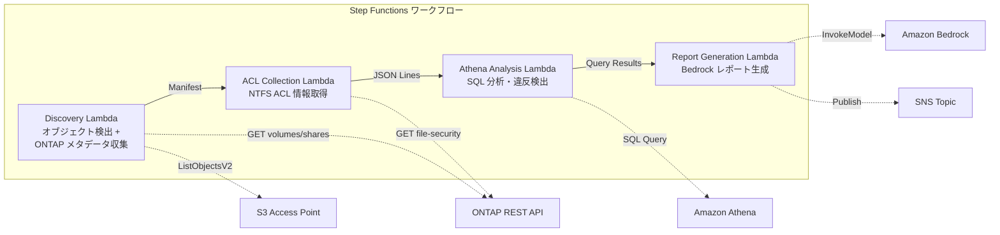

# UC1: 法務・コンプライアンス — ファイルサーバー監査・データガバナンス

## 概要

FSx for NetApp ONTAP の S3 Access Points を活用し、ファイルサーバーの NTFS ACL 情報を自動収集・分析して、コンプライアンスレポートを生成するサーバーレスワークフローです。

### このパターンが適しているケース

- NAS データに対する定期的なガバナンス・コンプライアンススキャンが必要
- S3 イベント通知が利用不可、またはポーリングベースの監査が望ましい
- ファイルデータは ONTAP 上に保持し、既存の SMB/NFS アクセスを維持したい
- NTFS ACL の変更履歴を Athena で横断分析したい
- 自然言語のコンプライアンスレポートを自動生成したい

### このパターンが適さないケース

- リアルタイムのイベント駆動型処理が必要（ファイル変更即時検知）
- 完全な S3 バケットセマンティクス（通知、Presigned URL）が必要
- EC2 ベースのバッチ処理が既に稼働しており、移行コストが見合わない
- ONTAP REST API へのネットワーク到達性が確保できない環境

### 主な機能

- ONTAP REST API 経由で NTFS ACL、CIFS 共有、エクスポートポリシー情報を自動収集
- Athena SQL による過剰権限共有、陳腐化アクセス、ポリシー違反の検出
- Amazon Bedrock による自然言語コンプライアンスレポートの自動生成
- SNS 通知による監査結果の即時共有

## アーキテクチャ



### ワークフローステップ

1. **Discovery**: S3 AP からオブジェクト一覧を取得し、ONTAP メタデータ（セキュリティスタイル、エクスポートポリシー、CIFS 共有 ACL）を収集
2. **ACL Collection**: 各オブジェクトの NTFS ACL 情報を ONTAP REST API 経由で取得し、JSON Lines 形式で日付パーティション付き S3 出力
3. **Athena Analysis**: Glue Data Catalog テーブルを作成/更新し、Athena SQL で過剰権限・陳腐化アクセス・ポリシー違反を検出
4. **Report Generation**: Bedrock で自然言語コンプライアンスレポートを生成し、S3 出力 + SNS 通知

## 前提条件

- AWS アカウントと適切な IAM 権限
- FSx for NetApp ONTAP ファイルシステム（ONTAP 9.17.1P4D3 以上）
- S3 Access Point が有効化されたボリューム
- ONTAP REST API 認証情報が Secrets Manager に登録済み
- VPC、プライベートサブネット
- Amazon Bedrock モデルアクセスが有効（Claude / Nova）

### VPC 内 Lambda 実行時の注意事項

> **デプロイ検証（2026-05-03）で確認された重要事項**

- **PoC / デモ環境**: Lambda を VPC 外で実行することを推奨。S3 AP の network origin が `internet` であれば VPC 外 Lambda から問題なくアクセス可能
- **本番環境**: `PrivateRouteTableId` パラメータを指定し、S3 Gateway Endpoint にルートテーブルを関連付けること。未指定の場合、VPC 内 Lambda から S3 AP へのアクセスがタイムアウトする
- 詳細は [トラブルシューティングガイド](../docs/guides/troubleshooting-guide.md#6-lambda-vpc-内実行時の-s3-ap-タイムアウト) を参照

## デプロイ手順

### 1. パラメータの準備

デプロイ前に以下の値を確認してください:

- FSx ONTAP S3 Access Point Alias
- ONTAP 管理 IP アドレス
- Secrets Manager シークレット名
- SVM UUID、ボリューム UUID
- VPC ID、プライベートサブネット ID

### 2. CloudFormation デプロイ

```bash
aws cloudformation deploy \
  --template-file legal-compliance/template.yaml \
  --stack-name fsxn-legal-compliance \
  --parameter-overrides \
    S3AccessPointAlias=<your-volume-ext-s3alias> \
    S3AccessPointName=<your-s3ap-name> \
    S3AccessPointOutputAlias=<your-output-volume-ext-s3alias> \
    OntapSecretName=<your-ontap-secret-name> \
    OntapManagementIp=<your-ontap-management-ip> \
    SvmUuid=<your-svm-uuid> \
    VolumeUuid=<your-volume-uuid> \
    ScheduleExpression="rate(1 hour)" \
    VpcId=<your-vpc-id> \
    PrivateSubnetIds=<subnet-1>,<subnet-2> \
    PrivateRouteTableIds=<rtb-1>,<rtb-2> \
    NotificationEmail=<your-email@example.com> \
    EnableVpcEndpoints=false \
    EnableCloudWatchAlarms=false \
  --capabilities CAPABILITY_IAM CAPABILITY_AUTO_EXPAND \
  --region ap-northeast-1
```

> **注意**: `<...>` のプレースホルダーを実際の環境値に置き換えてください。

### 3. SNS サブスクリプションの確認

デプロイ後、指定したメールアドレスに SNS サブスクリプション確認メールが届きます。メール内のリンクをクリックして確認してください。

> **注意**: `S3AccessPointName` を省略すると、IAM ポリシーが Alias ベースのみとなり `AccessDenied` エラーが発生する場合があります。本番環境では指定を推奨します。詳細は [トラブルシューティングガイド](../docs/guides/troubleshooting-guide.md#1-accessdenied-エラー) を参照してください。


## 設定パラメータ一覧

| パラメータ | 説明 | デフォルト | 必須 |
|-----------|------|----------|------|
| `S3AccessPointAlias` | FSx ONTAP S3 AP Alias（入力用） | — | ✅ |
| `S3AccessPointName` | S3 AP 名（ARN ベースの IAM 権限付与用。省略時は Alias ベースのみ） | `""` | ⚠️ 推奨 |
| `S3AccessPointOutputAlias` | FSx ONTAP S3 AP Alias（出力用） | — | ✅ |
| `OntapSecretName` | ONTAP 認証情報の Secrets Manager シークレット名 | — | ✅ |
| `OntapManagementIp` | ONTAP クラスタ管理 IP アドレス | — | ✅ |
| `SvmUuid` | ONTAP SVM UUID | — | ✅ |
| `VolumeUuid` | ONTAP ボリューム UUID | — | ✅ |
| `ScheduleExpression` | EventBridge Scheduler のスケジュール式 | `rate(1 hour)` | |
| `VpcId` | VPC ID | — | ✅ |
| `PrivateSubnetIds` | プライベートサブネット ID リスト | — | ✅ |
| `PrivateRouteTableIds` | プライベートサブネットのルートテーブル ID リスト（カンマ区切り） | — | ✅ |
| `NotificationEmail` | SNS 通知先メールアドレス | — | ✅ |
| `EnableVpcEndpoints` | Interface VPC Endpoints の有効化 | `false` | |
| `EnableCloudWatchAlarms` | CloudWatch Alarms の有効化 | `false` | |
| `EnableAthenaWorkgroup` | Athena Workgroup / Glue Data Catalog の有効化 | `true` | |

## コスト構造

### リクエストベース（従量課金）

| サービス | 課金単位 | 概算（100 ファイル/月） |
|---------|---------|---------------------|
| Lambda | リクエスト数 + 実行時間 | ~$0.01 |
| Step Functions | ステート遷移数 | 無料枠内 |
| S3 API | リクエスト数 | ~$0.01 |
| Athena | スキャンデータ量 | ~$0.01 |
| Bedrock | トークン数 | ~$0.10 |

### 常時稼働（オプショナル）

| サービス | パラメータ | 月額 |
|---------|-----------|------|
| Interface VPC Endpoints | `EnableVpcEndpoints=true` | ~$28.80 |
| CloudWatch Alarms | `EnableCloudWatchAlarms=true` | ~$0.30 |

> デモ/PoC 環境では変動費のみで **~$0.13/月** から利用可能です。

## クリーンアップ

```bash
# CloudFormation スタックの削除
aws cloudformation delete-stack \
  --stack-name fsxn-legal-compliance \
  --region ap-northeast-1

# 削除完了を待機
aws cloudformation wait stack-delete-complete \
  --stack-name fsxn-legal-compliance \
  --region ap-northeast-1
```

> **注意**: S3 バケットにオブジェクトが残っている場合、スタック削除が失敗することがあります。事前にバケットを空にしてください。

## Supported Regions

UC1 は以下のサービスを使用します:

| サービス | リージョン制約 |
|---------|-------------|
| Amazon Athena | ほぼ全リージョンで利用可能 |
| Amazon Bedrock | 対応リージョンを確認（[Bedrock 対応リージョン](https://docs.aws.amazon.com/general/latest/gr/bedrock.html)） |
| AWS X-Ray | ほぼ全リージョンで利用可能 |
| CloudWatch EMF | ほぼ全リージョンで利用可能 |

> 詳細は [リージョン互換性マトリックス](../docs/region-compatibility.md) を参照。

## 参考リンク

### AWS 公式ドキュメント

- [FSx ONTAP S3 Access Points 概要](https://docs.aws.amazon.com/fsx/latest/ONTAPGuide/accessing-data-via-s3-access-points.html)
- [Athena で SQL クエリ（公式チュートリアル）](https://docs.aws.amazon.com/fsx/latest/ONTAPGuide/tutorial-query-data-with-athena.html)
- [Lambda でサーバーレス処理（公式チュートリアル）](https://docs.aws.amazon.com/fsx/latest/ONTAPGuide/tutorial-process-files-with-lambda.html)
- [Bedrock InvokeModel API リファレンス](https://docs.aws.amazon.com/bedrock/latest/APIReference/API_runtime_InvokeModel.html)
- [ONTAP REST API リファレンス](https://docs.netapp.com/us-en/ontap-automation/)

### AWS ブログ記事

- [S3 AP 発表ブログ](https://aws.amazon.com/blogs/aws/amazon-fsx-for-netapp-ontap-now-integrates-with-amazon-s3-for-seamless-data-access/)
- [AD 統合ブログ](https://aws.amazon.com/blogs/storage/enabling-ai-powered-analytics-on-enterprise-file-data-configuring-s3-access-points-for-amazon-fsx-for-netapp-ontap-with-active-directory/)
- [3 つのサーバーレスアーキテクチャパターン](https://aws.amazon.com/blogs/storage/bridge-legacy-and-modern-applications-with-amazon-s3-access-points-for-amazon-fsx/)

### GitHub サンプル

- [aws-samples/serverless-patterns](https://github.com/aws-samples/serverless-patterns) — サーバーレスパターン集
- [aws-samples/aws-stepfunctions-examples](https://github.com/aws-samples/aws-stepfunctions-examples) — Step Functions サンプル


## 検証済み環境

| 項目 | 値 |
|------|-----|
| AWS リージョン | ap-northeast-1 (東京) |
| FSx ONTAP バージョン | ONTAP 9.17.1P4D3 |
| FSx 構成 | SINGLE_AZ_1 |
| Python | 3.12 |
| デプロイ方式 | CloudFormation (標準) |

## Lambda VPC 配置アーキテクチャ

検証で得た知見に基づき、Lambda 関数は VPC 内/外に分離配置されています。

**VPC 内 Lambda**（ONTAP REST API アクセスが必要な関数のみ）:
- Discovery Lambda — S3 AP + ONTAP API
- AclCollection Lambda — ONTAP file-security API

**VPC 外 Lambda**（AWS マネージドサービス API のみ使用）:
- その他の全 Lambda 関数

> **理由**: VPC 内 Lambda から AWS マネージドサービス API（Athena, Bedrock, Textract 等）にアクセスするには Interface VPC Endpoint が必要（各 $7.20/月）。VPC 外 Lambda はインターネット経由で直接 AWS API にアクセスでき、追加コストなしで動作します。

> **注意**: ONTAP REST API を使用する UC（UC1 法務・コンプライアンス）では `EnableVpcEndpoints=true` が必須です。Secrets Manager VPC Endpoint 経由で ONTAP 認証情報を取得するためです。
