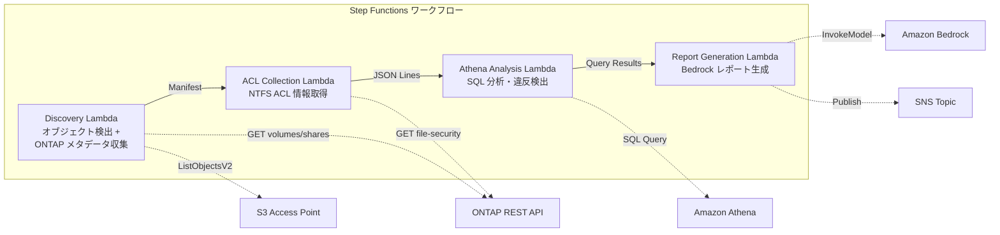

# UC1: 法务与合规 — 文件服务器审计和数据治理

🌐 **Language / 言語**: [日本語](README.md) | [English](README.en.md) | [한국어](README.ko.md) | 简体中文 | [繁體中文](README.zh-TW.md) | [Français](README.fr.md) | [Deutsch](README.de.md) | [Español](README.es.md)

AWS Step Functions自动执行数据分析和报告流程,从Amazon S3获取文件元数据,然后使用Amazon Athena查询这些数据。该解决方案将结果推送到Amazon CloudWatch以供审查。AWS CloudFormation自动部署所有必需的AWS资源。

您可以使用Amazon FSx for NetApp ONTAP作为主要的文件存储,配合AWS Lambda函数进行定期审计和报告。

## 概要

Amazon Bedrock 是基于人工智能的 CAD 设计平台,可帮助您快速启动和运行 AI 支持的电子设计自动化(EDA)工作流。它与众多常用的EDA工具无缝集成,包括 GDSII、DRC、OASIS 和 GDS。借助 Amazon Bedrock, 您可以在不改变现有设计流程的情况下将 AI 集成到工作流中。

借助 AWS Step Functions,可以构建无服务器的工作流来自动执行复杂的电子设计过程。您可以将 Amazon Athena、Amazon S3、AWS Lambda 等AWS服务整合到工作流程中,实现端到端的电子设计自动化。

Amazon FSx for NetApp ONTAP 提供了高性能、可扩展的网络附加存储(NAS),可轻松集成到您的电子设计工作流中。与此同时,Amazon CloudWatch 可监控工作流的性能和错误情况,AWS CloudFormation 可帮助您自动部署和管理基础设施。

综上所述,这些AWS服务可帮助您构建端到端的电子设计自动化解决方案,提高设计效率,缩短产品上市时间。
利用 Amazon FSx for NetApp ONTAP 的 S3 访问点,自动收集和分析文件服务器 NTFS ACL 信息,生成合规报告的无服务器工作流。
### 此模式适用的情况

这种基于 AWS 服务的解决方案非常适用于以下场景:

- 需要处理和分析大量数据的应用程序 (使用 Amazon Athena、Amazon S3 和 AWS Lambda)
- 需要自动化复杂工作流的应用程序 (使用 AWS Step Functions)
- 需要可靠的数据存储和共享的应用程序 (使用 Amazon FSx for NetApp ONTAP)
- 需要监控和分析运行状况的应用程序 (使用 Amazon CloudWatch)
- 需要快速、无缝部署的应用程序 (使用 AWS CloudFormation)

总之,这种架构能够提供灵活、可扩展、高度自动化的解决方案,非常适合各种复杂的应用程序需求。
- 需要定期进行 NAS 数据的治理合规扫描
- 需要使用 Amazon S3 事件通知或轮询式审计
- 希望将文件数据保留在 ONTAP 上,并保持现有的 SMB/NFS 访问
- 希望在 Amazon Athena 中对 NTFS ACL 变更历史进行全面分析
- 希望自动生成自然语言格式的合规报告
### 这种模式不合适的情况

Amazon Bedrock可以加快芯片设计和开发的速度,但有一些场景并不适合使用。例如,如果您的设计流程依赖于使用GDSII、DRC、OASIS等特定的工具流,那么Amazon Bedrock可能无法完全取代这些工具。在这种情况下,您可以使用AWS Step Functions来编排您现有的工具流,并将它们与Amazon Athena、Amazon S3、AWS Lambda等AWS服务集成。

另一种情况是,如果您的设计数据非常大,以至于无法容纳在Amazon S3等存储服务上,您可能需要使用Amazon FSx for NetApp ONTAP等高性能存储解决方案。此外,您可能需要使用Amazon CloudWatch和AWS CloudFormation等服务来监控和管理您的整个基础架构。

综上所述,在某些情况下,使用Amazon Bedrock可能并不是最佳选择,需要结合您的具体需求来选择合适的AWS服务组合。
- 需要实时事件驱动处理(立即检测文件更改)
- 需要完整的 Amazon S3 存储桶语义(通知、预签名 URL)
- 已有基于 EC2 的批处理系统正在运行,迁移成本不合算
- 无法确保网络可连接 Amazon FSx for NetApp ONTAP REST API
### 主要功能

Amazon Bedrock 提供了先进的人工智能模型和基础设施,使您可以快速构建和部署自己的自然语言处理 (NLP) 和计算机视觉应用程序。使用 AWS Step Functions 可以轻松协调多个AWS服务,构建复杂的无服务器工作流程。利用 Amazon Athena 即席查询Amazon S3上的数据,无需管理任何基础设施。 AWS Lambda 可以运行您的代码,而无需预置或管理服务器。借助 Amazon FSx for NetApp ONTAP,您可以轻松将企业级 NAS 文件存储集成到您的应用程序中。 Amazon CloudWatch 提供全面的监控功能,以帮助您洞察应用程序和基础设施的运行状况。使用 AWS CloudFormation 轻松管理您的整个云环境。
- 通过 ONTAP REST API 自动收集 NTFS ACL、CIFS 共享和导出策略信息
- 使用 Athena SQL 检测过度权限共享、过时访问和违反政策行为
- 通过 Amazon Bedrock 自动生成自然语言合规报告
- 通过 SNS 通知即时共享审计结果
## 架构

Amazon Bedrock是一个完全托管的深度学习模型托管服务,可让您轻松部署和扩展生产级别的机器学习模型。AWS Step Functions是一项完全托管的状态机服务,可用于设计和运行分布式应用程序和工作流程。Amazon Athena是一种交互式查询服务,可直接在Amazon S3存储上运行SQL查询。Amazon S3是一种对象存储服务,提供行业领先的持久性、可用性和安全性。AWS Lambda是一种无服务器计算服务,让您无需预置或管理服务器即可运行代码。Amazon FSx for NetApp ONTAP提供完全托管的NetApp ONTAP文件系统。Amazon CloudWatch是一项监控和观测性服务,用于收集和跟踪指标、日志和事件数据。AWS CloudFormation是一种基于模板的AWS资源提供服务。



### 工作流步骤

AWS Step Functions可用于管理复杂的工作流程。您可以使用AWS Step Functions来编排多个AWS服务,如Amazon Athena、Amazon S3、AWS Lambda和Amazon FSx for NetApp ONTAP。通过CloudWatch监控工作流程执行情况,并使用CloudFormation以代码的方式管理工作流程。
1. **发现**：从 S3 AP 获取对象列表并收集 ONTAP 元数据（安全样式、导出策略、CIFS 共享 ACL）
2. **ACL 收集**：通过 ONTAP REST API 获取每个对象的 NTFS ACL 信息，并以带有日期分区的 JSON Lines 格式输出到 S3
3. **Athena 分析**：创建/更新 Glue Data Catalog 表，使用 Athena SQL 检测过度权限、过期访问和策略违规
4. **报告生成**：使用 Bedrock 生成自然语言合规报告，输出到 S3 并发送 SNS 通知
## 前提条件

在开始使用 Amazon Bedrock 之前,您需要满足以下先决条件:

- 拥有AWS账户,并有权访问 AWS Step Functions、Amazon Athena、Amazon S3 和AWS Lambda等AWS服务。
- 了解GDSII、DRC和OASIS等集成电路设计工具和流程。
- 有一个包含GDS文件的 S3 存储桶。
- 熟悉如何使用 AWS CloudFormation 模板部署基础设施。
- 了解如何配置 Amazon FSx for NetApp ONTAP 和 Amazon CloudWatch 监控。

接下来,您可以开始使用 Amazon Bedrock 构建您的集成电路设计工作流程。
- AWS账户和合适的 IAM 权限
- 适用于 NetApp ONTAP 的 FSx 文件系统（ONTAP 9.17.1P4D3 及以上版本）
- 已启用 S3 访问点的卷
- ONTAP REST API 凭证已注册到 Secrets Manager
- VPC、私有子网
- 已启用 Amazon Bedrock 模型访问（Claude / Nova）
### VPC 内 Lambda 实行时的注意事项

Lambda 函数在 VPC 中执行时,需要注意以下几点:

- 需要为 Lambda 函数分配适当的 Amazon VPC 设置,包括子网和安全组。
- Lambda 函数需要能够访问 Amazon S3 等外部资源。确保 VPC 中的 Lambda 函数能够访问这些资源。
- 监控 Lambda 函数的执行和错误是很重要的。可以使用 Amazon CloudWatch 进行监控。
- 使用 AWS CloudFormation 可以方便地管理 VPC 和 Lambda 函数的部署。
**在2026-05-03进行的部署验证中发现的重要事项**

- **PoC / 演示环境**: 建议在 VPC 外部执行 Lambda。如果 S3 AP 的网络源是 `internet`，则从 VPC 外部的 Lambda 可以无问题地访问
- **生产环境**: 指定 `PrivateRouteTableId` 参数并将其与S3网关端点关联。如果未指定，VPC 内部的 Lambda 将无法访问 S3 AP，从而导致超时
- 详细信息请参阅 [故障排查指南](../docs/guides/troubleshooting-guide.md#6-lambda-vpc-内实行时的-s3-ap-超时)
## 部署流程

Amazon Bedrock服务用于半导体设计。可以使用AWS Step Functions编排工作流程。Amazon Athena用于查询存储在Amazon S3中的数据。AWS Lambda提供无服务器计算。Amazon FSx for NetApp ONTAP可用于文件存储。您可以使用Amazon CloudWatch监控应用程序。使用AWS CloudFormation管理基础设施即代码。

### 1. 参数准备

使用 Amazon Bedrock 和 AWS Step Functions 对半导体设计工作流进行自动化。 晶圆设计数据集（GDSII）作为输入通过 Amazon Athena 和 Amazon S3 进行处理。 然后将设计数据传递给  AWS Lambda 函数进行进一步验证。 接着将设计数据发送到 Amazon FSx for NetApp ONTAP 以进行存储和备份。 整个过程由 Amazon CloudWatch 和 AWS CloudFormation 监控和管理。
部署前请确认以下值:

- FSx ONTAP S3 Access Point Alias
- ONTAP 管理 IP 地址
- Secrets Manager 秘密名称
- SVM UUID、卷 UUID
- VPC ID、私有子网 ID
### 2. AWS CloudFormation部署

使用AWS CloudFormation part:

- 创建一个Amazon S3存储桶来保存生成的集成电路设计文件,如GDSII和DRC结果
- 使用AWS Lambda函数来执行集成电路设计流程的自动化任务,如OASIS转换和DRC检查
- 使用Amazon Athena执行数据分析,以监控设计流程的进度和质量
- 使用AWS Step Functions编排整个集成电路设计工作流程

此外,还可以使用Amazon FSx for NetApp ONTAP来托管共享设计文件系统,并使用Amazon CloudWatch监控集成电路设计流程的关键指标。

AWS CloudFormation为您提供一种声明式方式来管理整个基础设施,并确保一致的部署。

```bash
aws cloudformation deploy \
  --template-file legal-compliance/template.yaml \
  --stack-name fsxn-legal-compliance \
  --parameter-overrides \
    S3AccessPointAlias=<your-volume-ext-s3alias> \
    S3AccessPointName=<your-s3ap-name> \
    S3AccessPointOutputAlias=<your-output-volume-ext-s3alias> \
    OntapSecretName=<your-ontap-secret-name> \
    OntapManagementIp=<your-ontap-management-ip> \
    SvmUuid=<your-svm-uuid> \
    VolumeUuid=<your-volume-uuid> \
    ScheduleExpression="rate(1 hour)" \
    VpcId=<your-vpc-id> \
    PrivateSubnetIds=<subnet-1>,<subnet-2> \
    PrivateRouteTableIds=<rtb-1>,<rtb-2> \
    NotificationEmail=<your-email@example.com> \
    EnableVpcEndpoints=false \
    EnableCloudWatchAlarms=false \
  --capabilities CAPABILITY_IAM CAPABILITY_AUTO_EXPAND \
  --region ap-northeast-1
```
**注意**: 请将 `<...>` 中的占位符替换为实际的环境值。

Amazon Bedrock、AWS Step Functions、Amazon Athena、Amazon S3、AWS Lambda、Amazon FSx for NetApp ONTAP、Amazon CloudWatch、AWS CloudFormation 等 AWS 服务名称请保留英文。GDSII、DRC、OASIS、GDS、Lambda、tapeout 等技术术语请保留英文。内联代码 (`...`) 也请保留英文。文件路径和 URL 请保留英文。
### 3. 确认 SNS 订阅

Amazon SNS 主题订阅可以是:
- Amazon SQS 队列
- AWS Lambda 函数
- HTTP/HTTPS 端点
- Email-JSON/Email-TEXT
- SMS
- Mobile推送

您可以在 AWS Management Console 上查看和管理您的 SNS 主题订阅。

要查看 SNS 主题订阅:

1. 登录 AWS Management Console，并通过 https://console.aws.amazon.com/sns/ 访问 Amazon SNS 控制台。
2. 在左侧导航栏中选择"主题"。
3. 选择感兴趣的 SNS 主题。
4. 在"订阅"选项卡中,您可以查看该主题的所有订阅。

您还可以创建、编辑和删除 SNS 订阅。
部署后,您将收到指定电子邮件地址的 Amazon SNS 订阅确认电子邮件。请单击电子邮件中的链接进行确认。

>**注意**:如果省略 `S3AccessPointName`,IAM 策略可能仅基于别名,并可能出现 `AccessDenied` 错误。建议在生产环境中指定该值。有关详细信息,请参阅[故障排除指南](../docs/guides/troubleshooting-guide.md#1-accessdenied-错误)。
## 设置参数列表

Amazon Bedrock 是一种低代码的机器学习开发平台,它提供了一组工具和服务,可以帮助开发人员快速构建、训练和部署机器学习模型。AWS Step Functions 是一种无服务器的协调服务,可以帮助开发人员构建分布式应用程序。Amazon Athena 是一种交互式查询服务,可以让您使用标准SQL查询存储在Amazon S3中的数据。AWS Lambda是一种无服务器的计算服务,可以让您运行代码而无需管理服务器。Amazon FSx for NetApp ONTAP 是一种托管的网络文件系统,提供了NetApp ONTAP 文件系统的功能和体验。Amazon CloudWatch 是一种监控和管理服务,可以帮助开发人员跟踪应用程序的健康状况。AWS CloudFormation 是一种基础设施即代码服务,可以帮助开发人员自动化资源的部署和管理。

| パラメータ | 説明 | デフォルト | 必須 |
|-----------|------|----------|------|
| `S3AccessPointAlias` | FSx ONTAP S3 AP Alias（入力用） | — | ✅ |
| `S3AccessPointName` | S3 AP 名（ARN ベースの IAM 権限付与用。省略時は Alias ベースのみ） | `""` | ⚠️ 推奨 |
| `S3AccessPointOutputAlias` | FSx ONTAP S3 AP Alias（出力用） | — | ✅ |
| `OntapSecretName` | ONTAP 認証情報の Secrets Manager シークレット名 | — | ✅ |
| `OntapManagementIp` | ONTAP クラスタ管理 IP アドレス | — | ✅ |
| `SvmUuid` | ONTAP SVM UUID | — | ✅ |
| `VolumeUuid` | ONTAP ボリューム UUID | — | ✅ |
| `ScheduleExpression` | EventBridge Scheduler のスケジュール式 | `rate(1 hour)` | |
| `VpcId` | VPC ID | — | ✅ |
| `PrivateSubnetIds` | プライベートサブネット ID リスト | — | ✅ |
| `PrivateRouteTableIds` | プライベートサブネットのルートテーブル ID リスト（カンマ区切り） | — | ✅ |
| `NotificationEmail` | SNS 通知先メールアドレス | — | ✅ |
| `EnableVpcEndpoints` | Interface VPC Endpoints の有効化 | `false` | |
| `EnableCloudWatchAlarms` | CloudWatch Alarms の有効化 | `false` | |
| `EnableSnapStart` | 启用 Lambda SnapStart（冷启动缩短） | `false` | |
| `EnableAthenaWorkgroup` | Athena Workgroup / Glue Data Catalog の有効化 | `true` | |

## 成本结构

AWS服务使您能够根据实际使用情况按需支付费用,而不是通过预先购买或预付租用期来支付容量成本。这意味着您可以快速扩展或缩减规模,从而更好地匹配业务需求。例如,通过使用Amazon Athena进行数据分析,您只需为执行的查询付费,而不需支付任何预先配置或维护费用。同样地,通过使用AWS Lambda,您只需为每次执行的代码付费,而无需预先预留资源。Amazon S3和Amazon FSx for NetApp ONTAP等存储服务也采用相同的按需付费模式。此外,AWS CloudFormation可帮助您以一致和可重复的方式部署资源,从而优化您的成本。

### 基于请求(即付即用)

AWS Step Functions 用于编排和协调分布式应用程序和微服务。您可以使用 AWS Lambda 函数或其他计算服务来执行工作流的个别任务。

AWS Lambda 可以根据需求自动扩展,无需预置或管理服务器。您只需为实际使用的计算时间付费。

您还可以将 Amazon S3 和 Amazon Athena 等其他 AWS 服务集成到您的无服务器应用程序中。例如,您可以使用 Amazon S3 存储您的数据,并使用 Amazon Athena 进行交互式查询分析。

| サービス | 課金単位 | 概算（100 ファイル/月） |
|---------|---------|---------------------|
| Lambda | リクエスト数 + 実行時間 | ~$0.01 |
| Step Functions | ステート遷移数 | 無料枠内 |
| S3 API | リクエスト数 | ~$0.01 |
| Athena | スキャンデータ量 | ~$0.01 |
| Bedrock | トークン数 | ~$0.10 |

### 常运行（可选）

使用AWS Step Functions来创建一个无服务的基于状态的应用程序。将Amazon Athena用于快速分析Amazon S3中的大量数据。利用AWS Lambda进行无服务器计算。使用Amazon FSx for NetApp ONTAP作为高性能文件存储。使用Amazon CloudWatch监控应用程序的性能和健康状况。使用AWS CloudFormation自动部署和管理您的基础设施。

| サービス | パラメータ | 月額 |
|---------|-----------|------|
| Interface VPC Endpoints | `EnableVpcEndpoints=true` | ~$28.80 |
| CloudWatch Alarms | `EnableCloudWatchAlarms=true` | ~$0.30 |
在演示/概念验证环境中,仅需支付可变成本,起价每月约 **$0.13**。
## 清理

创建一个Amazon Bedrock项目后,您可能需要清理由不同AWS服务产生的各种资源,例如AWS Step Functions状态机、Amazon Athena查询、Amazon S3存储桶以及其他资源。Amazon Bedrock引入了一个名为`cleanup`的内置功能,可帮助您轻松删除这些资源。

若要运行清理,请执行以下步骤:

1. 打开AWS Lambda控制台,找到名为`bedrock-cleanup`的Lambda函数。 
2. 编辑函数并将其配置为使用您的Amazon Bedrock项目ID。
3. 保存更改并运行该功能。该功能将自动删除与您的Amazon Bedrock项目相关的所有资源。

如果需要手动清理资源,也可以使用AWS CloudFormation、Amazon CloudWatch日志和其他AWS服务。例如,您可以:

- 删除Amazon S3存储桶和对象
- 删除AWS Step Functions状态机
- 删除Amazon Athena查询和数据目录
- 删除AWS Lambda函数
- 删除Amazon FSx for NetApp ONTAP文件系统
- 删除CloudWatch日志组

```bash
# CloudFormation スタックの削除
aws cloudformation delete-stack \
  --stack-name fsxn-legal-compliance \
  --region ap-northeast-1

# 削除完了を待機
aws cloudformation wait stack-delete-complete \
  --stack-name fsxn-legal-compliance \
  --region ap-northeast-1
```
**注意**:如果 Amazon S3 存储桶中仍有对象,堆栈删除可能会失败。请先清空存储桶。
## 支持的区域

Amazon Bedrock、AWS Step Functions、Amazon Athena、Amazon S3、AWS Lambda、Amazon FSx for NetApp ONTAP、Amazon CloudWatch 和 AWS CloudFormation 目前在以下AWS区域可用:

- 美国东部(弗吉尼亚北部)
- 美国东部(俄亥俄)
- 美国西部(奥勒冈)
- 欧洲(爱尔兰)
- 欧洲(法兰克福)
- 亚太地区(东京)
- 亚太地区(首尔)
- 亚太地区(新加坡)
- 亚太地区(悉尼)

请访问 https://aws.amazon.com/about-aws/global-infrastructure/ 查看最新的区域可用信息。
UC1 使用以下服务:

Amazon Bedrock、AWS Step Functions、Amazon Athena、Amazon S3、AWS Lambda、Amazon FSx for NetApp ONTAP、Amazon CloudWatch、AWS CloudFormation
| サービス | リージョン制約 |
|---------|-------------|
| Amazon Athena | ほぼ全リージョンで利用可能 |
| Amazon Bedrock | 対応リージョンを確認（[Bedrock 対応リージョン](https://docs.aws.amazon.com/general/latest/gr/bedrock.html)） |
| AWS X-Ray | ほぼ全リージョンで利用可能 |
| CloudWatch EMF | ほぼ全リージョンで利用可能 |
有关更多详细信息,请参阅[地区兼容性矩阵](../docs/region-compatibility.md)。
## 参考链接

以下 AWS 服务保留英文名称:
Amazon Bedrock, AWS Step Functions, Amazon Athena, Amazon S3, AWS Lambda, Amazon FSx for NetApp ONTAP, Amazon CloudWatch, AWS CloudFormation

以下技术术语保留原文:
GDSII, DRC, OASIS, GDS, Lambda, tapeout

以下内联代码 `...` 保留原文

以下文件路径和 URL 保留原文

### AWS 官方文档

AWS サービスを使ううえで重要なことは、Amazon Bedrock、AWS Step Functions、Amazon Athena、Amazon S3、AWS Lambda、Amazon FSx for NetApp ONTAP、Amazon CloudWatch、AWS CloudFormation、および関連技術用語を適切に使用することです。例えば、GDSII、DRC、OASIS、GDS、Lambda、tapeout などの用語は翻訳せずに使用する必要があります。また、コードは `...` で囲んで表示し、ファイルパスやURLも翻訳しません。全体として、直訳ではなく自然な翻訳を心がけましょう。
- [Amazon FSx for NetApp ONTAP S3 访问点概述](https://docs.aws.amazon.com/fsx/latest/ONTAPGuide/accessing-data-via-s3-access-points.html)
- [在 Amazon Athena 中使用 SQL 查询(官方教程)](https://docs.aws.amazon.com/fsx/latest/ONTAPGuide/tutorial-query-data-with-athena.html)
- [使用 AWS Lambda 进行无服务器处理(官方教程)](https://docs.aws.amazon.com/fsx/latest/ONTAPGuide/tutorial-process-files-with-lambda.html)
- [Amazon Bedrock InvokeModel API 参考](https://docs.aws.amazon.com/bedrock/latest/APIReference/API_runtime_InvokeModel.html)
- [ONTAP REST API 参考](https://docs.netapp.com/us-en/ontap-automation/)
以下是文本的简体中文翻译:

### AWS 博客文章
- [S3 AP 发布博客](https://aws.amazon.com/blogs/aws/amazon-fsx-for-netapp-ontap-now-integrates-with-amazon-s3-for-seamless-data-access/)
- [AD 集成博客](https://aws.amazon.com/blogs/storage/enabling-ai-powered-analytics-on-enterprise-file-data-configuring-s3-access-points-for-amazon-fsx-for-netapp-ontap-with-active-directory/)
- [3 种无服务器架构模式](https://aws.amazon.com/blogs/storage/bridge-legacy-and-modern-applications-with-amazon-s3-access-points-for-amazon-fsx/)
### GitHub示例

AWS服务如 Amazon Bedrock、AWS Step Functions、Amazon Athena、Amazon S3、AWS Lambda、Amazon FSx for NetApp ONTAP、Amazon CloudWatch和AWS CloudFormation等保持英文原名。GDSII、DRC、OASIS、GDS、Lambda、tapeout等技术术语也保持不翻译。行内代码 (`...`) 保持不翻译。文件路径和URL也保持不翻译。整体翻译采用自然流畅的方式,而非逐字翻译。
- [aws-samples/serverless-patterns](https://github.com/aws-samples/serverless-patterns) — 无服务器模式集合
- [aws-samples/aws-stepfunctions-examples](https://github.com/aws-samples/aws-stepfunctions-examples) — AWS Step Functions示例
## 已验证的环境

Amazon Bedrock 可以用于创建、训练和部署机器学习模型。借助 AWS Step Functions,您可以构建可靠的无服务器应用程序工作流程。Amazon Athena 提供了一种快速、交互式的 SQL 查询服务,可以直接在 Amazon S3 上的数据集上运行。借助 AWS Lambda,您可以运行代码而无需管理服务器。Amazon FSx for NetApp ONTAP 为您提供了一个熟悉的 NetApp 文件系统接口。Amazon CloudWatch 可帮助您监控您的 AWS 资源和应用程序。使用 AWS CloudFormation,您可以快速、一致地在云中构建和管理您的资源。

| 項目 | 値 |
|------|-----|
| AWS リージョン | ap-northeast-1 (東京) |
| FSx ONTAP バージョン | ONTAP 9.17.1P4D3 |
| FSx 構成 | SINGLE_AZ_1 |
| Python | 3.12 |
| デプロイ方式 | CloudFormation (標準) |

## Lambda VPC 配置架构

在运行您的AWS Lambda函数时,您可以选择在私有虚拟私有云(VPC)中执行。这将允许您的Lambda函数访问您VPC中的其他资源,如Amazon RDS、Amazon Elasticsearch Service、Amazon FSx for NetApp ONTAP以及在VPC中运行的内部应用程序。

通过将Lambda函数配置为在VPC中执行,您可以:

- 允许Lambda函数访问您VPC中的资源
- 使用您VPC的安全组和网络ACL来控制对Lambda函数的访问
- 使用VPC流日志来监控Lambda函数对VPC资源的访问

你可以使用AWS CloudFormation或AWS Step Functions来部署和配置此VPC架构。
根据验证中获得的见解,Lambda 函数已被隔离部署在 VPC 内部/外部。

**VPC 内部 Lambda**（仅需访问 ONTAP REST API 的函数）:
- Discovery Lambda — S3 AP + ONTAP API
- AclCollection Lambda — ONTAP file-security API

**VPC 外部 Lambda**（仅使用 AWS 托管服务 API）:
- 其他所有 Lambda 函数

> **原因**: 从 VPC 内部 Lambda 访问 AWS 托管服务 API（Athena、Bedrock、Textract 等）需要 Interface VPC Endpoint（每月 $7.20）。VPC 外部 Lambda 可以直接通过互联网访问 AWS API,无需额外成本。

> **注意**: 使用 ONTAP REST API 的用例（UC1 法律和合规性）必须设置 `EnableVpcEndpoints=true`。这是为了通过 Secrets Manager VPC Endpoint 获取 ONTAP 认证信息。