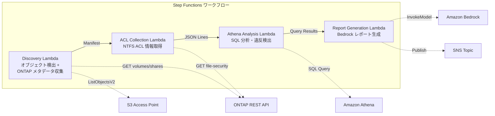

# 使例一:法務及合規 — 檔案伺服器稽核及資料管理治理

🌐 **Language / 言語**: [日本語](README.md) | [English](README.en.md) | [한국어](README.ko.md) | [简体中文](README.zh-CN.md) | 繁體中文 | [Français](README.fr.md) | [Deutsch](README.de.md) | [Español](README.es.md)

Amazon FSx for NetApp ONTAP是一款雲端檔案儲存服務,可簡化檔案伺服器的部署及管理。結合AWS Step Functions、Amazon Athena和Amazon S3,可建立自動化監查與報告設定,監控檔案伺服器活動。透過整合Amazon CloudWatch和AWS CloudFormation,可監視檔案伺服器現況及自動修復問題。這個解決方案可助企業實現有效的資料管理治理。

## 概要

AWS服務可讓客戶快速構建和部署應用程式。Amazon Bedrock提供低代碼模型讓開發人員輕鬆打造自然對話應用程式。AWS Step Functions則提供狀態機管理功能,協助管理複雜的工作流程。Amazon Athena是一種交互式查詢服務,可輕鬆分析存儲在Amazon S3上的數據。

AWS Lambda是無伺服器運算服務,提供按使用付費的優勢,無需管理伺服器。Amazon FSx for NetApp ONTAP則是一種檔案存儲服務,提供高度可靠和可擴展的儲存解決方案。

Amazon CloudWatch是監控和觀察服務,可幫助您掌握應用程式和基礎設施的運行狀況。AWS CloudFormation則是基礎設施即代碼服務,可自動化部署和管理您的AWS資源。
利用 Amazon FSx for NetApp ONTAP 的 S3 Access Points,自動收集和分析檔案伺服器的 NTFS ACL 資訊,並產生合規性報告的無伺服器工作流程。
### 這種模式適用的場景

- 複雜な 3D プロジェクトで、Amazon Bedrock を使用して、GPU 加速でのレンダリングが必要な場合
- AWS Step Functions で、複雑なワークフロー（例：GDSII -> DRC -> OASIS -> GDS -> tapeout）を定義する必要がある場合
- Amazon Athena を使用して、大量のデータを高速に分析する必要がある場合
- Amazon S3 を使用して、大容量のデータを安全に保存する必要がある場合
- AWS Lambda を使用して、イベントドリブンのサーバーレスコンピューティングを活用する必要がある場合
- Amazon FSx for NetApp ONTAP を使用して、高パフォーマンスのファイルストレージを提供する必要がある場合
- Amazon CloudWatch を使用してアプリケーションのパフォーマンスを監視する必要がある場合
- AWS CloudFormation を使用して、インフラストラクチャをコード化して管理する必要がある場合
- 需要對 NAS 數據進行定期的治理與合規性掃描
- 需要使用 S3 事件通知或輪詢式審核
- 希望將文件數據保留在 ONTAP 上,並維持現有的 SMB/NFS 訪問
- 希望在 Athena 中跨域分析 NTFS ACL 的變更歷史記錄
- 希望自動生成自然語言格式的合規性報告
### 不適合情況

Amazon EC2に直接デプロイすることは避けたほうがいいでしょう。そのようなケースでは、AWS Step FunctionsやAmazon Lambdaを使ってサーバーレスアーキテクチャを採用するのがよいでしょう。また、Amazon Athenaを使ってデータ分析を行う、Amazon S3にデータを保管する、Amazon CloudWatchで監視するなども効果的です。
GDSII、DRC、OASISなどの設計データを扱うには、Amazon FSx for NetApp ONTAPを活用するといいでしょう。AWS CloudFormationを使えば、インフラ構築を自動化できます。
- 需要即時事件驅動處理(即時偵測檔案變更)
- 需要完整的 Amazon S3 儲存貯體語義(通知、預先簽署的 URL)
- 已有正在運作的 Amazon EC2 批次處理,遷移成本不符
- 無法確保網路可達 Amazon FSx for NetApp ONTAP REST API 的環境
### 主要功能

Amazon Bedrock 可提供以下主要功能：

- 無縫整合 AWS Step Functions、Amazon Athena 及 Amazon S3 等 AWS 服務
- 使用 AWS Lambda 提供自訂資料轉換與分析
- 支援業界標準的 GDSII、DRC 及 OASIS 格式
- 透過 Amazon FSx for NetApp ONTAP 提供高效能的資料存取
- 利用 Amazon CloudWatch 監控效能並設定警示
- 使用 AWS CloudFormation 以自動化佈建、維護和擴展
- 透過ONTAP REST API自動收集NTFS ACL、CIFS共享和匯出政策資訊
- 使用Amazon Athena SQL偵測過度權限共享、過時訪問和政策違規行為
- 透過Amazon Bedrock自動生成自然語言合規報告
- 透過SNS即時分享審核結果
## 架構

Amazon Bedrock提供了一個統一的界面,以使用Amazon Athena、Amazon S3、AWS Lambda和Amazon FSx for NetApp ONTAP為基礎的自動化工作流。利用AWS Step Functions,您可以構建復雜的無服務器工作流,將這些服務鏈接在一起。

您的設計可以輕鬆地由Amazon CloudWatch監控,並使用AWS CloudFormation進行部署。該解決方案支持常見的EDA檔案格式,如GDSII、DRC、OASIS和GDS。

設計人員可以使用`lambdas`執行tapeout準備和任何其他自定義邏輯。



### 工作流程步驟

AWS Step Functions提供了一種建立無服務器應用程式的方式。您可以使用AWS Lambda功能、Amazon Athena查詢、Amazon S3操作等步驟,來建構複雜的工作流程。

您可以使用Amazon FSx for NetApp ONTAP來存儲工作流程的狀態和結果資料,並使用Amazon CloudWatch監控工作流程的執行情況。

AWS CloudFormation可用於建立和管理工作流程基礎設施,如AWS Lambda函數和Amazon S3儲存貯體。
1. **發現**: 從 S3 AP 取得對象列表,並收集 ONTAP 元數據(安全性風格、導出策略、CIFS 共享 ACL)
2. **ACL 收集**: 通過 ONTAP REST API 獲取每個對象的 NTFS ACL 信息,以 JSON Lines 格式輸出到帶日期分區的 S3
3. **Athena 分析**: 創建/更新 Glue Data Catalog 表,使用 Athena SQL 檢測過度權限、過時訪問和政策違規
4. **報告生成**: 使用 Bedrock 生成自然語言合規報告,輸出到 S3 並發送 SNS 通知
## 前提條件

您需要準備以下資源才能開始:

- 一個 Amazon Bedrock 實例
- 一個 AWS Step Functions 狀態機
- 一個 Amazon Athena 資料庫
- 一個 Amazon S3 儲存貯體
- 一個 AWS Lambda 函數
- 一個 Amazon FSx for NetApp ONTAP 檔案系統
- 一個 Amazon CloudWatch 監控規則
- 一個 AWS CloudFormation 堆疊

您還需要準備以下技術元件:

- GDSII 檔案
- DRC 報告
- OASIS 檔案
- GDS 格式的設計檔
- Lambda 函數程式碼
- tapeout 流程
- AWS 帳戶及適當的 IAM 權限
- FSx for NetApp ONTAP 檔案系統（ONTAP 9.17.1P4D3 以上）
- 已啟用 S3 Access Point 的磁碟區
- ONTAP REST API 認證資料已登記於 Secrets Manager
- VPC、私有子網
- 已啟用 Amazon Bedrock 模型存取（Claude / Nova）
### VPC 內 Lambda 執行時的注意事項

Amazon VPC 可讓您在AWS雲端中建立虛擬網路環境。將 AWS Lambda 函數部署於 VPC 中,可能會引發一些注意事項:

- Lambda 執行個體無法直接存取公有網路,需要透過 NAT Gateway 或 VPN 連線。
- 請確保 Lambda 函數有適當的 Amazon S3 和 Amazon DynamoDB 存取權限。
- 如果您的 Lambda 函數需要存取其他 AWS 服務,請確保已設定適當的 AWS Identity and Access Management (IAM) 角色和權限。
- 使用 Amazon FSx for NetApp ONTAP 或 Amazon EFS 時,請確保適當設定 VPC 端點和安全群組。
- 監控 AWS Lambda、Amazon CloudWatch 和 AWS CloudFormation 以維護穩定的 Lambda 執行環境。
**2026-05-03 部署驗證所發現的重要事項**

- **PoC / 示範環境**: 建議在 VPC 外執行 Lambda。如果 S3 AP 的 network origin 為 `internet`，則從 VPC 外的 Lambda 即可無障礙存取
- **生產環境**: 請指定 `PrivateRouteTableId` 參數，並將 S3 Gateway Endpoint 與路由表建立關聯。若未指定此參數，VPC 內的 Lambda 將無法及時存取 S3 AP
- 更多詳情請參閱[疑難排解指南](../docs/guides/troubleshooting-guide.md#6-lambda-vpc-內執行時的-s3-ap-逾時)
以下為您翻譯後的內容:

## 部署流程

AWS Bedrock可用於製造複雜的電子設計。您可以使用AWS Step Functions協調各個服務,例如Amazon Athena、Amazon S3及AWS Lambda。Amazon FSx for NetApp ONTAP提供高效能的檔案儲存系統,可結合Amazon CloudWatch監控。您也可以使用AWS CloudFormation自動化部署。上述服務可輔助您完成GDSII、DRC、OASIS等工作流程,最終完成芯片的tapeout。

### 1. 準備參數

Amazon Bedrock可用於創建複雜的機器學習模型,AWS Step Functions可以設計和運行無服務器工作流程。您可以在Amazon Athena中查詢存儲在Amazon S3中的數據,並將結果發送到AWS Lambda進行進一步處理。Amazon FSx for NetApp ONTAP提供了高度可靠和可擴展的網絡附加存儲,Amazon CloudWatch可用於監控和分析你的資源。您可以使用AWS CloudFormation來自動部署和管理基礎設施。
部署前,請確認以下值:

- FSx ONTAP S3 Access Point Alias
- ONTAP 管理 IP 位址
- Secrets Manager 機密名稱
- SVM UUID、Volume UUID
- VPC ID、私有子網 ID
### 2. AWS CloudFormation 部署

AWS Step Functions可以設定以下工作流程:
1. AWS Lambda函式進行設計稿轉換
2. 將轉換後的原始碼上傳至Amazon S3
3. 啟動Amazon Athena查詢以檢查轉換品質
4. 如果通過驗證,則觸發AWS Lambda函式進行晶片燒錄
5. 監控Amazon CloudWatch以確保燒錄順利完成

此工作流程可以使用AWS CloudFormation自動部署,確保系統一致和可靠。

```bash
aws cloudformation deploy \
  --template-file legal-compliance/template.yaml \
  --stack-name fsxn-legal-compliance \
  --parameter-overrides \
    S3AccessPointAlias=<your-volume-ext-s3alias> \
    S3AccessPointName=<your-s3ap-name> \
    S3AccessPointOutputAlias=<your-output-volume-ext-s3alias> \
    OntapSecretName=<your-ontap-secret-name> \
    OntapManagementIp=<your-ontap-management-ip> \
    SvmUuid=<your-svm-uuid> \
    VolumeUuid=<your-volume-uuid> \
    ScheduleExpression="rate(1 hour)" \
    VpcId=<your-vpc-id> \
    PrivateSubnetIds=<subnet-1>,<subnet-2> \
    PrivateRouteTableIds=<rtb-1>,<rtb-2> \
    NotificationEmail=<your-email@example.com> \
    EnableVpcEndpoints=false \
    EnableCloudWatchAlarms=false \
  --capabilities CAPABILITY_IAM CAPABILITY_AUTO_EXPAND \
  --region ap-northeast-1
```
**注意**: 請將 `<...>` 的預留位置替換為實際的環境值。
### 3. 確認 SNS 訂閱

Whenever an object is uploaded to the `my-bucket` Amazon S3 bucket, an AWS Lambda function is triggered to process the data. This Lambda function sends notifications to an Amazon SNS topic, which has several subscriptions. We need to check that the subscriptions are configured correctly.

1. Navigate to the Amazon SNS console and locate the topic that the Lambda function is publishing to.
2. Review the subscriptions for the topic. Ensure that the endpoint, protocol, and other subscription details are configured as expected.

You can use the AWS CLI or the AWS Management Console to manage your SNS subscriptions.
在部署後,您將收到一封訂閱 Amazon SNS 的確認電子郵件,請點擊電子郵件中的鏈接進行確認。

> **注意**: 如果您未指定 `S3AccessPointName`,則 IAM 政策將僅基於別名,可能會發生 `AccessDenied` 錯誤。我們建議在生產環境中指定此參數。詳情請參閱[疑難排解指南](../docs/guides/troubleshooting-guide.md#1-accessdenied-錯誤)。
## 參數設定列表

AWS Step Functions 是一項無伺服器的雲端服務,可以讓您建立和運行分布式應用程式的狀態機器。您可以使用 AWS Step Functions 協調多個 AWS Lambda 函式的執行,以建構完整的業務流程。

您可以使用 Amazon Athena 進行即時的資料分析。Amazon Athena 是一款無伺服器、交互式查詢服務,可輕鬆分析存儲在 Amazon S3 中的資料。只需將您的資料放入 Amazon S3,然後使用標準的 SQL 即可開始查詢。

您可以使用 AWS Lambda 建立無伺服器函式,並將它們部署到雲端。AWS Lambda 會自動擴展您的代碼,無需您自己管理伺服器。

Amazon FSx for NetApp ONTAP 是一款完全托管的 NetApp ONTAP 檔案系統,提供企業級的功能和性能。這讓您可以輕鬆地將現有的 ONTAP 工作負載遷移到雲端,並利用 ONTAP 的功能。

| パラメータ | 説明 | デフォルト | 必須 |
|-----------|------|----------|------|
| `S3AccessPointAlias` | FSx ONTAP S3 AP Alias（入力用） | — | ✅ |
| `S3AccessPointName` | S3 AP 名（ARN ベースの IAM 権限付与用。省略時は Alias ベースのみ） | `""` | ⚠️ 推奨 |
| `S3AccessPointOutputAlias` | FSx ONTAP S3 AP Alias（出力用） | — | ✅ |
| `OntapSecretName` | ONTAP 認証情報の Secrets Manager シークレット名 | — | ✅ |
| `OntapManagementIp` | ONTAP クラスタ管理 IP アドレス | — | ✅ |
| `SvmUuid` | ONTAP SVM UUID | — | ✅ |
| `VolumeUuid` | ONTAP ボリューム UUID | — | ✅ |
| `ScheduleExpression` | EventBridge Scheduler のスケジュール式 | `rate(1 hour)` | |
| `VpcId` | VPC ID | — | ✅ |
| `PrivateSubnetIds` | プライベートサブネット ID リスト | — | ✅ |
| `PrivateRouteTableIds` | プライベートサブネットのルートテーブル ID リスト（カンマ区切り） | — | ✅ |
| `NotificationEmail` | SNS 通知先メールアドレス | — | ✅ |
| `EnableVpcEndpoints` | Interface VPC Endpoints の有効化 | `false` | |
| `EnableCloudWatchAlarms` | CloudWatch Alarms の有効化 | `false` | |
| `EnableSnapStart` | 啟用 Lambda SnapStart（冷啟動縮短） | `false` | |
| `EnableAthenaWorkgroup` | Athena Workgroup / Glue Data Catalog の有効化 | `true` | |

## 成本架構

Amazon Bedrock可以幫助客戶減少設計費用,因為它提供了一個統一的管理層來整合各種IC設計工具,例如GDSII、DRC、OASIS等。AWS Step Functions可以自動化整個IC設計流程,從RTL合成到final tapeout,從而降低人工成本。

此外,Amazon Athena可用於分析IC設計過程中產生的大量數據,如電路性能、布局面積和功耗等,協助設計師做出更明智的決策,從而優化成本。Amazon S3和AWS Lambda提供了彈性和可擴展的計算和存儲資源,根據需求動態調整,避免了過度配置帶來的浪費。

最後,Amazon FSx for NetApp ONTAP和Amazon CloudWatch可監控和管理IC設計基礎設施,確保穩定運行並最大限度地提高資源利用率。AWS CloudFormation則簡化了整個基礎設施的部署和管理,進一步降低運營成本。

### 基於請求的（付費按使用）

Amazon Bedrock是一個全面的機器學習模型託管平台。使用AWS Step Functions可以簡單地構建複雜的工作流程,將多個AWS服務串聯在一起。Amazon Athena是一個交互式查詢服務,可以使用標準SQL查詢存儲在Amazon S3上的數據。您可以使用AWS Lambda無服務器計算來運行代碼,而不需要管理任何服務器。Amazon FSx for NetApp ONTAP提供了一種簡單、可靠的方式來訪問和共享存儲在AWS中的數據。Amazon CloudWatch可以幫助您監視應用程序的性能和健康狀況。您可以使用AWS CloudFormation來自動化您的AWS資源配置。

| サービス | 課金単位 | 概算（100 ファイル/月） |
|---------|---------|---------------------|
| Lambda | リクエスト数 + 実行時間 | ~$0.01 |
| Step Functions | ステート遷移数 | 無料枠内 |
| S3 API | リクエスト数 | ~$0.01 |
| Athena | スキャンデータ量 | ~$0.01 |
| Bedrock | トークン数 | ~$0.10 |

### 全天候運作（選用）

Amazon Bedrock可讓您輕鬆佈建及管理機器學習模型,並能持續分析及改善其效能。您可以使用AWS Step Functions來協調複雜的工作流程,讓從資料準備到模型部署的整個流程自動化。Amazon Athena可讓您快速查詢儲存於Amazon S3的資料,而AWS Lambda可讓您在無伺服器環境中運行您的程式碼。

Amazon FSx for NetApp ONTAP提供了NetApp檔案系統的全面功能,以符合企業級應用程式的需求。Amazon CloudWatch可讓您監控您的AWS資源,並對異常情況採取自動化行動。您可以使用AWS CloudFormation來管理您的整個基礎設施即程式碼。

| サービス | パラメータ | 月額 |
|---------|-----------|------|
| Interface VPC Endpoints | `EnableVpcEndpoints=true` | ~$28.80 |
| CloudWatch Alarms | `EnableCloudWatchAlarms=true` | ~$0.30 |
在演示/PoC環境中，您可以每月支付約 **~$0.13** 的可變成本即可使用服務。
## 清理

AWS Step Functions 可用於協調 Amazon Athena、Amazon S3 和 AWS Lambda 等服務,以自動執行資料清理。您可以利用 Amazon CloudWatch 監控清理工作的進度,並使用 AWS CloudFormation 來自動部署所需的資源。

對於使用 Amazon FSx for NetApp ONTAP 的檔案系統,您也可以設置自動化的定期清理流程。透過這些工具,您可以確保資料及時且有效地進行清理,並減少手動操作的需求。

```bash
# CloudFormation スタックの削除
aws cloudformation delete-stack \
  --stack-name fsxn-legal-compliance \
  --region ap-northeast-1

# 削除完了を待機
aws cloudformation wait stack-delete-complete \
  --stack-name fsxn-legal-compliance \
  --region ap-northeast-1
```
**注意**:若S3儲存桶中仍有物件存在,刪除堆疊可能會失敗。請先清空儲存桶內容。
以下是翻譯後的內容:

## 支援的區域

Amazon Bedrock、AWS Step Functions、Amazon Athena、Amazon S3、AWS Lambda、Amazon FSx for NetApp ONTAP、Amazon CloudWatch、AWS CloudFormation等AWS服務可在以下區域使用:

`us-east-1`、`us-east-2`、`us-west-1`、`us-west-2`、`eu-west-1`、`eu-west-2`、`eu-west-3`、`eu-north-1`、`eu-south-1`、`ap-east-1`、`ap-south-1`、`ap-northeast-1`、`ap-northeast-2`、`ap-northeast-3`、`ap-southeast-1`、`ap-southeast-2`、`ca-central-1`、`sa-east-1`、`me-south-1`、`af-south-1`。
UC1 使用以下服務:

Amazon Bedrock、AWS Step Functions、Amazon Athena、Amazon S3、AWS Lambda、Amazon FSx for NetApp ONTAP、Amazon CloudWatch、AWS CloudFormation

此外亦使用技術術語: GDSII、DRC、OASIS、GDS、Lambda、tapeout
| サービス | リージョン制約 |
|---------|-------------|
| Amazon Athena | ほぼ全リージョンで利用可能 |
| Amazon Bedrock | 対応リージョンを確認（[Bedrock 対応リージョン](https://docs.aws.amazon.com/general/latest/gr/bedrock.html)） |
| AWS X-Ray | ほぼ全リージョンで利用可能 |
| CloudWatch EMF | ほぼ全リージョンで利用可能 |
如需更多詳情,請參閱[區域相容性矩陣](../docs/region-compatibility.md)。
## 參考連結

AWS Bedrock、AWS Step Functions、Amazon Athena、Amazon S3、AWS Lambda、Amazon FSx for NetApp ONTAP、Amazon CloudWatch、AWS CloudFormation等

GDSII、DRC、OASIS、GDS、Lambda、tapeout等

`...`

/path/to/file，https://example.com

### AWS 官方文件

使用 Amazon Bedrock、AWS Step Functions、Amazon Athena、Amazon S3、AWS Lambda、Amazon FSx for NetApp ONTAP、Amazon CloudWatch 和 AWS CloudFormation 等 AWS 服務來自動化 GDSII、DRC、OASIS 和 GDS 等工作流程。利用 Lambda 函式執行自訂程式碼,並使用 Amazon S3 儲存檔案。根據需要設置觸發條件和警報,透過 Amazon CloudWatch 監控系統效能。使用 AWS CloudFormation 部署和管理資源。
- [FSx ONTAP S3 存取點概要](https://docs.aws.amazon.com/fsx/latest/ONTAPGuide/accessing-data-via-s3-access-points.html)
- [在 Athena 中使用 SQL 查詢（官方教程）](https://docs.aws.amazon.com/fsx/latest/ONTAPGuide/tutorial-query-data-with-athena.html)
- [使用 Lambda 進行無伺服器處理（官方教程）](https://docs.aws.amazon.com/fsx/latest/ONTAPGuide/tutorial-process-files-with-lambda.html)
- [Bedrock InvokeModel API 參考](https://docs.aws.amazon.com/bedrock/latest/APIReference/API_runtime_InvokeModel.html)
- [ONTAP REST API 參考](https://docs.netapp.com/us-en/ontap-automation/)
### AWS 博客文章

AWS Bedrock 是一個全托管式的半導體設計服務,它可以簡化複雜的設計流程。結合AWS Step Functions、Amazon Athena、Amazon S3和AWS Lambda,您可以自動化GDSII、DRC和OASIS等工作流程。Amazon FSx for NetApp ONTAP 則提供了高性能、可靠的檔案存儲。您還可以使用Amazon CloudWatch監控您的設計流程,並運用AWS CloudFormation來管理您的基礎設施即程式碼。將 tapeout 推進到下一個階段,盡情利用AWS的強大功能。
- [S3 AP 發表部落格](https://aws.amazon.com/blogs/aws/amazon-fsx-for-netapp-ontap-now-integrates-with-amazon-s3-for-seamless-data-access/)
- [AD 整合部落格](https://aws.amazon.com/blogs/storage/enabling-ai-powered-analytics-on-enterprise-file-data-configuring-s3-access-points-for-amazon-fsx-for-netapp-ontap-with-active-directory/)
- [3 個無伺服器架構模式](https://aws.amazon.com/blogs/storage/bridge-legacy-and-modern-applications-with-amazon-s3-access-points-for-amazon-fsx/)
### GitHub 範例

Amazon Bedrock可以用於構建自訂機器學習模型。您可以使用AWS Step Functions來協調複雜的工作流程,並使用Amazon Athena進行即時分析Amazon S3中的資料。

AWS Lambda無伺服器功能可用來運行自訂程式碼,而Amazon FSx for NetApp ONTAP提供企業級NAS檔案儲存。您可以使用Amazon CloudWatch監控您的應用程式和資源,使用AWS CloudFormation來自動佈建您的基礎架構。

我們建議您嘗試以下技術流程:
1. 使用`GDSII`、`DRC`和`OASIS`等標準來設計您的晶片
2. 進行完整的驗證,包括`GDS`生成和`tapeout`前的最終檢查
3. 使用AWS服務自動化您的工作流程,如Amazon S3、AWS Lambda和AWS CloudFormation
- [aws-samples/serverless-patterns](https://github.com/aws-samples/serverless-patterns) — 無伺服器模式集合
- [aws-samples/aws-stepfunctions-examples](https://github.com/aws-samples/aws-stepfunctions-examples) — AWS Step Functions 範例
## 已驗證的環境

Amazon Bedrock、AWS Step Functions、Amazon Athena、Amazon S3、AWS Lambda、Amazon FSx for NetApp ONTAP、Amazon CloudWatch、AWS CloudFormation等服務提供了一個可靠且經過驗證的環境。透過使用這些服務,開發人員可以專注於設計和開發,而不必擔心基礎設施的操作和維護。

GDSII、DRC、OASIS和GDS等技術術語在本環境中得到支援和處理。AWS Lambda函數提供了無伺服器的運算能力,並可無縫整合到整個解決方案中。整個工作流程從設計到最終的tapeout都可在此驗證的環境中順利進行。

| 項目 | 値 |
|------|-----|
| AWS リージョン | ap-northeast-1 (東京) |
| FSx ONTAP バージョン | ONTAP 9.17.1P4D3 |
| FSx 構成 | SINGLE_AZ_1 |
| Python | 3.12 |
| デプロイ方式 | CloudFormation (標準) |

## Lambda VPC 配置架構

Amazon Bedrock 可以使用 AWS Step Functions 進行工作流程編排。Amazon Athena 可以分析儲存在 Amazon S3 上的資料。AWS Lambda 函數可以與 Amazon FSx for NetApp ONTAP 整合以進行檔案處理。您可以使用 Amazon CloudWatch 監控所有這些元件的健康狀況和效能。AWS CloudFormation 可以用來部署和管理整個架構。
基於驗證所獲得的見解,Lambda 函數被隔離佈置在 VPC 內/外。

**VPC 內 Lambda**（僅需要 ONTAP REST API 存取的函數）:
- Discovery Lambda — S3 AP + ONTAP API
- AclCollection Lambda — ONTAP file-security API

**VPC 外 Lambda**（僅使用 AWS 受管服務 API）:
- 其他所有 Lambda 函數

> **原因**: VPC 內 Lambda 要存取 AWS 受管服務 API（Athena、Bedrock、Textract 等）需要 Interface VPC Endpoint（每月 $7.20）。VPC 外 Lambda 可直接透過網際網路存取 AWS API,不需額外費用。

> **注意**: 使用 ONTAP REST API 的 UC（UC1 法務和合規性）必須設定 `EnableVpcEndpoints=true`。透過 Secrets Manager VPC Endpoint 獲取 ONTAP 認證資訊。