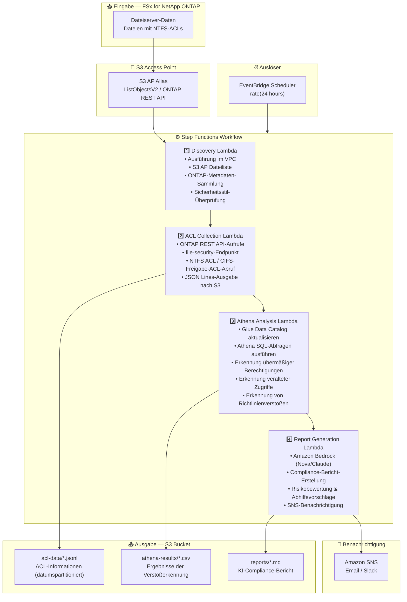

# UC1: Recht / Compliance — Dateiserver-Audit & Datengovernance

🌐 **Language / 言語**: [日本語](architecture.md) | [English](architecture.en.md) | [한국어](architecture.ko.md) | [简体中文](architecture.zh-CN.md) | [繁體中文](architecture.zh-TW.md) | [Français](architecture.fr.md) | Deutsch | [Español](architecture.es.md)

## End-to-End-Architektur (Eingabe → Ausgabe)

---

## Architekturdiagramm

---

## Datenfluss-Details

### Eingabe
| Element | Beschreibung |
|---------|--------------|
| **Quelle** | FSx for NetApp ONTAP Volume |
| **Dateitypen** | Alle Dateien (mit NTFS-ACLs) |
| **Zugriffsmethode** | S3 Access Point (Dateiliste) + ONTAP REST API (ACL-Informationen) |
| **Lesestrategie** | Nur Metadaten (Dateiinhalte werden nicht gelesen) |

### Verarbeitung
| Schritt | Service | Funktion |
|---------|---------|----------|
| Discovery | Lambda (VPC) | Dateien über S3 AP auflisten, ONTAP-Metadaten sammeln |
| ACL Collection | Lambda (VPC) | NTFS ACL / CIFS-Freigabe-ACL über ONTAP REST API abrufen |
| Athena Analysis | Lambda + Glue + Athena | SQL-basierte Erkennung übermäßiger Berechtigungen, veralteter Zugriffe, Richtlinienverstöße |
| Report Generation | Lambda + Bedrock | Compliance-Bericht in natürlicher Sprache erstellen |

### Ausgabe
| Artefakt | Format | Beschreibung |
|----------|--------|--------------|
| ACL-Daten | `acl-data/YYYY/MM/DD/*.jsonl` | ACL-Informationen pro Datei (JSON Lines) |
| Athena-Ergebnisse | `athena-results/{id}.csv` | Ergebnisse der Verstoßerkennung (übermäßige Berechtigungen, verwaiste Dateien usw.) |
| Compliance-Bericht | `reports/YYYY/MM/DD/compliance-report-{id}.md` | Von Bedrock erstellter Bericht |
| SNS-Benachrichtigung | Email | Zusammenfassung der Audit-Ergebnisse und Berichtsstandort |

---

## Wichtige Designentscheidungen

1. **S3 AP + ONTAP REST API Kombination** — S3 AP für Dateilisten, ONTAP REST API für detaillierten ACL-Abruf (Zwei-Stufen-Ansatz)
2. **Kein Lesen von Dateiinhalten** — Für Audit-Zwecke werden nur Metadaten/Berechtigungsinformationen gesammelt, um Datenübertragungskosten zu minimieren
3. **JSON Lines + Datumspartitionierung** — Balance zwischen Athena-Abfrageeffizienz und historischer Nachverfolgung
4. **Athena SQL für Verstoßerkennung** — Flexible regelbasierte Analyse (Everyone-Berechtigungen, 90 Tage ohne Zugriff usw.)
5. **Bedrock für Berichte in natürlicher Sprache** — Sicherstellung der Lesbarkeit für nicht-technisches Personal (Rechts-/Compliance-Teams)
6. **Polling (nicht ereignisgesteuert)** — S3 AP unterstützt keine Ereignisbenachrichtigungen, daher wird eine periodische geplante Ausführung verwendet

---

## Verwendete AWS-Services

| Service | Rolle |
|---------|-------|
| FSx for NetApp ONTAP | Enterprise-Dateispeicher (mit NTFS-ACLs) |
| S3 Access Points | Serverloser Zugriff auf ONTAP-Volumes |
| EventBridge Scheduler | Periodischer Auslöser (tägliches Audit) |
| Step Functions | Workflow-Orchestrierung |
| Lambda | Compute (Discovery, ACL Collection, Analysis, Report) |
| Glue Data Catalog | Schema-Verwaltung für Athena |
| Amazon Athena | SQL-basierte Berechtigungsanalyse & Verstoßerkennung |
| Amazon Bedrock | KI-Compliance-Bericht-Erstellung (Nova / Claude) |
| SNS | Benachrichtigung über Audit-Ergebnisse |
| Secrets Manager | ONTAP REST API-Anmeldeinformationsverwaltung |
| CloudWatch + X-Ray | Observability |
