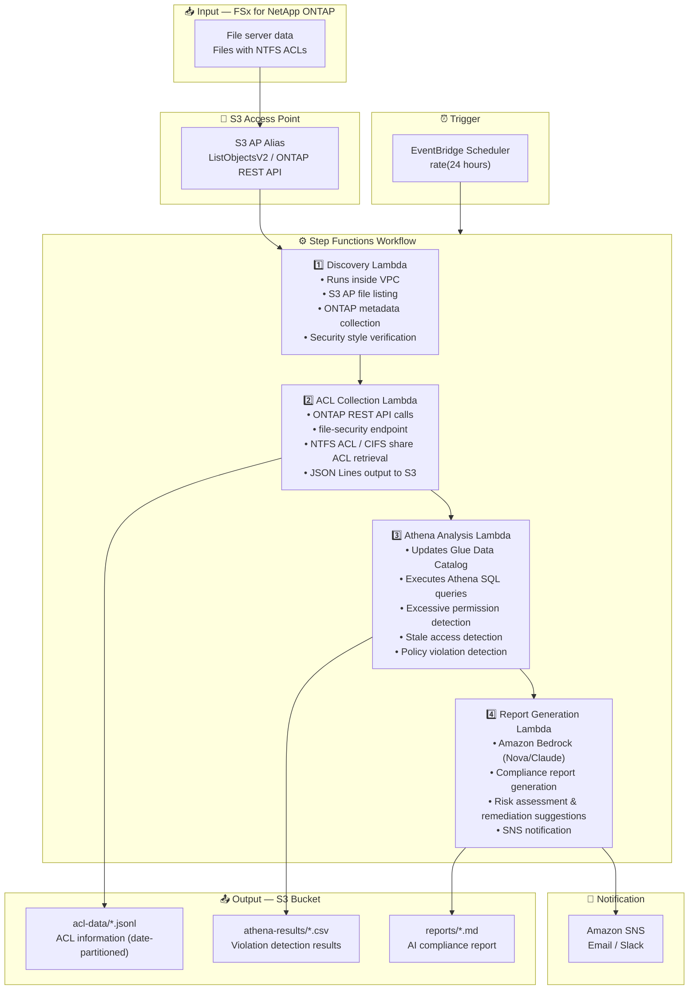

# UC1: Legal / Compliance — File Server Audit & Data Governance

🌐 **Language / 言語**: [日本語](architecture.md) | English | [한국어](architecture.ko.md) | [简体中文](architecture.zh-CN.md) | [繁體中文](architecture.zh-TW.md) | [Français](architecture.fr.md) | [Deutsch](architecture.de.md) | [Español](architecture.es.md)

## End-to-End Architecture (Input → Output)

---

## High-Level Flow

```
┌─────────────────────────────────────────────────────────────────────────────┐
│                         FSx for NetApp ONTAP                                 │
│                                                                              │
│  /vol/shared_data/                                                           │
│  ├── 経理部/決算資料/2024Q4.xlsx     (NTFS ACL: 経理部のみ)                  │
│  ├── 人事部/給与/salary_2024.csv     (NTFS ACL: 人事部のみ)                  │
│  ├── 全社共有/規程/就業規則.pdf      (NTFS ACL: Everyone Read)               │
│  └── プロジェクト/機密/design.dwg    (NTFS ACL: 設計チーム)                  │
│                                                                              │
└──────────────────────────────────┬───────────────────────────────────────────┘
                                   │
                                   ▼
┌──────────────────────────────────────────────────────────────────────────────┐
│                      S3 Access Point (Data Path)                              │
│                                                                              │
│  Alias: fsxn-compliance-vol-ext-s3alias                                      │
│  • ListObjectsV2 (file listing)                                              │
│  • ONTAP REST API (ACL / security info retrieval)                            │
│  • No NFS/SMB mount required from Lambda                                     │
│                                                                              │
└──────────────────────────────────┬───────────────────────────────────────────┘
                                   │
                                   ▼
┌──────────────────────────────────────────────────────────────────────────────┐
│                    EventBridge Scheduler (Trigger)                            │
│                                                                              │
│  Schedule: rate(24 hours) — configurable                                     │
│  Target: Step Functions State Machine                                        │
│                                                                              │
└──────────────────────────────────┬───────────────────────────────────────────┘
                                   │
                                   ▼
┌──────────────────────────────────────────────────────────────────────────────┐
│                    AWS Step Functions (Orchestration)                         │
│                                                                              │
│  ┌─────────────┐    ┌──────────────────────┐    ┌────────────────┐          │
│  │  Discovery   │───▶│  ACL Collection      │───▶│Athena Analysis │          │
│  │  Lambda      │    │  Lambda              │    │ Lambda         │          │
│  │             │    │                      │    │               │          │
│  │  • VPC内     │    │  • ONTAP REST API    │    │  • Athena SQL  │          │
│  │  • S3 AP List│    │  • file-security GET │    │  • Glue Catalog│          │
│  │  • ONTAP API │    │  • JSON Lines output │    │  • Excessive   │          │
│  └─────────────┘    └──────────────────────┘    │    permission  │          │
│                                                  │    detection   │          │
│                                                  └───────┬────────┘          │
│                                                          │                   │
│                                                          ▼                   │
│                                                 ┌────────────────┐          │
│                                                 │Report Generation│          │
│                                                 │ Lambda         │          │
│                                                 │               │          │
│                                                 │ • Bedrock      │          │
│                                                 │ • SNS notify   │          │
│                                                 └────────────────┘          │
│                                                                              │
└──────────────────────────────────────────────────────────────────────────────┘
                                   │
                                   ▼
┌──────────────────────────────────────────────────────────────────────────────┐
│                         Output (S3 Bucket)                                    │
│                                                                              │
│  s3://{stack}-output-{account}/                                              │
│  ├── acl-data/YYYY/MM/DD/                                                    │
│  │   ├── shared_data_acl.jsonl      ← ACL information (JSON Lines)           │
│  │   └── metadata.json              ← Volume/share metadata                  │
│  ├── athena-results/                                                         │
│  │   └── {query-execution-id}.csv   ← Violation detection results            │
│  └── reports/YYYY/MM/DD/                                                     │
│      └── compliance-report-{id}.md  ← Bedrock compliance report              │
│                                                                              │
└──────────────────────────────────────────────────────────────────────────────┘
```

---

## Mermaid Diagram



---

## Data Flow Detail

### Input
| Item | Description |
|------|-------------|
| **Source** | FSx for NetApp ONTAP volume |
| **File Types** | All files (with NTFS ACLs) |
| **Access Method** | S3 Access Point (file listing) + ONTAP REST API (ACL info) |
| **Read Strategy** | Metadata only (file contents are not read) |

### Processing
| Step | Service | Function |
|------|---------|----------|
| Discovery | Lambda (VPC) | List files via S3 AP, collect ONTAP metadata |
| ACL Collection | Lambda (VPC) | Retrieve NTFS ACL / CIFS share ACL via ONTAP REST API |
| Athena Analysis | Lambda + Glue + Athena | SQL-based detection of excessive permissions, stale access, policy violations |
| Report Generation | Lambda + Bedrock | Natural language compliance report generation |

### Output
| Artifact | Format | Description |
|----------|--------|-------------|
| ACL Data | `acl-data/YYYY/MM/DD/*.jsonl` | Per-file ACL information (JSON Lines) |
| Athena Results | `athena-results/{id}.csv` | Violation detection results (excessive permissions, orphaned files, etc.) |
| Compliance Report | `reports/YYYY/MM/DD/compliance-report-{id}.md` | Bedrock-generated report |
| SNS Notification | Email | Audit results summary and report location |

---

## Key Design Decisions

1. **S3 AP + ONTAP REST API combined** — S3 AP for file listing, ONTAP REST API for detailed ACL retrieval (two-stage approach)
2. **No file content reading** — For audit purposes, only metadata/permission info is collected, minimizing data transfer costs
3. **JSON Lines + date partitioning** — Balances Athena query efficiency with historical tracking
4. **Athena SQL for violation detection** — Flexible rule-based analysis (Everyone permissions, 90-day no-access, etc.)
5. **Bedrock for natural language reports** — Ensures readability for non-technical staff (legal/compliance teams)
6. **Polling (not event-driven)** — S3 AP does not support event notifications, so periodic scheduled execution is used

---

## AWS Services Used

| Service | Role |
|---------|------|
| FSx for NetApp ONTAP | Enterprise file storage (with NTFS ACLs) |
| S3 Access Points | Serverless access to ONTAP volumes |
| EventBridge Scheduler | Periodic trigger (daily audit) |
| Step Functions | Workflow orchestration |
| Lambda | Compute (Discovery, ACL Collection, Analysis, Report) |
| Glue Data Catalog | Schema management for Athena |
| Amazon Athena | SQL-based permission analysis & violation detection |
| Amazon Bedrock | AI compliance report generation (Nova / Claude) |
| SNS | Audit result notification |
| Secrets Manager | ONTAP REST API credential management |
| CloudWatch + X-Ray | Observability |
